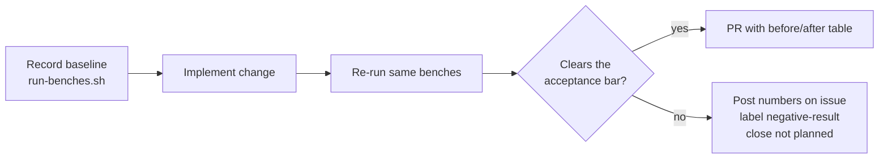

# Contributing to NEAT-AI-scorer

Thanks for your interest in improving **NEAT-AI-scorer** — the native MSE
scorer CLI for NEAT-AI creatures. This guide summarises how to build, test,
and submit changes. It mirrors the local gate documented in
[`AGENTS.md`](./AGENTS.md) and the CI workflow in
[`.github/workflows/ci.yml`](./.github/workflows/ci.yml).

## Repository layout

This is a multi-binary Rust workspace. The sole workspace member is
**`rust_scorer`** (the `rust_scorer`, `float_scan_bench`, and
`cost_scan_bench` binaries). The shared scoring logic lives in
**`neat-core`**, resolved as a **path dependency** on a sibling clone of
[NEAT-AI-core](https://github.com/stSoftwareAU/NEAT-AI-core).

Clone both repositories under the same parent directory so the path
dependency resolves:

```text
parent/
  NEAT-AI-core/      # clone of stSoftwareAU/NEAT-AI-core
  NEAT-AI-scorer/    # this repository
```

The `neat-core` path dependency is **unpinned** and tracks head, so a
**breaking** neat-core change can reach scorer silently. CI guards against
this with the **neat-core breaking-bump gate** (`scripts/check-neat-core-version.sh`):
it fails when neat-core's breaking component (major for `>= 1.0`, minor for
pre-1.0) climbs above the version recorded in
[`neat-core.expected-version`](./neat-core.expected-version). When the gate
fails, update `rust_scorer` for the breaking change and bump that baseline
file in the same PR. See the README "neat-core breaking-bump gate" section
for the full rationale.

## Prerequisites

The local gate and CI expect the following tools on your `PATH`:

- **Rust** — `cargo`, `rustc`, `clippy`, `rustfmt`. The exact compiler is pinned in [`rust-toolchain.toml`](./rust-toolchain.toml) and auto-installed by `rustup`, so local and CI builds use the same version (see the "Pinned Rust toolchain" section in the README for the bump cadence).
- **shellcheck** — lints the bash helper scripts.
- **cargo-deny** — licence and dependency audit (`cargo install cargo-deny --locked`).
- **codespell** — spell check (`pip install --user codespell`), driven by [`scripts/spell-check.sh`](./scripts/spell-check.sh).
- **bats** *(optional)* — runs the shell helper tests under `tests/scripts`.
- **cargo-edit** *(optional)* — enables the **opt-in** dependency upgrade step in `./quality.sh` (run `./quality.sh --upgrade`).

## Local gate

Run the full local quality gate before every commit or pull request:

```bash
./quality.sh < /dev/null
```

`./quality.sh` mirrors CI and runs, in order:

1. **shellcheck** — bash syntax and lint across all `*.sh` scripts.
2. **Workflow validators** — the `scripts/check-*.sh` guards over `.github/workflows`.
3. **codespell** — via `scripts/spell-check.sh`.
4. **bats** — shell helper tests under `tests/scripts` (when `bats` is installed).
5. **cargo-deny** — licence and advisory checks.
6. **`cargo fmt --all`** — formatting (CI runs `fmt --check`).
7. **`cargo clippy`** — lint with `-D warnings` plus `filter_next` and `collapsible_if`.
8. **`cargo check`**, **`cargo build`**, **`cargo test`** — type checks, debug build, and the test suite.
9. **`cargo doc`** — rustdoc with `RUSTDOCFLAGS=-D warnings`.
10. **Release build** — `cargo build --workspace --release`.

The default gate is **read-only** against `Cargo.lock` / `Cargo.toml` — it
never bumps dependency versions in your working tree. To bump library
dependencies during the gate, opt in with `./quality.sh --upgrade` (or
`QUALITY_UPGRADE=1 ./quality.sh`); this requires **cargo-edit**. Routine,
quarantine-gated bumps go through [`./bump-deps.sh`](./bump-deps.sh) instead.

Keep re-running `./quality.sh < /dev/null` until it passes cleanly.

## Coding standards

- **Australian English** throughout code, comments, and documentation
  (e.g. *colour*, *behaviour*, *organisation*, *favour*, *centre*).
- Keep the **positional** CLI contract (`<creature.json> <data_dir>`) stable.
- Add tests that exercise real behaviour — call functions with test data and
  assert on results, exit codes, or side effects.
- When a domain term trips codespell, add it with a short justification to
  [`.codespellrc`](./.codespellrc) rather than silencing a whole file.

## Pull request workflow

1. Branch from `Develop`.
2. Make your change with accompanying tests.
3. Run `./quality.sh < /dev/null` until it passes.
4. Update [`CHANGELOG.md`](./CHANGELOG.md) under the `## [Unreleased]`
   section, and update the README or other docs if behaviour changes.
5. Open a pull request targeting `Develop`.

On each PR the **Version Increment** workflow
([`.github/workflows/version-increment.yml`](./.github/workflows/version-increment.yml))
automatically bumps the patch component of `rust_scorer`'s version in
`rust_scorer/Cargo.toml` once, if it has not already been bumped on the
branch. Because the version is bumped automatically, the `CHANGELOG.md` is
the human-readable record of *what* changed — please keep it current.

## Performance Task Workflow

This section is the **single home** for the project's performance-change rules.
The README ["How to bench"](./README.md#how-to-bench) section,
[`docs/performance-baseline.md`](./docs/performance-baseline.md), and
[`docs/gpu-scoring-design.md`](./docs/gpu-scoring-design.md) point here rather
than restating them.

1. **Benchmark first.** Record the baseline with
   [`./scripts/run-benches.sh`](./scripts/run-benches.sh) *before* changing any
   code. Acceptance evidence is captured at the documented corpus size —
   `BENCH_SCORING_BYTES=200000000` (200 MB) — on the same host class as the
   baseline recorded in
   [`docs/performance-baseline.md`](./docs/performance-baseline.md).
2. **Implement the change.**
3. **Re-run the same benches** and record the after numbers: the median plus the
   95 % confidence interval for every affected bench group.
4. **Compare against the acceptance bar.** Only raise a PR when the change
   demonstrably improves the measured metric against the bar its issue sets (the
   per-bench bars for the GPU work are tabulated in
   [`docs/gpu-scoring-design.md`](./docs/gpu-scoring-design.md)). The PR summary
   MUST carry the before/after table. **Performance PRs without before/after
   Criterion evidence are rejected.**
5. **A miss is a negative result, not a failure.** A change that fails to clear
   its bar raises **no PR**. Instead: post the before/after numbers on the
   issue, explain what was tried and why it did not help, add the
   `negative-result` label, and close the issue as `not planned`. Negative
   results are first-class learnings — recording one stops the same experiment
   being re-run.



## Human escalation

Some changes cannot be finished by the automation worker and must be handed to a
maintainer. This section is the **single home** for that contract.

**Workflow YAML needs a maintainer.** The automation worker's credentials carry
no `workflow` OAuth scope, so it cannot create or modify anything under
[`.github/workflows/`](./.github/workflows). When a task needs new or changed
workflow YAML:

1. Land everything that does *not* need the workflow change — scripts, docs,
   tests — in the normal PR.
2. Spell out the wiring a maintainer must add (file, trigger, and the exact
   command to run) in both the PR summary and the issue.
3. Label the issue `needs-human` **and** post a comment saying why the label was
   applied and what the maintainer must do next. The label and its explanation
   always travel together — never one without the other.
4. Stop. Do not retry the push.

The same escalation applies to anything else only a human can do: credentials
the worker does not hold, repository settings (branch protection, rulesets), or
a product decision that is not ours to make.

## Licence

By contributing, you agree that your contributions are licensed under the
[Apache-2.0](./LICENSE) licence that covers this project.
