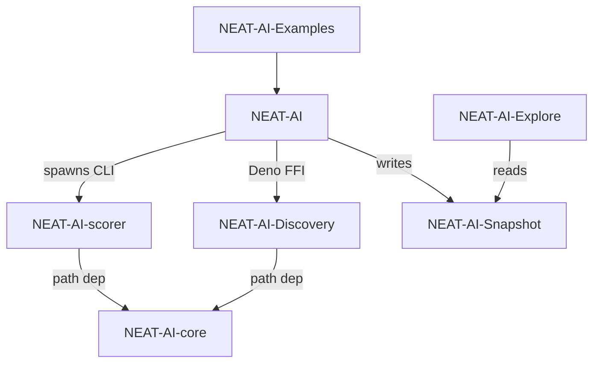

# NEAT-AI-scorer

Native **MSE scorer** CLI for NEAT-AI creatures. Shared logic lives in **`neat-core`**, resolved from a **path dependency** on **[NEAT-AI-core](https://github.com/stSoftwareAU/NEAT-AI-core)** (see `rust_scorer/Cargo.toml`). GitHub Actions checks out `NEAT-AI-core` next to this repo so CI can resolve that path.

## Source

| Component | Provenance |
|-----------|----------------|
| `rust_scorer/` | **`training_bin_stream::for_each_read_chunk`** (pipelined on native, same API on wasm) plus **pending + head + compact** (`stream_score.rs`), fused MSE when `forwardOnly` is true; **`float_scan_bench`** uses the same reader for throughput experiments. |
| `neat-core` (crate) | **`../../NEAT-AI-core/neat-core`** relative to `rust_scorer/Cargo.toml` — clone **NEAT-AI-core** as a sibling of **NEAT-AI-scorer** (same parent directory). |
| `LICENSE`, `.gitleaks.toml` | `origin/Develop` of NEAT-AI |

## Build

```bash
./quality.sh
```

Or step-by-step (matches CI):

```bash
export RUSTFLAGS="-D warnings"
cargo deny check
cargo fmt --all -- --check
cargo clippy --workspace --all-targets --all-features -- -D warnings -D clippy::filter_next -D clippy::collapsible_if
cargo test --workspace --all-features
cargo build --release -p rust_scorer
```

Requires **shellcheck**, **cargo-deny** (`cargo install cargo-deny --locked`), **codespell** (`pip install --user codespell`, used by `scripts/spell-check.sh`), and optionally **cargo-edit** for the upgrade step in `./quality.sh`.

### Spell check

CI runs `codespell` via `scripts/spell-check.sh`; the same script is invoked by `./quality.sh`, so the local gate and CI stay in lock-step. Reproduce the CI spell check at any time with:

```bash
./scripts/spell-check.sh
```

Configuration (ignore list, skip paths, check-filenames / check-hidden flags) is kept in a single source of truth: [`.codespellrc`](./.codespellrc). When a domain term trips codespell, prefer adding it — with a short justification comment — to `.codespellrc` over silencing the whole file. Genuine typos must continue to fail the build. Current curated domain entries:

- `renderD` — DRM device node name (e.g. `renderD128`).
- `mape` / `MAPE` — Mean Absolute Percentage Error (a `neat-core` loss function).

Binaries: `rust_scorer`, `float_scan_bench` (see `rust_scorer/Cargo.toml`).

## CLI

Positional arguments only (same contract as in NEAT-AI):

```text
rust_scorer <creature.json | creatures_dir> <training_data_dir>
```

- `creature.json` path: scores one creature and returns the existing single-object output.
- `creatures_dir` path: scores every `*.json` in that directory in one pass over training data and returns one JSON object keyed by each file's stem (filename without extension or folders).
- Directory mode requires `forwardOnly: true` and matching `input` / `output` shape across all files.

### Stdin input mode

For restricted worker/sandbox environments where writing a temp file may fail
even with write permission (see issue #15), pass the creature JSON on stdin:

```text
rust_scorer --creature-stdin <training_data_dir>
```

The positional contract is unchanged in default mode. With `--creature-stdin`,
the binary reads creature JSON from standard input until EOF and expects a
single positional argument (`<training_data_dir>`).

### Output

Single-creature mode JSON includes **`forwardOnly`** (from the creature) and **`trainingReadBackend`**: on a native release build you should see **`pipelined_double_buffer`** when `forwardOnly` is `true` (fused scoring + `training_bin_stream`). If `forwardOnly` is `false`, you get **`record_iterator`** instead (no pipelining — much slower on large data).

In directory mode, output is a top-level object keyed by creature filename stem, where each value has the same shape as a single-creature `ScoreResult`.

```json
{
  "GRQ-10-1": {
    "score": 0.9999998,
    "error": 0.0
  },
  "GRQ-12-1": {
    "score": 0.9999998,
    "error": 0.0
  }
}
```

This mode uses one shared training-data scan and parallelises scoring across creatures to use available CPU cores by default.

For forward-only single-creature fused scoring, activation parallelism also
defaults to all available CPU cores. Set `NEAT_SCORER_ACTIVATION_THREADS` only
when you want to tune down/up manually.

## Local layout

Place **NEAT-AI-core** and **NEAT-AI-scorer** as **siblings** (e.g. `…/src/NEAT-AI-core` and `…/src/NEAT-AI-scorer`). The path in `rust_scorer/Cargo.toml` is `../../NEAT-AI-core/neat-core` so `cargo build` resolves `neat-core` from your local **NEAT-AI-core** tree. CI does the same via a second checkout (`../NEAT-AI-core`).

## Relationship to NEAT-AI

Scorer-specific Rust stays here; **`neat-core`** tracks **NEAT-AI-core**.

## Related Repositories

The NEAT-AI project is split across several repositories. This repo, **NEAT-AI-scorer**, is the native MSE scorer CLI consumed by **NEAT-AI** during training.

| Repository | Role |
|------------|------|
| [NEAT-AI](https://github.com/stSoftwareAU/NEAT-AI) | Deno/TypeScript orchestrator — the NEAT neural-network runtime that trains and evaluates creatures. |
| [NEAT-AI-core](https://github.com/stSoftwareAU/NEAT-AI-core) | Shared Rust computation library (`neat-core` crate) with fused batch losses and `training_bin_stream`. |
| [NEAT-AI-Discovery](https://github.com/stSoftwareAU/NEAT-AI-Discovery) | Rust discovery module invoked by NEAT-AI via Deno FFI. |
| [NEAT-AI-Snapshot](https://github.com/stSoftwareAU/NEAT-AI-Snapshot) | Snapshot storage for trained creatures. |
| [NEAT-AI-scorer](https://github.com/stSoftwareAU/NEAT-AI-scorer) | **This repo** — native MSE scorer CLI; depends on `neat-core` via path dependency. |
| [NEAT-AI-Explore](https://github.com/stSoftwareAU/NEAT-AI-Explore) | Visualiser that consumes NEAT-AI-Snapshot data. |
| [NEAT-AI-Examples](https://github.com/stSoftwareAU/NEAT-AI-Examples) | Usage examples built on NEAT-AI. |

### Dependency graph



## Why MSE-only?

The CLI scores creatures with **mean squared error** only — there is no `--cost` flag
and no runtime dispatch across loss functions.

- **Fused fast path is MSE.** The forward-only path calls
  `neat_core::loss::mse_sum_batch_packed` directly so error accumulation stays
  inside the same SIMD-friendly pass that reads packed `[inputs..., targets...]`
  records. The non-fused recurrent path (`forwardOnly: false`) uses
  `neat_core::mse_mean_record` to match the TypeScript `MSE.calculate()` mean.
- **Scope matches today's callers.** NEAT-AI `Develop` invokes this binary with
  the fixed positional contract `<creature.json> <data_dir>` (see `AGENTS.md`)
  and never requests a non-MSE score. `GROWTH_COST` and the fitness formula in
  `scoring.rs` are defined against MSE.
- **`neat-core` still exposes the full set.** The sibling crate already ships
  fused batch variants for MAE, cross-entropy, MAPE, MSLE, and hinge
  (`neat_core::loss::{mae,cross_entropy,mape,msle,hinge}_sum_batch_packed`).
  Re-adding a `--cost` dispatch would be CLI wiring plus tests — no new math —
  but until a downstream caller needs it, keeping the surface area small wins
  on KISS grounds and preserves the stable positional CLI contract.

If a downstream caller ever needs non-MSE scoring at this boundary, the
existing fused batch-packed losses in `neat-core` are the drop-in entry points;
see the in-tree `rust_scorer/` experiment on
[`milestone/pure-rust-scorer-experiment`](https://github.com/stSoftwareAU/NEAT-AI/blob/milestone/pure-rust-scorer-experiment/rust_scorer/src/cost.rs)
for the six-way dispatch pattern.

## CI

Besides the quality gate (`.github/workflows/ci.yml`), PRs also run a guarded
auto-version increment job (`.github/workflows/version-increment.yml`,
Issue #20). On each PR the job compares `rust_scorer/Cargo.toml` against the
base branch and, if the version has not already changed on the branch, bumps
the patch component once and pushes that commit back to the PR branch. A
re-run of CI — or a human-authored bump on the same branch — short-circuits
the job, so no duplicate bump commits are produced. The underlying logic
lives in `scripts/version-increment.sh` and is covered by
`tests/scripts/version_increment.bats`.

## License

Apache-2.0 — see `LICENSE`.
