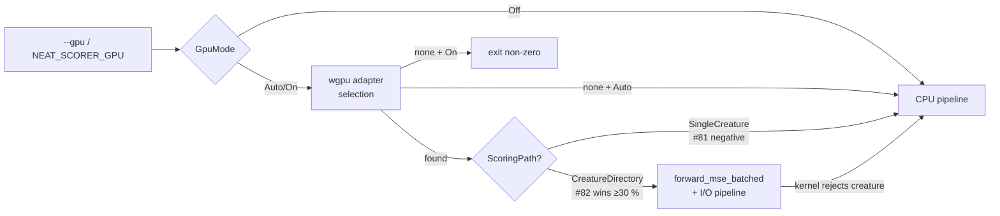
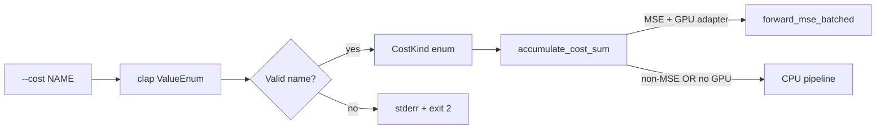
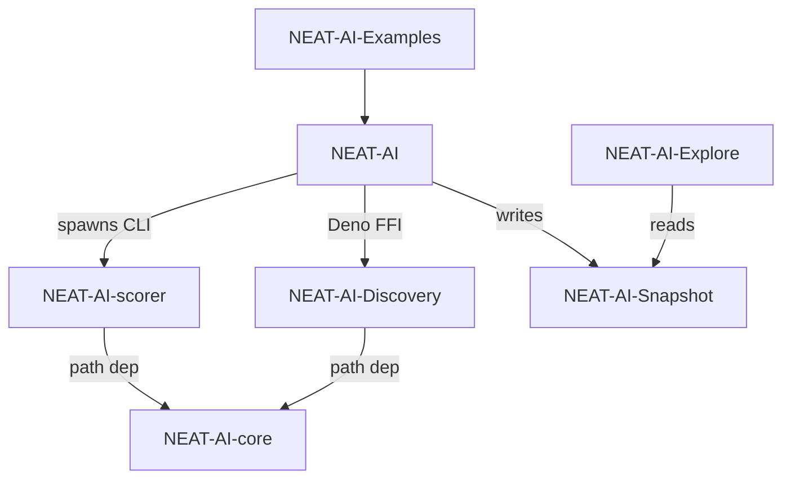
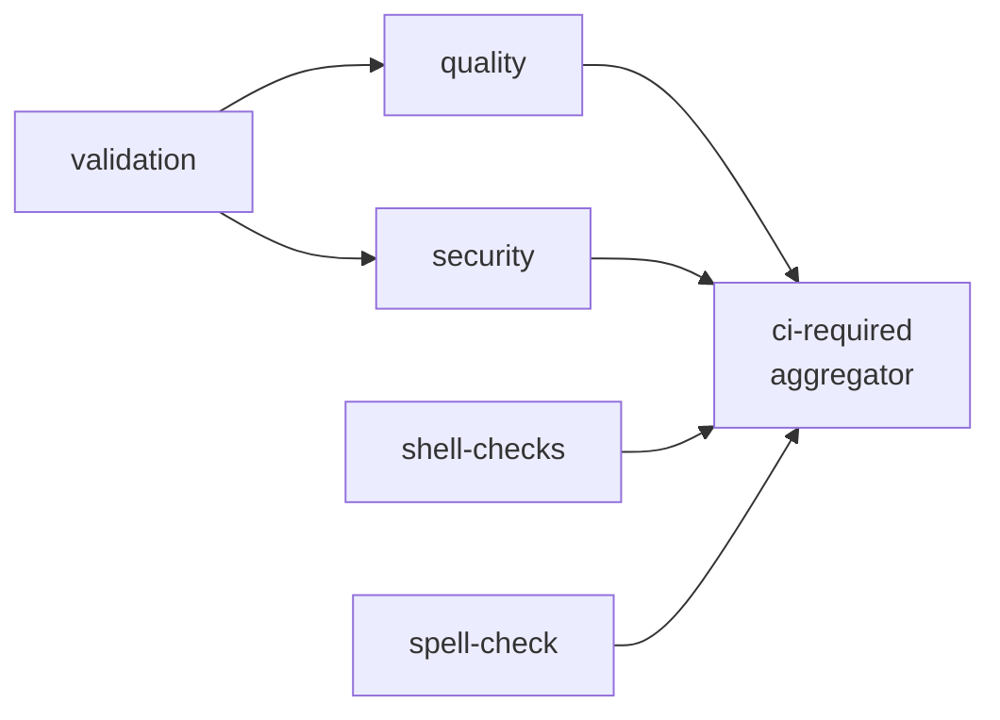
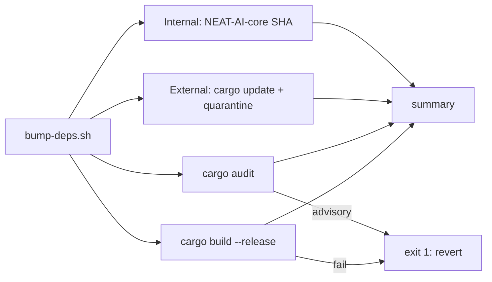

# NEAT-AI-scorer

Native **MSE scorer** CLI for NEAT-AI creatures. Shared logic lives in **`neat-core`**, resolved from a **path dependency** on **[NEAT-AI-core](https://github.com/stSoftwareAU/NEAT-AI-core)** (see `rust_scorer/Cargo.toml`). GitHub Actions checks out `NEAT-AI-core` next to this repo so CI can resolve that path.

## Source

| Component | Provenance |
|-----------|----------------|
| `rust_scorer/` | **`training_bin_stream::for_each_read_chunk`** (pipelined on native, same API on wasm) plus **pending + head + compact** (`stream_score.rs`), fused MSE when `forwardOnly` is true; **`float_scan_bench`** uses the same reader for throughput experiments. |
| `neat-core` (crate) | **`../../NEAT-AI-core/neat-core`** relative to `rust_scorer/Cargo.toml` — clone **NEAT-AI-core** as a sibling of **NEAT-AI-scorer** (same parent directory). |
| `LICENSE`, `.gitleaks.toml` | `origin/Develop` of NEAT-AI |

## Build

```bash
./quality.sh
```

Or step-by-step (matches CI):

```bash
export RUSTFLAGS="-D warnings"
cargo deny check
cargo fmt --all -- --check
cargo clippy --workspace --all-targets --all-features -- -D warnings -D clippy::filter_next -D clippy::collapsible_if
cargo test --workspace --all-features
cargo build --release -p rust_scorer
```

Requires **shellcheck**, **cargo-deny** (`cargo install cargo-deny --locked`), **codespell** (`pip install --user codespell`, used by `scripts/spell-check.sh`), and optionally **cargo-edit** for the upgrade step in `./quality.sh`

### Spell check

CI runs `codespell` via `scripts/spell-check.sh`; the same script is invoked by `./quality.sh`, so the local gate and CI stay in lock-step. Reproduce the CI spell check at any time with:

```bash
./scripts/spell-check.sh
```

Configuration (ignore list, skip paths, check-filenames / check-hidden flags) is kept in a single source of truth: [`.codespellrc`](./.codespellrc). When a domain term trips codespell, prefer adding it — with a short justification comment — to `.codespellrc` over silencing the whole file. Genuine typos must continue to fail the build. Current curated domain entries:

- `renderD` — DRM device node name (e.g. `renderD128`).
- `mape` / `MAPE` — Mean Absolute Percentage Error (a `neat-core` loss function).

Binaries: `rust_scorer`, `float_scan_bench`, `cost_scan_bench` (see `rust_scorer/Cargo.toml`). `cost_scan_bench` (Issue #124) sweeps every supported [`CostKind`](rust_scorer/src/cost.rs) through the forward-only fused path against a single creature and a `.bin` corpus, emitting a JSON summary for per-cost CPU baseline comparison.

## CLI

Positional arguments only (same contract as in NEAT-AI):

```text
rust_scorer <creature.json | creatures_dir> <training_data_dir>
```

- `creature.json` path: scores one creature and returns the existing single-object output.
- `creatures_dir` path: scores every `*.json` in that directory in one pass over training data and returns one JSON object keyed by each file's stem (filename without extension or folders).
- Directory mode requires `forwardOnly: true` and matching `input` / `output` shape across all files.

### GPU mode (Issues #80 / #83)

The scorer probes for a GPU adapter via `wgpu` and dispatches the
multi-creature batched kernel from Issue #82 when bench evidence supports it
(see [`docs/performance-baseline.md`](docs/performance-baseline.md)). The CLI
flag wins over the `NEAT_SCORER_GPU` environment variable.

| Mode    | Behaviour                                                                                                       | `gpuBackend` value                                  |
|---------|-----------------------------------------------------------------------------------------------------------------|-----------------------------------------------------|
| `auto`  | **Default since Issue #83.** Use GPU on paths where bench evidence supports it (directory mode at the issue-target corpus); silently fall back to CPU otherwise. | `"metal"` / `"vulkan"` / `"dx12"` / `"gl"` / `"cpu-fallback"` |
| `on`    | Require a compatible GPU; exit non-zero with a clear message when none is found (no silent fallback). Forces the GPU path even where bench evidence does not support it. | `"metal"` / `"vulkan"` / `"dx12"` / `"gl"`          |
| `off`   | Skip GPU detection entirely; run the CPU pipeline.                                                             | `"cpu-fallback"`                                    |

```text
rust_scorer <creatures_dir> <training_data_dir>             # Auto by default
rust_scorer --gpu off <creature.json> <training_data_dir>   # opt out
NEAT_SCORER_GPU=on rust_scorer <creatures_dir> <training_data_dir>
```

The `gpuBackend` field is added to every JSON output (single-creature and
directory mode) and reports the backend that **actually ran** the scoring
kernel (per Issue #83). Existing fields and their order are unchanged.



### GPU acceleration (Issue #83)

End-to-end benchmarking at `BENCH_SCORING_BYTES=200000000` showed the
multi-creature batched kernel from #82 beats CPU+PGO by ≥ 30 % on Apple
Silicon Metal, well clearing the 3 % bar from
[`docs/gpu-scoring-design.md`](docs/gpu-scoring-design.md). The
single-creature path stayed slower on GPU than CPU+PGO in #81 and is held
on CPU. `auto_should_use_gpu` in `rust_scorer/src/gpu/mod.rs` is the single
source of truth for the per-path decision; updating either result only
requires editing that function plus the matching row in the docs table

| Path                               | GPU vs CPU+PGO @ 200 MB | `Auto` default | Source       |
|------------------------------------|-------------------------|----------------|--------------|
| `score_from_json_fused` (single)   | GPU loses               | **CPU**        | Issue #81 (negative result) |
| `score_from_creature_dir` (N=50)   | **GPU −32.4 %** (Metal) | **GPU**        | Issue #82 PR summary |
| `score_from_creature_dir` (N=10)   | GPU loses (low N)       | GPU (per-path) | Issue #82 |

`Auto` selects per **path** (single vs directory), not per N — at N=10 the
per-dispatch overhead dominates, but at the issue-target corpus the
break-even sits well before N=50 (see [`docs/gpu-scoring-design.md`](docs/gpu-scoring-design.md)).
Users running directory mode at very low N can opt out with `--gpu off` if
they observe a regression on their hardware.

Headline numbers (Apple Silicon M-series, 200 MB corpus, from
[`docs/performance-baseline.md`](docs/performance-baseline.md)):

| Bench                                              | Median  | Throughput  |
|----------------------------------------------------|---------|-------------|
| `score_from_creature_dir/creatures/50` (CPU)       | 3.219 s | 59.2 MiB/s  |
| `gpu_score_from_creature_dir/creatures/50` (GPU)   | 2.176 s | 87.7 MiB/s  |
| `gpu_pipelining_toggle/inflight/2` (pipelined)     | 2.153 s | 88.6 MiB/s  |

The JSON output adds `gpuKernel: "forward_mse_batched"` plus
`gpuInflightChunks` and `gpuDispatchCount` diagnostic counters when the
GPU directory path runs.

### Cost function selector (Issues #120, #121)

The `--cost <NAME>` flag selects which built-in loss function the scorer
dispatches when scoring a creature. Names match the TypeScript
`BUILT_IN_COST_NAMES` strings exactly (see
[`NEAT-AI/src/Costs.ts`](https://github.com/stSoftwareAU/NEAT-AI/blob/Develop/src/Costs.ts))
so callers can pass `NeatOptions.costName` through unchanged.

| Value               | Meaning                              | Dispatch helper (`neat_core::loss`) | GPU?           |
|---------------------|--------------------------------------|--------------------------------------|----------------|
| `MSE` (**default**) | Mean Squared Error                   | `mse_sum_batch_packed`               | **Yes**        |
| `MAE`               | Mean Absolute Error                  | `mae_sum_batch_packed`               | No (CPU)       |
| `MAPE`              | Mean Absolute Percentage Error       | `mape_sum_batch_packed`              | No (CPU)       |
| `MSLE`              | Mean Squared Logarithmic Error       | `msle_sum_batch_packed`              | No (CPU)       |
| `HINGE`             | Hinge loss                           | `hinge_sum_batch_packed`             | No (CPU)       |
| `CROSS_ENTROPY`     | Cross-entropy                        | `cross_entropy_sum_batch_packed`     | No (CPU)       |
| `CATEGORICAL_ERROR` | Categorical (top-1 mismatch) error   | `categorical_error_sum_batch_packed` | No (CPU)       |

Unknown values are rejected by `clap` with a non-zero exit and a stderr
message listing the supported set. There is **no** `NEAT_SCORER_COST`
environment-variable override — KISS, the CLI flag is the only knob.
The resolved cost name is echoed back as the `costName` JSON field on
every `ScoreResult`.

#### Per-cost examples

```text
rust_scorer --cost MSE               <creature.json> <training_data_dir>  # default; unchanged behaviour
rust_scorer --cost MAE               <creature.json> <training_data_dir>  # absolute-error regression
rust_scorer --cost MAPE              <creature.json> <training_data_dir>  # percentage-error regression
rust_scorer --cost MSLE              <creature.json> <training_data_dir>  # log-scale regression
rust_scorer --cost HINGE             <creature.json> <training_data_dir>  # margin classifier
rust_scorer --cost CROSS_ENTROPY     <creature.json> <training_data_dir>  # probabilistic classifier
rust_scorer --cost CATEGORICAL_ERROR <creature.json> <training_data_dir>  # multi-class top-1 mismatch count
rust_scorer --cost FOO               <creature.json> <training_data_dir>  # exits non-zero — unknown cost
```

#### GPU constraint — MSE-only kernel

The `forward_mse_batched` GPU kernel currently computes **MSE only**.
Any non-MSE `--cost` selection forces the CPU pipeline:

- Under `--gpu auto` (the default since Issue #83) a non-MSE cost
  silently routes to the CPU directory/streaming path — the
  `gpuBackend` field on the result reports `"cpu-fallback"` so the
  caller can see what actually ran.
- Under `--gpu on` a non-MSE cost is a hard error before any scoring
  runs (no silent downgrade — `--gpu on` is a strict requirement).
- Under `--gpu off` GPU detection is skipped regardless of `--cost`.



### Stdin input mode

For restricted worker/sandbox environments where writing a temp file may fail
even with write permission (see issue #15), pass the creature JSON on stdin:

```text
rust_scorer --creature-stdin <training_data_dir>
```

The positional contract is unchanged in default mode. With `--creature-stdin`,
the binary reads creature JSON from standard input until EOF and expects a
single positional argument (`<training_data_dir>`).

### Output

Single-creature mode JSON includes **`forwardOnly`** (from the creature) and **`trainingReadBackend`**: on a native release build you should see **`pipelined_double_buffer`** when `forwardOnly` is `true` (fused scoring + `training_bin_stream`). If `forwardOnly` is `false`, you get **`record_iterator`** instead (no pipelining — much slower on large data). The **`gpuBackend`** field reports which `wgpu` backend the scorer would run on (`"cpu-fallback"` until GPU kernels land; see [GPU mode](#gpu-mode-issues-80--83) above).

In directory mode, output is a top-level object keyed by creature filename stem, where each value has the same shape as a single-creature `ScoreResult`.

```json
{
  "GRQ-10-1": {
    "score": 0.9999998,
    "error": 0.0
  },
  "GRQ-12-1": {
    "score": 0.9999998,
    "error": 0.0
  }
}
```

This mode uses one shared training-data scan and parallelises scoring across creatures to use available CPU cores by default.

Per-chunk activation runs through a single flat Rayon layer (Issue #41): a worker network pool sized to `activation_threads` is built up-front, and every chunk dispatches one `par_iter_mut` over that pool. When the population meets or exceeds `activation_threads` each creature owns one worker; below that, the thread budget is spread across creatures so a small population still saturates the CPU. The JSON output keeps the same shape — `parallelActivationBatches` and `maxActivationBatchRecords` are not emitted in directory mode.

For forward-only single-creature fused scoring, activation parallelism also
defaults to all available CPU cores. Set `NEAT_SCORER_ACTIVATION_THREADS` only
when you want to tune down/up manually.

## Local layout

Place **NEAT-AI-core** and **NEAT-AI-scorer** as **siblings** (e.g. `…/src/NEAT-AI-core` and `…/src/NEAT-AI-scorer`). The path in `rust_scorer/Cargo.toml` is `../../NEAT-AI-core/neat-core` so `cargo build` resolves `neat-core` from your local **NEAT-AI-core** tree. CI does the same via a second checkout (`../NEAT-AI-core`).

## Relationship to NEAT-AI

Scorer-specific Rust stays here; **`neat-core`** tracks **NEAT-AI-core**.

## Related Repositories

The NEAT-AI project is split across several repositories. This repo, **NEAT-AI-scorer**, is the native MSE scorer CLI consumed by **NEAT-AI** during training.

| Repository | Role |
|------------|------|
| [NEAT-AI](https://github.com/stSoftwareAU/NEAT-AI) | Deno/TypeScript orchestrator — the NEAT neural-network runtime that trains and evaluates creatures. |
| [NEAT-AI-core](https://github.com/stSoftwareAU/NEAT-AI-core) | Shared Rust computation library (`neat-core` crate) with fused batch losses and `training_bin_stream`. |
| [NEAT-AI-Discovery](https://github.com/stSoftwareAU/NEAT-AI-Discovery) | Rust discovery module invoked by NEAT-AI via Deno FFI. |
| [NEAT-AI-Snapshot](https://github.com/stSoftwareAU/NEAT-AI-Snapshot) | Snapshot storage for trained creatures. |
| [NEAT-AI-scorer](https://github.com/stSoftwareAU/NEAT-AI-scorer) | **This repo** — native MSE scorer CLI; depends on `neat-core` via path dependency. |
| [NEAT-AI-Explore](https://github.com/stSoftwareAU/NEAT-AI-Explore) | Visualiser that consumes NEAT-AI-Snapshot data. |
| [NEAT-AI-Examples](https://github.com/stSoftwareAU/NEAT-AI-Examples) | Usage examples built on NEAT-AI. |

### Dependency graph



## Cost dispatch (Issues #120, #121)

The CLI accepts a `--cost <NAME>` flag listing every TypeScript
`BUILT_IN_COST_NAMES` value, and (since #121) the scoring calculation
honours the selection. The dispatch site is a single helper
(`rust_scorer::cost::accumulate_cost_sum`) shared by both the fused
forward-only path and the per-record recurrent path:

- **Fused forward-only path.** `stream_score::accumulate_cost_sum_forward_only_fused`
  routes every chunk through `accumulate_cost_sum`, which calls the matching
  `neat_core::loss::*_sum_batch_packed` helper. Adding a future cost is a
  one-line addition to the dispatch site.
- **Per-record recurrent path.** `forwardOnly: false` creatures use
  `TrainingDataIterator` to feed `[inputs..., targets...]` packed records into
  the same `accumulate_cost_sum` helper one record at a time, so every
  supported cost works here too.
- **`CATEGORICAL_ERROR` dispatches** through `categorical_error_sum_batch_packed`
  (landed via [`NEAT-AI-core#88`](https://github.com/stSoftwareAU/NEAT-AI-core/issues/88);
  unblocked here in #134) — the dispatch returns the integer count of
  argmax misclassifications across the corpus.
- **GPU kernel is MSE-only.** `forward_mse_batched` does not yet have
  per-cost variants; non-MSE costs route to the CPU pipeline (silent
  fallback under `--gpu auto`, hard error under `--gpu on`).

See the [Cost function selector](#cost-function-selector-issues-120-121) section
above for the supported names and CLI surface.

## CI

### Job dependency graph (Issue #23)

`.github/workflows/ci.yml` declares an explicit job graph so ordering is
predictable on re-runs and partial failures:



* **`validation`** is the foundation — it verifies required files and Cargo
  metadata. `quality` and `security` `needs: [validation]` so a broken repo
  layout fails fast without burning Rust compile minutes or a security scan.
* **`shell-checks`** and **`spell-check`** are lightweight and run in
  parallel with the foundation to surface findings early.
* **`ci-required`** is a single fan-in aggregator. It `needs:` every gating
  job, uses `if: always()` so it always reports a result, and inspects
  `needs.<job>.result` in its run step to fail unless every dependency
  reported `success` or `skipped`. **Branch protection should pin exactly
  one required check — `CI Required Checks` — so the merge gate is stable
  even when individual gating jobs are added or renamed.**

The graph is validated by `scripts/check-ci-job-graph.sh` (wired into
`quality.sh`) and covered end-to-end by `tests/scripts/workflow_job_graph.bats`.

### Pre-quality dependency bump (`bump-deps.sh`)

`bump-deps.sh` lives at the repo root and is invoked by the Vibe Coder
worker before `quality.sh` (per stSoftwareAU/VibeCoding#1613). It refreshes
the Cargo dependency graph in four stages and prints a one-line summary:

1. **Internal — NEAT-AI-core pin.** When any workspace member's `Cargo.toml`
   pins `neat-core` to a `git+rev` SHA, the script resolves
   `gh api repos/stSoftwareAU/NEAT-AI-core/commits/Develop --jq .sha` and
   advances the `rev = "..."` field if it has moved. The default layout in
   this repo uses a `path = "..."` sibling clone (see AGENTS.md), so this
   step is a no-op unless someone switches to a `git+rev` pin.
2. **External — crates.io.** Runs `cargo update --dry-run` (or
   `cargo upgrade --dry-run` under `--cargo-upgrade`, see below), then for
   each proposed bump checks the version's publish time against
   `--quarantine-hours` (default `$VIBE_BUMP_QUARANTINE_HOURS` / 24h).
   Versions younger than the quarantine window are deferred; older versions
   are applied with `cargo update -p <crate> --precise <new>` (or
   `cargo upgrade -p <crate>@<new>`).
3. **`cargo audit`.** Fails non-zero on any reported advisory, naming the
   offending crate and advisory ID.
4. **`cargo build --release`.** Confirms the bumped tree compiles.

Exit `0` means the tree is clean (or no-op); non-zero means a bump was
rejected and the worker reverts. Override flags (`--skip-internal`,
`--skip-external`, `--skip-audit`, `--skip-build`, `--cargo-upgrade`) and a
hidden `--check-published` testing helper are documented under
`./bump-deps.sh --help`. The script is covered by
`tests/scripts/bump_deps.bats`.

The `--cargo-upgrade` flag (Issue #101) switches the driver from
`cargo update` (lockfile-only) to `cargo upgrade` (cargo-edit), so a
worker preparing a PR can bump the `Cargo.toml` manifests through the
same quarantine gate. Dependency bumps now happen per-PR only
(Issue #105) — the previous weekly `upgrade-dependencies.yml` schedule
has been removed.



### Other PR automation

Besides the quality gate (`.github/workflows/ci.yml`), PRs also run a guarded
auto-version increment job (`.github/workflows/version-increment.yml`,
Issue #20). On each PR the job compares `rust_scorer/Cargo.toml` against the
base branch and, if the version has not already changed on the branch, bumps
the patch component once and pushes that commit back to the PR branch. A
re-run of CI — or a human-authored bump on the same branch — short-circuits
the job, so no duplicate bump commits are produced. The underlying logic
lives in `scripts/version-increment.sh` and is covered by
`tests/scripts/version_increment.bats`.

PRs also run an auto-format job (`.github/workflows/auto-format.yml`,
Issue #19). The job runs `cargo fmt --all` on the PR branch; if the working
tree changes, the formatting fix is committed with a deterministic message
and pushed back. When there are no changes the commit step is skipped, so
re-running on a clean branch is a no-op. Change detection and the commit
message live in `scripts/auto-format.sh` and are covered by
`tests/scripts/auto_format.bats`; the workflow itself is validated by
`scripts/check-auto-format-workflow.sh` (invoked from `quality.sh`).

A standalone Cargo Security Audit workflow (`.github/workflows/cargo-audit.yml`,
Issue #64) mirrors the `cargo audit` step in the reusable `security.yml` but
adds a weekly cron schedule (`0 6 * * 1`) plus `workflow_dispatch`. The
schedule catches advisories published _after_ the last PR — the lockfile
does not change but the RustSec advisory database does. The workflow is
validated by `scripts/check-cargo-audit-workflow.sh` (invoked from
`quality.sh`) and covered end-to-end by
`tests/scripts/cargo_audit_workflow.bats`.

A standalone Cargo Quality workflow (`.github/workflows/cargo-quality.yml`,
Issue #66) runs `cargo fmt --check` and `cargo clippy -- -D warnings` on
pull requests against **any** branch (`branches: ["*"]`). `ci.yml` only
fires for PRs targeting `Develop`, so this dedicated workflow gives feature
branches and stacked PRs the same fmt + clippy gate without spinning up the
full CI graph. The workflow is validated by
`scripts/check-cargo-quality-workflow.sh` (invoked from `quality.sh`) and
covered end-to-end by `tests/scripts/cargo_quality_workflow.bats`.

ShellCheck runs in exactly one place: `ci.yml`'s `shell-checks` job invokes
`ludeeus/action-shellcheck@2.0.0` alongside the `bash -n` syntax check and
the bats helper-test suite, and feeds the `ci-required` aggregator that
branch protection gates on. A standalone `shellcheck.yml` previously ran the
identical invocation, doubling the maintenance surface (Issue #157); it was
removed so the ShellCheck configuration lives in a single home. The dedup
invariant is enforced by `scripts/check-shellcheck-dedup.sh` (invoked from
`quality.sh`) and covered end-to-end by
`tests/scripts/shellcheck_dedup.bats`, which fail if a second workflow
re-introduces the duplicate ShellCheck step.

A standalone Dependency Review workflow
(`.github/workflows/dependency-review.yml`, Issue #62) runs
`actions/dependency-review-action@v4` on every pull request against any
branch. The action diffs the PR's manifest against the base branch and
fails the run if any newly introduced dependency carries a known
vulnerability or disallowed licence — catching supply-chain regressions
before merge. The reusable `security.yml` workflow runs the same action
inside the full CI graph; this dedicated workflow gives feature branches
and stacked PRs the same gate without spinning up CI. The workflow is
validated by `scripts/check-dependency-review-workflow.sh` (invoked from
`quality.sh`) and covered end-to-end by
`tests/scripts/dependency_review_workflow.bats`.

A standalone Gitleaks Secrets Detection workflow
(`.github/workflows/gitleaks.yml`, Issue #21) runs the pinned
`gitleaks` binary on every pull request against any branch. The scan is
scoped to the PR commit range (`origin/<base>..HEAD`) so reviewers see
only findings introduced by the proposed change. The Gitleaks binary is
pinned by version **and** SHA256 checksum (bumped together in the same
PR), so a compromised release asset cannot silently replace the
scanner. The workflow is validated by `scripts/check-gitleaks-workflow.sh`
(invoked from `quality.sh`) and covered end-to-end by
`tests/scripts/gitleaks_workflow.bats`.

A standalone Semgrep SAST workflow (`.github/workflows/semgrep.yml`,
Issue #47) runs the official `semgrep/semgrep` container — pinned by
`sha256:` digest (Issue #102) — on every pull request against any branch.
The container path is the functional equivalent of the
`semgrep/semgrep-action` GitHub Action; both consume
`SEMGREP_APP_TOKEN` from repo secrets and execute
`semgrep ci --config p/default`. The workflow is validated by
`scripts/check-semgrep-workflow.sh` (invoked from `quality.sh`) and
covered end-to-end by `tests/scripts/semgrep_workflow.bats`.

A standalone Markdown Lint workflow
(`.github/workflows/markdown-lint.yml`, Issue #63) runs
`markdownlint-cli2` against the existing `.markdownlint-cli2.yaml`
config on every pull request and on pushes to `main`/`master`. The
workflow keeps README/docs style regressions out of merged commits
without depending on the full CI graph. It is validated by
`scripts/check-markdown-lint-workflow.sh` (invoked from `quality.sh`)
and covered end-to-end by `tests/scripts/markdown_lint_workflow.bats`.

### GitHub Actions pinning policy (SHA pinning + Node 24 compat)

Every `uses:` reference across the workflow files is pinned to a
40-character commit SHA, with the human-readable version recorded in a
trailing comment, e.g.

```yaml
uses: actions/checkout@93cb6efe18208431cddfb8368fd83d5badbf9bfd  # v5
uses: dtolnay/rust-toolchain@29eef336d9b2848a0b548edc03f92a220660cdb8  # stable, frozen 2026-05-18
uses: peter-evans/create-pull-request@5f6978faf089d4d20b00c7766989d076bb2fc7f1  # v8
```

The SHA is the supply-chain pin (Issue #100) — it stops a compromised
maintainer or re-tagged ref from silently re-executing under workflows
with `contents: write` and `GITHUB_TOKEN` access. The trailing comment
keeps bumps reviewable: the SHA changes, the version label tells the
reviewer what the bump is. **Bump protocol:** resolve the new SHA from
the upstream tag (`gh api repos/<owner>/<repo>/git/ref/tags/vN`), update
the SHA and the comment in the same PR, and note the changelog highlights
in the PR description.

The same script also enforces the Node 24 deprecation policy from the
trailing comment: minimum majors, tracked Node 20 exceptions
(`actions/dependency-review-action@v4`, `rustsec/audit-check@v2` — no
Node 24 release upstream yet), and a composite/shell allow-list. The
policy lives in `scripts/check-workflow-action-versions.sh` and is
covered end-to-end by `tests/scripts/workflow_action_versions.bats`.
`quality.sh` invokes the script so any unpinned or outdated `uses:`
reference fails the local gate before CI (Issues #24 and #100).

## How to bench

`rust_scorer` ships a Criterion suite (Issue #36) covering the forward-only
fused path, the multi-creature directory mode, and the inner unpack + MSE
loop. The bench is **not** part of `quality.sh` — Criterion runs are slow and
not deterministic enough for a merge gate. Reproduce the baseline with:

```bash
./scripts/run-benches.sh
```

Or, for the issue's 50–200 MB target corpus:

```bash
BENCH_SCORING_BYTES=200000000 ./scripts/run-benches.sh
```

Tunables (all optional): `BENCH_SCORING_BYTES`, `BENCH_SCORING_INPUTS`,
`BENCH_SCORING_OUTPUTS`, `BENCH_SCORING_HIDDEN`. Recorded baselines and
host-specific numbers live in [`docs/performance-baseline.md`](docs/performance-baseline.md).
Per `AGENTS.md`, performance PRs without before/after Criterion evidence are
rejected.

## How to flamegraph (Issue #37)

Capture an SVG flamegraph for the single-creature fused path and the
multi-creature directory mode with the cross-platform helper:

```bash
./scripts/profile-flamegraph.sh
```

The defaults (2 GiB single-creature corpus, 500 MB × 50 creatures
multi-creature corpus) take a couple of minutes end-to-end on Apple
silicon and write:

* `docs/evidence/single-creature.svg`
* `docs/evidence/multi-creature.svg`

The script builds `rust_scorer` with a dedicated `profiling` Cargo profile
(release optimisations + `debug = true`) so function names survive into the
flamegraph, generates deterministic synthetic data via Python's `array`
module, runs each scenario and feeds raw samples through `inferno`.

One-time install of the toolchain:

```bash
cargo install inferno           # required for inferno-collapse-sample + inferno-flamegraph
cargo install flamegraph        # Linux only: provides `cargo flamegraph` on top of `perf`
# macOS: Xcode command-line tools ship /usr/bin/sample — no sudo needed.
```

Runtime tunables (override any default positional arg or env var):

```bash
# size-down for a quick smoke test
./scripts/profile-flamegraph.sh 209715200 52428800 10

# slim inputs / fewer hidden neurons
PROFILE_NUM_INPUTS=4 PROFILE_HIDDEN=4 ./scripts/profile-flamegraph.sh
```

The `profiling` Cargo profile inherits from `release` but turns debug info
and symbols back on. It is invoked only by this helper — the CI `release`
build path is unchanged.

Interpretation and the current top-5 cost centres per scenario are
documented in the **"Hot spots"** section of
[`docs/performance-baseline.md`](docs/performance-baseline.md). Re-run the
script after each optimisation sub-issue lands and overwrite the SVGs so
the hot-spot ordering stays honest.

## Optimised release build (PGO) — Issue #43

The default release profile already enables LTO and `codegen-units = 1`.
**Profile-Guided Optimisation (PGO)** is the next compiler-level lever — a
recorded profile of a real scoring run feeds back into `rustc` so hot loops
get better inlining, branch prediction hints, and code layout. PGO often
yields 5–15 % on numeric inner loops similar to `mse_sum_batch_packed`, and
since `rust_scorer` is invoked many times per NEAT training run, even a few
percent per call compounds.

### One-shot build

```bash
./scripts/build-pgo.sh
```

The helper drives the standard manual `rustc` flow — no `cargo-pgo` install
required:

1. Generates a deterministic synthetic training fixture (Python).
2. Builds an instrumented binary with `RUSTFLAGS="-Cprofile-generate=…"`
   under the dedicated `pgo` Cargo profile (inherits `release`, keeps
   `codegen-units = 1`).
3. Runs the instrumented binary against the fixture in **single-creature**
   mode and **directory** mode to gather `*.profraw` files.
4. Merges them via `llvm-profdata merge`.
5. Re-builds with `RUSTFLAGS="-Cprofile-use=…/merged.profdata"`.

The final binary lands at `target/pgo/rust_scorer`. NEAT-AI can pick it up
by overriding the scorer path in its launch config — the CLI contract
(`<creature.json> <data_dir>`) is unchanged.

### Prerequisites

```bash
rustup component add llvm-tools   # provides llvm-profdata
# python3 is also required (used to materialise the training fixture)
```

`build-pgo.sh` auto-discovers `llvm-profdata` via `command -v` first and
then falls back to `rustc --print sysroot`/`lib/rustlib`. Override with
`LLVM_PROFDATA=/path/to/llvm-profdata` if needed.

### Tunables

| Variable | Default | Purpose |
|---|---|---|
| `PGO_BYTES` | `104857600` (100 MB) | training corpus size for instrumentation |
| `PGO_NUM_INPUTS` | `8` | inputs per record |
| `PGO_NUM_OUTPUTS` | `2` | outputs per record |
| `PGO_HIDDEN` | `8` | hidden neurons per synthetic creature |
| `PGO_CREATURES` | `10` | creatures used for the directory-mode pass |
| `PGO_PROFDATA_DIR` | `target/pgo-profiles` | where `*.profraw` and `merged.profdata` land |
| `PGO_FIXTURE_DIR` | `target/pgo-fixture` | where the synthetic training fixture is materialised |

### Benchmark evidence (Issue #43)

Numbers below come from timing the same `rust_scorer` binary (release vs
PGO) against an identical 300 MB fixture, 15 timed runs each (median /
best, lower is better — Apple silicon, see
`docs/evidence/pgo-bench-300mb.log`):

| Scenario | release median | PGO median | Δ median |
|---|---:|---:|---:|
| `score_from_json_fused` (single-creature, 300 MB) | 447.6 ms | 407.7 ms | **−8.9 %** |
| `score_from_creature_dir` (10 creatures, 300 MB) | 2079.2 ms | 1911.2 ms | **−8.1 %** |

Both scoring paths beat the 3 % acceptance threshold from the issue. The
gain is most reliable on the directory-mode path (more time spent inside
the activation/MSE inner loops), and noisier on the small single-creature
path where CLI start-up makes up a larger share of wall-clock time.

Reproduce on your host by running `./scripts/build-pgo.sh` and then timing
`target/release/rust_scorer` against `target/pgo/rust_scorer` over the
fixture the helper wrote to `target/pgo-fixture/`.

### CI

Producing the PGO binary as a release artefact in CI requires committing a
new workflow YAML, which the worker is not authorised to push (no
`workflow` OAuth scope — see `AGENTS.md` "Human Escalation"). Run the
helper locally for now, or have a maintainer wire `build-pgo.sh` into a
manually triggered workflow under `.github/workflows/`.

## License

Apache-2.0 — see `LICENSE`.
