# NEAT-AI-scorer

Native **MSE scorer** CLI for NEAT-AI creatures. Shared logic lives in **`neat-core`**, resolved from a **path dependency** on **[NEAT-AI-core](https://github.com/stSoftwareAU/NEAT-AI-core)** (see `rust_scorer/Cargo.toml`). GitHub Actions checks out `NEAT-AI-core` next to this repo so CI can resolve that path

## Source

| Component | Provenance |
|-----------|----------------|
| `rust_scorer/` | **`training_bin_stream::for_each_read_chunk`** (pipelined on native, same API on wasm) plus **pending + head + compact** (`stream_score.rs`), fused MSE when `forwardOnly` is true; **`float_scan_bench`** uses the same reader for throughput experiments. |
| `neat-core` (crate) | **`../../NEAT-AI-core/neat-core`** relative to `rust_scorer/Cargo.toml` — clone **NEAT-AI-core** as a sibling of **NEAT-AI-scorer** (same parent directory). |
| `LICENSE`, `.gitleaks.toml` | `origin/Develop` of NEAT-AI |

## Build

```bash
./quality.sh
```

Or step-by-step (matches CI):

```bash
export RUSTFLAGS="-D warnings"
cargo deny check
cargo fmt --all -- --check
cargo clippy --all-targets --all-features -- \
  -D warnings \
  -D clippy::filter_next \
  -D clippy::collapsible_if
cargo check --all-targets --all-features
cargo build --workspace
cargo test --workspace --all-features --verbose -- --test-threads=2
RUSTDOCFLAGS="-D warnings" cargo doc --workspace --no-deps
```

Requires **shellcheck**, **cargo-deny** (`cargo install cargo-deny --locked`), **codespell** (`pip install --user codespell`, used by `scripts/spell-check.sh`), and optionally **cargo-edit** for the **opt-in** upgrade step in `./quality.sh`

By default `./quality.sh` is **read-only** against `Cargo.lock` / `Cargo.toml` — it never bumps dependency versions in your working tree. To bump library dependencies during the gate, opt in with `./quality.sh --upgrade` (or `QUALITY_UPGRADE=1 ./quality.sh`); this requires **cargo-edit**. Routine, quarantine-gated dependency bumps go through [`./bump-deps.sh`](./bump-deps.sh) (Issue #105) instead.

### Pinned Rust toolchain (Issue #209)

The project SHA-pins every GitHub Action and container digest for reproducibility, but the Rust compiler version would otherwise float — `dtolnay/rust-toolchain` resolves `stable` at run time. Because the gate is `-D warnings` plus specific clippy lints, a fresh stable release can introduce a lint that breaks CI with **no code change**, and contributors cannot reproduce it locally.

The root [`rust-toolchain.toml`](./rust-toolchain.toml) closes that gap by pinning a concrete channel and the `rustfmt`/`clippy` components:

```toml
[toolchain]
channel = "1.95.0"
components = ["rustfmt", "clippy"]
```

`rustup` reads this file automatically, so both local `./quality.sh` and every CI workflow (`dtolnay/rust-toolchain` honours the file when no explicit `toolchain:` input is given) resolve the **same** `rustc`/`clippy`/`rustfmt`. The pinned compiler auto-installs on the first `cargo` invocation. `edition = "2024"` already requires a recent stable, reinforcing the need to pin.

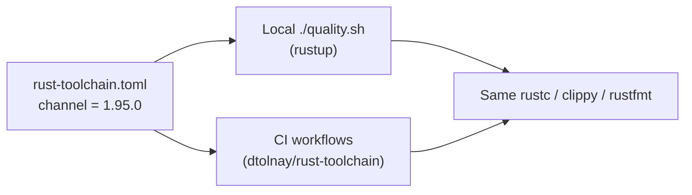

**Bump cadence.** Review when a new stable lands (~every 6 weeks):

1. Edit `channel` in `rust-toolchain.toml` to the new `X.Y.Z`.
2. Run `./quality.sh` locally to confirm the gate still passes under the new compiler (fix any newly-surfaced lints).
3. Land the bump in its own PR so the compiler change is reviewed in isolation.

The pin is validated by `scripts/check-rust-toolchain.sh` (invoked from `quality.sh`) and covered end-to-end by `tests/scripts/rust_toolchain.bats`. The validator rejects a floating channel (`stable`/`beta`/`nightly`) or a missing `rustfmt`/`clippy` component.

### Crate-level rustc lint hardening (Issue #274)

The gate configures Clippy lints, but rustc's own (`rust`) lint groups need denying at the **source tree** too. Relying solely on a CI `-D warnings` flag leaves the tree itself unhardened, so a local build or a differently-configured CI step would not catch a regression at the point it is introduced. The root [`Cargo.toml`](./Cargo.toml) adds a `[workspace.lints.rust]` table (inherited by the crate via `[lints] workspace = true`):

```toml
[workspace.lints.rust]
unsafe_op_in_unsafe_fn = "deny"
unused = "deny"
```

- **`unsafe_op_in_unsafe_fn`** — the crate uses `unsafe` in hot paths (`rust_scorer/src/stream_io.rs`, `rust_scorer/src/cost.rs`); denying this stops an unguarded unsafe operation inside an `unsafe fn` slipping in silently.
- **`unused`** — dead code and unused imports fail the build rather than reaching `Develop`.
- **`missing_docs`** is scoped to the **library surface** via `#![warn(missing_docs)]` in [`rust_scorer/src/lib.rs`](./rust_scorer/src/lib.rs) rather than the workspace table, because the binary targets are doc-noisy. Under the gate's `-D warnings` it enforces doc discipline on the public API exposed to benches and integration tests.

Per-lint denies are used deliberately in place of a blanket `#![deny(warnings)]` so a future compiler warning does not break the build unexpectedly.

The posture is validated by `scripts/check-rust-lints.sh` (invoked from `quality.sh`) and covered end-to-end by `tests/scripts/rust_lints.bats`. The validator fails if the `[workspace.lints.rust]` table is dropped, if either lint stops being denied, if a blanket `warnings` lint is introduced, or if the `missing_docs` scoping is removed from the library root.

### Spell check

CI runs `codespell` via `scripts/spell-check.sh`; the same script is invoked by `./quality.sh`, so the local gate and CI stay in lock-step. Reproduce the CI spell check at any time with:

```bash
./scripts/spell-check.sh
```

Configuration (ignore list, skip paths, check-filenames / check-hidden flags) is kept in a single source of truth: [`.codespellrc`](./.codespellrc). When a domain term trips codespell, prefer adding it — with a short justification comment — to `.codespellrc` over silencing the whole file. Genuine typos must continue to fail the build. Current curated domain entries:

- `renderD` — DRM device node name (e.g. `renderD128`).
- `mape` / `MAPE` — Mean Absolute Percentage Error (a `neat-core` loss function).

Binaries: `rust_scorer`, `float_scan_bench`, `cost_scan_bench`, `gpu_pipeline_alloc_bench` (see `rust_scorer/Cargo.toml`). `cost_scan_bench` (Issue #124) sweeps every supported [`CostKind`](rust_scorer/src/cost.rs) through the forward-only fused path against a single creature and a `.bin` corpus, emitting a JSON summary for per-cost CPU baseline comparison. `gpu_pipeline_alloc_bench` (Issue #202) counts heap allocations during a multi-chunk pipelined (`inflight_chunks == 2`) GPU directory run; it skips cleanly on CPU-only hosts.

## CLI

Positional arguments only (same contract as in NEAT-AI):

```text
rust_scorer <creature.json | creatures_dir> <training_data_dir>
```

- `creature.json` path: scores one creature and returns the existing single-object output.
- `creatures_dir` path: scores every `*.json` in that directory in one pass over training data and returns one JSON object keyed by each file's stem (filename without extension or folders).
- Directory mode requires `forwardOnly: true` and matching `input` / `output` shape across all files.

### GPU mode (Issues #80 / #83)

The scorer probes for a GPU adapter via `wgpu` and dispatches the
multi-creature batched kernel from Issue #82 when bench evidence supports it
(see [`docs/performance-baseline.md`](docs/performance-baseline.md)). The CLI
flag wins over the `NEAT_SCORER_GPU` environment variable.

| Mode    | Behaviour                                                                                                       | `gpuBackend` value                                  |
|---------|-----------------------------------------------------------------------------------------------------------------|-----------------------------------------------------|
| `auto`  | **Default since Issue #83.** Use GPU on directory paths with **AllPrivate** topology (≤256 total neurons per creature); fall back to CPU for scratch/mixed GRQ-scale pools (#317), GPU-unsupported costs (any cost other than MSE/RMSE/MAE), missing adapters, or failed pre-flight. Prints one stderr note when declining GPU for topology. | `"metal"` / `"vulkan"` / `"dx12"` / `"gl"` / `"cpu-fallback"` |
| `on`    | Require a compatible GPU; exit non-zero with a clear message when none is found (no silent fallback). Forces the GPU path even where bench evidence does not support it. | `"metal"` / `"vulkan"` / `"dx12"` / `"gl"`          |
| `off`   | Skip GPU detection entirely; run the CPU pipeline.                                                             | `"cpu-fallback"`                                    |

```text
rust_scorer <creatures_dir> <training_data_dir>             # Auto by default
rust_scorer --gpu off <creature.json> <training_data_dir>   # opt out
NEAT_SCORER_GPU=on rust_scorer <creatures_dir> <training_data_dir>
```

The `gpuBackend` field is added to every JSON output (single-creature and
directory mode) and reports the backend that **actually ran** the scoring
kernel (per Issue #83). Existing fields and their order are unchanged.

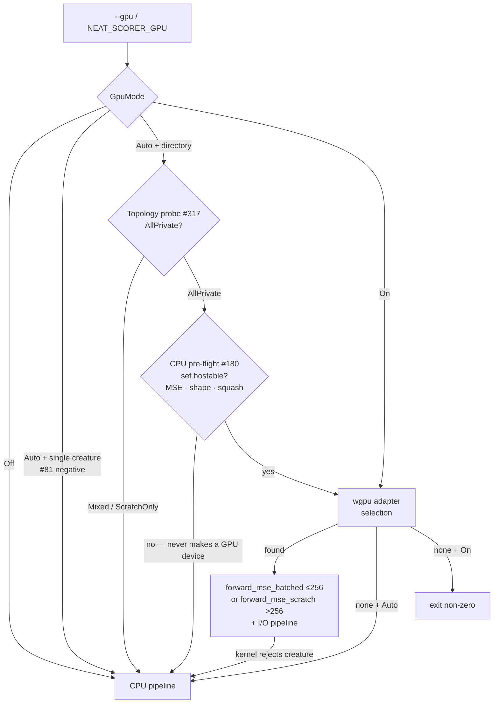

Under `--gpu auto` the directory path runs a **CPU-only pre-flight**
(`multi_score::gpu_directory_compatible`, Issue #180) **before** any `wgpu`
device is created. A creature set no GPU kernel can host (an unsupported
squash, a shape mismatch, or — guarding against corruption — an absurd
neuron count) routes straight to the CPU pipeline without ever spinning up —
or tearing down — a GPU context, so the fallback always returns valid JSON
and exits cleanly. Since Issue #182 the 256-neuron cap is no longer a reason
to fall back (see below). Issue #317 adds a **topology probe** before GPU
device creation: GRQ-scale creatures (total neurons >256, including inputs)
classify as **ScratchOnly** and `Auto` stays on CPU — full-corpus M4 A/B
showed CPU ~3× faster than scratch GPU even with dual-kernel dispatch and
32 MiB read chunks. `--gpu on` still runs the scratch kernel for debug.

### GPU acceleration (Issue #83)

End-to-end benchmarking at `BENCH_SCORING_BYTES=200000000` showed the
multi-creature batched kernel from #82 beats CPU+PGO by ≥ 30 % on Apple
Silicon Metal, well clearing the 3 % bar from
[`docs/gpu-scoring-design.md`](docs/gpu-scoring-design.md). The
single-creature path stayed slower on GPU than CPU+PGO in #81 and is held
on CPU. `auto_should_use_gpu` in `rust_scorer/src/gpu/mod.rs` is the single
source of truth for the per-path decision; updating either result only
requires editing that function plus the matching row in the docs table

| Path                               | GPU vs CPU+PGO @ 200 MB | `Auto` default | Source       |
|------------------------------------|-------------------------|----------------|--------------|
| `score_from_json_fused` (single)   | GPU loses               | **CPU**        | Issue #81 (negative result) |
| `score_from_creature_dir` (N=50, AllPrivate) | **GPU −32.4 %** (Metal) | **GPU**        | Issue #82 PR summary |
| `score_from_creature_dir` (N=63, GRQ scratch) | **CPU ~3× faster** (full corpus) | **CPU** | Issue #317 |

`Auto` selects per **path** (single vs directory), not per N — at N=10 the
per-dispatch overhead dominates, but at the issue-target corpus the
break-even sits well before N=50 (see [`docs/gpu-scoring-design.md`](docs/gpu-scoring-design.md)).
Users running directory mode at very low N can opt out with `--gpu off` if
they observe a regression on their hardware.

Headline numbers (Apple Silicon M-series, 200 MB corpus, from
[`docs/performance-baseline.md`](docs/performance-baseline.md)):

| Bench                                              | Median  | Throughput  |
|----------------------------------------------------|---------|-------------|
| `score_from_creature_dir/creatures/50` (CPU)       | 3.219 s | 59.2 MiB/s  |
| `gpu_score_from_creature_dir/creatures/50` (GPU)   | 2.176 s | 87.7 MiB/s  |
| `gpu_pipelining_toggle/inflight/2` (pipelined)     | 2.153 s | 88.6 MiB/s  |

The JSON output adds `gpuKernel` (`forward_mse_batched`,
`forward_mse_scratch`, or `forward_mse_batched+forward_mse_scratch` for mixed
pools — Issue #317) plus
`gpuInflightChunks` and `gpuDispatchCount` diagnostic counters when the
GPU directory path runs.

#### Large creatures on the GPU (Issue #182)

Two kernels back the directory path, selected automatically by the largest
per-creature neuron count:

| Kernel                  | Hosts                | Activation scratch            |
|-------------------------|----------------------|-------------------------------|
| `forward_mse_batched`   | ≤ **256** neurons    | fixed-size `private` array (fastest for small creatures — #82) |
| `forward_mse_scratch`   | **any** size (#182)  | runtime-sized `storage` buffer with a bounded grid-stride loop |

WGSL forbids runtime-sized `private` arrays, which is why the original
batched kernel caps at `MAX_NEURONS_PER_CREATURE = 256`. Real evolved
creatures routinely exceed that (production runs have hit 4139 neurons), so
Issue #182 added `forward_mse_scratch`, which moves each thread's activation
scratch into a `storage` buffer (no compile-time size limit). To keep that
buffer bounded, the host caps the live thread count against a memory budget
(`NEAT_SCORER_GPU_SCRATCH_BYTES`, default 512 MiB, further capped to the
device's max storage-buffer binding size) and the kernel walks the records
with a grid-stride loop. Per-creature MSE partials reduce exactly as in the
batched kernel, so results match the CPU path within the #81/#82 tolerance.

The pre-flight (`multi_score::gpu_directory_compatible`) therefore now reports
large creatures as **GPU-hostable** — only an unsupported squash, a shape
mismatch, or an absurd neuron count (> `MAX_NEURONS_ABSOLUTE`, guarding
against corrupt input) forces a CPU fallback. That fallback remains
first-class: an unhostable set never creates a GPU device, the CPU pipeline
scores it, and the process emits valid JSON with `gpuBackend: "cpu-fallback"`
and exits 0. `--gpu on` still hard-errors on an unhostable set.

#### Squash coverage on the GPU (Issues #305, #312)

Both kernels' `activate()` inlines **every point-wise activation**
(`SquashType` discriminants `0..=31` — IDENTITY, RELU, …, SELU, GELU, SINE,
ABSOLUTE, BENT_IDENTITY, Cube, HARD_TANH, ISRU), matching the CPU
`apply_squash` followed by the `apply_limit_range` clamp. Before #305 only
IDENTITY / RELU / LOGISTIC / TANH were inlined, so a production creature
mixing the wider set fell back to CPU on **~95.8 %** of its neurons
(Scorer#299).

Issue #312 extended both kernels past the point-wise set to the three
**aggregate** squashes **MINIMUM (32) / MAXIMUM (33) / IF (34)**. These combine
the individual weighted inputs rather than their sum, so the per-neuron
accumulation branches on squash category: point-wise neurons take the
`bias + Σ w·act` then `activate()` path, while an aggregate neuron reduces its
synapses directly — `min`/`max` of `w·act` (`+ bias`), or, for IF, bucketing
each `w·act` by the synapse's **type** (condition / positive / negative) and
selecting the positive or negative sum on the condition sign. This matches
`neat_core::batch_scoring::neuron_activation_scalar` exactly, so `SynapseGpu`
now carries a `synapse_type` field. **Constant neurons** are hosted too
(flagged by `NeuronGpu.is_constant`): the kernel returns their clamped bias and
ignores their synapses. Together these make the real GRQ-cluster creature
(aggregates + three constant neurons) fully GPU-hostable. The remaining three
aggregates **HYPOT / HYPOTv2 / MEAN (35..=37)** are still unhosted and force a
clean CPU fallback via `squash_supported`.

CPU↔GPU parity across all 32 point-wise squashes is asserted by
`cpu_vs_gpu_pointwise_squash_coverage`, and across the aggregate + constant
forms by `cpu_vs_gpu_minimum_aggregate` / `cpu_vs_gpu_maximum_aggregate` /
`cpu_vs_gpu_if_aggregate` / `cpu_vs_gpu_mixed_aggregates_and_constant_neuron`,
all in
[`tests/gpu_multi_score_parity.rs`](rust_scorer/tests/gpu_multi_score_parity.rs).
Whether directory-mode GPU should *default* on for a given production creature
is a separate, benchmark-gated decision (see the "production GPU" section in
[`docs/performance-baseline.md`](docs/performance-baseline.md)); coverage
landing here does not by itself flip that default — the pre-existing
`auto_should_use_gpu` per-path decision (#82/#83) is unchanged, and the CPU
path is untouched.

### Cost function selector (Issues #120, #121)

The `--cost <NAME>` flag selects which built-in loss function the scorer
dispatches when scoring a creature. Names match the TypeScript
`BUILT_IN_COST_NAMES` strings exactly (see
[`NEAT-AI/src/Costs.ts`](https://github.com/stSoftwareAU/NEAT-AI/blob/Develop/src/Costs.ts))
so callers can pass `NeatOptions.costName` through unchanged.

| Value               | Meaning                              | Dispatch helper (`neat_core::loss`) | GPU?           |
|---------------------|--------------------------------------|--------------------------------------|----------------|
| `MSE` (**default**) | Mean Squared Error                   | `mse_sum_batch_packed`               | **Yes**        |
| `RMSE`              | Root Mean Squared Error (`sqrt(mean(squared error))`) — ranks identically to MSE, reports same-unit magnitudes | `mse_sum_batch_packed` + host `sqrt` | **Yes** (MSE kernel) |
| `MAE`               | Mean Absolute Error                  | `mae_sum_batch_packed`               | No (CPU)       |
| `MAPE`              | Mean Absolute Percentage Error       | `mape_sum_batch_packed`              | No (CPU)       |
| `MSLE`              | Mean Squared Logarithmic Error       | `msle_sum_batch_packed`              | No (CPU)       |
| `HINGE`             | Hinge loss                           | `hinge_sum_batch_packed`             | No (CPU)       |
| `CROSS_ENTROPY`     | Cross-entropy                        | `cross_entropy_sum_batch_packed`     | No (CPU)       |
| `CATEGORICAL_ERROR` | Categorical (top-1 mismatch) error   | `categorical_error_sum_batch_packed` | No (CPU)       |

Unknown values are rejected by `clap` with a non-zero exit and a stderr
message listing the supported set. There is **no** `NEAT_SCORER_COST`
environment-variable override — KISS, the CLI flag is the only knob.
The resolved cost name is echoed back as the `costName` JSON field on
every `ScoreResult`.

`RMSE` (Issue #337) reuses the MSE squared-error accumulation unchanged on
**both** the CPU and GPU paths and differs only by a single host-side `sqrt`
applied at finalisation (via the shared `CostKind::finalise_mean` helper). It
therefore ranks creatures identically to `MSE` while reporting interpretable,
same-unit magnitudes, and — because it adds no new kernel and no per-record work
— carries **no performance difference versus `MSE`** on either backend.

#### Per-cost examples

```text
rust_scorer --cost MSE               <creature.json> <training_data_dir>  # default; unchanged behaviour
rust_scorer --cost RMSE              <creature.json> <training_data_dir>  # sqrt(mean squared error); reuses MSE kernel (CPU+GPU), same-unit magnitudes, no perf cost
rust_scorer --cost MAE               <creature.json> <training_data_dir>  # absolute-error regression
rust_scorer --cost MAPE              <creature.json> <training_data_dir>  # percentage-error regression
rust_scorer --cost MSLE              <creature.json> <training_data_dir>  # log-scale regression
rust_scorer --cost HINGE             <creature.json> <training_data_dir>  # margin classifier
rust_scorer --cost CROSS_ENTROPY     <creature.json> <training_data_dir>  # probabilistic classifier
rust_scorer --cost CATEGORICAL_ERROR <creature.json> <training_data_dir>  # multi-class top-1 mismatch count
rust_scorer --cost FOO               <creature.json> <training_data_dir>  # exits non-zero — unknown cost
```

#### GPU costs — the batched/scratch kernels serve MSE, RMSE and MAE

The `forward_mse_batched` and `forward_mse_scratch` GPU kernels run one shared
forward pass and then reduce a per-record loss selected by the shader's
`cost_kind` header field:

- `MSE` / `RMSE` accumulate the **squared-error sum** — `RMSE` (Issue #339)
  shares that sum unchanged and only adds a host-side `sqrt` at finalisation, so
  both are GPU-supported at identical speed.
- `MAE` (Issue #316) accumulates the **absolute-error sum** on the same forward
  pass, so it is GPU-hosted on both kernels — including the > 256-neuron scratch
  path used by production GRQ creatures — at MSE-class speed.

Every **other** (non-`MSE`, non-`RMSE`, non-`MAE`) `--cost` selection forces the
CPU pipeline:

- Under `--gpu auto` (the default since Issue #83) a GPU-unsupported cost
  routes to the CPU directory/streaming path — the `gpuBackend` field
  on the result reports `"cpu-fallback"` so the caller can see what
  actually ran. On the **directory path** the scorer also prints one
  informational `[gpu] auto fallback ...` line to stderr naming the
  cost as the reason (Issue #205), so the CPU choice is not silent;
  MSE / RMSE / MAE (GPU-supported costs) print nothing extra. (An
  `AllPrivate` pool runs on GPU; `Mixed`/`ScratchOnly` GRQ-scale pools still
  fall back to CPU for **topology** reasons per Issue #317, independent of cost.)
- Under `--gpu on` a GPU-unsupported cost is a hard error before any scoring
  runs (no silent downgrade — `--gpu on` is a strict requirement).
- Under `--gpu off` GPU detection is skipped regardless of `--cost`.

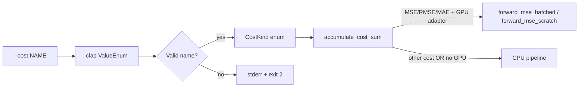

### Record-level sub-sampling — `--sample-rate` (Issue #310)

Multi-fidelity fitness scores a creature on a deterministic, stratified
**subsample** of the binary corpus instead of the full corpus, trading a little
ranking fidelity for a large wall-clock saving during a per-generation ranking
pass. Production spends ≈95 % of its fitness wall-clock in the forward-only Rust
batch path (`rust_scorer <creatures_dir> <data_dir>`) over a single ~21 GiB
corpus file, so the byte cut has to happen **inside the streaming reader** — there
is no shard to drop and no room for a second corpus on disk.

- `--sample-rate <f>` — a value in `(0, 1]`, default `1` (score every record).
  When `< 1`, the reader keeps a stratified subsample: record `i` is kept iff
  `floor((i+1)·rate) > floor(i·rate)`. This keeps `floor(N·rate)` of `N` records
  spread evenly across the corpus in a **single pass, no second corpus on disk**.
  Out-of-range values are rejected with a non-zero exit (never silently clamped).
- `--sample-phase <u64>` — default `0`. Shifts the stride to select a *different*
  subsample of the same size (e.g. rotating the sampled stratum per generation)
  with no randomness. Ignored when `--sample-rate` is `1` or absent.

The stride matches the TypeScript consumer (NEAT-AI#3257) exactly, so both agree
on which records survive. When sub-sampling runs, `error`/`score` are computed
over the kept subset, `recordCount` is the number of records actually scored,
and a `sampleRate` JSON field echoes the effective rate so a caller can confirm
the scorer honoured the flag rather than silently ignoring it. A full-corpus run
(`--sample-rate 1`, the default) emits the pre-#310 JSON unchanged. The consumer
can probe `--help` for `--sample-rate` (the `resolveProbeState` pattern) and pass
it on the batch path once a release advertises it.

```text
rust_scorer --sample-rate 0.25 <creatures_dir> <training_data_dir>  # score a 25% stratified subsample
rust_scorer --sample-rate 0.5 --sample-phase 1 <c.json> <data_dir>  # a different 50% stratum
```

The flag applies uniformly to every scoring path — the single-creature fused
path, the multi-creature CPU directory path, the GPU directory path, and the
per-record recurrent path — because sampling is threaded through the one shared
head-and-compact reader (`run_io_loop`). A stateful sampler carries the global
record index across streamed chunks so the kept set is **independent of how the
reader chunks the bytes**.

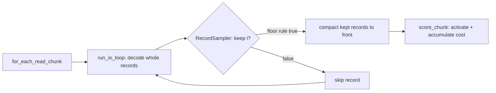

Synthetic corpus (1.5 M records, forward-only 4→128→2 creature, CPU path,
`--gpu off`; best of 3 runs) — wall-clock scales down with the rate while the
score stays stable:

| `--sample-rate` | records scored | wall-clock | speed-up |
|-----------------|----------------|------------|----------|
| `1.0` (default) | 1,500,000      | 0.121 s    | 1.00×    |
| `0.5`           | 750,000        | 0.069 s    | 1.76×    |
| `0.25`          | 375,000        | 0.039 s    | 3.15×    |
| `0.1`           | 150,000        | 0.021 s    | 5.67×    |

> **Production gate (needs production data + a human).** Lighting this up on the
> real GRQ corpus is gated on ≥ 5 % `evolveDir` wall-clock **and** rank
> correlation (Spearman/pairwise) of subsample vs full ≥ 0.95, published on
> NEAT-AI#3256 / #3257. The scorer does **not** auto-release — the consumer bumps
> to a released scorer through the normal dependency-bump flow once a human cuts
> the release.

### Stdin input mode

For restricted worker/sandbox environments where writing a temp file may fail
even with write permission (see issue #15), pass the creature JSON on stdin:

```text
rust_scorer --creature-stdin <training_data_dir>
```

The positional contract is unchanged in default mode. With `--creature-stdin`,
the binary reads creature JSON from standard input until EOF and expects a
single positional argument (`<training_data_dir>`).

### Output

Single-creature mode JSON includes **`forwardOnly`** (from the creature) and **`trainingReadBackend`**: on a native release build you should see **`pipelined_double_buffer`** when `forwardOnly` is `true` (fused scoring + `training_bin_stream`). If `forwardOnly` is `false`, you get **`record_iterator`** instead (no pipelining — much slower on large data). The **`gpuBackend`** field reports which `wgpu` backend the scorer would run on (`"cpu-fallback"` until GPU kernels land; see [GPU mode](#gpu-mode-issues-80--83) above). When record-level sub-sampling runs (`--sample-rate < 1`, see [Record-level sub-sampling](#record-level-sub-sampling----sample-rate-issue-310)) a **`sampleRate`** field echoes the effective rate and `recordCount` is the number of *sampled* records scored; the field is absent for a full-corpus run.

In directory mode, output is a top-level object keyed by creature filename stem, where each value has the same shape as a single-creature `ScoreResult`.

```json
{
  "GRQ-10-1": {
    "score": 0.9999998,
    "error": 0.0
  },
  "GRQ-12-1": {
    "score": 0.9999998,
    "error": 0.0
  }
}
```

This mode uses one shared training-data scan and parallelises scoring across creatures to use available CPU cores by default.

Per-chunk activation runs through a single flat Rayon layer (Issue #41): a worker network pool sized to `activation_threads` is built up-front, and every chunk dispatches one `par_iter_mut` over that pool. When the population meets or exceeds `activation_threads` each creature owns one worker; below that, the thread budget is spread across creatures so a small population still saturates the CPU. The JSON output keeps the same shape — `parallelActivationBatches` and `maxActivationBatchRecords` are not emitted in directory mode.

#### Early-exit / partial-score API (Issue #308)

The directory-mode batch path is also exposed as a library entrypoint with a
per-chunk early-exit hook, so a caller (e.g. NEAT-AI#3264's cascading fitness
ranking) can abort creatures mid-corpus without reimplementing the fused
scoring loop:

```rust
use rust_scorer::multi_score::{score_from_creature_dir_with_early_exit, EarlyExit};
use rust_scorer::{cost::CostKind, gpu::GpuBackendLabel};
use std::path::Path;

let scores = score_from_creature_dir_with_early_exit(
    Path::new("creatures/"),
    Path::new("training_data/"),
    GpuBackendLabel::CpuFallback,
    CostKind::Mse,
    |partials| {
        // Abort any creature whose running error is already 10x the best so far.
        let best = partials.iter().map(|p| p.partial_error).fold(f64::INFINITY, f64::min);
        let losers: Vec<usize> = partials
            .iter()
            .filter(|p| p.partial_error > best * 10.0)
            .map(|p| p.creature_index)
            .collect();
        if losers.is_empty() { EarlyExit::Continue } else { EarlyExit::AbortCreatures(losers) }
    },
).unwrap();
```

After each scored chunk the callback receives one `PartialScore` per
still-active creature (`creature_index`, `key`, running `partial_error`,
`records_scored`) and returns an `EarlyExit`:

- `Continue` — keep scoring every active creature.
- `AbortCreatures(indices)` — stop scoring those creatures; each freezes at its
  current partial score (its final `error` over a partial `record_count`).
  Skipping them removes their activation cost from every remaining chunk.
- `AbortAll` — stop the sweep entirely; every active creature freezes.

**Full-score parity is guaranteed:** the plain `score_from_creature_dir` (no
callback), and a callback that always returns `Continue`, produce
**bit-identical** scores (`tests/early_exit_tdd.rs`). Aborting ~50 % of the
population after the first chunk cuts directory-mode median wall-clock by
**40–45 %** on the synthetic bench (`early_exit_directory` in
`benches/scoring.rs`).

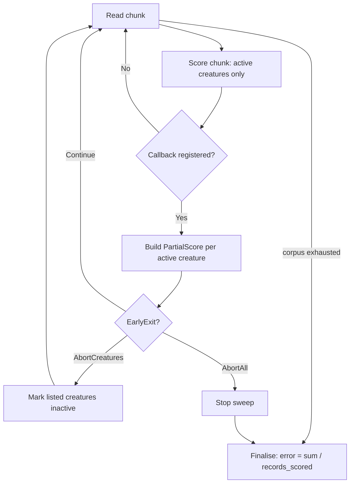

For forward-only single-creature fused scoring, activation parallelism also
defaults to all available CPU cores. Set `NEAT_SCORER_ACTIVATION_THREADS` only
when you want to tune down/up manually.

### Malformed tuning values are reported, not silently ignored (Issue #204)

The numeric performance knobs `NEAT_SCORER_READ_BYTES`,
`NEAT_SCORER_ACTIVATION_THREADS` and `NEAT_SCORER_GPU_SCRATCH_BYTES` used to
fall back to their default on an invalid value with no feedback, so a typo
such as `NEAT_SCORER_READ_BYTES=2MB` looked like it took effect when it was
ignored. Each now prints a single diagnostic to stderr and continues with the
default, mirroring how `NEAT_SCORER_GPU` already rejects invalid values:

```text
[scorer] ignoring invalid NEAT_SCORER_READ_BYTES='2MB', using default 2097152
```

Unset or blank values stay silent, and a valid value is honoured without any
warning.

### Large-record hosts: raise `NEAT_SCORER_READ_BYTES` (Issue #307)

The default `NEAT_SCORER_READ_BYTES` (2 MiB) is tuned for the synthetic
small-record fixtures. **Production GRQ-cluster records are 9848 bytes**
(2461 inputs + 1 output, `f32`), so a 2 MiB chunk holds only ~213 records —
too few to amortise the per-chunk Rayon dispatch across the worker pool. A
sweep on the #296 production fixture (see
[`docs/performance-baseline.md`](docs/performance-baseline.md)) shows larger
aligned reads recover **~20 %** on the single-creature path, with the sweet
spot at **16–32 MiB**:

| `NEAT_SCORER_READ_BYTES` | `production_single_creature` | `production_multi_creature/1` | `production_multi_creature/4` |
|---|---:|---:|---:|
| 2 MiB (default) | baseline | baseline | baseline |
| 8 MiB | −19 % | −15 % | −6 % |
| **16 MiB** | **−22 %** | **−20 %** | −5 % |
| **32 MiB** | **−24 %** | **−24 %** | **−14 %** |
| 64 MiB | −22 % | −22 % | −15 % |

(Deltas are the median wall-clock reduction vs the 2 MiB default measured
back-to-back on one Apple Silicon host; absolute times are host-load
sensitive, so the table reports the relative improvement each cell held across
repeated interleaved runs.)

On GRQ hosts with these large records, export a bigger chunk before scoring:

```bash
# ~24 % faster forward-only scoring on 9848-byte production records.
export NEAT_SCORER_READ_BYTES=33554432   # 32 MiB
```

`16777216` (16 MiB) captures most of the gain at half the transient read
buffer. The read buffer is **per-scan, not per-worker** — directory mode runs
a single shared scan and partitions the unpacked records across the worker
pool — so a 32 MiB setting adds at most ~64 MiB of transient buffer (the
pipelined path double-buffers), not 32 MiB × worker count. That stays well
within GRQ host RAM headroom.

The global default is intentionally **left at 2 MiB**: the gain is specific to
large (> ~1 KiB) records, and raising it globally would enlarge the buffer for
the small-record synthetic path for no benefit. Set the env per-host instead.

## Local layout

Place **NEAT-AI-core** and **NEAT-AI-scorer** as **siblings** (e.g. `…/src/NEAT-AI-core` and `…/src/NEAT-AI-scorer`). The path in `rust_scorer/Cargo.toml` is `../../NEAT-AI-core/neat-core` so `cargo build` resolves `neat-core` from your local **NEAT-AI-core** tree. CI does the same via a second checkout (`../NEAT-AI-core`).

### neat-core breaking-bump gate (Issue #252)

The `neat-core` dependency is an **unpinned `path` dependency that always
tracks head** — there is no version to pin (kept by design). To stop scorer
from silently tracking a **breaking** neat-core change, CI runs a
version-baseline gate:

- Scorer records the **last-handled** neat-core version in the checked-in
  [`neat-core.expected-version`](./neat-core.expected-version) file.
- CI reads neat-core's actual version from the cloned sibling
  `../NEAT-AI-core/Cargo.toml` (`[workspace.package] version`).
- The **breaking component** follows SemVer: the **major** for `>= 1.0`
  releases, the **minor** for pre-1.0 (`0.x`) releases. The gate **fails**
  when neat-core's breaking component is **greater** than the recorded
  baseline, and **passes** on patch-level drift or an exact match.

This is what would have caught the neat-core breaking type change
(NEAT-AI-core #177) before the build broke.

**How to clear the gate** when it fails — in a single deliberate PR:

1. Update `rust_scorer` for the breaking neat-core change.
2. Bump the recorded version in
   [`neat-core.expected-version`](./neat-core.expected-version) to match the
   new neat-core version.

The gate runs as a step in the CI `validation` job and locally via
`./quality.sh` (the script is `scripts/check-neat-core-version.sh`; it skips
locally when no sibling `../NEAT-AI-core` clone is present).

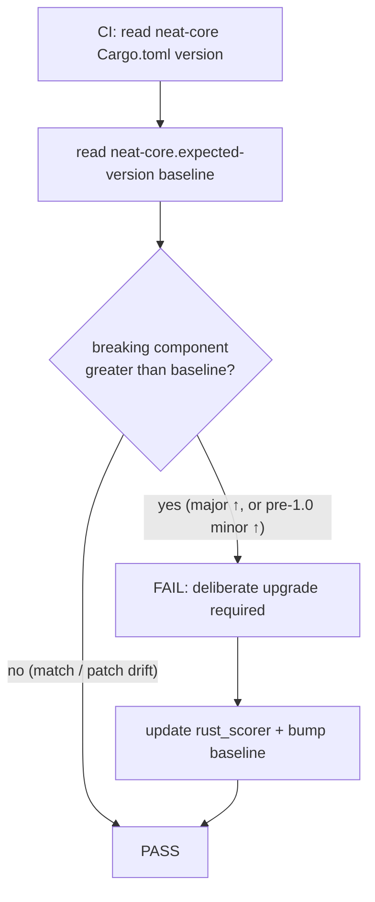

## Relationship to NEAT-AI

Scorer-specific Rust stays here; **`neat-core`** tracks **NEAT-AI-core**.

## Related Repositories

The NEAT-AI project is split across several repositories. This repo, **NEAT-AI-scorer**, is the native MSE scorer CLI consumed by **NEAT-AI** during training.

| Repository | Role |
|------------|------|
| [NEAT-AI](https://github.com/stSoftwareAU/NEAT-AI) | Deno/TypeScript orchestrator — the NEAT neural-network runtime that trains and evaluates creatures. |
| [NEAT-AI-core](https://github.com/stSoftwareAU/NEAT-AI-core) | Shared Rust computation library (`neat-core` crate) with fused batch losses and `training_bin_stream`. |
| [NEAT-AI-Discovery](https://github.com/stSoftwareAU/NEAT-AI-Discovery) | Rust discovery module invoked by NEAT-AI via Deno FFI. |
| [NEAT-AI-Snapshot](https://github.com/stSoftwareAU/NEAT-AI-Snapshot) | Snapshot storage for trained creatures. |
| [NEAT-AI-scorer](https://github.com/stSoftwareAU/NEAT-AI-scorer) | **This repo** — native MSE scorer CLI; depends on `neat-core` via path dependency. |
| [NEAT-AI-Explore](https://github.com/stSoftwareAU/NEAT-AI-Explore) | Visualiser that consumes NEAT-AI-Snapshot data. |
| [NEAT-AI-Examples](https://github.com/stSoftwareAU/NEAT-AI-Examples) | Usage examples built on NEAT-AI. |

### Dependency graph

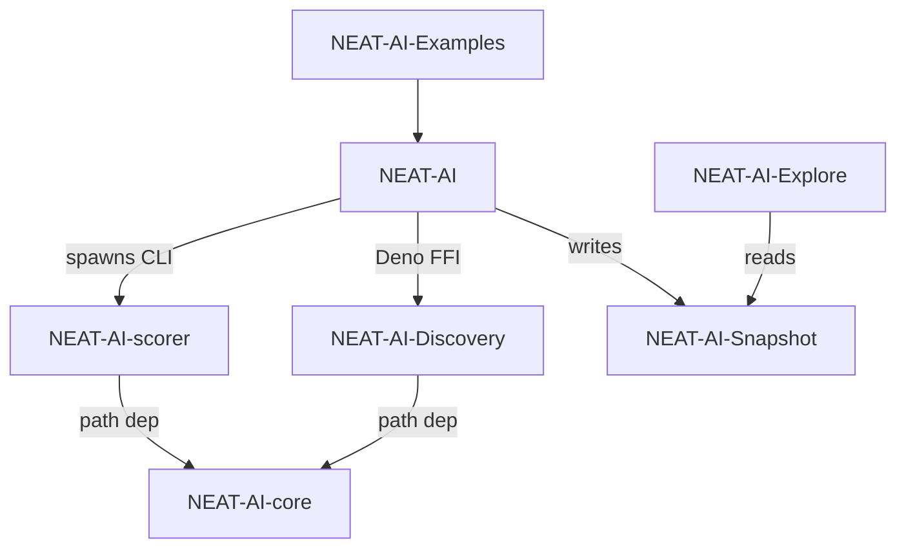

## Cost dispatch (Issues #120, #121)

The CLI accepts a `--cost <NAME>` flag listing every TypeScript
`BUILT_IN_COST_NAMES` value, and (since #121) the scoring calculation
honours the selection. The dispatch site is a single helper
(`rust_scorer::cost::accumulate_cost_sum`) shared by both the fused
forward-only path and the per-record recurrent path:

- **Fused forward-only path.** `stream_score::accumulate_cost_sum_forward_only_fused`
  routes every chunk through `accumulate_cost_sum`, which calls the matching
  `neat_core::loss::*_sum_batch_packed` helper. Adding a future cost is a
  one-line addition to the dispatch site.
- **Per-record recurrent path.** `forwardOnly: false` creatures use
  `TrainingDataIterator` to feed `[inputs..., targets...]` packed records into
  the same `accumulate_cost_sum` helper one record at a time, so every
  supported cost works here too.
- **`CATEGORICAL_ERROR` dispatches** through `categorical_error_sum_batch_packed`
  (landed via [`NEAT-AI-core#88`](https://github.com/stSoftwareAU/NEAT-AI-core/issues/88);
  unblocked here in #134) — the dispatch returns the integer count of
  argmax misclassifications across the corpus.
- **GPU kernels host MSE, RMSE and MAE.** `forward_mse_batched` and
  `forward_mse_scratch` share one forward pass and select the per-record loss
  (squared for MSE/RMSE, absolute for MAE — Issue #316) via the `cost_kind`
  header field. The remaining costs route to the CPU pipeline (silent fallback
  under `--gpu auto`, hard error under `--gpu on`).

See the [Cost function selector](#cost-function-selector-issues-120-121) section
above for the supported names and CLI surface.

## CI

### Job dependency graph (Issue #23)

`.github/workflows/ci.yml` declares an explicit job graph so ordering is
predictable on re-runs and partial failures:

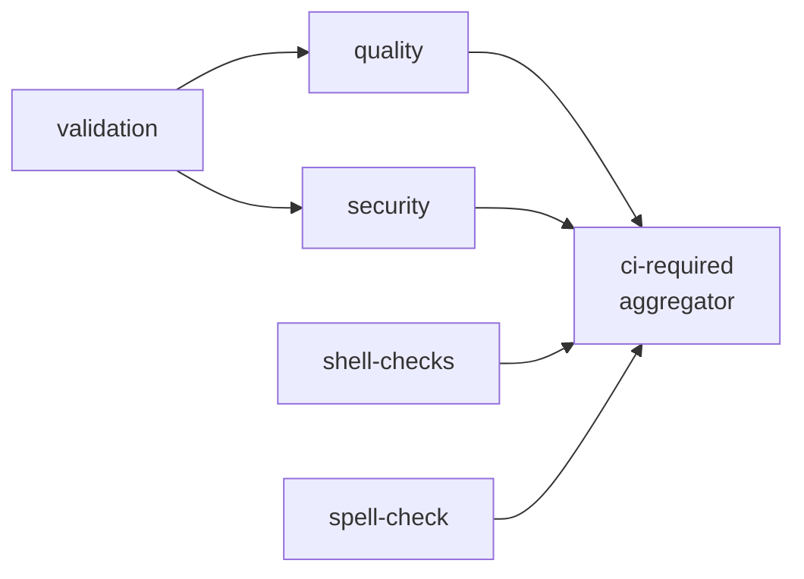

* **`validation`** is the foundation — it verifies required files and Cargo
  metadata. `quality` and `security` `needs: [validation]` so a broken repo
  layout fails fast without burning Rust compile minutes or a security scan.
* **`shell-checks`** and **`spell-check`** are lightweight and run in
  parallel with the foundation to surface findings early.
* **`ci-required`** is a single fan-in aggregator. It `needs:` every gating
  job, uses `if: always()` so it always reports a result, and inspects
  `needs.<job>.result` in its run step to fail unless every dependency
  reported `success` or `skipped`. **Branch protection should pin exactly
  one required check — `CI Required Checks` — so the merge gate is stable
  even when individual gating jobs are added or renamed.**

The graph is validated by `scripts/check-ci-job-graph.sh` (wired into
`quality.sh`) and covered end-to-end by `tests/scripts/workflow_job_graph.bats`.

### Least-privilege token scope (Issue #155)

`.github/workflows/ci.yml` declares an explicit workflow-level
`permissions:` block so every job runs with a least-privilege
`GITHUB_TOKEN` instead of the broad repository/organisation default:

```yaml
permissions:
  contents: read
```

The `quality`, `validation`, `shell-checks` and `spell-check` jobs only read
the checked-out code, so the read-only default covers them. The `security`
job calls the reusable `security.yml`, which writes check-run annotations and
PR/issue comments, so it opts into the wider scopes **at the job level**:

```yaml
  security:
    permissions:
      contents: read
      checks: write
      issues: write
    uses: ./.github/workflows/security.yml
```

The job-level grant is required because a called workflow's token can only be
narrowed, never elevated, along the caller chain — without it the read-only
workflow default would clamp away `security.yml`'s own `checks: write` /
`issues: write` and its annotations would silently fail. The rule "narrow at
the workflow level, grant only where needed at the job level" keeps the blast
radius small if any step (or a dependency it installs) is compromised.

The scope is validated by `scripts/check-ci-permissions.sh` (wired into
`quality.sh`) and covered end-to-end by `tests/scripts/ci_permissions.bats`.

### Per-job timeouts (Issue #154)

Every job across `.github/workflows/` declares an explicit `timeout-minutes`
so a hung compile, a wedged `cargo install`, a stuck network fetch, or a
runaway test fails fast instead of occupying a shared runner for GitHub's
360-minute (6-hour) default. Budgets are sized to the work each job performs:
`ci.yml`'s `quality` job (full cargo build + test + doc + release) gets 30
minutes, the security/audit jobs 15, and the lint/format/spell/version jobs
5–10. A reusable-workflow-call job (`security` in `ci.yml`) cannot declare
`timeout-minutes` — GitHub rejects that keyword on caller jobs — so its budget
lives in the called workflow's own job (`security.yml`).

The rule is validated by `scripts/check-workflow-timeouts.sh` (wired into
`quality.sh`) and covered end-to-end by `tests/scripts/workflow_timeouts.bats`.

### Checkout credential persistence (Issue #388)

Every `actions/checkout` step in the reusable `security.yml` sets
`persist-credentials: false`. By default checkout writes the workflow's
`GITHUB_TOKEN` into `.git/config` as an auth header, where any later step in the
same job — including a compromised dependency or an injected script — can read
it and act as the token. The `security` job only reads the checked-out code and
runs `cargo audit` / dependency-review; it never pushes back and never fetches a
private submodule, so keeping the credential on disk is pure blast radius.

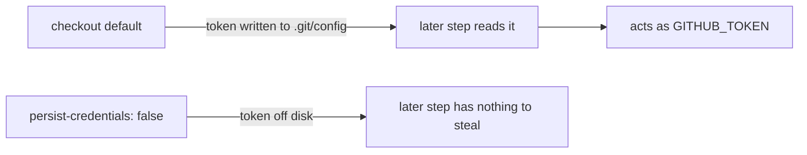

If a checkout genuinely needs the persisted credential (e.g. it later pushes
back or fetches a private submodule), document the exception with an inline
`# best-practice-ignore: BP-PERSIST-CREDS — <reason>` comment above the `uses:`
line. The rule is validated by `scripts/check-persist-credentials.sh` (wired
into `quality.sh`) and covered end-to-end by
`tests/scripts/persist_credentials.bats`.

### Pre-quality dependency bump (`bump-deps.sh`)

`bump-deps.sh` lives at the repo root and is invoked by the Vibe Coder
worker before `quality.sh` (per stSoftwareAU/VibeCoding#1613). It refreshes
the Cargo dependency graph in four stages and prints a one-line summary:

1. **Internal — NEAT-AI-core pin.** When any workspace member's `Cargo.toml`
   pins `neat-core` to a `git+rev` SHA, the script resolves
   `gh api repos/stSoftwareAU/NEAT-AI-core/commits/Develop --jq .sha` and
   advances the `rev = "..."` field if it has moved. The default layout in
   this repo uses a `path = "..."` sibling clone (see AGENTS.md), so this
   step is a no-op unless someone switches to a `git+rev` pin.
2. **External — crates.io.** Runs `cargo update --dry-run` (or
   `cargo upgrade --dry-run` under `--cargo-upgrade`, see below), then for
   each proposed bump checks the version's publish time against
   `--quarantine-hours` (default `$VIBE_BUMP_QUARANTINE_HOURS` / 24h).
   Versions younger than the quarantine window are deferred; older versions
   are applied with `cargo update -p <crate> --precise <new>` (or
   `cargo upgrade -p <crate>@<new>`).
3. **`cargo audit`.** Fails non-zero on any reported advisory, naming the
   offending crate and advisory ID.
4. **`cargo build --release`.** Confirms the bumped tree compiles.

Exit `0` means the tree is clean (or no-op); non-zero means a bump was
rejected and the worker reverts. Override flags (`--skip-internal`,
`--skip-external`, `--skip-audit`, `--skip-build`, `--cargo-upgrade`) and a
hidden `--check-published` testing helper are documented under
`./bump-deps.sh --help`. The script is covered by
`tests/scripts/bump_deps.bats`.

The `--cargo-upgrade` flag (Issue #101) switches the driver from
`cargo update` (lockfile-only) to `cargo upgrade` (cargo-edit), so a
worker preparing a PR can bump the `Cargo.toml` manifests through the
same quarantine gate. Dependency bumps now happen per-PR only
(Issue #105) — the previous weekly `upgrade-dependencies.yml` schedule
has been removed.

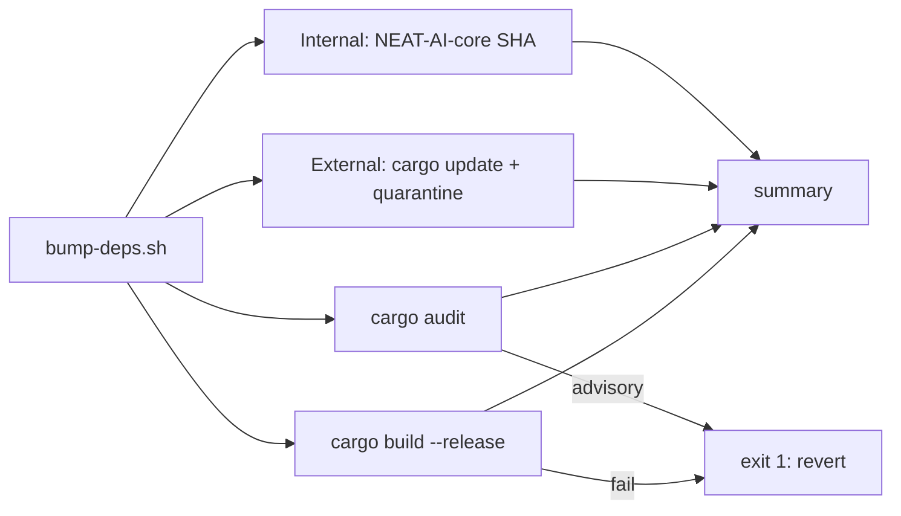

### Other PR automation

Besides the quality gate (`.github/workflows/ci.yml`), PRs also run a guarded
auto-version increment job (`.github/workflows/version-increment.yml`,
Issue #20). On each PR the job compares `rust_scorer/Cargo.toml` against the
base branch and, if the version has not already changed on the branch, bumps
the patch component once and pushes that commit back to the PR branch. A
re-run of CI — or a human-authored bump on the same branch — short-circuits
the job, so no duplicate bump commits are produced. The underlying logic
lives in `scripts/version-increment.sh` and is covered by
`tests/scripts/version_increment.bats`.

PRs also run an auto-format job (`.github/workflows/auto-format.yml`,
Issue #19). The job runs `cargo fmt --all` on the PR branch; if the working
tree changes, the formatting fix is committed with a deterministic message
and pushed back. When there are no changes the commit step is skipped, so
re-running on a clean branch is a no-op. Change detection and the commit
message live in `scripts/auto-format.sh` and are covered by
`tests/scripts/auto_format.bats`; the workflow itself is validated by
`scripts/check-auto-format-workflow.sh` (invoked from `quality.sh`).

A standalone Cargo Security Audit workflow (`.github/workflows/cargo-audit.yml`,
Issue #64) mirrors the `cargo audit` step in the reusable `security.yml` but
adds a weekly cron schedule (`0 6 * * 1`) plus `workflow_dispatch`. The
schedule catches advisories published *after* the last PR — the lockfile
does not change but the RustSec advisory database does. The workflow is
validated by `scripts/check-cargo-audit-workflow.sh` (invoked from
`quality.sh`) and covered end-to-end by
`tests/scripts/cargo_audit_workflow.bats`.

A standalone SBOM workflow (`.github/workflows/sbom.yml`, Issue #172) exports
the dependency inventory as a CycloneDX Software Bill of Materials and uploads
it as a build artefact. `rust_scorer` ships a binary, so its dependency graph
has a real binary surface; `Cargo.lock` already pins that graph, and this
workflow turns it into a standard, scanner-consumable document. When a
supply-chain advisory drops ("crate X version Y is compromised"), the SBOM is
the lookup table that answers "are we affected, and where?" in seconds —
without a Rust toolchain. The job installs `cargo-cyclonedx`, runs
`cargo cyclonedx --format json --all`, and uploads the resulting `*.cdx.json`
files via `actions/upload-artifact`. It runs on pull requests, pushes to
`Develop`, and `workflow_dispatch`. This workflow only emits the inventory
artefact (the supply-chain *posture* gap); active advisories remain owned by
`cargo-audit.yml` / `security.yml`. The workflow is validated by
`scripts/check-sbom-workflow.sh` (invoked from `quality.sh`) and covered
end-to-end by `tests/scripts/sbom_workflow.bats`.

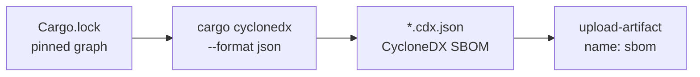

CI installs its cargo CLI tools from **prebuilt binaries**, not from source
(Issue #208). `cargo-audit` (`cargo-audit.yml`, `security.yml`),
`cargo-cyclonedx` (`sbom.yml`), and `cargo-deny` (`ci.yml`) are fetched via
`taiki-e/install-action` — a released binary downloads in seconds, where
`cargo install <tool> --locked` recompiled the tool from source on every run
with no behaviour change. The action is SHA-pinned like every other `uses:`
(supply-chain policy, Issue #100). The invariant is enforced by
`scripts/check-prebuilt-tool-install.sh` (invoked from `quality.sh`) and
covered end-to-end by `tests/scripts/prebuilt_tool_install.bats`.

A standalone Cargo Quality workflow (`.github/workflows/cargo-quality.yml`,
Issue #66) runs `cargo fmt --check` and `cargo clippy -- -D warnings` on
pull requests against **any** branch (`branches: ["**"]`). `**` is used
rather than `*` because GitHub's `*` glob does not match across `/`, so a
`["*"]` filter would silently skip `milestone/<slug>` sub-issue PRs (Issue
#392); `**` also matches nested branch names. `ci.yml` only fires for PRs
targeting `Develop`, so this dedicated workflow gives feature branches and
stacked PRs the same fmt + clippy gate without spinning up the full CI
graph. The workflow is validated by
`scripts/check-cargo-quality-workflow.sh` (invoked from `quality.sh`) and
covered end-to-end by `tests/scripts/cargo_quality_workflow.bats`.

ShellCheck runs in exactly one place: `ci.yml`'s `shell-checks` job invokes
`ludeeus/action-shellcheck@2.0.0` alongside the `bash -n` syntax check and
the bats helper-test suite, and feeds the `ci-required` aggregator that
branch protection gates on. A standalone `shellcheck.yml` previously ran the
identical invocation, doubling the maintenance surface (Issue #157); it was
removed so the ShellCheck configuration lives in a single home. The dedup
invariant is enforced by `scripts/check-shellcheck-dedup.sh` (invoked from
`quality.sh`) and covered end-to-end by
`tests/scripts/shellcheck_dedup.bats`, which fail if a second workflow
re-introduces the duplicate ShellCheck step.

A standalone Dependency Review workflow
(`.github/workflows/dependency-review.yml`, Issue #62) runs
`actions/dependency-review-action@v4` on every pull request against any
branch. The action diffs the PR's manifest against the base branch and
fails the run if any newly introduced dependency carries a known
vulnerability or disallowed licence — catching supply-chain regressions
before merge. The reusable `security.yml` workflow runs the same action
inside the full CI graph; this dedicated workflow gives feature branches
and stacked PRs the same gate without spinning up CI. The workflow is
validated by `scripts/check-dependency-review-workflow.sh` (invoked from
`quality.sh`) and covered end-to-end by
`tests/scripts/dependency_review_workflow.bats`.

A standalone Actionlint workflow (`.github/workflows/actionlint.yml`,
Issue #195) runs [actionlint](https://github.com/rhysd/actionlint) — the
standard GitHub Actions linter — on every pull request (including PRs targeting
`milestone/**` sub-issue branches, Issue #390) and on pushes to the default
branches. actionlint catches workflow regressions that a plain YAML
parse misses: invalid `runs-on` labels, broken `${{ }}` expressions, unknown
`uses:` inputs, and shellcheck findings inside `run:` scripts. The binary is
downloaded from a version-pinned upstream release by the official
`download-actionlint.bash` installer and run directly — no third-party wrapper
action enters the supply chain, mirroring how `ci.yml` invokes ShellCheck
(PR #184). The workflow is validated by
`scripts/check-actionlint-workflow.sh` (invoked from `quality.sh`) and covered
end-to-end by `tests/scripts/actionlint_workflow.bats`.

A standalone Gitleaks Secrets Detection workflow
(`.github/workflows/gitleaks.yml`, Issue #21) runs the pinned
`gitleaks` binary on every pull request against any branch. The scan is
scoped to the PR commit range (`origin/<base>..HEAD`) so reviewers see
only findings introduced by the proposed change. The Gitleaks binary is
pinned by version **and** SHA256 checksum (bumped together in the same
PR), so a compromised release asset cannot silently replace the
scanner. The workflow is validated by `scripts/check-gitleaks-workflow.sh`
(invoked from `quality.sh`) and covered end-to-end by
`tests/scripts/gitleaks_workflow.bats`.

A standalone Semgrep SAST workflow (`.github/workflows/semgrep.yml`,
Issue #47) runs the official `semgrep/semgrep` container — pinned by
`sha256:` digest (Issue #102) — on every pull request against any branch.
The container path is the functional equivalent of the
`semgrep/semgrep-action` GitHub Action; both consume
`SEMGREP_APP_TOKEN` from repo secrets and execute
`semgrep ci --config p/default`. The workflow is validated by
`scripts/check-semgrep-workflow.sh` (invoked from `quality.sh`) and
covered end-to-end by `tests/scripts/semgrep_workflow.bats`.

A standalone Markdown Lint workflow
(`.github/workflows/markdown-lint.yml`, Issue #63) runs
`markdownlint-cli2` against the existing `.markdownlint-cli2.yaml`
config on every pull request and on pushes to `main`/`master`. The
workflow keeps README/docs style regressions out of merged commits
without depending on the full CI graph. It is validated by
`scripts/check-markdown-lint-workflow.sh` (invoked from `quality.sh`)
and covered end-to-end by `tests/scripts/markdown_lint_workflow.bats`.

### Review governance (CODEOWNERS) — Issue #176

`.github/CODEOWNERS` designates the `@stSoftwareAU/developers` maintainers
team as the owner of the repository, with explicit rules over `.github/` and
`.github/workflows/`. The workflow directory is **privileged**: `semgrep.yml`
runs with a non-`GITHUB_TOKEN` secret (`SEMGREP_APP_TOKEN`), so an unreviewed
edit there could exfiltrate that secret or weaken a security gate. When a
branch-protection rule on `Develop` requires owner review, GitHub auto-requests
a maintainer's review on any change a CODEOWNERS rule matches — closing the
self-approval path for workflow edits.

The CODEOWNERS file is validated by `scripts/check-codeowners.sh` (invoked from
`quality.sh`) and covered end-to-end by `tests/scripts/codeowners.bats`. The
validator asserts the file exists at a GitHub-recognised path, that every rule
names a valid owner (`@user`, `@org/team`, or an email), and that at least one
rule covers `.github/workflows/`. `ci.yml`'s `validation` job also lists
`.github/CODEOWNERS` among its required files, so the file cannot silently
disappear.

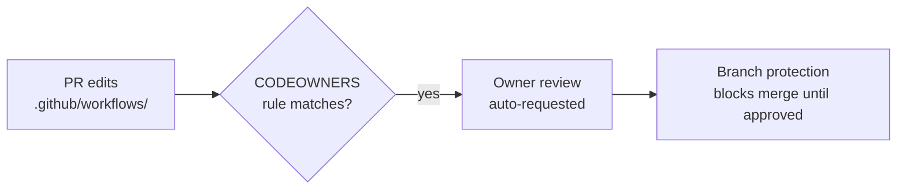

**Branch-protection recommendations (repo-level, not committed).** CODEOWNERS
only takes effect when the default branch (`Develop`) requires owner review.
These settings live in repository configuration — a branch-protection rule or
ruleset — and are not visible from committed files, so a maintainer with admin
rights must enable them: at least one required PR approval before merge, blocked
direct push and force-push, required linear history, and required signed
commits.

### GitHub Actions pinning policy (SHA pinning + Node 24 compat)

Every `uses:` reference across the workflow files is pinned to a
40-character commit SHA, with the human-readable version recorded in a
trailing comment, e.g.

```yaml
uses: actions/checkout@93cb6efe18208431cddfb8368fd83d5badbf9bfd  # v5
uses: dtolnay/rust-toolchain@29eef336d9b2848a0b548edc03f92a220660cdb8  # stable, frozen 2026-05-18
uses: peter-evans/create-pull-request@5f6978faf089d4d20b00c7766989d076bb2fc7f1  # v8
```

The SHA is the supply-chain pin (Issue #100) — it stops a compromised
maintainer or re-tagged ref from silently re-executing under workflows
with `contents: write` and `GITHUB_TOKEN` access. The trailing comment
keeps bumps reviewable: the SHA changes, the version label tells the
reviewer what the bump is. **Bump protocol:** resolve the new SHA from
the upstream tag (`gh api repos/<owner>/<repo>/git/ref/tags/vN`), update
the SHA and the comment in the same PR, and note the changelog highlights
in the PR description.

The same script also enforces the Node 24 deprecation policy from the
trailing comment: minimum majors, tracked Node 20 exceptions
(`actions/dependency-review-action@v4`, `rustsec/audit-check@v2` — no
Node 24 release upstream yet), and a composite/shell allow-list. The
policy lives in `scripts/check-workflow-action-versions.sh` and is
covered end-to-end by `tests/scripts/workflow_action_versions.bats`.
`quality.sh` invokes the script so any unpinned or outdated `uses:`
reference fails the local gate before CI (Issues #24 and #100).

## How to bench

`rust_scorer` ships a Criterion suite (Issue #36) covering the forward-only
fused path, the multi-creature directory mode, and the inner unpack + MSE
loop. The bench is **not** part of `quality.sh` — Criterion runs are slow and
not deterministic enough for a merge gate. Reproduce the baseline with:

```bash
./scripts/run-benches.sh
```

Or, for the issue's 50–200 MB target corpus:

```bash
BENCH_SCORING_BYTES=200000000 ./scripts/run-benches.sh
```

Tunables (all optional): `BENCH_SCORING_BYTES`, `BENCH_SCORING_INPUTS`,
`BENCH_SCORING_OUTPUTS`, `BENCH_SCORING_HIDDEN`. Recorded baselines and
host-specific numbers live in [`docs/performance-baseline.md`](docs/performance-baseline.md).
Per `AGENTS.md`, performance PRs without before/after Criterion evidence are
rejected.

## How to flamegraph (Issue #37)

Capture an SVG flamegraph for the single-creature fused path and the
multi-creature directory mode with the cross-platform helper:

```bash
./scripts/profile-flamegraph.sh
```

The defaults (2 GiB single-creature corpus, 500 MB × 50 creatures
multi-creature corpus) take a couple of minutes end-to-end on Apple
silicon and write:

* `docs/evidence/single-creature.svg`
* `docs/evidence/multi-creature.svg`

The script builds `rust_scorer` with a dedicated `profiling` Cargo profile
(release optimisations + `debug = true`) so function names survive into the
flamegraph, generates deterministic synthetic data via Python's `array`
module, runs each scenario and feeds raw samples through `inferno`.

One-time install of the toolchain:

```bash
cargo install inferno           # required for inferno-collapse-sample + inferno-flamegraph
cargo install flamegraph        # Linux only: provides `cargo flamegraph` on top of `perf`
# macOS: Xcode command-line tools ship /usr/bin/sample — no sudo needed.
```

Runtime tunables (override any default positional arg or env var):

```bash
# size-down for a quick smoke test
./scripts/profile-flamegraph.sh 209715200 52428800 10

# slim inputs / fewer hidden neurons
PROFILE_NUM_INPUTS=4 PROFILE_HIDDEN=4 ./scripts/profile-flamegraph.sh
```

The `profiling` Cargo profile inherits from `release` but turns debug info
and symbols back on. It is invoked only by this helper — the CI `release`
build path is unchanged.

Interpretation and the current top-5 cost centres per scenario are
documented in the **"Hot spots"** section of
[`docs/performance-baseline.md`](docs/performance-baseline.md). Re-run the
script after each optimisation sub-issue lands and overwrite the SVGs so
the hot-spot ordering stays honest.

## Optimised release build (PGO) — Issue #43

The default release profile already enables LTO and `codegen-units = 1`.
**Profile-Guided Optimisation (PGO)** is the next compiler-level lever — a
recorded profile of a real scoring run feeds back into `rustc` so hot loops
get better inlining, branch prediction hints, and code layout. PGO often
yields 5–15 % on numeric inner loops similar to `mse_sum_batch_packed`, and
since `rust_scorer` is invoked many times per NEAT training run, even a few
percent per call compounds.

### One-shot build

```bash
./scripts/build-pgo.sh
```

The helper drives the standard manual `rustc` flow — no `cargo-pgo` install
required:

1. Generates a deterministic synthetic training fixture (Python).
2. Builds an instrumented binary with `RUSTFLAGS="-Cprofile-generate=…"`
   under the dedicated `pgo` Cargo profile (inherits `release`, keeps
   `codegen-units = 1`).
3. Runs the instrumented binary against the fixture in **single-creature**
   mode and **directory** mode to gather `*.profraw` files.
4. Merges them via `llvm-profdata merge`.
5. Re-builds with `RUSTFLAGS="-Cprofile-use=…/merged.profdata"`.

The final binary lands at `target/pgo/rust_scorer`. NEAT-AI can pick it up
by overriding the scorer path in its launch config — the CLI contract
(`<creature.json> <data_dir>`) is unchanged.

### Prerequisites

```bash
rustup component add llvm-tools   # provides llvm-profdata
# python3 is also required (used to materialise the training fixture)
```

`build-pgo.sh` auto-discovers `llvm-profdata` via `command -v` first and
then falls back to `rustc --print sysroot`/`lib/rustlib`. Override with
`LLVM_PROFDATA=/path/to/llvm-profdata` if needed.

### Tunables

| Variable | Default | Purpose |
|---|---|---|
| `PGO_BYTES` | `104857600` (100 MB) | training corpus size for instrumentation |
| `PGO_NUM_INPUTS` | `8` | inputs per record |
| `PGO_NUM_OUTPUTS` | `2` | outputs per record |
| `PGO_HIDDEN` | `8` | hidden neurons per synthetic creature |
| `PGO_CREATURES` | `10` | creatures used for the directory-mode pass |
| `PGO_PROFDATA_DIR` | `target/pgo-profiles` | where `*.profraw` and `merged.profdata` land |
| `PGO_FIXTURE_DIR` | `target/pgo-fixture` | where the synthetic training fixture is materialised |

### Benchmark evidence (Issue #43)

Numbers below come from timing the same `rust_scorer` binary (release vs
PGO) against an identical 300 MB fixture, 15 timed runs each (median /
best, lower is better — Apple silicon, see
`docs/evidence/pgo-bench-300mb.log`):

| Scenario | release median | PGO median | Δ median |
|---|---:|---:|---:|
| `score_from_json_fused` (single-creature, 300 MB) | 447.6 ms | 407.7 ms | **−8.9 %** |
| `score_from_creature_dir` (10 creatures, 300 MB) | 2079.2 ms | 1911.2 ms | **−8.1 %** |

Both scoring paths beat the 3 % acceptance threshold from the issue. The
gain is most reliable on the directory-mode path (more time spent inside
the activation/MSE inner loops), and noisier on the small single-creature
path where CLI start-up makes up a larger share of wall-clock time.

Reproduce on your host by running `./scripts/build-pgo.sh` and then timing
`target/release/rust_scorer` against `target/pgo/rust_scorer` over the
fixture the helper wrote to `target/pgo-fixture/`.

### CI

Producing the PGO binary as a release artefact in CI requires committing a
new workflow YAML, which the worker is not authorised to push (no
`workflow` OAuth scope — see `AGENTS.md` "Human Escalation"). Run the
helper locally for now, or have a maintainer wire `build-pgo.sh` into a
manually triggered workflow under `.github/workflows/`.

## License

Apache-2.0 — see `LICENSE`.
