# NEAT-AI-scorer


Native **MSE scorer** CLI for NEAT-AI creatures. Shared logic lives in **`neat-core`**, resolved from a **path dependency** on **[NEAT-AI-core](https://github.com/stSoftwareAU/NEAT-AI-core)** (see `rust_scorer/Cargo.toml`). GitHub Actions checks out `NEAT-AI-core` next to this repo so CI can resolve that path

## Source

| Component | Provenance |
|-----------|----------------|
| `rust_scorer/` | **`training_bin_stream::for_each_read_chunk`** (pipelined on native, same API on wasm) plus **pending + head + compact** (`stream_score.rs`), fused MSE when `forwardOnly` is true; **`float_scan_bench`** uses the same reader for throughput experiments. |
| `neat-core` (crate) | **`../../NEAT-AI-core/neat-core`** relative to `rust_scorer/Cargo.toml` — clone **NEAT-AI-core** as a sibling of **NEAT-AI-scorer** (same parent directory). |
| `LICENSE`, `.gitleaks.toml` | `origin/Develop` of NEAT-AI |

## Build

```bash
./quality.sh
```

Or step-by-step (matches CI):

```bash
export RUSTFLAGS="-D warnings"
cargo deny check
cargo fmt --all -- --check
cargo clippy --all-targets --all-features -- \
  -D warnings \
  -D clippy::filter_next \
  -D clippy::collapsible_if
cargo build --workspace
cargo test --workspace --all-features --verbose -- --test-threads=2
RUSTDOCFLAGS="-D warnings" cargo doc --workspace --no-deps
```

Requires **shellcheck**, **cargo-deny** (`cargo install cargo-deny --locked`), **codespell** (`pip install --user codespell`, used by `scripts/spell-check.sh`), and optionally **cargo-edit** for the **opt-in** upgrade step in `./quality.sh`

By default `./quality.sh` is **read-only** against `Cargo.lock` / `Cargo.toml` — it never bumps dependency versions in your working tree. To bump library dependencies during the gate, opt in with `./quality.sh --upgrade` (or `QUALITY_UPGRADE=1 ./quality.sh`); this requires **cargo-edit**. Routine, quarantine-gated dependency bumps go through [`./bump-deps.sh`](./bump-deps.sh) (Issue #105) instead.

### Build profiles (Issue #568)

Workspace root [`Cargo.toml`](./Cargo.toml) carries the Cargo profiles (member
crates do not — Cargo reads `[profile.*]` from the workspace root only):

| Profile | Intent | Settings |
|---------|--------|----------|
| `dev` | Fast rebuilds | `debug = "line-tables-only"` (panic file:line stays; full DWARF dropped). Default `opt-level = 0` and incremental compilation stay. |
| `release` | Fastest artefact | `opt-level = 3`, `lto = "fat"`, `codegen-units = 1` — **workspace-wide**, not scoped to one package. Compile time is irrelevant. |
| `profiling` / `pgo` | Inherit `release` | Flamegraph helper and [`scripts/build-pgo.sh`](./scripts/build-pgo.sh); see below. |

Same-host fleet builds (`cargo build --release` on the machine that runs the
binary) also pick up `-C target-cpu=native` from
[`.cargo/config.toml`](./.cargo/config.toml) for every non-`wasm32` target.
An exported `RUSTFLAGS` **replaces** those config rustflags rather than
appending — so `./quality.sh` / CI (`RUSTFLAGS=-D warnings`) stay portable on
purpose, while a plain host `cargo build --release` gets the native CPU.

### Pinned Rust toolchain (Issue #209)

The project SHA-pins every GitHub Action and container digest for reproducibility, but the Rust compiler version would otherwise float — `dtolnay/rust-toolchain` resolves `stable` at run time. Because the gate is `-D warnings` plus specific clippy lints, a fresh stable release can introduce a lint that breaks CI with **no code change**, and contributors cannot reproduce it locally.

The root [`rust-toolchain.toml`](./rust-toolchain.toml) closes that gap by pinning a concrete channel and the `rustfmt`/`clippy` components:

```toml
[toolchain]
channel = "1.98.0"
components = ["rustfmt", "clippy"]
```

`rustup` reads this file automatically, so both local `./quality.sh` and every CI workflow (`dtolnay/rust-toolchain` honours the file when no explicit `toolchain:` input is given) resolve the **same** `rustc`/`clippy`/`rustfmt`. The pinned compiler auto-installs on the first `cargo` invocation. `edition = "2024"` already requires a recent stable, reinforcing the need to pin.


**Bump cadence.** Review when a new stable lands (~every 6 weeks):

1. Edit `channel` in `rust-toolchain.toml` to the new `X.Y.Z`.
2. Run `./quality.sh` locally to confirm the gate still passes under the new compiler (fix any newly-surfaced lints).
3. Land the bump in its own PR so the compiler change is reviewed in isolation.

The pin is validated by `scripts/check-rust-toolchain.sh` (invoked from `quality.sh`) and covered end-to-end by `tests/scripts/rust_toolchain.bats`. The validator rejects a floating channel (`stable`/`beta`/`nightly`) or a missing `rustfmt`/`clippy` component.

### Crate-level rustc lint hardening (Issue #274)

The gate configures Clippy lints, but rustc's own (`rust`) lint groups need denying at the **source tree** too. Relying solely on a CI `-D warnings` flag leaves the tree itself unhardened, so a local build or a differently-configured CI step would not catch a regression at the point it is introduced. The root [`Cargo.toml`](./Cargo.toml) adds a `[workspace.lints.rust]` table (inherited by the crate via `[lints] workspace = true`):

```toml
[workspace.lints.rust]
unsafe_op_in_unsafe_fn = "deny"
unused = "deny"
```

- **`unsafe_op_in_unsafe_fn`** — the crate uses `unsafe` in hot paths (`rust_scorer/src/stream_io.rs`, `rust_scorer/src/cost.rs`); denying this stops an unguarded unsafe operation inside an `unsafe fn` slipping in silently.
- **`unused`** — dead code and unused imports fail the build rather than reaching `Develop`.
- **`missing_docs`** is scoped to the **library surface** via `#![warn(missing_docs)]` in [`rust_scorer/src/lib.rs`](./rust_scorer/src/lib.rs) rather than the workspace table, because the binary targets are doc-noisy. Under the gate's `-D warnings` it enforces doc discipline on the public API exposed to benches and integration tests.

Per-lint denies are used deliberately in place of a blanket `#![deny(warnings)]` so a future compiler warning does not break the build unexpectedly.

The posture is validated by `scripts/check-rust-lints.sh` (invoked from `quality.sh`) and covered end-to-end by `tests/scripts/rust_lints.bats`. The validator fails if the `[workspace.lints.rust]` table is dropped, if either lint stops being denied, if a blanket `warnings` lint is introduced, or if the `missing_docs` scoping is removed from the library root.

### Spell check

CI runs `codespell` via `scripts/spell-check.sh`; the same script is invoked by `./quality.sh`, so the local gate and CI stay in lock-step. Reproduce the CI spell check at any time with:

```bash
./scripts/spell-check.sh
```

Configuration (ignore list, skip paths, check-filenames / check-hidden flags) is kept in a single source of truth: [`.codespellrc`](./.codespellrc). When a domain term trips codespell, prefer adding it — with a short justification comment — to `.codespellrc` over silencing the whole file. Genuine typos must continue to fail the build. Current curated domain entries:

- `renderD` — DRM device node name (e.g. `renderD128`).
- `mape` / `MAPE` — Mean Absolute Percentage Error (a `neat-core` loss function).

### Binaries

This section is the single documented home for the workspace's binary list; `rust_scorer/Cargo.toml` owns it and `CONTRIBUTING.md` / `AGENTS.md` cite it rather than keeping their own copies (Issue #509). `scripts/check-binary-list-docs.sh` (invoked from `quality.sh`, covered by `tests/scripts/binary_list_docs.bats`) fails the gate when a manifest binary is missing here, or when either of those documents restates the list.

Binaries: `rust_scorer`, `float_scan_bench`, `cost_scan_bench`, `gpu_pipeline_alloc_bench`, `if_tree_batch_bench` (see `rust_scorer/Cargo.toml`). `cost_scan_bench` (Issue #124) sweeps every supported [`CostKind`](rust_scorer/src/cost.rs) through the forward-only fused path against a single creature and a `.bin` corpus, emitting a JSON summary for per-cost CPU baseline comparison. `gpu_pipeline_alloc_bench` (Issue #202) counts heap allocations during a multi-chunk pipelined (`inflight_chunks == 2`) GPU directory run; it skips cleanly on CPU-only hosts. `if_tree_batch_bench` (Issue #574) scores a batch of `IF` decision-tree candidates against one generated corpus and reports candidates/second and records/second — see [Tree-heavy candidate batching bench](#tree-heavy-candidate-batching-bench-issue-574).

## CLI

Positional arguments only (same contract as in NEAT-AI):

```text
rust_scorer <creature.json | creatures_dir> <training_data_dir>
```

- `creature.json` path: scores one creature and returns the existing single-object output.
- `creatures_dir` path: scores every `*.json` in that directory in one pass over training data and returns one JSON object keyed by each file's stem (filename without extension or folders).
- Directory mode requires a matching `input` / `output` shape across all files. Since **Issue #579** it accepts `forwardOnly: false` creatures — see [Recurrent creatures in directory mode](#recurrent-creatures-in-directory-mode-issue-579) below.
- Since **GRQ#4387** a creature that cannot be scored no longer takes the batch down — see [Per-creature failures in directory mode](#per-creature-failures-in-directory-mode-grq4387) below.

### Per-creature failures in directory mode (GRQ#4387)

One `.json` in the directory that will not parse, will not compile, disagrees
with the batch shape, or whose numbers the score maths refuses used to abort the
whole run: nothing on stdout, exit 1, every other creature's score lost. GRQ-25
lost 23 creatures' scores to one duplicate-synapse creature that way.

Directory mode now **isolates the offender**:

- every creature that *can* be scored still is;
- the offender keeps its place in the map under its own filename stem, as an
  entry carrying `failed: true`, a machine-readable `reason`
  (`READ` / `PARSE` / `WIDTH` / `SHAPE` / `COMPILE` / `SCORE`) and the scorer's
  own message — never a score;
- stdout stays a **complete** JSON map, so no stem silently disappears;
- every offender is also named on stderr as `[creature-failed] <stem>: <message>`;
- the process exits **3** — "the batch completed, some creatures did not" —
  which is distinguishable from **1**, "the run failed".

Isolation never quietly reconciles a dead batch to a green run. A directory in
which *no* creature survived is still exit 1 with no JSON: there is no batch
left to protect, so the first offender's message becomes the run's error, and
the guards that fired before the training corpus was touched still do.

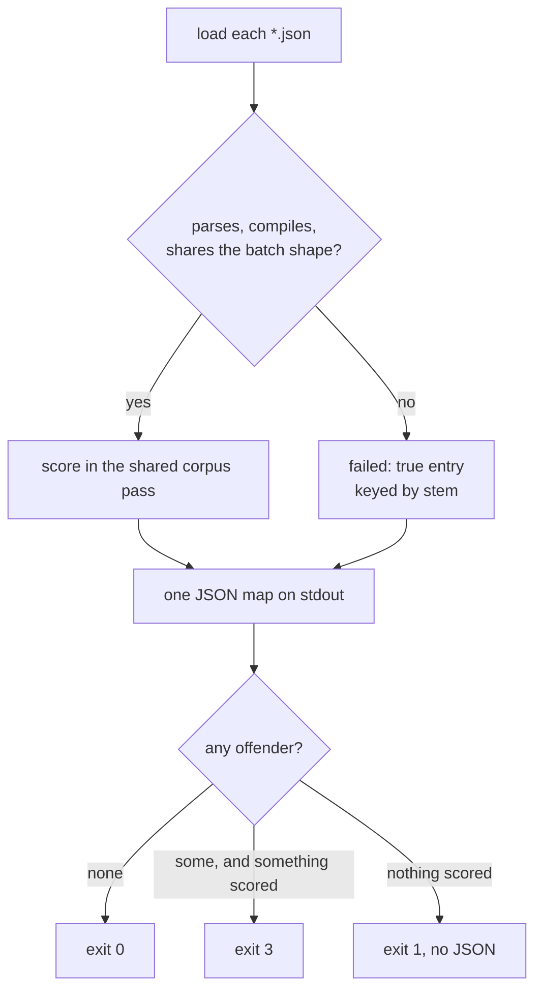

Consumers that do not know exit 3 see a non-zero exit and behave exactly as they
did before, so the change is safe in both directions across a version skew.

The library keeps both contracts: `score_from_creature_dir_isolated` returns the
`DirectoryScores` above, while `score_from_creature_dir`,
`score_from_creature_dir_sampled` and `score_from_creature_dir_with_early_exit`
keep the strict, first-offender-aborts behaviour byte for byte. The GPU
directory legs are strict too — they have no per-creature reporting seam, and
`--gpu auto` already falls through to the isolating CPU path on any error.

### Recurrent creatures in directory mode (Issue #579)

A creature directory may mix `forwardOnly: true` and `forwardOnly: false`
creatures. Each is scored under **its own** flag, so a recurrent creature in a
batch gets the same per-record state reset the single-creature path applies —
`neat_core::loss::packed_record_scan` calls `CompiledNetwork::reset_state()`
before every record, a back edge therefore reads `0.0`, and records stay
independent. Independence is what keeps the batch path valid: a chunk is still
partitioned across Rayon workers, and each creature's `forwardOnly` follows its
worker.

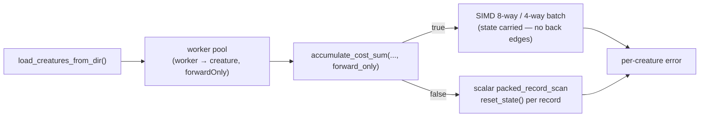

Consequences worth knowing before you batch a recurrent population:

- **Same answer as single-creature mode.** `rust_scorer <dir>` and
  `rust_scorer <file>` report the same `error` for the same recurrent creature
  (pinned by `rust_scorer/tests/recurrent_directory_tdd.rs`).
- **`forwardOnly` is echoed per creature** in the directory JSON, so a caller
  can see which entries took the recurrent path.
- **Recurrent creatures lose the SIMD batch kernels** (upstream gates the 8-way
  and 4-way paths on `forward_only`) and fall to the scalar per-record scan —
  several times slower *for those creatures only*. Forward-only creatures
  sharing the batch are unaffected; `reset_state()` costs O(neurons) stores per
  record.
- **The GPU path needs no change.** Both `forward_mse_batched` and
  `forward_mse_scratch` zero every non-input activation per
  `(creature, record)` thread, so a GPU thread never carries state between
  records — the reset semantics hold on GPU by construction, and the
  hostability/topology probes classify neuron counts only.

### GPU mode (Issues #80 / #83)

The scorer probes for a GPU adapter via `wgpu` and dispatches the
multi-creature batched kernel from Issue #82 when bench evidence supports it
(see [`docs/performance-baseline.md`](docs/performance-baseline.md)). The CLI
flag wins over the `NEAT_SCORER_GPU` environment variable.

| Mode    | Behaviour                                                                                                       | `gpuBackend` value                                  |
|---------|-----------------------------------------------------------------------------------------------------------------|-----------------------------------------------------|
| `auto`  | **Default since Issue #83.** Use GPU on directory paths with **AllPrivate** topology (≤256 total neurons per creature) **or a shallow scratch-only pool** (≤256 *non-input* neurons per creature — Issue #467); fall back to CPU for **deep** scratch/mixed production-scale pools (#317), GPU-unsupported costs (any cost other than MSE/RMSE/MAE), missing adapters, or failed pre-flight. Prints one stderr note when declining GPU for topology. | `"metal"` / `"vulkan"` / `"dx12"` / `"gl"` / `"cpu-fallback"` |
| `on`    | Require a compatible GPU; exit non-zero with a clear message when none is found (no silent fallback). Forces the GPU path even where bench evidence does not support it. | `"metal"` / `"vulkan"` / `"dx12"` / `"gl"`          |
| `off`   | Skip GPU detection entirely; run the CPU pipeline.                                                             | `"cpu-fallback"`                                    |

```text
rust_scorer <creatures_dir> <training_data_dir>             # Auto by default
rust_scorer --gpu off <creature.json> <training_data_dir>   # opt out
NEAT_SCORER_GPU=on rust_scorer <creatures_dir> <training_data_dir>
```

The `gpuBackend` field is added to every JSON output (single-creature and
directory mode) and reports the backend that **actually ran** the scoring
kernel (per Issue #83). Existing fields and their order are unchanged.

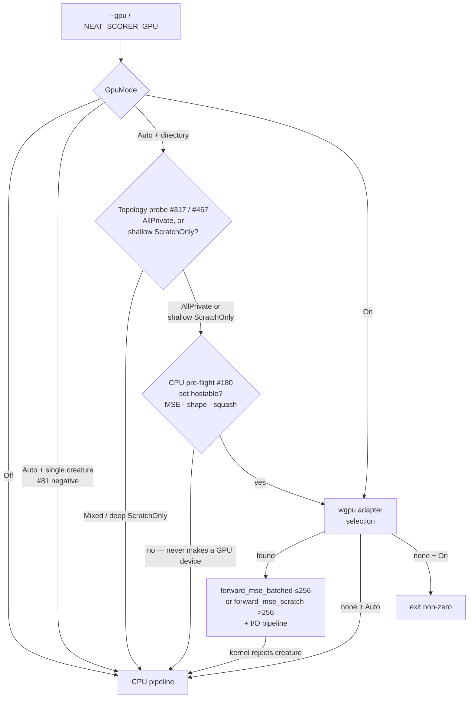

Under `--gpu auto` the directory path runs a **CPU-only pre-flight**
(`multi_score::gpu_directory_compatible`, Issue #180) **before** any `wgpu`
device is created. A creature set no GPU kernel can host (an unsupported
squash, a shape mismatch, or — guarding against corruption — an absurd
neuron count) routes straight to the CPU pipeline without ever spinning up —
or tearing down — a GPU context, so the fallback always returns valid JSON
and exits cleanly. Since Issue #182 the 256-neuron cap is no longer a reason
to fall back (see below). Issue #317 adds a **topology probe** before GPU
device creation: production-scale creatures (total neurons >256, including inputs)
classify as **ScratchOnly** and `Auto` stays on CPU — full-corpus M4 A/B
showed CPU ~3× faster than scratch GPU even with dual-kernel dispatch and
32 MiB read chunks. `--gpu on` still runs the scratch kernel for debug.

Issue #467 narrows that skip to **deep** pools. A creature with thousands of
inputs but only a handful of hidden neurons (the 2461-input / 19-hidden
Enceladus shape) is scratch-routed purely because inputs count towards
`num_neurons`, yet it is **45–50 % faster on GPU** at N=50–63 on an M4 Pro. So a
scratch-only pool whose creatures all have ≤256 **non-input** neurons
(`MAX_SHALLOW_NON_INPUT_NEURONS`) keeps the GPU path and prints no fallback note;
deep pools behave exactly as #317 left them. Numbers and the reproduce command
are in [`docs/performance-baseline.md`](docs/performance-baseline.md).

### GPU acceleration (Issue #83)

End-to-end benchmarking at `BENCH_SCORING_BYTES=200000000` showed the
multi-creature batched kernel from #82 beats CPU+PGO by ≥ 30 % on Apple
Silicon Metal, well clearing the 3 % bar from
[`docs/gpu-scoring-design.md`](docs/gpu-scoring-design.md). The
single-creature path stayed slower on GPU than CPU+PGO in #81 and is held
on CPU. `auto_should_use_gpu` in `rust_scorer/src/gpu/mod.rs` is the single
source of truth for the per-path decision; updating either result only
requires editing that function plus the matching row in the docs table

| Path                               | GPU vs CPU+PGO @ 200 MB | `Auto` default | Source       |
|------------------------------------|-------------------------|----------------|--------------|
| `score_from_json_fused` (single)   | GPU loses               | **CPU**        | Issue #81 (negative result) |
| `score_from_creature_dir` (N=50, AllPrivate) | **GPU −32.4 %** (Metal) | **GPU**        | Issue #82 PR summary |
| `score_from_creature_dir` (N=63, production scratch) | **CPU ~3× faster** (full corpus) | **CPU** | Issue #317 |
| `score_from_creature_dir` (N=50–63, shallow scratch — Enceladus) | **GPU 45–50 % faster** (M4 Pro) | **GPU** | Issue #467 |

`Auto` selects per **path** (single vs directory), not per N — at N=10 the
per-dispatch overhead dominates, but at the issue-target corpus the
break-even sits well before N=50 (see [`docs/gpu-scoring-design.md`](docs/gpu-scoring-design.md)).
Users running directory mode at very low N can opt out with `--gpu off` if
they observe a regression on their hardware.

Headline numbers (Apple Silicon M-series, 200 MB corpus, from
[`docs/performance-baseline.md`](docs/performance-baseline.md)):

| Bench                                              | Median  | Throughput  |
|----------------------------------------------------|---------|-------------|
| `score_from_creature_dir/creatures/50` (CPU)       | 3.219 s | 59.2 MiB/s  |
| `gpu_score_from_creature_dir/creatures/50` (GPU)   | 2.176 s | 87.7 MiB/s  |
| `gpu_pipelining_toggle/inflight/2` (pipelined)     | 2.153 s | 88.6 MiB/s  |

The JSON output adds `gpuKernel` (`forward_mse_batched`,
`forward_mse_scratch`, or `forward_mse_batched+forward_mse_scratch` for mixed
pools — Issue #317) plus
`gpuInflightChunks` and `gpuDispatchCount` diagnostic counters when the
GPU directory path runs.

#### Large creatures on the GPU (Issue #182)

Two kernels back the directory path, selected automatically by the largest
per-creature neuron count:

| Kernel                  | Hosts                | Activation scratch            |
|-------------------------|----------------------|-------------------------------|
| `forward_mse_batched`   | ≤ **256** neurons    | fixed-size `private` array (fastest for small creatures — #82) |
| `forward_mse_scratch`   | **any** size (#182)  | runtime-sized `storage` buffer with a bounded grid-stride loop |

WGSL forbids runtime-sized `private` arrays, which is why the original
batched kernel caps at `MAX_NEURONS_PER_CREATURE = 256`. Real evolved
creatures routinely exceed that (production runs have hit 4139 neurons), so
Issue #182 added `forward_mse_scratch`, which moves each thread's activation
scratch into a `storage` buffer (no compile-time size limit). To keep that
buffer bounded, the host caps the live thread count against a memory budget
(`NEAT_SCORER_GPU_SCRATCH_BYTES`, default [sensed from the
adapter](#gpu-capability-sensing-issue-548), further capped to the device's max
storage-buffer binding size and to `max_compute_workgroups_per_dimension`) and
the kernel walks the records with a grid-stride loop. Per-creature MSE partials
reduce exactly as in the batched kernel, so results match the CPU path within
the #81/#82 tolerance.

The pre-flight (`multi_score::gpu_directory_compatible`) therefore now reports
large creatures as **GPU-hostable** — only an unsupported squash, a shape
mismatch, or an absurd neuron count (> `MAX_NEURONS_ABSOLUTE`, guarding
against corrupt input) forces a CPU fallback. That fallback remains
first-class: an unhostable set never creates a GPU device, the CPU pipeline
scores it, and the process emits valid JSON with `gpuBackend: "cpu-fallback"`
and exits 0. `--gpu on` still hard-errors on an unhostable set.

#### Squash coverage on the GPU (Issues #305, #312)

Both kernels' `activate()` inlines **every point-wise activation**
(`SquashType` discriminants `0..=31` — IDENTITY, RELU, …, SELU, GELU, SINE,
ABSOLUTE, BENT_IDENTITY, Cube, HARD_TANH, ISRU), matching the CPU
`apply_squash` followed by the `apply_limit_range` clamp. Before #305 only
IDENTITY / RELU / LOGISTIC / TANH were inlined, so a production creature
mixing the wider set fell back to CPU on **~95.8 %** of its neurons
(Scorer#299).

Issue #312 extended both kernels past the point-wise set to the three
**aggregate** squashes **MINIMUM (32) / MAXIMUM (33) / IF (34)**. These combine
the individual weighted inputs rather than their sum, so the per-neuron
accumulation branches on squash category: point-wise neurons take the
`bias + Σ w·act` then `activate()` path, while an aggregate neuron reduces its
synapses directly — `min`/`max` of `w·act` (`+ bias`), or, for IF, bucketing
each `w·act` by the synapse's **type** (condition / positive / negative) and
selecting the positive or negative sum on the condition sign. This matches
`neat_core::batch_scoring::neuron_activation_scalar` exactly, so `SynapseGpu`
now carries a `synapse_type` field. **Constant neurons** are hosted too
(flagged by `NeuronGpu.is_constant`): the kernel returns their clamped bias and
ignores their synapses. Together these make the real production creature
(aggregates + three constant neurons) fully GPU-hostable. The remaining three
aggregates **HYPOT / HYPOTv2 / MEAN (35..=37)** are still unhosted and force a
clean CPU fallback via `squash_supported`.

CPU↔GPU parity across all 32 point-wise squashes is asserted by
`cpu_vs_gpu_pointwise_squash_coverage`, and across the aggregate + constant
forms by `cpu_vs_gpu_minimum_aggregate` / `cpu_vs_gpu_maximum_aggregate` /
`cpu_vs_gpu_if_aggregate` / `cpu_vs_gpu_mixed_aggregates_and_constant_neuron`,
all in
[`tests/gpu_multi_score_parity.rs`](rust_scorer/tests/gpu_multi_score_parity.rs).
Whether directory-mode GPU should *default* on for a given production creature
is a separate, benchmark-gated decision (see the "production GPU" section in
[`docs/performance-baseline.md`](docs/performance-baseline.md)); coverage
landing here does not by itself flip that default — the pre-existing
`auto_should_use_gpu` per-path decision (#82/#83) is unchanged, and the CPU
path is untouched.

### IF decision-tree parity contract (Issue #574)

`NEAT-AI-Forests` generates tree-shaped creatures built from `SquashType::If`
plus the `Condition` / `Negative` / `Positive` synapse roles, and trusts this
scorer as the final judge of a candidate batch. The branch semantics are
therefore a **locked contract**, not an implementation detail:

- **Branch rule.** An `IF` neuron sums each synapse's weighted input into the
  bucket its role selects, then emits `positive + bias` when the condition sum
  is **strictly** greater than zero and `negative + bias` otherwise. A
  `condition == 0` record takes the **negative** branch, on the CPU pipeline and
  on both GPU kernels alike.
- **Never reinterpreted.** An `IF` neuron is never collapsed into an ordinary
  point-wise squash. Both kernels reduce it inline (Issue #312), and an
  aggregate they do not host (`HYPOT` / `HYPOTv2` / `MEAN`) fails pre-flight
  (`GpuPrepareError::UnsupportedSquash`) so the run falls **closed** to the CPU
  pipeline instead of scoring the neuron as a weighted sum.
- **Documented tolerance.** CPU activations are asserted **bit-exactly** against
  an independent reference evaluator; cross-backend per-creature losses are
  asserted within `1e-3` relative error (the repository-wide CPU↔GPU tolerance
  from Issues #82/#312), and candidate **ordering** must match exactly.
- **Both kernels.** Small trees stay under the 256-neuron cap and run on
  `forward_mse_batched` (private); a large creature carrying an appended `IF`
  correction graft exceeds it and runs on `forward_mse_scratch`. Both are
  covered.

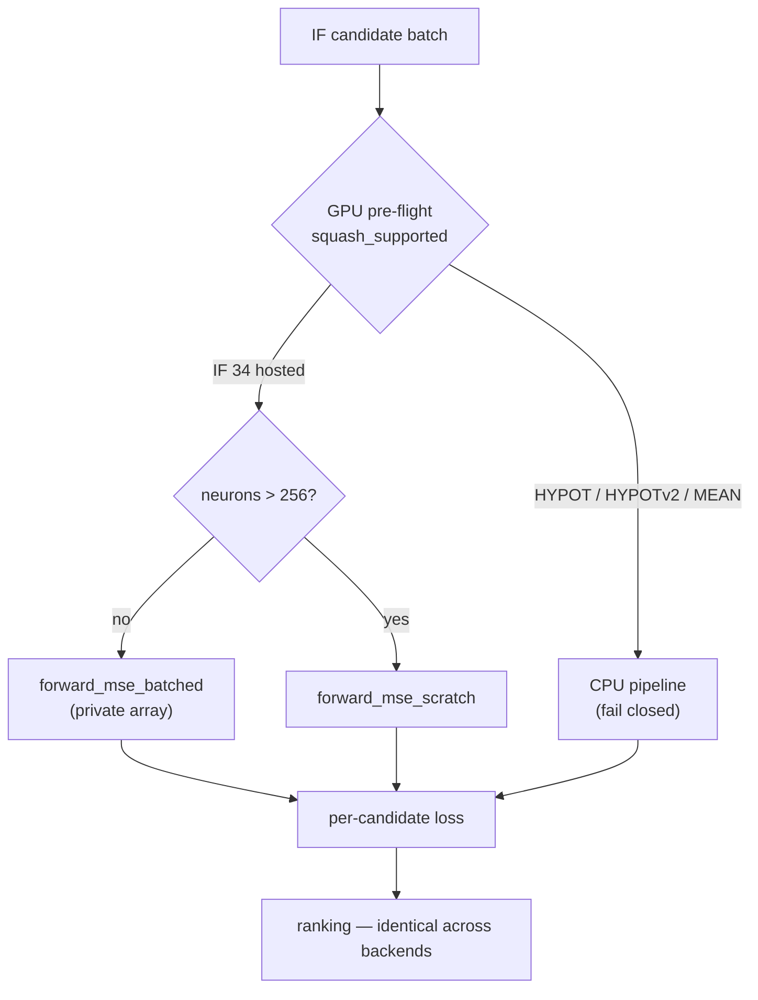

The fixtures live in
[`rust_scorer/src/if_tree_fixture.rs`](rust_scorer/src/if_tree_fixture.rs) —
depth-1 stump, nested tree, mixed point-wise + `IF` creature, large creature with
an appended `IF` graft, and a branch-boundary corpus that pins every split on,
one ULP below and one ULP above its threshold. They are consumed by
[`tests/if_tree_parity.rs`](rust_scorer/tests/if_tree_parity.rs); synapse-role
upload/decoding (`Condition` / `Negative` / `Positive` surviving creature JSON →
`compile_creature` → the `SynapseGpu` buffer) is asserted by
`build_batched_network_data_preserves_if_tree_synapse_roles` in
[`rust_scorer/src/gpu/forward_mse_batched.rs`](rust_scorer/src/gpu/forward_mse_batched.rs).
The CPU half of the suite runs everywhere; the cross-backend half skips cleanly
on hosts without an adapter, exactly as the other GPU parity suites do.

Once `NEAT-AI-core#555` lands its canonical decision-tree fixture and graft
helper, these builders become its scorer-side consumers — the parity assertions
are written against the semantics, not the builder, so the swap is a fixture
change rather than a test rewrite.

### Synapses are keyed by `(from, to, type)` (Issue #581)

`NEAT-AI-core#577` relaxed the duplicate-synapse rule: the key is the
`(fromUUID, toUUID, type)` **triple**, so one source may feed an `IF` neuron
through more than one role. The contribution that must apply *whichever way the
node branches* no longer needs an `IDENTITY` relay neuron existing purely to be
a second distinct source. Every other squash sums its inward synapses regardless
of role, so a repeated pair into a point-wise target is still refused — as
`CreatureError::TypedDuplicateSynapse`, distinct from the
`CreatureError::DuplicateSynapse` an exact repeated triple earns.

This engine is the one that would **disagree first**, which is why the guard is
pinned rather than assumed. `rust_scorer` resolves every synapse independently
and sums each role's bucket; a loader keyed by `(from, to)` alone keeps one edge
per ordered pair and silently drops the rest, so the same JSON means two
different things:

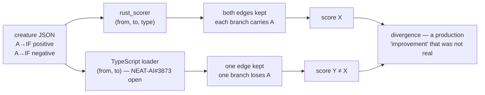

The fixtures live in
[`rust_scorer/src/dual_role_fixture.rs`](rust_scorer/src/dual_role_fixture.rs):
the relay-free creature (one constant carrying all three roles, one input column
carrying both branches), the pre-#577 relay workaround that describes the *same*
function, the creature a `(from, to)`-keyed loader is left holding, and the two
shapes that must still be refused. They are consumed by
[`tests/dual_role_parity.rs`](rust_scorer/tests/dual_role_parity.rs), which
asserts that:

- **nothing is dropped on load** — the synapse count is identical in the raw
  JSON, the parsed export and the compiled network (the Rust-side spelling of
  the `jsonSynapses === loadedSynapses` assertion `NEAT-AI-Forests`' `ts_parity.rs`
  makes against `Creature.scoreDir`);
- **the relaxed form and the relay workaround agree exactly** — bit-identical
  activations and an identical loss through the real directory pipeline, so
  upstream may drop the relay without moving a score;
- **a dropped edge is detectable** — the `(from, to)`-keyed creature scores
  differently, so the assertions above cannot pass vacuously;
- **both GPU kernels agree** with CPU within the same `1e-3` cross-backend
  tolerance, since the kernels bucket by synapse role too.

Nothing in the scorer's own scoring path keys synapses by `(from, to)`: it
iterates `creature.synapses` in declaration order and reports
`synapse_count = creature.synapses.len()`. The TypeScript half of the rule
(`NEAT-AI#3873`) is still open, so `if_tree_fixture.rs` keeps its three separate
bias-1 constants — a conservative choice that keeps those fixtures loadable by
**both** engines, not a requirement of this one.

### Cost function selector (Issues #120, #121)

The `--cost <NAME>` flag selects which built-in loss function the scorer
dispatches when scoring a creature. Names match the TypeScript
`BUILT_IN_COST_NAMES` strings exactly (see
[`NEAT-AI/src/Costs.ts`](https://github.com/stSoftwareAU/NEAT-AI/blob/Develop/src/Costs.ts))
so callers can pass `NeatOptions.costName` through unchanged.

| Value               | Meaning                              | Dispatch helper (`neat_core::loss`) | GPU?           |
|---------------------|--------------------------------------|--------------------------------------|----------------|
| `MSE` (**default**) | Mean Squared Error                   | `mse_sum_batch_packed`               | **Yes**        |
| `RMSE`              | Root Mean Squared Error (`sqrt(mean(squared error))`) — same creature ordering as MSE, but a different reported score, in the target's own units | `mse_sum_batch_packed` + host `sqrt` | **Yes** (MSE kernel) |
| `MAE`               | Mean Absolute Error                  | `mae_sum_batch_packed`               | No (CPU)       |
| `MAPE`              | Mean Absolute Percentage Error       | `mape_sum_batch_packed`              | No (CPU)       |
| `MSLE`              | Mean Squared Logarithmic Error       | `msle_sum_batch_packed`              | No (CPU)       |
| `HINGE`             | Hinge loss                           | `hinge_sum_batch_packed`             | No (CPU)       |
| `CROSS_ENTROPY`     | Cross-entropy                        | `cross_entropy_sum_batch_packed`     | No (CPU)       |
| `CATEGORICAL_ERROR` | Categorical (top-1 mismatch) error   | `categorical_error_sum_batch_packed` | No (CPU)       |

Unknown values are rejected by `clap` with a non-zero exit and a stderr
message listing the supported set. There is **no** `NEAT_SCORER_COST`
environment-variable override — KISS, the CLI flag is the only knob.
The resolved cost name is echoed back as the `costName` JSON field on
every `ScoreResult`.

`RMSE` (Issue #337) reuses the MSE squared-error accumulation unchanged on
**both** the CPU and GPU paths and differs only by a single host-side `sqrt`
applied at finalisation (via the shared `CostKind::finalise_mean` helper).
Because `sqrt` is monotonic, it preserves the **creature ordering** `MSE`
produces — a creature that beats another under `MSE` still beats it under
`RMSE` — but the **reported score differs**: `RMSE` reports the error in the
target's own units (an `MSE` of `0.04` is an `RMSE` of `0.2`), which is why it
is worth selecting. It adds no new kernel and no per-record work, so it carries
**no performance difference versus `MSE`** on either backend.
`scripts/check-rmse-docs.sh` (invoked from `quality.sh`, covered by
`tests/scripts/rmse_docs.bats`) fails the gate if this section or the
`CostKind::Rmse` rustdoc collapses that distinction back into an
identical-ranking claim (Issue #556).

#### Per-cost examples

```text
rust_scorer --cost MSE               <creature.json> <training_data_dir>  # default; unchanged behaviour
rust_scorer --cost RMSE              <creature.json> <training_data_dir>  # sqrt(mean squared error); reuses MSE kernel (CPU+GPU), same-unit magnitudes, no perf cost
rust_scorer --cost MAE               <creature.json> <training_data_dir>  # absolute-error regression
rust_scorer --cost MAPE              <creature.json> <training_data_dir>  # percentage-error regression
rust_scorer --cost MSLE              <creature.json> <training_data_dir>  # log-scale regression
rust_scorer --cost HINGE             <creature.json> <training_data_dir>  # margin classifier
rust_scorer --cost CROSS_ENTROPY     <creature.json> <training_data_dir>  # probabilistic classifier
rust_scorer --cost CATEGORICAL_ERROR <creature.json> <training_data_dir>  # multi-class top-1 mismatch count
rust_scorer --cost FOO               <creature.json> <training_data_dir>  # exits non-zero — unknown cost
```

#### GPU costs — the batched/scratch kernels serve MSE, RMSE and MAE

The `forward_mse_batched` and `forward_mse_scratch` GPU kernels run one shared
forward pass and then reduce a per-record loss selected by the shader's
`cost_kind` header field:

- `MSE` / `RMSE` accumulate the **squared-error sum** — `RMSE` (Issue #339)
  shares that sum unchanged and only adds a host-side `sqrt` at finalisation, so
  both are GPU-supported at identical speed.
- `MAE` (Issue #316) accumulates the **absolute-error sum** on the same forward
  pass, so it is GPU-hosted on both kernels — including the > 256-neuron scratch
  path used by production-scale creatures — at MSE-class speed.

Every **other** (non-`MSE`, non-`RMSE`, non-`MAE`) `--cost` selection forces the
CPU pipeline:

- Under `--gpu auto` (the default since Issue #83) a GPU-unsupported cost
  routes to the CPU directory/streaming path — the `gpuBackend` field
  on the result reports `"cpu-fallback"` so the caller can see what
  actually ran. On the **directory path** the scorer also prints one
  informational `[gpu] auto fallback ...` line to stderr naming the
  cost as the reason (Issue #205), so the CPU choice is not silent;
  MSE / RMSE / MAE (GPU-supported costs) print nothing extra. (An
  `AllPrivate` pool — and, since Issue #467, a **shallow** `ScratchOnly` pool —
  runs on GPU; `Mixed` and **deep** `ScratchOnly` production-scale pools still
  fall back to CPU for **topology** reasons per Issue #317, independent of cost.)
- Under `--gpu on` a GPU-unsupported cost is a hard error before any scoring
  runs (no silent downgrade — `--gpu on` is a strict requirement).
- Under `--gpu off` GPU detection is skipped regardless of `--cost`.

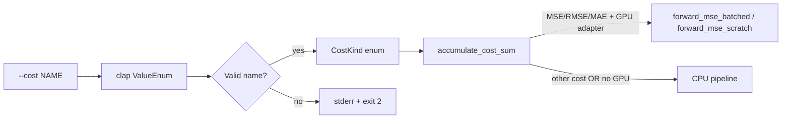

### Record-level sub-sampling — `--sample-rate` (Issue #310)

Multi-fidelity fitness scores a creature on a deterministic, stratified
**subsample** of the binary corpus instead of the full corpus, trading a little
ranking fidelity for a large wall-clock saving during a per-generation ranking
pass. Production spends ≈95 % of its fitness wall-clock in the forward-only Rust
batch path (`rust_scorer <creatures_dir> <data_dir>`) over a single ~21 GiB
corpus file, so the byte cut has to happen **inside the streaming reader** — there
is no shard to drop and no room for a second corpus on disk.

- `--sample-rate <f>` — a value in `(0, 1]`, default `1` (score every record).
  When `< 1`, the reader keeps a stratified subsample: record `i` is kept iff
  `floor((i+1)·rate) > floor(i·rate)`. This keeps `floor(N·rate)` of `N` records
  spread evenly across the corpus in a **single pass, no second corpus on disk**.
  Out-of-range values are rejected with a non-zero exit (never silently clamped).
- `--sample-phase <u64>` — default `0`. Shifts the stride to select a *different*
  subsample of the same size (e.g. rotating the sampled stratum per generation)
  with no randomness. Ignored when `--sample-rate` is `1` or absent.

The stride matches the TypeScript consumer (NEAT-AI#3257) exactly, so both agree
on which records survive. When sub-sampling runs, `error`/`score` are computed
over the kept subset, `recordCount` is the number of records actually scored,
and a `sampleRate` JSON field echoes the effective rate so a caller can confirm
the scorer honoured the flag rather than silently ignoring it. A full-corpus run
(`--sample-rate 1`, the default) emits the pre-#310 JSON unchanged. The consumer
can probe `--help` for `--sample-rate` (the `resolveProbeState` pattern) and pass
it on the batch path once a release advertises it.

```text
rust_scorer --sample-rate 0.25 <creatures_dir> <training_data_dir>  # score a 25% stratified subsample
rust_scorer --sample-rate 0.5 --sample-phase 1 <c.json> <data_dir>  # a different 50% stratum
```

The flag applies uniformly to every scoring path — the single-creature fused
path, the multi-creature CPU directory path, the GPU directory path, and the
per-record recurrent path — because sampling is threaded through the one shared
head-and-compact reader (`run_io_loop`). A stateful sampler carries the global
record index across streamed chunks so the kept set is **independent of how the
reader chunks the bytes**.

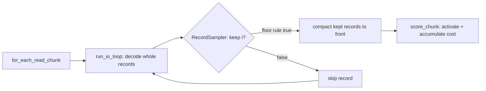

Synthetic corpus (1.5 M records, forward-only 4→128→2 creature, CPU path,
`--gpu off`; best of 3 runs) — wall-clock scales down with the rate while the
score stays stable:

| `--sample-rate` | records scored | wall-clock | speed-up |
|-----------------|----------------|------------|----------|
| `1.0` (default) | 1,500,000      | 0.121 s    | 1.00×    |
| `0.5`           | 750,000        | 0.069 s    | 1.76×    |
| `0.25`          | 375,000        | 0.039 s    | 3.15×    |
| `0.1`           | 150,000        | 0.021 s    | 5.67×    |

> **Production gate (needs production data + a human).** Lighting this up on the
> real production corpus is gated on ≥ 5 % `evolveDir` wall-clock **and** rank
> correlation (Spearman/pairwise) of subsample vs full ≥ 0.95, published on
> NEAT-AI#3256 / #3257. The scorer does **not** auto-release — the consumer bumps
> to a released scorer through the normal dependency-bump flow once a human cuts
> the release.

### Self-tuning, and why the `NEAT_SCORER_*` knobs are not configuration (Issue #544)

The scorer picks every performance knob from the machine it is running on —
worker counts, read-chunk sizes, the GPU scratch budget — so a low-RAM box stays
within memory and a large Mac is not stuck at historical ceilings. The
`NEAT_SCORER_*` variables below are an **emergency escape hatch** for incidents
and diagnostics, **not per-host configuration**: exporting one per host is not a
supported way to run the scorer, and a host that needs it is a tuning bug in
`host_resources.rs` / `read_tuning.rs`, not a host that needs a wrapper script.

The full detection → tier → knob mapping, the fleet tier table and the
Issue #544 roll-up (including the retunes that measured no gain) live in
[`docs/self-tuning.md`](docs/self-tuning.md). The sections below describe the
individual knobs; read them as *what the scorer decided*, not as a menu.

### Host knob report — `--host-report` (Issue #545)

Every host-tuned default is chosen from a probed snapshot of the machine
([`host_resources`](rust_scorer/src/host_resources.rs)), so retuning one across
the fleet first needs a way to see what a given host **detected** and **chose**.
`--host-report` prints exactly that as one JSON object and exits without scoring
anything:

```bash
rust_scorer --host-report                      # production record width (9848 B)
rust_scorer --host-report --record-bytes 40    # small-record corpora
```

```json
{
  "schema": "neat-scorer-host-report/3",
  "logical_cpus": 10,
  "performance_cpus": 4,
  "physical_ram_bytes": 25769803776,
  "record_bytes": 9848,
  "knobs": {
    "default_worker_count": { "value": 10, "source": "default", "env_var": "NEAT_SCORER_ACTIVATION_THREADS" },
    "max_worker_count": { "value": 256, "source": "default", "env_var": null },
    "max_read_bytes": { "value": 67108864, "source": "default", "env_var": null },
    "default_training_read_bytes": { "value": 6706488, "source": "default", "env_var": "NEAT_SCORER_READ_BYTES" },
    "file_read_workers": { "value": 10, "source": "default", "env_var": "NEAT_SCORER_FILE_THREADS" },
    "aggregate_read_budget_bytes": { "value": 67108864, "source": "default", "env_var": null },
    "gpu_scratch_bytes": { "value": 536870912, "source": "default", "env_var": "NEAT_SCORER_GPU_SCRATCH_BYTES" }
  }
}
```

- `value` is what the scorer will actually use, **after** every clamp and the
  round-down to a whole record multiple — not the raw env string.
- `physical_ram_bytes` is the probe **snapped to the host's nameplate capacity**
  (see [Nameplate RAM snapping](#nameplate-ram-snapping-issue-547)), so it is
  the figure the knobs were tiered against — on a 16 GB x86 Linux host it reads
  `17179869184`, not the ≈ 15.5 GiB the kernel leaves usable.
- `source` is `env` only when an override was parsed and **honoured**. A
  malformed value (`NEAT_SCORER_READ_BYTES=2MB`) is rejected by the shipped
  resolver, so it keeps reporting `default` and still warns on stderr.
- `env_var` is `null` for a host-derived ceiling, which takes no override.
- `NEAT_SCORER_FILE_THREADS` shares the `default_worker_count` default,
  additionally capped at the corpus file count.
- `default_training_read_bytes` is the chunk **one reader** takes, and
  `file_read_workers` (schema `/3`, Issue #549) is how many readers a
  production-shaped 26-shard corpus spawns. Their product never exceeds
  `aggregate_read_budget_bytes`, the total resident read buffer this host allows
  — see
  [Adaptive `NEAT_SCORER_READ_BYTES` default](#large-record-hosts-adaptive-neat_scorer_read_bytes-default-issues-307-504-549).
  Before schema `/3` the report printed the *unsplit* record-size tier
  (`33552136` on this host), which overstated the buffer a 10-reader run
  actually holds by 5×.
- `performance_cpus` (schema `/2`, Issue #546) is the **performance-core**
  count: `hw.perflevel0.physicalcpu` on Apple silicon (falling back to
  `hw.physicalcpu`), the highest-`cpu_capacity` tier on heterogeneous ARM
  Linux, and otherwise — x86, Intel Macs, any probe failure — the same value as
  `logical_cpus`. The probe never reports **fewer** cores than it can prove, so
  a host it cannot classify keeps every historical default. The example above
  is an M4 (4P + 6E of 10 logical); the shipped `default_worker_count` still
  keys off `logical_cpus` (see the Issue #546 section of
  [`docs/performance-baseline.md`](docs/performance-baseline.md) for why).
- `gpu_scratch_bytes` is the **no-adapter** budget: resolving the report never
  creates a `wgpu` device, so it prints the RAM-derived value. A scoring run
  that actually selects an adapter tunes the budget against that adapter's
  limits instead — see
  [GPU capability sensing](#gpu-capability-sensing-issue-548).
- Keys are snake_case and named after the functions that produced them, so a
  pasted report maps 1:1 onto the code a retune has to change. This is a
  diagnostic, **not** the camelCase scoring payload.

The report is measurement only: it changes no default, never creates a `wgpu`
adapter, and therefore returns the same JSON on a GPU-less host, under
`--gpu off`, and under `--gpu on`. `--record-bytes` selects the record width the
read-chunk knob is resolved for (the default is record-size adaptive); zero is
rejected rather than clamped. Pair it with the knob sweep harness in
[How to bench](#how-to-bench) when retuning a knob.

### GPU capability sensing (Issue #548)

The GPU scratch budget used to be inferred from **system RAM alone**, which is a
poor proxy: an M1 Max and an M4 with the same RAM got the same budget, and a
headless x86 Linux box computed a budget for a GPU it does not have. The scorer
now senses what the selected adapter actually reports and tunes against that.

`HostResources::gpu` carries the sensed
[`GpuCapability`](rust_scorer/src/host_resources.rs) — backend label, whether
adapter memory is **unified** with system RAM (Apple silicon, integrated GPUs)
or **discrete** VRAM, `max_storage_buffer_binding_size`, and
`max_compute_workgroups_per_dimension`. It is `None` until an adapter is
selected, so nothing about sensing can start a `wgpu` device on its own:

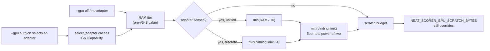

- **Sensing only ever tightens the budget.** Every bound is a `min` on the RAM
  tier, because raising the budget measured **slower**: doubling it on an M4 Pro
  cost 7.9 % on the shallow scratch path (4 of 4 interleaved pairs), so the
  *retune* half of #548 is a recorded negative result and only the clamp ships.
  See
  [`docs/performance-baseline.md`](docs/performance-baseline.md#gpu-capability-sensing--10-august-2026-issue-548).
- **No adapter sensed ⇒ nothing changes.** `--gpu off`, a GPU-less host, and any
  knob resolved before an adapter exists all keep the pre-#548 RAM tiering
  (64 MiB / 128 MiB / 256 MiB / 512 MiB / 1 GiB by RAM). That is also what
  `--host-report` prints, because the report never creates an adapter.
- **The adapter's limit is a hard ceiling.** The activation scratch is a single
  binding, so a budget above `max_storage_buffer_binding_size` is a validation
  error rather than a slow run. The budget is floored to a power of two because
  the runner rounds its scratch allocation up to one.
- **Unified memory stays RAM-bounded.** The scratch SSBO and the streamed corpus
  share one pool on Apple silicon, so the budget is additionally capped at one
  sixteenth of physical RAM. Every shipped tier already sits below that share,
  so no fleet Mac moves.
- **Discrete cards are bounded by the card.** Host RAM describes nothing about
  VRAM, so the budget is additionally capped at a quarter of the adapter's
  binding limit.
- **`max_compute_workgroups_per_dimension` bounds the grid.** The scratch
  kernel's grid-stride width `G_x` is now clamped to it as well as to the memory
  budget.
- **`NEAT_SCORER_GPU_SCRATCH_BYTES` still wins**, and is still capped to the
  device binding limit — as an emergency escape hatch for a diagnostic run, not
  per-host configuration ([`docs/self-tuning.md`](docs/self-tuning.md)).

### Nameplate RAM snapping (Issue #547)

Every RAM tier above (`max_worker_count`, `max_read_bytes`, the GPU scratch
budget, the `read_tuning` read cap) is a strict comparison against an exact
power-of-two byte count, but the POSIX probe
(`sysconf(_SC_PHYS_PAGES) * sysconf(_SC_PAGESIZE)`) reports **usable** memory.
On x86 Linux, firmware and kernel reservations put a nominally 16 GB box a few
hundred MiB below `16 * GIB`, so it silently dropped a whole tier — and a
nominally 8 GB box was treated as a low-RAM host, capped at 16 workers with an
8 MiB read buffer.

[`host_resources::snap_to_nameplate_bytes`](rust_scorer/src/host_resources.rs)
rounds the reading up to the nearest nameplate capacity when it sits within
**6.25 %** of it, once, at the single point `HostResources` is constructed — so
every knob inherits the correction and none can bypass it:

| Nameplate | Probe reports | Tier before | Tier after |
|---|---|---|---|
| 8 GB | ≈ 7.6 GiB | `< 8 GiB` — 16-worker cap, 8 MiB reads | 8 GiB — 256-worker cap, 16 MiB reads |
| 16 GB | ≈ 15.4 / 15.5 GiB | `< 16 GiB` — 16 MiB reads, 256 MiB scratch | 16 GiB — 32 MiB reads, 512 MiB scratch |
| 24 GB (Apple Silicon) | 24.0 GiB exactly | 24 GiB | unchanged |

Readings further below a capacity than the tolerance band are left exactly as
probed, so a genuinely small machine (7 GiB against an 8 GiB capacity, 12.5 %
short) keeps its low-RAM defaults. An unavailable probe stays `None` and keeps
the unknown-RAM defaults.

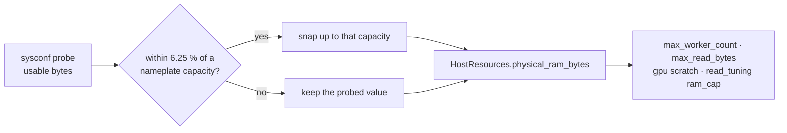

### Stdin input mode

For restricted worker/sandbox environments where writing a temp file may fail
even with write permission (see issue #15), pass the creature JSON on stdin:

```text
rust_scorer --creature-stdin <training_data_dir>
```

The positional contract is unchanged in default mode. With `--creature-stdin`,
the binary reads creature JSON from standard input until EOF and expects a
single positional argument (`<training_data_dir>`).

### Output

Single-creature mode JSON includes **`forwardOnly`** (from the creature) and **`trainingReadBackend`**: on a native release build you should see **`pipelined_double_buffer`** when `forwardOnly` is `true` (fused scoring + `training_bin_stream`). If `forwardOnly` is `false`, you get **`record_iterator`** instead (no pipelining — much slower on large data). The **`gpuBackend`** field reports the `wgpu` backend that **actually ran** the scoring kernel — `"metal"`, `"vulkan"`, `"dx12"` or `"gl"` when a GPU hosted the run, and `"cpu-fallback"` when the CPU pipeline ran (see [GPU mode](#gpu-mode-issues-80--83) above for the routing rules). When record-level sub-sampling runs (`--sample-rate < 1`, see [Record-level sub-sampling](#record-level-sub-sampling----sample-rate-issue-310)) a **`sampleRate`** field echoes the effective rate and `recordCount` is the number of *sampled* records scored; the field is absent for a full-corpus run. **`compileTimeSecs`** (Issue #42) reports the wall-clock seconds spent in `compile_creature` — plus any per-worker `CompiledNetwork` clone — before scoring starts, so the fixed startup share of `timeTaken` can be told apart from scoring time; it is omitted when no compile timing was recorded.

In directory mode, output is a top-level object keyed by creature filename stem, where each value has the same shape as a single-creature `ScoreResult` — or, since GRQ#4387, an offender entry for a creature that could not be scored (see [Per-creature failures in directory mode](#per-creature-failures-in-directory-mode-grq4387)).

```json
{
  "creature-10-1": {
    "score": 0.9999998,
    "error": 0.0
  },
  "creature-12-1": {
    "score": 0.9999998,
    "error": 0.0
  },
  "creature-13-1": {
    "failed": true,
    "reason": "COMPILE",
    "message": "Failed compiling worker network for creature '/tmp/batch/creature-13-1.json': duplicate synapse input-7 -> hidden-2"
  }
}
```

This mode uses one shared training-data scan and parallelises scoring across creatures to use available CPU cores by default.

Per-chunk activation runs through a single flat Rayon layer (Issue #41): a worker network pool sized to `activation_threads` is built up-front, and every chunk dispatches one `par_iter_mut` over that pool. When the population meets or exceeds `activation_threads` each creature owns one worker; below that, the thread budget is spread across creatures so a small population still saturates the CPU. The JSON output keeps the same shape — `parallelActivationBatches` and `maxActivationBatchRecords` are not emitted in directory mode.

#### Early-exit / partial-score API (Issue #308)

The directory-mode batch path is also exposed as a library entrypoint with a
per-chunk early-exit hook, so a caller (e.g. NEAT-AI#3264's cascading fitness
ranking) can abort creatures mid-corpus without reimplementing the fused
scoring loop:

```rust
use rust_scorer::multi_score::{score_from_creature_dir_with_early_exit, EarlyExit};
use rust_scorer::{cost::CostKind, gpu::GpuBackendLabel};
use std::path::Path;

let scores = score_from_creature_dir_with_early_exit(
    Path::new("creatures/"),
    Path::new("training_data/"),
    GpuBackendLabel::CpuFallback,
    CostKind::Mse,
    |partials| {
        // Abort any creature whose running error is already 10x the best so far.
        let best = partials.iter().map(|p| p.partial_error).fold(f64::INFINITY, f64::min);
        let losers: Vec<usize> = partials
            .iter()
            .filter(|p| p.partial_error > best * 10.0)
            .map(|p| p.creature_index)
            .collect();
        if losers.is_empty() { EarlyExit::Continue } else { EarlyExit::AbortCreatures(losers) }
    },
).unwrap();
```

After each scored chunk the callback receives one `PartialScore` per
still-active creature (`creature_index`, `key`, running `partial_error`,
`records_scored`) and returns an `EarlyExit`:

- `Continue` — keep scoring every active creature.
- `AbortCreatures(indices)` — stop scoring those creatures; each freezes at its
  current partial score (its final `error` over a partial `record_count`).
  Skipping them removes their activation cost from every remaining chunk.
- `AbortAll` — stop the sweep entirely; every active creature freezes.

**Full-score parity is guaranteed:** the plain `score_from_creature_dir` (no
callback), and a callback that always returns `Continue`, produce
**bit-identical** scores (`tests/early_exit_tdd.rs`). Aborting ~50 % of the
population after the first chunk cuts directory-mode median wall-clock by
**40–45 %** on the synthetic bench (`early_exit_directory` in
`benches/scoring.rs`).

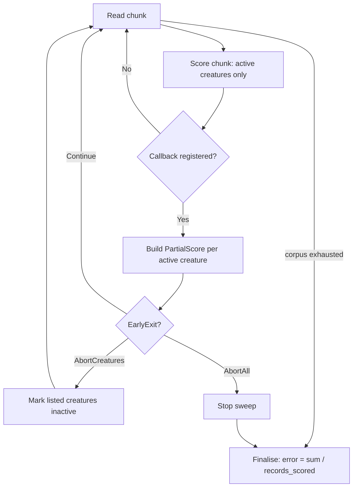

For forward-only single-creature fused scoring, activation parallelism also
defaults to a **host-aware** worker count (every logical CPU on mid/large hosts;
clamped on low-RAM machines so compiled-network clones stay within memory).
`NEAT_SCORER_ACTIVATION_THREADS` overrides that choice, but it is an emergency
escape hatch, not per-host configuration — see
[`docs/self-tuning.md`](docs/self-tuning.md).

### Parallel training-data file reads (Issue #529)

Record order does not matter — the fused accumulator is a plain sum over
records — so a multi-file corpus is read by **several concurrent readers**
instead of one. Production splits ~80 GB across 26 `.bin` files; each reader
takes the next unread file, streams it, unpacks it and scores it independently,
and the per-file partial losses are folded back **in file order** so the result
does not depend on which reader got which file.

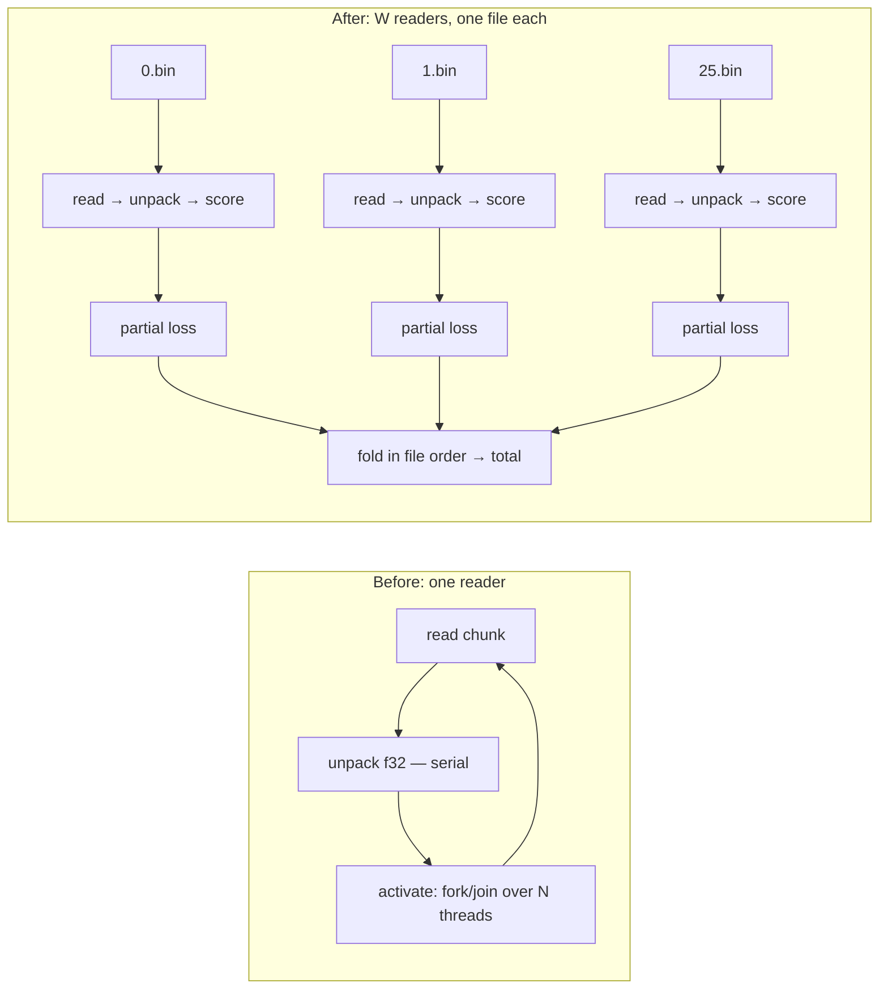

| Knob | Default | Purpose |
|---|---|---|
| `NEAT_SCORER_FILE_THREADS` | host-aware: one reader per CPU on mid/large hosts (fewer on low-RAM), never more than there are files | `.bin` files read and scored concurrently. `1` restores the single sequential reader. Emergency escape hatch, not per-host configuration ([`docs/self-tuning.md`](docs/self-tuning.md)). |

The two parallel axes share one CPU budget: with `W` readers, each reader gets
`NEAT_SCORER_ACTIVATION_THREADS / W` activation workers (at least one), and the
readers share the same total read-buffer budget as a single reader — so neither
threads nor memory grow with the file count. The resolved reader count is
echoed back as the `fileReadWorkers` JSON field whenever it is `> 1`.

Falls back to the single sequential reader for a one-file corpus and for a
corpus whose files are **not** each a whole number of records (records spliced
across a file boundary can only be reassembled by one continuous stream —
[`corpus_guard`](rust_scorer/src/corpus_guard.rs) rejects such a corpus at the
CLI anyway).

**Scores are unchanged.** The kept record set is identical at every reader
count, including under `--sample-rate` (each reader seeds its sampler with its
file's global record offset, and the stride is a pure function of that index).
On a corpus whose per-record errors are not exactly representable, the total can
move in the last floating-point bits because records group into different SIMD
batches — the same effect the existing `NEAT_SCORER_READ_BYTES` knob already
has, measured well below `1e-6` relative
(`tests/parallel_file_reads_tdd.rs`).

Measured on an Apple M4 (10 cores) over a 200 MB corpus in 26 files — see
[`docs/performance-baseline.md`](docs/performance-baseline.md#parallel-file-reads--5-august-2026-issue-529):

| Record width | Sequential reader | Parallel readers (auto) | Change |
|---|---|---|---|
| 40 B/record (8 in / 2 out) | 178.28 ms | 77.06 ms | **−56.8 %** |
| 9848 B/record (production width) | 109.77 ms | 60.00 ms | **−45.3 %** |

### Malformed tuning values are reported, not silently ignored (Issue #204)

The numeric performance knobs `NEAT_SCORER_READ_BYTES`,
`NEAT_SCORER_ACTIVATION_THREADS`, `NEAT_SCORER_FILE_THREADS` and
`NEAT_SCORER_GPU_SCRATCH_BYTES` used to
fall back to their default on an invalid value with no feedback, so a typo
such as `NEAT_SCORER_READ_BYTES=2MB` looked like it took effect when it was
ignored. Each now prints a single diagnostic to stderr and continues with the
default, mirroring how `NEAT_SCORER_GPU` already rejects invalid values:

```text
[scorer] ignoring invalid NEAT_SCORER_READ_BYTES='2MB', using default 2097152
```

Unset or blank values stay silent, and a valid value is honoured without any
warning. The default quoted in the message is the **record-size adaptive**
default described below, so it reads `33554432` on production-sized records.

### Large-record hosts: adaptive `NEAT_SCORER_READ_BYTES` default (Issues #307, #504, #549)

The read-chunk default is **record-size adaptive**, **host-RAM adaptive** and
**reader-count aware** —
the record-size constants live in
[`rust_scorer/src/read_tuning.rs`](rust_scorer/src/read_tuning.rs) and the host
probe in [`rust_scorer/src/host_resources.rs`](rust_scorer/src/host_resources.rs).
Both apply to every scoring path (single-creature, directory/multi-creature,
streaming, CLI and `float_scan_bench`):

| Record size | Default read chunk when `NEAT_SCORER_READ_BYTES` is **unset** (mid-host, ≥ 16 GiB RAM) |
|---|---|
| < 8000 B/record (synthetic fixtures) | **2 MiB** (`DEFAULT_READ_BYTES`) |
| ≥ 8000 B/record (`LARGE_RECORD_BYTES_THRESHOLD`) | **32 MiB** (`LARGE_RECORD_DEFAULT_READ_BYTES`) |

Self-tuning then **shrinks** that default on old / low-RAM machines (e.g. 2 MiB
on &lt; 4 GiB RAM, 8 MiB on &lt; 8 GiB) and may take the full **64 MiB**
`MAX_READ_BYTES` default on very large Macs (≥ 64 GiB RAM) for production-width
records. Thread counts and the GPU scratch budget scale the same way — see
`host_resources`. Those RAM comparisons are made against the **nameplate**
capacity, not the raw probe — see
[Nameplate RAM snapping](#nameplate-ram-snapping-issue-547).

#### Aggregate read budget across concurrent readers (Issue #549)

A multi-file corpus is read by **one reader per CPU** (Issue #529), so the
resident read buffer is `readers × chunk`, not one chunk. The table above is the
**single-reader** figure; with concurrent readers each reader gets its share of
one host-wide budget:

| Host RAM | `aggregate_read_budget_bytes` (all readers together) |
|---|---|
| < 64 GiB | **64 MiB** |
| ≥ 64 GiB (Mac Studio / Mac Pro class) | **256 MiB** |
| any | never more than **RAM / 16** |

A 12-core 24 GiB M4 Pro reading a 26-shard production corpus therefore takes
**12 readers × ~5.3 MiB**, not 12 × 32 MiB — which is what it has read since
Issue #529 split the budget across the readers. What #549 changed is *where* the
split happens: `read_tuning` now chooses the per-reader chunk itself, so the
value `--host-report` prints and the value each reader holds are the same number.
The dead `≥ 64 GiB → 256 MiB` **override clamp** was removed at the same time
(no built-in default could ever select it); the 256 MiB figure it really
described is the aggregate budget row above. No tier's chunk was retuned — the
before/after A/B, the noise probes that blocked the retune, and the reproduction
recipe are in
[`docs/performance-baseline.md`](docs/performance-baseline.md#read-chunk-defaults-vs-the-reader-count--10-august-2026-issue-549).

**Production records are 9848 bytes** (2461 inputs + 1 output, `f32`), so a
typical production host already reads 32 MiB chunks with **no environment
variable set** — exporting `NEAT_SCORER_READ_BYTES=33554432` by hand is
redundant there.

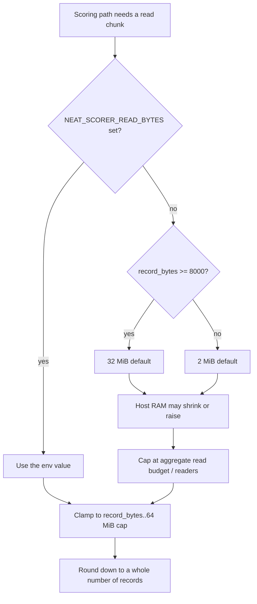

`NEAT_SCORER_READ_BYTES` still **overrides** the adaptive default, as an
emergency escape hatch — a diagnostic or incident lever, **not per-host
configuration** ([`docs/self-tuning.md`](docs/self-tuning.md)). Any value — env
or default — is clamped to the **64 MiB**
`MAX_READ_BYTES` cap (flat on every host since Issue #549) and to at least one
record, then rounded down to a whole number of records, so a chunk never splits
a record. An override is still divided across concurrent readers, so setting it
raises each reader's chunk only up to that reader's share of the aggregate
budget.

#### Why 32 MiB (the supporting sweep)

A 2 MiB chunk holds only ~213 production records — too few to amortise the
per-chunk Rayon dispatch across the worker pool. A sweep on the #296 production
fixture (see [`docs/performance-baseline.md`](docs/performance-baseline.md))
shows larger aligned reads recover **~20 %** on the single-creature path, with
the sweet spot at **16–32 MiB**:

| `NEAT_SCORER_READ_BYTES` | `production_single_creature` | `production_multi_creature/1` | `production_multi_creature/4` |
|---|---:|---:|---:|
| 2 MiB (default) | baseline | baseline | baseline |
| 8 MiB | −19 % | −15 % | −6 % |
| **16 MiB** | **−22 %** | **−20 %** | −5 % |
| **32 MiB** | **−24 %** | **−24 %** | **−14 %** |
| 64 MiB | −22 % | −22 % | −15 % |

(Deltas are the median wall-clock reduction vs the 2 MiB default measured
back-to-back on one Apple Silicon host; absolute times are host-load
sensitive, so the table reports the relative improvement each cell held across
repeated interleaved runs.)

Those numbers are why the ≥ 8000 B/record default is **32 MiB**; no export is
needed to get them, and none is expected. Setting the variable by hand is a
diagnostic step — reproducing a report, or bisecting a suspected tuning fault —
after which it comes back out again:

```bash
# Diagnostic only: the adaptive default already resolves 32 MiB (33554432) here.
NEAT_SCORER_READ_BYTES=16777216 rust_scorer creature.json data_dir   # 16 MiB
```

The read buffer is **per-scan, not per-activation-worker** — directory mode runs
a single shared scan and partitions the unpacked records across the worker
pool — so a 32 MiB setting adds at most ~64 MiB of transient buffer (the
pipelined path double-buffers), not 32 MiB × activation worker count. The
forward-only fused path does hold one buffer per **file reader**, and that total
is what the [aggregate read budget](#aggregate-read-budget-across-concurrent-readers-issue-549)
bounds. Either way it stays well within production host RAM headroom.

The default is raised **per record size, not globally**: the gain is specific to
large records, so the small-record synthetic path keeps its 2 MiB buffer while
large-record corpora get 32 MiB automatically. The #307 sweep originally shipped
as env-var advice with the global default fixed at 2 MiB; that recommendation was
superseded when the adaptive default landed in `read_tuning.rs` (see the
supersession note in
[`docs/performance-baseline.md`](docs/performance-baseline.md)).

## Local layout

Place **NEAT-AI-core** and **NEAT-AI-scorer** as **siblings** (e.g. `…/src/NEAT-AI-core` and `…/src/NEAT-AI-scorer`). The path in `rust_scorer/Cargo.toml` is `../../NEAT-AI-core/neat-core` so `cargo build` resolves `neat-core` from your local **NEAT-AI-core** tree. CI does the same via a second checkout, but indirectly: `actions/checkout` **refuses any `path:` that resolves outside `$GITHUB_WORKSPACE`**, so the [`setup-neat-core`](./.github/actions/setup-neat-core/action.yml) composite action clones into the in-workspace `NEAT-AI-core/` and symlinks `$GITHUB_WORKSPACE/../NEAT-AI-core` at it (Issue #18). `scripts/check-workflow-paths.sh` fails the gate if a workflow reintroduces an out-of-workspace `path:`.

### neat-core breaking-bump gate (Issue #252)

The `neat-core` dependency is an **unpinned `path` dependency that always
tracks head** — there is no version to pin (kept by design). To stop scorer
from silently tracking a **breaking** neat-core change, CI runs a
version-baseline gate:

- Scorer records the **last-handled** neat-core version in the checked-in
  [`neat-core.expected-version`](./neat-core.expected-version) file.
- CI reads neat-core's actual version from the cloned sibling
  `../NEAT-AI-core/Cargo.toml` (`[workspace.package] version`).
- The **breaking component** follows SemVer: the **major** for `>= 1.0`
  releases, the **minor** for pre-1.0 (`0.x`) releases. The gate **fails**
  when neat-core's breaking component is **greater** than the recorded
  baseline, and **passes** on patch-level drift or an exact match.

This is what would have caught the neat-core breaking type change
(NEAT-AI-core #177) before the build broke.

**How to clear the gate** when it fails — in a single deliberate PR:

1. Update `rust_scorer` for the breaking neat-core change.
2. Bump the recorded version in
   [`neat-core.expected-version`](./neat-core.expected-version) to match the
   new neat-core version.

The gate runs as a step in the CI `validation` job and locally via
`./quality.sh` (the script is `scripts/check-neat-core-version.sh`; it skips
locally when no sibling `../NEAT-AI-core` clone is present).

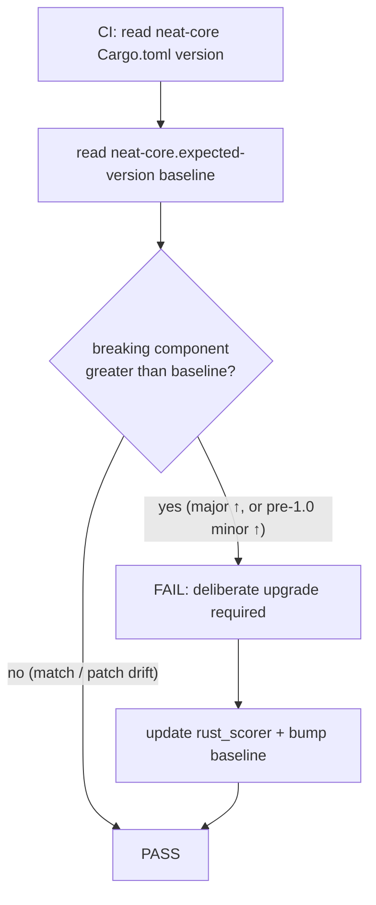

## Relationship to NEAT-AI

Scorer-specific Rust stays here; **`neat-core`** tracks **NEAT-AI-core**.

## Related Repositories

The NEAT-AI project is split across several repositories. This repo, **NEAT-AI-scorer**, is the native MSE scorer CLI consumed by **NEAT-AI** during training.

| Repository | Role |
|------------|------|
| [NEAT-AI](https://github.com/stSoftwareAU/NEAT-AI) | Deno/TypeScript orchestrator — the NEAT neural-network runtime that trains and evaluates creatures. |
| [NEAT-AI-core](https://github.com/stSoftwareAU/NEAT-AI-core) | Shared Rust computation library (`neat-core` crate) with fused batch losses and `training_bin_stream`. |
| [NEAT-AI-Discovery](https://github.com/stSoftwareAU/NEAT-AI-Discovery) | Rust discovery module invoked by NEAT-AI via Deno FFI. |
| [NEAT-AI-Snapshot](https://github.com/stSoftwareAU/NEAT-AI-Snapshot) | Snapshot storage for trained creatures. |
| [NEAT-AI-scorer](https://github.com/stSoftwareAU/NEAT-AI-scorer) | **This repo** — native MSE scorer CLI; depends on `neat-core` via path dependency. |
| [NEAT-AI-Explore](https://github.com/stSoftwareAU/NEAT-AI-Explore) | Visualiser that consumes NEAT-AI-Snapshot data. |
| [NEAT-AI-Examples](https://github.com/stSoftwareAU/NEAT-AI-Examples) | Usage examples built on NEAT-AI. |

### Dependency graph

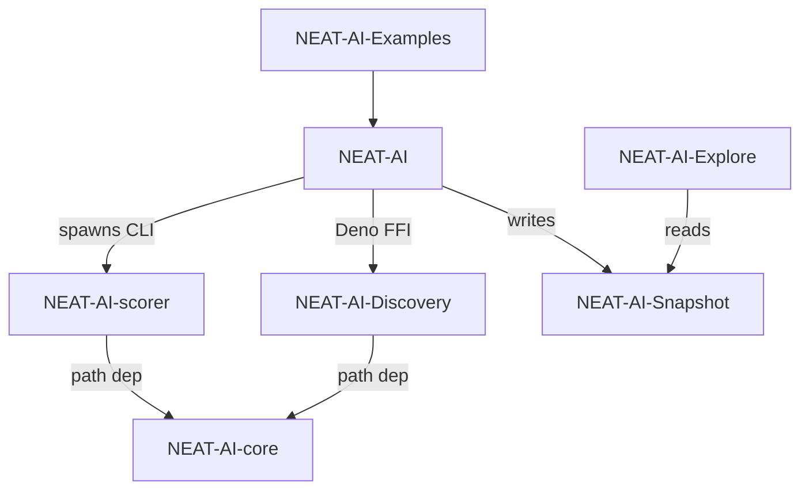

## Cost dispatch (Issues #120, #121)

The CLI accepts a `--cost <NAME>` flag listing every TypeScript
`BUILT_IN_COST_NAMES` value, and (since #121) the scoring calculation
honours the selection. The dispatch site is a single helper
(`rust_scorer::cost::accumulate_cost_sum`) shared by both the fused
forward-only path and the per-record recurrent path:

- **Fused forward-only path.** `stream_score::accumulate_cost_sum_forward_only_fused`
  routes every chunk through `accumulate_cost_sum`, which calls the matching
  `neat_core::loss::*_sum_batch_packed` helper. Adding a future cost is a
  one-line addition to the dispatch site.
- **Per-record recurrent path.** `forwardOnly: false` creatures use
  `TrainingDataIterator` to feed `[inputs..., targets...]` packed records into
  the same `accumulate_cost_sum` helper one record at a time, so every
  supported cost works here too. Directory mode (Issue #579) passes a whole
  chunk to the same helper with `forward_only = false`; the per-record reset
  inside `packed_record_scan` makes the two numerically identical, pinned per
  cost by `rust_scorer/tests/cost_parity.rs`.
- **`CATEGORICAL_ERROR` dispatches** through `categorical_error_sum_batch_packed`
  (landed via [`NEAT-AI-core#88`](https://github.com/stSoftwareAU/NEAT-AI-core/issues/88);
  unblocked here in #134) — the dispatch returns the integer count of
  argmax misclassifications across the corpus.
- **GPU kernels host MSE, RMSE and MAE.** `forward_mse_batched` and
  `forward_mse_scratch` share one forward pass and select the per-record loss
  (squared for MSE/RMSE, absolute for MAE — Issue #316) via the `cost_kind`
  header field. The remaining costs route to the CPU pipeline (silent fallback
  under `--gpu auto`, hard error under `--gpu on`).

See the [Cost function selector](#cost-function-selector-issues-120-121) section
above for the supported names and CLI surface.

## CI

### Job dependency graph (Issue #23)

`.github/workflows/ci.yml` declares an explicit job graph so ordering is
predictable on re-runs and partial failures:

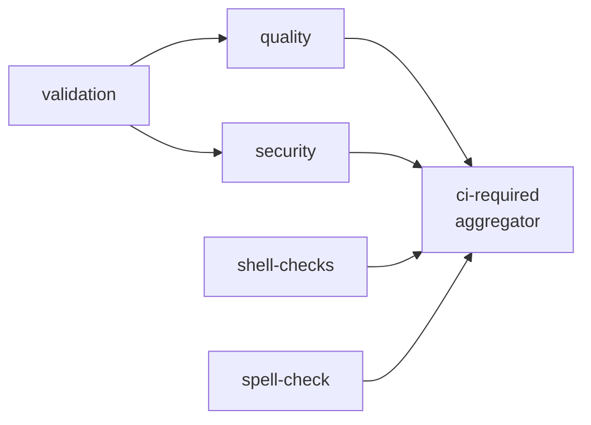

* **`validation`** is the foundation — it verifies required files and Cargo
  metadata. `quality` and `security` `needs: [validation]` so a broken repo
  layout fails fast without burning Rust compile minutes or a security scan.
* **`shell-checks`** and **`spell-check`** are lightweight and run in
  parallel with the foundation to surface findings early.
* **`ci-required`** is a single fan-in aggregator. It `needs:` every gating
  job, uses `if: always()` so it always reports a result, and inspects
  `needs.<job>.result` in its run step to fail unless every dependency
  reported `success` or `skipped`. **Branch protection should pin exactly
  one required check — `CI Required Checks` — so the merge gate is stable
  even when individual gating jobs are added or renamed.**

The graph is validated by `scripts/check-ci-job-graph.sh` (wired into
`quality.sh`) and covered end-to-end by `tests/scripts/workflow_job_graph.bats`.

### Least-privilege token scope (Issue #155)

`.github/workflows/ci.yml` declares an explicit workflow-level
`permissions:` block so every job runs with a least-privilege
`GITHUB_TOKEN` instead of the broad repository/organisation default:

```yaml
permissions:
  contents: read
```

The `quality`, `validation`, `shell-checks` and `spell-check` jobs only read
the checked-out code, so the read-only default covers them. The `security`
job calls the reusable `security.yml`, which writes check-run annotations and
PR/issue comments, so it opts into the wider scopes **at the job level**:

```yaml
  security:
    permissions:
      contents: read
      checks: write
      issues: write
    uses: ./.github/workflows/security.yml
```

The job-level grant is required because a called workflow's token can only be
narrowed, never elevated, along the caller chain — without it the read-only
workflow default would clamp away `security.yml`'s own `checks: write` /
`issues: write` and its annotations would silently fail. The rule "narrow at
the workflow level, grant only where needed at the job level" keeps the blast
radius small if any step (or a dependency it installs) is compromised.

The scope is validated by `scripts/check-ci-permissions.sh` (wired into
`quality.sh`) and covered end-to-end by `tests/scripts/ci_permissions.bats`.

### Per-job timeouts (Issue #154)

Every job across `.github/workflows/` declares an explicit `timeout-minutes`
so a hung compile, a wedged `cargo install`, a stuck network fetch, or a
runaway test fails fast instead of occupying a shared runner for GitHub's
360-minute (6-hour) default. Budgets are sized to the work each job performs:
`ci.yml`'s `quality` job (full cargo build + test + doc + release) gets 30
minutes, the security/audit jobs 15, and the lint/format/spell/version jobs
5–10. A reusable-workflow-call job (`security` in `ci.yml`) cannot declare
`timeout-minutes` — GitHub rejects that keyword on caller jobs — so its budget
lives in the called workflow's own job (`security.yml`).

The rule is validated by `scripts/check-workflow-timeouts.sh` (wired into
`quality.sh`) and covered end-to-end by `tests/scripts/workflow_timeouts.bats`.

### Checkout credential persistence (Issue #388)

Every `actions/checkout` step in the reusable `security.yml` sets
`persist-credentials: false`. By default checkout writes the workflow's
`GITHUB_TOKEN` into `.git/config` as an auth header, where any later step in the
same job — including a compromised dependency or an injected script — can read
it and act as the token. The `security` job only reads the checked-out code and
runs `cargo audit` / dependency-review; it never pushes back and never fetches a
private submodule, so keeping the credential on disk is pure blast radius.

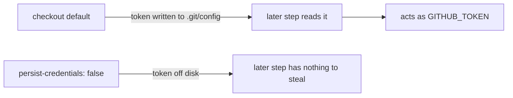

If a checkout genuinely needs the persisted credential (e.g. it later pushes
back or fetches a private submodule), document the exception with an inline
`# best-practice-ignore: BP-PERSIST-CREDS — <reason>` comment above the `uses:`
line. The rule is validated by `scripts/check-persist-credentials.sh` (wired
into `quality.sh`) and covered end-to-end by
`tests/scripts/persist_credentials.bats`.

### Pre-quality dependency bump (`bump-deps.sh`)

`bump-deps.sh` lives at the repo root and is invoked by the automation
worker before `quality.sh`, per the standing dependency-bump contract. It refreshes
the Cargo dependency graph in four stages and prints a one-line summary:

1. **Internal — NEAT-AI-core pin.** When any workspace member's `Cargo.toml`
   pins `neat-core` to a `git+rev` SHA, the script resolves
   `gh api repos/stSoftwareAU/NEAT-AI-core/commits/Develop --jq .sha` and
   advances the `rev = "..."` field if it has moved. The default layout in
   this repo uses a `path = "..."` sibling clone (see AGENTS.md), so this
   step is a no-op unless someone switches to a `git+rev` pin.
2. **External — crates.io.** Runs `cargo update --dry-run` (or
   `cargo upgrade --dry-run` under `--cargo-upgrade`, see below), then for
   each proposed bump checks the version's publish time against
   `--quarantine-hours` (default `$VIBE_BUMP_QUARANTINE_HOURS` / 24h).
   Versions younger than the quarantine window are deferred; older versions
   are applied with `cargo update -p <crate> --precise <new>` (or
   `cargo upgrade -p <crate>@<new>`).
3. **`cargo audit`.** Fails non-zero on any reported advisory, naming the
   offending crate and advisory ID.
4. **`cargo build --release`.** Confirms the bumped tree compiles.

Exit `0` means the tree is clean (or no-op); non-zero means a bump was
rejected and the worker reverts. Override flags (`--skip-internal`,
`--skip-external`, `--skip-audit`, `--skip-build`, `--cargo-upgrade`) and a
hidden `--check-published` testing helper are documented under
`./bump-deps.sh --help`. The script is covered by
`tests/scripts/bump_deps.bats`.

The `--cargo-upgrade` flag (Issue #101) switches the driver from
`cargo update` (lockfile-only) to `cargo upgrade` (cargo-edit), so a
worker preparing a PR can bump the `Cargo.toml` manifests through the
same quarantine gate. Dependency bumps now happen per-PR only
(Issue #105) — the previous weekly `upgrade-dependencies.yml` schedule
has been removed.

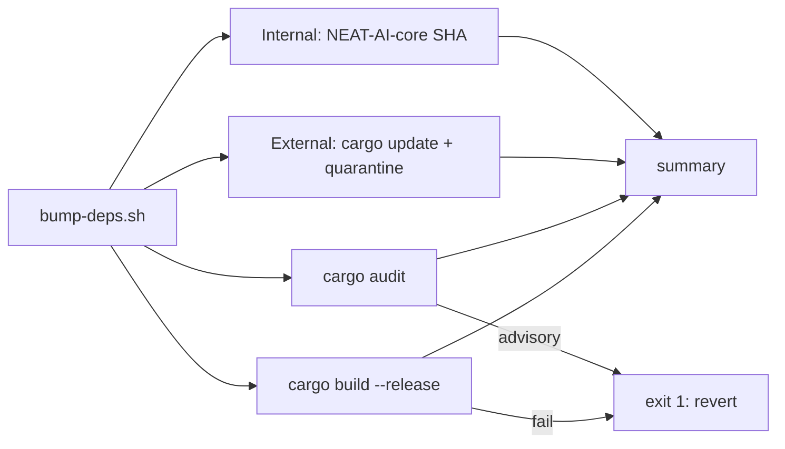

### Other PR automation

Besides the quality gate (`.github/workflows/ci.yml`), PRs also run a guarded
auto-version increment job (`.github/workflows/version-increment.yml`,
Issue #20). On each PR the job compares `rust_scorer/Cargo.toml` against the
base branch and, if the version has not already changed on the branch, bumps
the patch component once and pushes that commit back to the PR branch. A
re-run of CI — or a human-authored bump on the same branch — short-circuits
the job, so no duplicate bump commits are produced. The underlying logic
lives in `scripts/version-increment.sh` and is covered by
`tests/scripts/version_increment.bats`. Bot pushes authenticate with a
short-lived repo-scoped installation token (see below) so the follow-on PR
checks run without an "Approve and run" gate (Issue #435).

PRs also run an auto-format / housekeeping job
(`.github/workflows/auto-format.yml`, Issues #19 and #542). The job runs
`cargo fmt --all` and then `cargo update -p neat-core` so `Cargo.lock`
tracks the checked-out NEAT-AI-core path dependency (workers otherwise
rewrite the lock on every `cargo build` and `model_fetch` resets it). If the
working tree changes, the fix is committed with a deterministic message and
pushed back. When there are no changes the commit step is skipped, so
re-running on a clean branch is a no-op. The job deliberately does **not**
bump `neat-core.expected-version` — the Issue #252 breaking-bump gate stays a
human acknowledgement. Change detection and the commit message live in
`scripts/auto-format.sh` and are covered by `tests/scripts/auto_format.bats`;
the workflow itself is validated by `scripts/check-auto-format-workflow.sh`
(invoked from `quality.sh`). The same bot-push token pattern applies here
(Issue #435).

#### Bot-push credential — repo-scoped installation token (Issue #498)

Both bot-push jobs mint their push credential per run with
`actions/create-github-app-token` (SHA-pinned, `# v3`): a GitHub App
installation token narrowed to `permission-contents: write` on **this
repository only**, expiring within the hour and revoked by the action's post
step. That replaces the organisation-level `ACTIONS_PUSH` PAT as the primary
credential — the PAT is long-lived and org-scoped, so anything that reached it
stepped up from single-repo write access to write access on every repository
in the organisation. Pushes stay attributed to a trusted non-`GITHUB_TOKEN`
identity, so the Issue #435 "Approve and run" behaviour is unchanged.

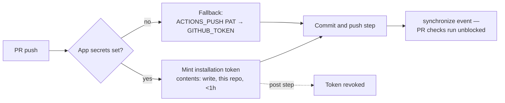

The App requires an organisation admin to create it and store two secrets:

| Secret                          | Value                                        |
| ------------------------------- | -------------------------------------------- |
| `ACTIONS_PUSH_APP_CLIENT_ID`    | The App's client ID                           |
| `ACTIONS_PUSH_APP_PRIVATE_KEY`  | The App's PEM private key                     |

Install the App on this repository only, with the `Contents: Read and write`
repository permission. Until both secrets exist the job-level
`PUSH_APP_CONFIGURED` flag is `false`, the mint step is skipped, and the push
falls back to `secrets.ACTIONS_PUSH || secrets.GITHUB_TOKEN` — so the
workflows keep working unchanged in the meantime. A fine-grained PAT limited
to this single repository, stored as `ACTIONS_PUSH`, is the lower-effort
alternative to the App. The policy is validated by
`scripts/check-bot-push-token.sh` (invoked from `quality.sh`) and covered by
`tests/scripts/bot_push_token.bats`.

#### Hardened PAT-bearing push steps (Issue #497)

Both bot-push jobs execute scripts checked out from the **PR head branch**
before the step that holds the org-level `ACTIONS_PUSH` PAT in its
environment. Within a single job the earlier, attacker-editable step can
poison the later one — append a `PATH` override to `$GITHUB_ENV` so `git`
resolves to a planted binary, or write a `.git/hooks/pre-commit` that runs
with `$GH_PAT` in scope. The fork guard keeps forks out, so the reachable
population is same-repo branch pushers; that is still an escalation from
single-repo write access to the PAT's full organisation scope.

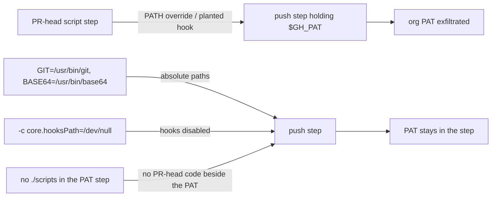

Each push step therefore pins `GIT=/usr/bin/git` and `BASE64=/usr/bin/base64`
(`base64` is piped `$GH_PAT` on stdin when the auth header is built, so it is
the same hijack vector as `git`), passes `-c core.hooksPath=/dev/null` on every
git invocation, and resolves the commit message in an earlier step so no
repository script runs alongside `$GH_PAT`.
This is defence in depth, not a closed window — the durable fix is to scope
the credential itself, which Issue #498 does above: once the App secrets are
in place the credential in `$GH_PAT` is a repo-scoped token that expires
within the hour, so exfiltrating it no longer reaches other organisation
repositories. The hardening is validated by
`scripts/check-push-step-hardening.sh` (invoked from `quality.sh` and from the
CI `bats` suite) and covered by `tests/scripts/push_step_hardening.bats`.

A standalone Cargo Security Audit workflow (`.github/workflows/cargo-audit.yml`,
Issue #64) runs a prebuilt `cargo audit` on every PR (against `*` and
`milestone/**`) and adds a weekly cron schedule (`0 6 * * 1`) plus
`workflow_dispatch`. The schedule catches advisories published *after* the last
PR — the lockfile does not change but the RustSec advisory database does. The
reusable `security.yml` scans the same `Cargo.lock` via the `rustsec/audit-check`
action (which annotates the PR check run). A second, direct `cargo audit` run
in `security.yml` was removed as pure duplication (Issue #399): the action
already fails the check on any advisory, so a follow-up run in the same job
could not catch anything it missed. The workflow is validated by
`scripts/check-cargo-audit-workflow.sh` (invoked from `quality.sh`) and covered
end-to-end by `tests/scripts/cargo_audit_workflow.bats`.

A standalone SBOM workflow (`.github/workflows/sbom.yml`, Issue #172) exports
the dependency inventory as a CycloneDX Software Bill of Materials and uploads
it as a build artefact. `rust_scorer` ships a binary, so its dependency graph
has a real binary surface; `Cargo.lock` already pins that graph, and this
workflow turns it into a standard, scanner-consumable document. When a
supply-chain advisory drops ("crate X version Y is compromised"), the SBOM is
the lookup table that answers "are we affected, and where?" in seconds —
without a Rust toolchain. The job installs `cargo-cyclonedx`, runs
`cargo cyclonedx --format json --all`, and uploads the resulting `*.cdx.json`
files via `actions/upload-artifact`. It runs on pull requests, pushes to
`Develop`, and `workflow_dispatch`. This workflow only emits the inventory
artefact (the supply-chain *posture* gap); active advisories remain owned by
`cargo-audit.yml` / `security.yml`. The workflow is validated by
`scripts/check-sbom-workflow.sh` (invoked from `quality.sh`) and covered
end-to-end by `tests/scripts/sbom_workflow.bats`.

```mermaid
flowchart LR
    lock[Cargo.lock<br/>pinned graph] --> gen[cargo cyclonedx<br/>--format json]
    gen --> cdx[*.cdx.json<br/>CycloneDX SBOM]
    cdx --> art[upload-artifact<br/>name: sbom]
```

CI installs its cargo CLI tools from **prebuilt binaries**, not from source
(Issue #208). `cargo-audit` (`cargo-audit.yml`),
`cargo-cyclonedx` (`sbom.yml`), and `cargo-deny` (`ci.yml`) are fetched via
`taiki-e/install-action` — a released binary downloads in seconds, where
`cargo install <tool> --locked` recompiled the tool from source on every run
with no behaviour change. The action is SHA-pinned like every other `uses:`
(supply-chain policy, Issue #100). The invariant is enforced by
`scripts/check-prebuilt-tool-install.sh` (invoked from `quality.sh`) and
covered end-to-end by `tests/scripts/prebuilt_tool_install.bats`.

A standalone Cargo Quality workflow (`.github/workflows/cargo-quality.yml`,
Issue #66) runs `cargo fmt --check` and `cargo clippy -- -D warnings` on
pull requests against **any** branch (`branches: ["**"]`). `**` is used
rather than `*` because GitHub's `*` glob does not match across `/`, so a
`["*"]` filter would silently skip `milestone/<slug>` sub-issue PRs
(Issue #392); `**` also matches nested branch names. `ci.yml` fires for PRs
targeting `Develop` and `milestone/*` (Issue #393) — milestone branch names are
`milestone/<slug>` with no nested slashes, so the single-level `milestone/*`
glob gates every sub-issue PR rather than only the rollup PR into `Develop`.
This dedicated workflow still gives other feature branches and stacked PRs the
same fmt + clippy gate without spinning up the full CI graph. The Gitleaks
secret-scanning workflow (`.github/workflows/gitleaks.yml`) carries the same
`milestone/*` glob (Issue #394) — its previous `["*"]` filter matched only
top-level branches (GitHub's `*` glob does not span `/`), so milestone
sub-issue PRs merged into the milestone branch unscanned. The milestone
filter on both `ci.yml` and `gitleaks.yml` is validated by
`scripts/check-milestone-branch-filter.sh` (invoked from `quality.sh`) and
covered end-to-end by `tests/scripts/milestone_branch_filter.bats`. The workflow is validated by
`scripts/check-cargo-quality-workflow.sh` (invoked from `quality.sh`) and
covered end-to-end by `tests/scripts/cargo_quality_workflow.bats`.

ShellCheck runs in exactly one place: `ci.yml`'s `shell-checks` job runs the
[`koalaman/shellcheck`](https://github.com/koalaman/shellcheck) binary
**pre-installed on the `ubuntu-latest` runner** directly — no third-party
wrapper action enters the supply chain (PR #184 dropped the wrapper, whose
unauthenticated release-asset download also failed the job on a transient
error) — alongside the `bash -n` syntax check and the bats helper-test suite,
and feeds the `ci-required` aggregator that branch protection gates on. A
standalone `shellcheck.yml` previously ran the identical invocation, doubling
the maintenance surface (Issue #157); it was removed so the ShellCheck
configuration lives in a single home. The dedup
invariant is enforced by `scripts/check-shellcheck-dedup.sh` (invoked from
`quality.sh`) and covered end-to-end by
`tests/scripts/shellcheck_dedup.bats`, which fail if a second workflow
re-introduces the duplicate ShellCheck step.

A standalone Dependency Review workflow
(`.github/workflows/dependency-review.yml`, Issue #62) runs
`actions/dependency-review-action@v5` on every pull request against any branch
(`branches: ["*", "milestone/**"]`). The action diffs the PR's manifest against
the base branch and fails the run if any newly introduced dependency carries a
known vulnerability or disallowed licence — catching supply-chain regressions
before merge. This is now the **single** dependency-review gate (Issue #399):
the reusable `security.yml` used to run the same action inside CI too, but that
duplicated the verdict on the dominant `Develop` / `milestone/*` path, so its
caller (`ci.yml`) now passes `include-dependency-review: false`. Because the
standalone workflow is the sole gate, its `pull_request` filter includes
`milestone/**` so milestone sub-issue PRs are not silently skipped (a bare `*`
glob does not span `/`). The workflow is validated by
`scripts/check-dependency-review-workflow.sh` (invoked from `quality.sh`) and
covered end-to-end by `tests/scripts/dependency_review_workflow.bats`.

A standalone Actionlint workflow (`.github/workflows/actionlint.yml`,
Issue #195) runs [actionlint](https://github.com/rhysd/actionlint) — the
standard GitHub Actions linter — on every pull request (including PRs targeting
`milestone/**` sub-issue branches, Issue #390) and on pushes to the default
branches. actionlint catches workflow regressions that a plain YAML
parse misses: invalid `runs-on` labels, broken `${{ }}` expressions, unknown
`uses:` inputs, and shellcheck findings inside `run:` scripts. The binary is
downloaded from a version-pinned upstream release by the official
`download-actionlint.bash` installer and run directly — no third-party wrapper
action enters the supply chain, mirroring how `ci.yml` invokes ShellCheck
(PR #184). The workflow is validated by
`scripts/check-actionlint-workflow.sh` (invoked from `quality.sh`) and covered
end-to-end by `tests/scripts/actionlint_workflow.bats`.

A standalone Gitleaks Secrets Detection workflow
(`.github/workflows/gitleaks.yml`, Issue #21) runs the pinned
`gitleaks` binary on every pull request against any branch. The scan is
scoped to the PR commit range (`origin/<base>..HEAD`) so reviewers see
only findings introduced by the proposed change. The Gitleaks binary is
pinned by version **and** SHA256 checksum (bumped together in the same
PR), so a compromised release asset cannot silently replace the
scanner. The workflow is validated by `scripts/check-gitleaks-workflow.sh`
(invoked from `quality.sh`) and covered end-to-end by
`tests/scripts/gitleaks_workflow.bats`.

A standalone Semgrep SAST workflow (`.github/workflows/semgrep.yml`,
Issue #47) runs the official `semgrep/semgrep` container — pinned by
`sha256:` digest (Issue #102) — on every pull request against any branch.
The container path is the functional equivalent of the
`semgrep/semgrep-action` GitHub Action; both consume
`SEMGREP_APP_TOKEN` from repo secrets and execute
`semgrep ci --config p/default`. The workflow is validated by
`scripts/check-semgrep-workflow.sh` (invoked from `quality.sh`) and
covered end-to-end by `tests/scripts/semgrep_workflow.bats`.

A standalone Markdown Lint workflow
(`.github/workflows/markdown-lint.yml`, Issue #63) runs
`markdownlint-cli2` against the existing `.markdownlint-cli2.yaml`
config on every pull request. As a lint/checker it gates the PR only
and deliberately carries no `push:` trigger (Issue #371) — a post-merge
push run to the default branch (`Develop`) would just duplicate the run
that already gated the PR. The workflow keeps README/docs style
regressions out of merged commits without depending on the full CI graph. It is validated by
`scripts/check-markdown-lint-workflow.sh` (invoked from `quality.sh`)
and covered end-to-end by `tests/scripts/markdown_lint_workflow.bats`.

### Review governance (CODEOWNERS) — Issue #176

`.github/CODEOWNERS` designates the `@stSoftwareAU/developers` maintainers
team as the owner of the repository, with explicit rules over `.github/` and
`.github/workflows/`. The workflow directory is **privileged**: `semgrep.yml`
runs with a non-`GITHUB_TOKEN` secret (`SEMGREP_APP_TOKEN`), so an unreviewed
edit there could exfiltrate that secret or weaken a security gate. When a
branch-protection rule on `Develop` requires owner review, GitHub auto-requests
a maintainer's review on any change a CODEOWNERS rule matches — closing the
self-approval path for workflow edits.

The CODEOWNERS file is validated by `scripts/check-codeowners.sh` (invoked from
`quality.sh`) and covered end-to-end by `tests/scripts/codeowners.bats`. The
validator asserts the file exists at a GitHub-recognised path, that every rule
names a valid owner (`@user`, `@org/team`, or an email), and that at least one
rule covers `.github/workflows/`. `ci.yml`'s `validation` job also lists
`.github/CODEOWNERS` among its required files, so the file cannot silently
disappear.

```mermaid
flowchart LR
    pr[PR edits<br/>.github/workflows/] --> co{CODEOWNERS<br/>rule matches?}
    co -- yes --> rev[Owner review<br/>auto-requested]
    rev --> bp[Branch protection<br/>blocks merge until approved]
```

**Branch-protection recommendations (repo-level, not committed).** CODEOWNERS
only takes effect when the default branch (`Develop`) requires owner review.
These settings live in repository configuration — a branch-protection rule or
ruleset — and are not visible from committed files, so a maintainer with admin
rights must enable them: at least one required PR approval before merge, blocked
direct push and force-push, required linear history, and required signed
commits.

### GitHub Actions pinning policy (SHA pinning + Node 24 compat)

Every `uses:` reference across the workflow files is pinned to a
40-character commit SHA, with the human-readable version recorded in a
trailing comment, e.g.

```yaml
uses: actions/checkout@93cb6efe18208431cddfb8368fd83d5badbf9bfd  # v5
uses: dtolnay/rust-toolchain@29eef336d9b2848a0b548edc03f92a220660cdb8  # stable, frozen 2026-05-18
uses: peter-evans/create-pull-request@5f6978faf089d4d20b00c7766989d076bb2fc7f1  # v8
```

The SHA is the supply-chain pin (Issue #100) — it stops a compromised
maintainer or re-tagged ref from silently re-executing under workflows
with `contents: write` and `GITHUB_TOKEN` access. The trailing comment
keeps bumps reviewable: the SHA changes, the version label tells the
reviewer what the bump is. **Bump protocol:** resolve the new SHA from
the upstream tag (`gh api repos/<owner>/<repo>/git/ref/tags/vN`), update
the SHA and the comment in the same PR, and note the changelog highlights
in the PR description.

The same script also enforces the Node 24 deprecation policy from the
trailing comment: minimum majors, the single remaining tracked Node 20
exception (`rustsec/audit-check@v2` — no Node 24 tag upstream yet, so the pin
is the `master` HEAD commit that already declares `using: node24`), and a
composite/shell allow-list. `actions/dependency-review-action` is no longer an
exception (Issue #136): the validator requires major **5**, and both
`dependency-review.yml` and `security.yml` pin `v5.0.0`, which ships on
Node 24. The
policy lives in `scripts/check-workflow-action-versions.sh` and is
covered end-to-end by `tests/scripts/workflow_action_versions.bats`.
`quality.sh` invokes the script so any unpinned or outdated `uses:`
reference fails the local gate before CI (Issues #24 and #100).

Six per-workflow validators (`check-actionlint-workflow.sh`,
`check-cargo-audit-workflow.sh`, `check-cargo-quality-workflow.sh`,
`check-dependency-review-workflow.sh`, `check-markdown-lint-workflow.sh` and
`check-sbom-workflow.sh`) additionally assert that their own workflow has a
pinned `actions/checkout` step. That rule used to be an inline `grep` block in
each script and had drifted into three generations of the same regex, so a
future bump to a SHA starting with a hex letter would have failed two gates
spuriously. Issue #511 extracted it into a single helper,
`require_pinned_checkout`, in `scripts/lib/workflow-checks.sh` — the one place
the acceptance rule (`vN` or a 40-character SHA, branch refs disallowed) now
lives. The helper is covered by `tests/scripts/workflow_checks_lib.bats`.

The least-privilege `permissions:` rule — the workflow declares a bare top-level
`permissions:` key and grants `contents: read` — was the same story one step
earlier: seven validators (the six above plus
`check-semgrep-workflow.sh`) carried a byte-identical six-line `grep` pair, so
any change to the acceptance rule needed seven identical edits. Issue #514
extracted it into `require_readonly_permissions` in the same library, alongside
the checkout rule.

```mermaid
flowchart LR
    L["scripts/lib/workflow-checks.sh<br/>require_pinned_checkout<br/>require_readonly_permissions"]
    A[check-actionlint-workflow.sh] --> L
    B[check-cargo-audit-workflow.sh] --> L
    C[check-cargo-quality-workflow.sh] --> L
    D[check-dependency-review-workflow.sh] --> L
    E[check-markdown-lint-workflow.sh] --> L
    F[check-sbom-workflow.sh] --> L
    G["check-semgrep-workflow.sh<br/>(permissions rule only)"] --> L
```

## How to bench

`rust_scorer` ships a Criterion suite (Issue #36) covering the forward-only
fused path, the multi-creature directory mode, and the inner unpack + MSE
loop. The bench is **not** part of `quality.sh` — Criterion runs are slow and
not deterministic enough for a merge gate. Reproduce the baseline with:

```bash
./scripts/run-benches.sh
```

Or, for the issue's 50–200 MB target corpus:

```bash
BENCH_SCORING_BYTES=200000000 ./scripts/run-benches.sh
```

Tunables (all optional): `BENCH_SCORING_BYTES`, `BENCH_SCORING_INPUTS`,
`BENCH_SCORING_OUTPUTS`, `BENCH_SCORING_HIDDEN`. Recorded baselines and
host-specific numbers live in [`docs/performance-baseline.md`](docs/performance-baseline.md).
Per the
[Performance Task Workflow](CONTRIBUTING.md#performance-task-workflow) in
`CONTRIBUTING.md`, performance PRs without before/after Criterion evidence are
rejected, and a change that misses its acceptance bar is recorded as a
`negative-result` on the issue instead of raised as a PR.

### Tree-heavy candidate batching bench (Issue #574)

`NEAT-AI-Forests` evaluates **many candidate grafts against the same corpus** —
one sweep of the training data, N `IF`-heavy decision trees scored inside it,
ranked by loss. `if_tree_batch_bench` measures that shape and reports the two
rates Forests plans against, plus their product:

```bash
cargo build --release -p rust_scorer --bin if_tree_batch_bench
./target/release/if_tree_batch_bench --candidates 64 --records 200000 --depth 3
```

The fixture (candidate creatures + `.bin` corpus) is generated into a temporary
directory from [`if_tree_fixture`](rust_scorer/src/if_tree_fixture.rs), so the
bench needs no committed creature or corpus and is reproducible on any host.
Every `--graft-every`th candidate is a large creature carrying an appended `IF`
correction graft, so a run mixes the private and scratch GPU kernels the way a
real Forests batch does.

| Flag | Default | Purpose |
|---|---|---|
| `--candidates` | `64` | candidate trees scored against the shared corpus |
| `--records` | `100000` | records in the generated corpus |
| `--depth` | `3` | depth of each candidate tree (`1` = stump) |
| `--inputs` | `8` | input columns per record |
| `--runs` | `3` | timed repetitions (median reported) |
| `--graft-every` | `8` | every Nth candidate is a large grafted creature (`0` disables) |
| `--graft-hidden` | `288` | hidden width of the grafted candidates |
| `--gpu` | `auto` | `auto` uses a GPU when present, `on` requires one, `off` forces CPU |
| `--keep-fixture` | off | keep the generated fixture directory for inspection |

Output is one JSON object carrying `candidatesPerSec`, `recordsPerSec`,
`candidateRecordEvaluationsPerSec`, the median and per-run times, the resolved
`gpuBackend`, and the winning candidate. The bench is **fail-loud**: an
unwritable fixture, a failed scoring run, or `--gpu on` on a host with no
adapter exits non-zero rather than reporting an empty result as success
(`rust_scorer/tests/if_tree_batch_bench_smoke.rs`). Recorded numbers live in
[`docs/performance-baseline.md`](docs/performance-baseline.md).

### Knob sweep harness (Issue #545)

CLI-level wall-clock sweeps live outside Criterion.
[`scripts/bench-knob-sweep.sh`](scripts/bench-knob-sweep.sh) runs the production
scoring path at a caller-supplied list of values for **one** knob and reports
the median per value, in the same table shape as
[`scripts/bench-shallow-gpu.sh`](scripts/bench-shallow-gpu.sh):

```bash
BENCH_SWEEP_CREATURE=/path/to/creatures_dir BENCH_SWEEP_DATA=/path/to/corpus \
  BENCH_SWEEP_KNOB=NEAT_SCORER_READ_BYTES \
  BENCH_SWEEP_VALUES=default,2097152,8388608,33554432 \
  ./scripts/bench-knob-sweep.sh
```

The run opens with the host's `--host-report` JSON, so a pasted sweep carries
the machine it was measured on. The first value in the list is the baseline
every later value is compared against; the literal `default` runs with the knob
**unset**, which is also the single-knob-neutral baseline used for the fleet
captures in
[`docs/performance-baseline.md`](docs/performance-baseline.md#544-fleet-knob-baseline--10-august-2026-issue-545).

| Variable | Default | Purpose |
|---|---|---|
| `BENCH_SWEEP_CREATURE` | — | local creature JSON or creatures directory (**required**) |
| `BENCH_SWEEP_DATA` | — | local training-data directory of `.bin` files (**required**) |
| `BENCH_SWEEP_KNOB` | `NEAT_SCORER_READ_BYTES` | `NEAT_SCORER_*` variable to sweep |
| `BENCH_SWEEP_VALUES` | `default` | comma-separated values; `default` means "knob unset" |
| `BENCH_SWEEP_REPS` | `5` | timed repetitions per value (median reported) |
| `BENCH_SWEEP_GPU` | `auto` | `--gpu` mode for every run (production omits the flag) |
| `BENCH_SWEEP_SCORER` | `target/release/rust_scorer` | scorer binary (built when absent) |

This repo ships no production creature or corpus and fetches neither
(Issue #448), so with either input unset the harness **skips cleanly** (exit 0)
exactly as the other production benches do. Once inputs are supplied it is
**fail-loud**: an unreadable input, a rejected knob name or value, a failed
host report, or a non-zero scoring run all exit non-zero rather than reporting
an empty sweep as success (`tests/scripts/bench_knob_sweep.bats`).

## How to flamegraph (Issue #37)

Capture an SVG flamegraph for the single-creature fused path and the
multi-creature directory mode with the cross-platform helper:

```bash
./scripts/profile-flamegraph.sh
```

The defaults (2 GiB single-creature corpus, 500 MB × 50 creatures
multi-creature corpus) take a couple of minutes end-to-end on Apple
silicon and write:

* `docs/evidence/single-creature.svg`
* `docs/evidence/multi-creature.svg`

The script builds `rust_scorer` with a dedicated `profiling` Cargo profile
(release optimisations + `debug = true`) so function names survive into the
flamegraph, generates deterministic synthetic data via Python's `array`
module, runs each scenario and feeds raw samples through `inferno`.

One-time install of the toolchain:

```bash
cargo install inferno           # required for inferno-collapse-sample + inferno-flamegraph
cargo install flamegraph        # Linux only: provides `cargo flamegraph` on top of `perf`
# macOS: Xcode command-line tools ship /usr/bin/sample — no sudo needed.
```

Runtime tunables (override any default positional arg or env var):

```bash
# size-down for a quick smoke test
./scripts/profile-flamegraph.sh 209715200 52428800 10

# slim inputs / fewer hidden neurons
PROFILE_NUM_INPUTS=4 PROFILE_HIDDEN=4 ./scripts/profile-flamegraph.sh
```

The `profiling` Cargo profile inherits from `release` but turns debug info
and symbols back on. It is invoked only by this helper — the CI `release`
build path is unchanged.

Interpretation and the current top-5 cost centres per scenario are
documented in the **"Hot spots"** section of
[`docs/performance-baseline.md`](docs/performance-baseline.md). Re-run the
script after each optimisation sub-issue lands and overwrite the SVGs so
the hot-spot ordering stays honest.

## Optimised release build (PGO) — Issue #43

The default release profile already enables fat LTO and workspace-wide
`codegen-units = 1` (Issue #568). **Profile-Guided Optimisation (PGO)** is the
next compiler-level lever — a recorded profile of a real scoring run feeds
back into `rustc` so hot loops get better inlining, branch prediction hints,
and code layout. PGO often yields 5–15 % on numeric inner loops similar to
`mse_sum_batch_packed`, and since `rust_scorer` is invoked many times per
NEAT training run, even a few percent per call compounds.

### One-shot build

```bash
./scripts/build-pgo.sh
```

The helper drives the standard manual `rustc` flow — no `cargo-pgo` install
required:

1. Generates a deterministic synthetic training fixture (Python).
2. Builds an instrumented binary with `RUSTFLAGS="-Cprofile-generate=…"`
   under the dedicated `pgo` Cargo profile (inherits `release`, so fat LTO
   and `codegen-units = 1` apply). Note that this `RUSTFLAGS` replaces the
   `.cargo/config.toml` `target-cpu=native` flag for that invocation.
3. Runs the instrumented binary against the fixture in **single-creature**
   mode and **directory** mode to gather `*.profraw` files.
4. Merges them via `llvm-profdata merge`.
5. Re-builds with `RUSTFLAGS="-Cprofile-use=…/merged.profdata"`.

The final binary lands at `target/pgo/rust_scorer`. NEAT-AI can pick it up
by overriding the scorer path in its launch config — the CLI contract
(`<creature.json> <data_dir>`) is unchanged.

### Prerequisites

```bash
rustup component add llvm-tools   # provides llvm-profdata
# python3 is also required (used to materialise the training fixture)
```

`build-pgo.sh` auto-discovers `llvm-profdata` via `command -v` first and
then falls back to `rustc --print sysroot`/`lib/rustlib`. Override with
`LLVM_PROFDATA=/path/to/llvm-profdata` if needed.

### Tunables

| Variable | Default | Purpose |
|---|---|---|
| `PGO_BYTES` | `104857600` (100 MB) | training corpus size for instrumentation |
| `PGO_NUM_INPUTS` | `8` | inputs per record |
| `PGO_NUM_OUTPUTS` | `2` | outputs per record |
| `PGO_HIDDEN` | `8` | hidden neurons per synthetic creature |
| `PGO_CREATURES` | `10` | creatures used for the directory-mode pass |
| `PGO_PROFDATA_DIR` | `target/pgo-profiles` | where `*.profraw` and `merged.profdata` land |
| `PGO_FIXTURE_DIR` | `target/pgo-fixture` | where the synthetic training fixture is materialised |

### Benchmark evidence (Issue #43)

Numbers below come from timing the same `rust_scorer` binary (release vs
PGO) against an identical 300 MB fixture, 15 timed runs each (median /
best, lower is better — Apple silicon, see
`docs/evidence/pgo-bench-300mb.log`):

| Scenario | release median | PGO median | Δ median |
|---|---:|---:|---:|
| `score_from_json_fused` (single-creature, 300 MB) | 447.6 ms | 407.7 ms | **−8.9 %** |
| `score_from_creature_dir` (10 creatures, 300 MB) | 2079.2 ms | 1911.2 ms | **−8.1 %** |

Both scoring paths beat the 3 % acceptance threshold from the issue. The
gain is most reliable on the directory-mode path (more time spent inside
the activation/MSE inner loops), and noisier on the small single-creature
path where CLI start-up makes up a larger share of wall-clock time.

Reproduce on your host by running `./scripts/build-pgo.sh` and then timing
`target/release/rust_scorer` against `target/pgo/rust_scorer` over the
fixture the helper wrote to `target/pgo-fixture/`.

### CI

Producing the PGO binary as a release artefact in CI requires committing a
new workflow YAML, which the worker is not authorised to push (no
`workflow` OAuth scope — see
[Human escalation](CONTRIBUTING.md#human-escalation) in `CONTRIBUTING.md`).
Run the
helper locally for now, or have a maintainer wire `build-pgo.sh` into a
manually triggered workflow under `.github/workflows/`.

## License

Apache-2.0 — see `LICENSE`.
