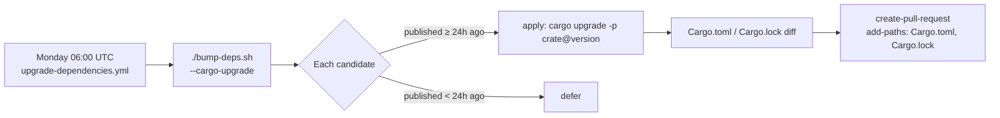

## Summary

The weekly `Upgrade Cargo Dependencies` workflow ran `cargo upgrade`
directly and applied no minimum-release-age quarantine. The repository's
own `bump-deps.sh` enforces a `VIBE_BUMP_QUARANTINE_HOURS` (default 24h)
gate for worker-initiated bumps, but the scheduled GitHub workflow
bypassed that gate entirely. A malicious crates.io publication could
land in the auto-generated PR within minutes of being published.

This PR routes the scheduled bump through `bump-deps.sh` so the same
quarantine gate protects scheduled bumps as worker-initiated bumps.
A new `--cargo-upgrade` flag in `bump-deps.sh` switches the external
driver from `cargo update` (lockfile only) to `cargo upgrade`
(cargo-edit, manifest-level), per-crate-gated by the quarantine window.
A new validator rule (Rule 4 in `check-upgrade-deps-workflow.sh`) makes
it a hard failure if the workflow ever invokes `cargo upgrade` again
without going through `bump-deps.sh`.

Fixes #101.

## Evidence

CLI / backend change — no UI to screenshot. Verified via the bats
suites (192/192 passing) and `./quality.sh` (all checks green).

## Test Plan

- `tests/scripts/bump_deps.bats`:
  - `accepts --cargo-upgrade flag (Issue #101)` — the new flag is
    recognised and produces a clean no-op when combined with the
    existing skip flags.
  - `--help advertises --cargo-upgrade (Issue #101)` — usage output
    documents the new flag.
- `tests/scripts/upgrade_deps_workflow.bats`:
  - `fails when the workflow invokes cargo upgrade directly without
    bump-deps.sh (Issue #101)` — validator rejects the pre-fix
    workflow that called `cargo upgrade` in a `run:` block.
  - `passes when the workflow routes the upgrade through bump-deps.sh
    (Issue #101)` — validator accepts the post-fix workflow.
  - `real shipped upgrade-dependencies workflow satisfies every rule` —
    the actual `.github/workflows/upgrade-dependencies.yml` after this
    change passes every rule including the new Rule 4.
- `./quality.sh` — green (shellcheck, codespell, cargo-deny, fmt,
  clippy, check, build, test, rustdoc, release build, all 192 bats
  tests).
