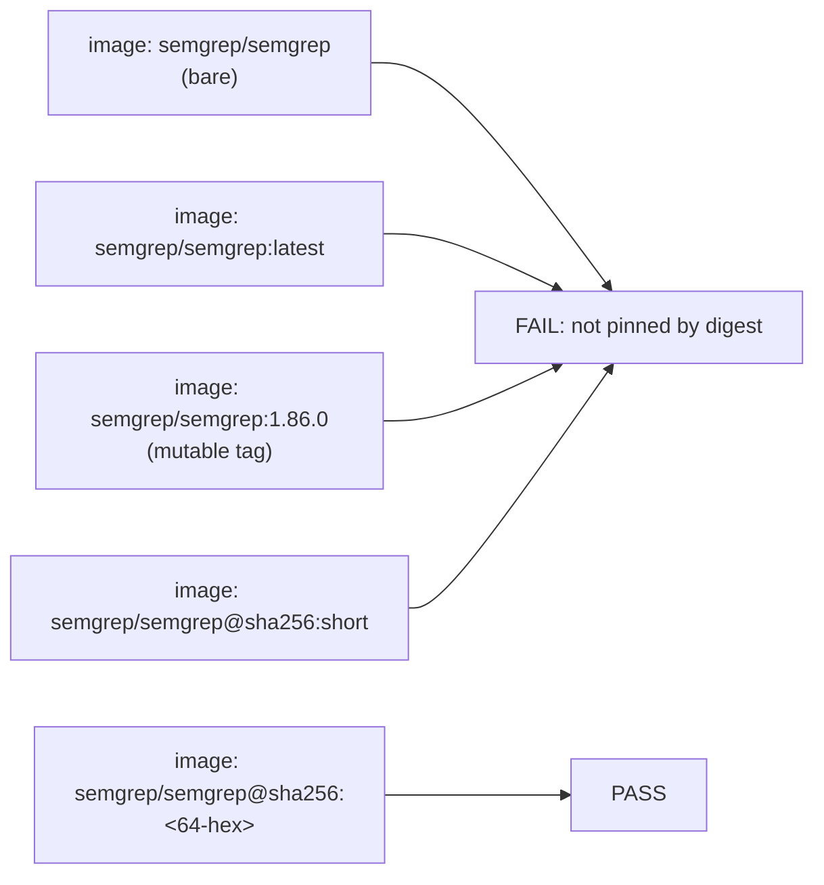

# PR Summary — Issue #102

## Summary

Pinned the Semgrep SAST scanner container by immutable `sha256` digest
instead of the mutable `1.86.0` Docker tag, eliminating the silent
tag-repush attack vector flagged in the issue. The validator
(`scripts/check-semgrep-workflow.sh`) is updated to enforce the new
digest-only rule so any future regression to a tag pin fails CI, and
the workflow header now documents the digest-bump protocol alongside
the existing version-label conventions. Closes #102.

## Evidence

This is a CLI/workflow change with no UI surface, so the evidence is
the test results and the resulting workflow YAML.

* `bats tests/scripts/semgrep_workflow.bats` — 16/16 tests pass,
  including two new cases (`fails when the container image is pinned
  to a mutable tag (issue #102)` and `fails when the container image
  digest is malformed`) plus the existing `real repository semgrep
  workflow satisfies every rule` end-to-end gate.
* `./quality.sh` — full local gate passes (shellcheck, all workflow
  validators, every bats suite, cargo-deny, fmt, clippy, check, build,
  test, doc, release).

The new policy enforced by the validator:



Pinned digest (multi-arch manifest, frozen 2026-05-18, looked up via
Docker Hub for the v1.86.0 tag):

```yaml
image: semgrep/semgrep@sha256:a9ea2d5621c29d815d90c2a3b2f9571da8972ef4ff855c9e4902681730240e35
```

## Test Plan

* Updated `tests/scripts/semgrep_workflow.bats`:
  * `write_container_workflow` fixture now emits a digest-pinned image
    so positive cases reflect the new policy.
  * `passes on the container fixture` now asserts on the
    "pinned by digest" OK message.
  * `fails when the container image is unpinned (no tag)` →
    renamed to "no digest" with the same intent.
  * Added `fails when the container image is pinned to a mutable tag
    (issue #102)` — drives the rule introduced by this PR.
  * Added `fails when the container image digest is malformed` —
    guards against an invalid hex digest sneaking past the regex.
  * `:latest` and "no semgrep entry point" cases continue to fail
    as before (untouched intent).
* `real repository semgrep workflow satisfies every rule` exercises
  the actual shipped `.github/workflows/semgrep.yml` against the
  updated validator.
