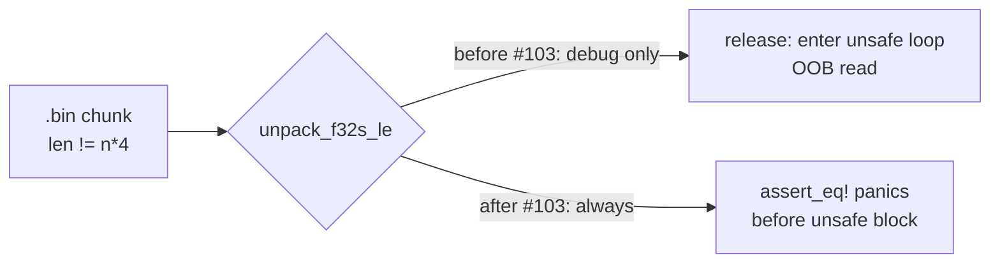

## Summary

Hardens the two `unpack_f32s_le` helpers in `rust_scorer` so the length
precondition guarding their `unsafe` raw-pointer loops is enforced in
**both debug and release** builds. The previous `debug_assert_eq!` was
compiled out in release, so a malformed `.bin` chunk whose byte length
was not exactly `n * 4` would have driven an out-of-bounds read inside
the unsafe block. Replaced with a runtime `assert_eq!` that panics with
a clear diagnostic before any unsafe pointer arithmetic runs. Closes #103.

## Evidence

This is a backend/CLI safety fix with no web interface — evidence is the
test suite. Three new unit tests per file (six total) lock in the
behaviour:

- `unpack_f32s_le_decodes_exact_length_buffer` — happy path: correct
  length decodes the expected `f32`s.
- `unpack_f32s_le_rejects_short_buffer_in_release` — `src.len() < n * 4`
  triggers a deterministic panic instead of an OOB read.
- `unpack_f32s_le_rejects_oversize_buffer` — `src.len() > n * 4` is
  also rejected (the invariant is equality, not just lower-bound).

Both `#[should_panic]` tests assert on the panic message prefix, so they
verify the new runtime check is what triggers (not some downstream
allocator fault).

Full `./quality.sh` run passes:

- shellcheck, cargo-deny, `fmt --check`, clippy, check, build, test,
  rustdoc with `-D warnings`, release build — all green.
- New tests visible under `multi_score::tests::unpack_f32s_le_*` and
  `stream_score::tests::unpack_f32s_le_*`.

## Test Plan

- Added `unpack_f32s_le_decodes_exact_length_buffer` in
  `rust_scorer/src/stream_score.rs` and `rust_scorer/src/multi_score.rs`.
- Added `unpack_f32s_le_rejects_short_buffer_in_release` (both files,
  `#[should_panic]`) — regression test for #103.
- Added `unpack_f32s_le_rejects_oversize_buffer` (both files,
  `#[should_panic]`) — edge case.
- Verified `./quality.sh < /dev/null` passes end-to-end (60 lib tests,
  5 directory-mode TDD tests, 3 GPU parity tests, 10 scorer smoke tests).
