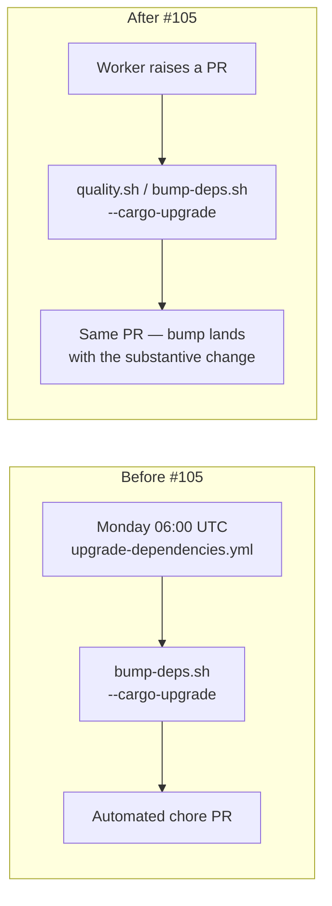

## Summary

Removed the weekly scheduled dependency-upgrade workflow so dependency
bumps happen only when a PR is being raised. The owner asked for this
in issue #105 — Monday 06:00 UTC PRs were noisy and the per-PR
`bump-deps.sh` path (invoked from `quality.sh` during normal PR prep)
already covers the use-case with the same `VIBE_BUMP_QUARANTINE_HOURS`
gate. Closes #105.

Deleted:

- `.github/workflows/upgrade-dependencies.yml` (the cron `"0 6 * * 1"`
  schedule and its `peter-evans/create-pull-request` flow).
- `scripts/check-upgrade-deps-workflow.sh` — only validated the
  removed workflow.
- `scripts/check-upgrade-has-changes.sh` — only used by the removed
  workflow to detect lock-only drift.
- `tests/scripts/upgrade_deps_workflow.bats` and
  `tests/scripts/upgrade_dependencies_workflow.bats` — both pinned to
  the removed scripts.

Updated `quality.sh`, `AGENTS.md`, `README.md`, `.gitignore`, and the
header comments in `bump-deps.sh` to drop the references to the
weekly workflow. `bump-deps.sh --cargo-upgrade` itself is retained —
it is still the entry point a worker uses when bumping deps as part
of a PR.

## Evidence

Backend-only change with no UI. Verified by:

- New regression suite `tests/scripts/no_scheduled_dep_bump.bats`
  (5 tests) asserts the workflow YAML and its helper scripts are
  absent, that no remaining workflow schedules a `cargo upgrade` or
  `bump-deps.sh` invocation, and that `quality.sh` no longer calls
  the removed validator.
- `./quality.sh < /dev/null` passes end-to-end (shellcheck, codespell,
  every remaining workflow validator, bats suites including the new
  regression file, `cargo deny`, fmt, clippy, check, build, tests,
  rustdoc, release build).

## Test Plan

- [x] Added `tests/scripts/no_scheduled_dep_bump.bats` — five regression
      tests guarding against reintroduction of the scheduled bump.
- [x] Removed the two bats suites that tested the deleted helper
      scripts (`upgrade_deps_workflow.bats`,
      `upgrade_dependencies_workflow.bats`) — they covered code that
      no longer exists. Documented here so the deletion is auditable.
- [x] `./quality.sh < /dev/null` passes cleanly.
