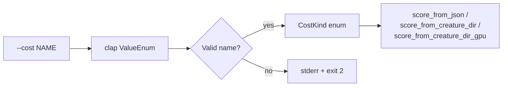

## Summary

Added a `--cost <NAME>` CLI flag to `rust_scorer` that accepts the seven
NEAT-AI built-in cost names exactly as they appear in the TypeScript
`BUILT_IN_COST_NAMES` tuple (`MSE`, `MAE`, `MAPE`, `MSLE`, `HINGE`,
`CROSS_ENTROPY`, `CATEGORICAL_ERROR`) and hard-errors on anything else via
`clap::ValueEnum`. The default is `MSE`, which preserves the current
scoring behaviour byte-for-byte. The resolved `CostKind` is plumbed through
every scoring entry point (`score_from_json`, `score_from_creature_dir`,
`score_from_creature_dir_gpu`) as a parameter so the CLI contract is
stable; **the calculation itself is unchanged** — the MSE path keeps calling
`mse_sum_batch_packed`. Dispatch wiring lands in the follow-up issue
(`#119-3`). There is no `NEAT_SCORER_COST` environment-variable override
(KISS, as the issue brief requires).

Closes #120.

## Evidence

Pure CLI/library change with no UI to screenshot. Verified by:

- 7 new unit tests in `rust_scorer/src/cost.rs` exercising the `CostKind`
  enum and `from_cli` validation helper (accept every TS name, reject
  unknown/case-mismatch/empty, default to MSE, clap round-trip).
- 3 new unit tests in `rust_scorer/src/main.rs` proving the `--cost` flag
  is parsed by `clap` (every value accepted, default is `MSE`, unknown
  rejected with a stderr message listing the supported set).
- 5 new end-to-end smoke tests in `rust_scorer/tests/scorer_smoke.rs`
  driving the compiled binary against the identity fixture:
  - `--cost MSE` matches the default scoring output exactly.
  - `--cost MAE` parses and runs (still computing MSE) — proves the flag
    is wired without changing the calculation.
  - Every built-in cost name is accepted by the binary.
  - `--cost FOO` exits non-zero with a stderr message naming the
    supported set.
  - `--help` lists `--cost` and every supported value.
  - `NEAT_SCORER_COST` env var is ignored (KISS contract).
- Full `./quality.sh` passes (shellcheck, cargo-deny, fmt, clippy, check,
  build, all tests, doc with `-D warnings`, release build).

## Test Plan

- [x] `cargo test -p rust_scorer` — 70+ tests pass, including the new
  unit tests in `cost.rs` and `main.rs` and the new smoke tests in
  `tests/scorer_smoke.rs`.
- [x] `./quality.sh` passes locally on macOS (shellcheck, cargo-deny,
  fmt, clippy, check, build, test, doc, release).
- [x] `rust_scorer --help` lists `--cost <NAME>` and the seven supported
  values.
- [x] `rust_scorer --cost FOO …` exits non-zero with a stderr message
  listing the supported set.

Tests added or modified:

- `rust_scorer/src/cost.rs` — new module; 7 unit tests for `CostKind` /
  `from_cli` validation.
- `rust_scorer/src/main.rs` — 3 new unit tests for the `--cost` clap
  surface; existing tests updated to populate the new `cost` field on
  the `Cli` struct.
- `rust_scorer/tests/scorer_smoke.rs` — 5 new end-to-end smoke tests
  covering every acceptance criterion in the issue.
- `rust_scorer/benches/scoring.rs` — pass `CostKind::default()` to the
  scoring entry points whose signatures gained the new parameter.
