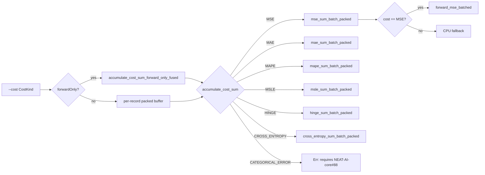

# Wire CostKind dispatch through stream_score and multi_score (Closes #121)

## Summary

Issue #121 wires the `--cost <NAME>` selector added in #120 through to the
per-chunk loss accumulator so the fused single-creature path
(`stream_score.rs`) and the directory/batch path (`multi_score.rs`) actually
compute the requested NEAT-AI built-in cost instead of always running MSE.

- New `accumulate_cost_sum(kind, net, chunk, input_size, num_outputs, forward_only)`
  in `rust_scorer::cost` dispatches a packed `[inputs..., targets...]`
  chunk to the matching `neat_core::loss::*_sum_batch_packed` helper. MSE,
  MAE, MAPE, MSLE, HINGE, and CROSS_ENTROPY all route here.
- `accumulate_mse_sum_forward_only_fused` is renamed to
  `accumulate_cost_sum_forward_only_fused` and now takes a `CostKind`. The
  multi-creature directory path threads `CostKind` through to the same
  dispatch site.
- CATEGORICAL_ERROR is a hard runtime error referencing
  `stSoftwareAU/NEAT-AI-core#88` — the underlying
  `categorical_error_sum_batch_packed` helper has not yet landed in
  `neat-core` (the issue is open). Once it merges, the dispatch is a
  one-line change.
- GPU dispatch is gated: `auto_should_use_gpu` now also takes the
  `CostKind`, returning `false` for any cost other than MSE.
  `--gpu on --cost X != MSE` hard-errors at the CLI layer; `--gpu auto`
  silently falls back to the CPU pipeline.
- `ScoreResult` gains a `costName: String` field (serialised as
  `"costName"`) populated from the resolved `CostKind`, so the TS bridge
  can confirm which loss was actually applied.
- The recurrent (non-`forwardOnly`) single-creature path now also routes
  through `accumulate_cost_sum`, packing one record at a time and
  passing `forward_only = false` so the helper resets network state per
  record (matching the old hand-rolled loop).

Closes #121.

## Evidence

Pure backend/CLI change — no UI to screenshot. Verified via the full
quality gate:

- `./quality.sh` passes cleanly (shellcheck, fmt, clippy with
  `-D warnings`, cargo-deny, build, all tests, rustdoc, release build).
- 75 unit tests pass (rust_scorer lib + bin), 20 smoke tests, 5
  directory-mode TDD tests, 3 GPU parity tests.

### Dispatch flow

## Test Plan

New tests added:

- `rust_scorer/src/cost.rs`:
  - `gpu_supported_only_for_mse` — locks the GPU-cost predicate to MSE.
  - `accumulate_cost_sum_categorical_error_is_blocked` — asserts
    CATEGORICAL_ERROR returns an `Err` mentioning `#88`.
  - `accumulate_cost_sum_mse_matches_direct_helper` — MSE dispatch
    numerically equals `mse_sum_batch_packed` directly (regression
    check on existing fixtures).
  - `accumulate_cost_sum_mae_diverges_from_mse` — proves MAE takes a
    different code path from MSE for `|diff| > 1`.
- `rust_scorer/src/gpu/mod.rs`:
  - `auto_should_use_gpu_directory_falls_back_to_cpu_for_non_mse_costs`
    — every non-MSE variant forces CPU fallback under Auto.
- `rust_scorer/tests/scorer_smoke.rs`:
  - `scorer_binary_accepts_every_dispatchable_built_in_cost_name` —
    end-to-end runs MSE, MAE, MAPE, MSLE, HINGE on the identity
    fixture and asserts each echoes `costName=<NAME>` (CE is exercised
    separately because the fixture has negative targets).
  - `scorer_binary_cost_cross_entropy_runs_on_probabilistic_fixture` —
    builds a `[0, 1]`-target fixture and asserts CE runs cleanly with
    `costName=CROSS_ENTROPY` and a non-negative error.
  - `scorer_binary_categorical_error_is_blocked_with_helpful_message`
    — stderr names CATEGORICAL_ERROR and references issue #88.
  - `scorer_binary_gpu_on_with_non_mse_cost_errors` — `--gpu on --cost
    MAE` exits non-zero with a clear message.
  - `scorer_binary_gpu_auto_with_non_mse_cost_runs_on_cpu` — auto +
    non-MSE silently falls back to CPU and reports
    `gpuBackend=cpu-fallback`.
  - `scorer_binary_cost_mae_runs_through_dispatch` (replaces the older
    `..._parses_and_runs_as_mse`) — the identity fixture has zero
    error under both MSE and MAE, but the JSON now also asserts the
    `costName` field round-trips MAE through dispatch.

Existing tests updated:

- `scorer_binary_accepts_every_built_in_cost_name` renamed to
  `..._accepts_every_dispatchable_built_in_cost_name` and narrowed to
  the regression-friendly costs; CE and CATEGORICAL_ERROR have
  dedicated tests above. Business-logic shift: dispatch is real now,
  so the test must use a fixture appropriate to each cost.
- `scorer_binary_cost_mae_parses_and_runs_as_mse` renamed to
  `scorer_binary_cost_mae_runs_through_dispatch` — the assertion that
  MAE silently equals MSE was tied to the placeholder dispatch.

`./quality.sh < /dev/null` passes cleanly.
