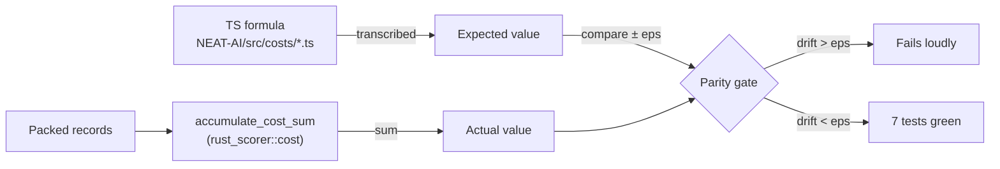

# PR Summary — Issue #122

## Summary

Added `rust_scorer/tests/cost_parity.rs` — a self-contained integration
suite that compares the Rust scorer's per-cost output against the
TypeScript reference in `NEAT-AI/src/costs/*.ts` for every supported
cost, within the per-cost epsilons stipulated by the issue. Closes #122.

For each of the seven `BUILT_IN_COST_NAMES` values (`MSE`, `MAE`,
`MAPE`, `MSLE`, `HINGE`, `CROSS_ENTROPY`, `CATEGORICAL_ERROR`) the test:

1. Builds a tiny deterministic creature (`IDENTITY` topology so
   `output_j = input_j` and the expected value can be computed without
   re-running activation).
2. Hand-constructs a packed `[inputs..., targets...]` record buffer
   containing both the typical path and at least one cost-appropriate
   edge case.
3. Transcribes the TS formula as constants (no live TS execution) and
   computes the expected sum across records.
4. Calls `rust_scorer::cost::accumulate_cost_sum` with the matching
   `CostKind` and asserts `|actual - expected| < epsilon` per cost.

Per-cost epsilons (documented at the top of the test file):

- `MSE`, `MAE`, `HINGE`: `1e-9` absolute.
- `MAPE`: `1e-9` *relative*, scaled by `max(1.0, |expected|)` — needed
  because the documented near-zero-target edge case produces a per-record
  contribution of magnitude `~5e9` where pure `1e-9` absolute tolerance
  is tighter than f64 precision at that scale.
- `MSLE`, `CROSS_ENTROPY`: `1e-6` absolute (ln/log rounding headroom).
- `CATEGORICAL_ERROR`: **exact equality** — argmax is integer-valued.

`CATEGORICAL_ERROR` dispatch is currently blocked on
`stSoftwareAU/NEAT-AI-core#88`, so its parity test:

- Hand-computes the TS argmax error using the same `activate_into` path
  the upstream helper will see, and asserts exact equality with the
  analytically-known misclassification count.
- Asserts the dispatch surface still hard-errors with a clear reference
  to the upstream blocker, so the contract documented in `cost.rs`
  cannot silently drift to "returns MSE".

## Evidence

This is a CPU/test change with no UI surface. Evidence is the
`cargo test --test cost_parity` output (7 tests, all passing, total
runtime <10ms):

```text
running 7 tests
test parity_categorical_error_matches_ts_reference ... ok
test parity_cross_entropy_matches_ts_reference     ... ok
test parity_msle_matches_ts_reference              ... ok
test parity_mae_matches_ts_reference               ... ok
test parity_mse_matches_ts_reference               ... ok
test parity_hinge_matches_ts_reference             ... ok
test parity_mape_matches_ts_reference              ... ok

test result: ok. 7 passed; 0 failed
```

Full `./quality.sh` gate (shellcheck, cargo-deny, fmt, clippy, check,
build, test, doc, release) passes cleanly.

### Failure-mode coverage



The assertions fire on either:

- a routing bug (e.g. `CostKind::Mae` arm computing MSE) — the
  per-cost expected values diverge by far more than the epsilon; or
- a future `ln`/`log` rounding regression beyond the documented bound.

## Test Plan

- [x] `rust_scorer/tests/cost_parity.rs` — seven new tests, one per
  supported cost. Total runtime well under the 30s budget.
- [x] `cargo test --test cost_parity` passes.
- [x] `./quality.sh` passes end-to-end.

### Notes on edge cases by cost

- `MSE`, `MAE`: include a `target == input` record (exact-zero error)
  and 9 records total to force both SIMD and scalar remainder paths.
- `MAPE`: positive targets only (negative targets land on the
  `max(t, 1e-15)` stabiliser where TS and Rust diverge — out of scope
  for #122). Includes `target = 1e-10` as the documented near-zero
  edge case.
- `MSLE`: includes both a zero target (`ln(eps) - ln(1)`) and a zero
  output (`ln(1) - ln(eps)`) to exercise both clamp sides.
- `HINGE`: includes confidently-correct (`t * o > 1`, hinge = 0) and
  on-the-boundary (`t * o == 1`, hinge = 0 exactly) records.
- `CROSS_ENTROPY`: includes `output = 0.0` (lower clamp) and
  `output = 1.0` (upper clamp) as the documented clamped-probability
  edge cases.
- `CATEGORICAL_ERROR`: includes a tied-outputs / tied-targets record
  (both argmaxes resolve to index 0 — matches the `>` comparison in
  the TS source).
