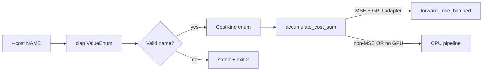

## Summary

Documents the `--cost <NAME>` contract end-to-end now that dispatch is
wired (#121) and the per-cost CPU baseline is recorded (#124). Updates
`README.md`, `AGENTS.md`, and the clap doc strings driving
`rust_scorer --help` so the seven supported names, the MSE-only GPU
constraint, and the `CATEGORICAL_ERROR` blocker on
[`NEAT-AI-core#88`](https://github.com/stSoftwareAU/NEAT-AI-core/issues/88)
are all discoverable from the CLI and the docs. Closes #123.

## Evidence

CLI-only documentation change — no UI to screenshot. Verified by:

- `cargo test --workspace` — all 1 028+ unit + integration tests pass,
  including three new tests in `rust_scorer/src/main.rs`:
  - `test_help_enumerates_every_built_in_cost_name`
  - `test_help_notes_gpu_mse_only_constraint`
  - `test_help_links_to_readme`
- `./quality.sh` — clean (fmt, clippy `-D warnings`, deny, check, build,
  test, doc with `RUSTDOCFLAGS=-D warnings`, release build, shellcheck,
  codespell).
- Manual inspection of `rust_scorer --help` output confirms the seven
  cost values, the MSE-only GPU note, and the README pointer all
  render.

## Test Plan

- Added `test_help_enumerates_every_built_in_cost_name` — asserts every
  `BUILT_IN_COST_NAMES` value appears in `Cli::command().render_long_help()`.
- Added `test_help_notes_gpu_mse_only_constraint` — asserts the rendered
  long-help mentions the GPU MSE-only constraint.
- Added `test_help_links_to_readme` — asserts the rendered long-help
  references the README so users can find per-cost examples.
- Existing integration test `scorer_binary_help_lists_cost_flag_and_values`
  in `rust_scorer/tests/scorer_smoke.rs` continues to pass against the
  updated doc strings.

## Files Changed

- `README.md` — rewrote the "Cost function selector" section to include
  per-cost example rows, a dispatch-helper column, the MSE-only GPU
  constraint, and the `CATEGORICAL_ERROR` blocker; refreshed the stale
  "Cost dispatch" section that still claimed dispatch was pending.
- `AGENTS.md` — added a "Cost selector" line under the CLI contract
  paragraph alongside the GPU plumbing line, listing the seven supported
  names and the GPU constraint.
- `rust_scorer/src/main.rs` — updated the `--cost` clap doc string to
  describe wired dispatch, the GPU constraint, and the README pointer;
  refreshed the top-of-`Cli` about string so it no longer says "MSE"
  exclusively; added the three help-rendering tests.
