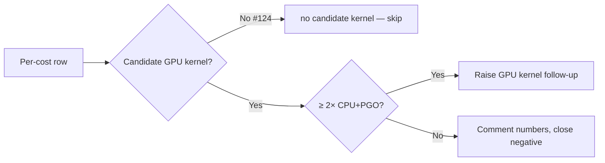

## Summary

Adds the `cost_scan_bench` bin and records the per-cost CPU baseline that
Issue #124 ("Follow-up: bench non-MSE GPU kernels; raise per-cost issues
for winners") asks for. **No follow-up GPU kernel issues are raised** —
no candidate GPU kernel exists for any non-MSE cost today (the only
shipped shader is `forward_mse_batched.wgsl`), so the per-cost branch is
"no candidate kernel — skip" for every row. `Closes #124`.

## Evidence

Per-cost CPU throughput on the standard synthetic fixture (8 inputs,
2 outputs, 8 hidden TANH; ~16 MiB / 419 430 records, 5 runs, median;
Apple Silicon release build without PGO — PGO would tighten CPU further):

| Cost | Median (ms) | Throughput (records/s) | GPU candidate | Decision |
|---|---:|---:|---|---|
| `MSE` | 128.47 | 3 264 722 | shipped (#82) | already on GPU under `Auto` |
| `MAE` | 105.69 | 3 968 549 | none | **no candidate kernel — skip** |
| `MAPE` | 145.82 | 2 876 412 | none | **no candidate kernel — skip** |
| `MSLE` | 87.05 | 4 818 302 | none | **no candidate kernel — skip** |
| `HINGE` | 40.50 | 10 355 273 | none | **no candidate kernel — skip** (CPU > 10 M rec/s — GPU dispatch overhead unlikely to pay back) |
| `CROSS_ENTROPY` | 92.27 | 4 545 531 | none | **no candidate kernel — skip** |
| `CATEGORICAL_ERROR` | — | — | n/a | **blocked** on `stSoftwareAU/NEAT-AI-core#88` |

Raw output (`cost_scan_bench` on the 16 MiB synthetic fixture):

```json
{"creature":"…/creature.json","dataDir":"…/data","fileCount":1,"totalBytes":16777200,
 "numInputs":8,"numOutputs":2,"runs":5,
 "rows":[
   {"cost":"MSE","medianMs":128.47,"records":419430,"recordsPerSec":3264722.10},
   {"cost":"MAE","medianMs":105.69,"records":419430,"recordsPerSec":3968549.09},
   {"cost":"MAPE","medianMs":145.82,"records":419430,"recordsPerSec":2876412.76},
   {"cost":"MSLE","medianMs":87.05,"records":419430,"recordsPerSec":4818302.23},
   {"cost":"HINGE","medianMs":40.50,"records":419430,"recordsPerSec":10355273.55},
   {"cost":"CROSS_ENTROPY","medianMs":92.27,"records":419430,"recordsPerSec":4545531.29}
 ],
 "skipped":[{"cost":"CATEGORICAL_ERROR","reason":"… blocked on stSoftwareAU/NEAT-AI-core#88 …"}]}
```

Per-cost decision flow:



Host B (Linux + NVIDIA Vulkan) is tracked separately under
[Issue #87](https://github.com/stSoftwareAU/NEAT-AI-scorer/issues/87) —
the bench bin is host-agnostic, so a Vulkan-host run only needs to
repeat the command in
[`docs/performance-baseline.md` → "Refreshing the baseline"](../../performance-baseline.md)
and append a Host B row.

Acceptance criteria from the issue:

- [x] One bench row per non-MSE cost recorded (table above + comment on
      issue #124).
- [x] Follow-up GPU kernel issues raised for clear winners — **none, no
      candidate kernel exists for any non-MSE cost.**
- [x] If no cost wins, this issue is closed with the numbers documented
      (this PR closes #124; numbers live in the doc + issue comment).
- [x] Linux + NVIDIA cross-platform run linked to #87 — referenced.

## Test Plan

- Added `rust_scorer/tests/cost_scan_bench_smoke.rs`:
  - `cost_scan_bench_emits_one_row_per_supported_cost` drives the bin
    end-to-end against a synthetic tempdir fixture and asserts one row
    per dispatchable cost, finite `medianMs`, positive `recordsPerSec`,
    and `CATEGORICAL_ERROR` in `skipped` with `#88` in the reason.
  - `cost_scan_bench_rejects_missing_data_dir` confirms the CLI exits
    non-zero when `data_dir` does not exist.
- `./quality.sh` passes (fmt, clippy, check, build, test, doc, release).
