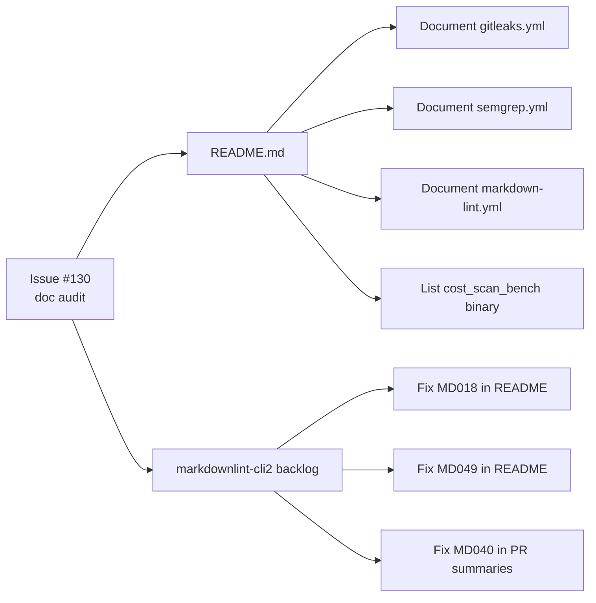

## Summary

Documentation audit — refreshed `README.md` against the actual workflow,
script, and binary surface in the repo, and fixed pre-existing
`markdownlint-cli2` violations. Closes #130.

What was out of date:

- **Missing workflows.** Three standalone workflows shipped without a
  matching README entry: `gitleaks.yml` (Issue #21), `semgrep.yml`
  (Issue #47), and `markdown-lint.yml` (Issue #63). Each is now
  documented in the "Other PR automation" section with its triggers,
  rationale, validator script, and bats coverage — matching the
  existing entries for `cargo-audit`, `cargo-quality`, `shellcheck`,
  and `dependency-review`.
- **Missing binary.** `cost_scan_bench` (Issue #124) is built from
  `rust_scorer/Cargo.toml` but was absent from the README "Binaries:"
  line. Added it alongside `rust_scorer` and `float_scan_bench` with
  a one-line description of its per-cost CPU sweep role.
- **Markdownlint backlog.** Three pre-existing
  `markdownlint-cli2` violations broke a clean `markdown-lint.yml`
  run: `MD018` on `(Issue #105)` in the README dependency-bump
  paragraph, `MD049` emphasis-style on `*after*` in the
  cargo-audit paragraph, and `MD040` (missing fenced-code language)
  in `docs/pr-summary-100.md` and
  `docs/archive/pr-summaries/pr-summary-122.md`. Fixed in place;
  `markdownlint-cli2` now reports zero errors across all 50 markdown
  files.

## Evidence

CLI / docs change — no UI to screenshot. Verified locally with:

```text
$ markdownlint-cli2
markdownlint-cli2 v0.22.1 (markdownlint v0.40.0)
Finding: **/*.md **/*.markdown !target/**
Linting: 50 file(s)
Summary: 0 error(s)

$ ./scripts/spell-check.sh
codespell: no typos found

$ bats tests/scripts/diagrams_mermaid.bats
ok 1 README.md declares at least one Mermaid code block
ok 2 README.md CI job dependency graph is a Mermaid block
ok 3 living docs contain no box-drawing ASCII diagrams
```

The doc rot the audit closed, visualised:



## Test Plan

- `markdownlint-cli2` — 0 errors across 50 markdown files (was 5).
- `./scripts/spell-check.sh` — no typos found.
- `bats tests/scripts/diagrams_mermaid.bats` — Mermaid invariants
  still hold after the README edits.
- No code or script behaviour changed, so no new code tests were
  added; the existing workflow-validator bats suites
  (`gitleaks_workflow.bats`, `semgrep_workflow.bats`,
  `markdown_lint_workflow.bats`) already cover each newly documented
  workflow.
