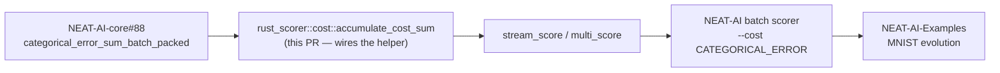

## Summary

Unblocks `--cost CATEGORICAL_ERROR` dispatch in `rust_scorer` now that
`categorical_error_sum_batch_packed` has landed in `neat-core` via
[`NEAT-AI-core#88`](https://github.com/stSoftwareAU/NEAT-AI-core/issues/88).
Before this change, batch scoring through NEAT-AI's `rust_scorer`
backend returned `Error: CATEGORICAL_ERROR dispatch is blocked …` and
evolution fell back to per-creature WASM scoring; after this change all
seven built-in NEAT-AI cost names dispatch natively. Closes #134.

Key changes:

- `rust_scorer/src/cost.rs`: `CostKind::CategoricalError` arm now calls
  `neat_core::loss::categorical_error_sum_batch_packed` instead of
  returning a hard error.
- Tests flipped from "asserts blocked" to "asserts parity":
  - `accumulate_cost_sum_categorical_error_matches_direct_helper`
    (unit) — dispatch matches a direct helper call on a multi-output
    fixture.
  - `parity_categorical_error_matches_ts_reference` (integration) —
    dispatch sum equals the hand-rolled TS argmax misclassification
    count, exact equality.
  - `scorer_binary_categorical_error_runs_after_upstream_helper_landed`
    (binary smoke) — `--cost CATEGORICAL_ERROR` exits 0 and echoes
    `costName: "CATEGORICAL_ERROR"`.
  - `cost_scan_bench_emits_one_row_per_supported_cost` (bench smoke) —
    expects 7 measured rows and an empty `skipped` array.
- Docs / comments cleaned up: `README.md`, `docs/performance-baseline.md`,
  `AGENTS.md`, `rust_scorer/src/main.rs` help text,
  `rust_scorer/src/bin/cost_scan_bench.rs`,
  `rust_scorer/src/stream_score.rs`, `rust_scorer/src/multi_score.rs`,
  and the `cost_parity.rs` module doc no longer claim CATEGORICAL_ERROR
  is blocked.

CI already checks out NEAT-AI-core's `Develop` branch (which includes [#88](https://github.com/stSoftwareAU/NEAT-AI-core/issues/88)), so no workflow changes were needed

## Evidence

Acceptance criteria verified via the test suite:

- `accumulate_cost_sum_categorical_error_matches_direct_helper` confirms
  the dispatch sum exactly equals
  `categorical_error_sum_batch_packed` on a 2-input/2-output identity
  fixture (2 misclassifications, integer equality).
- `parity_categorical_error_matches_ts_reference` confirms the
  dispatch matches the hand-rolled TS argmax reference (4
  misclassifications across 9 records, integer equality).
- `scorer_binary_categorical_error_runs_after_upstream_helper_landed`
  drives the released binary with `--cost CATEGORICAL_ERROR <creature>
  <data_dir>` and asserts exit 0 + `costName: "CATEGORICAL_ERROR"` in
  the JSON output.
- The six already-dispatchable costs continue to pass their existing
  parity / smoke tests (`MSE`, `MAE`, `MAPE`, `MSLE`, `HINGE`,
  `CROSS_ENTROPY`).
- `./quality.sh` passes cleanly (shellcheck, fmt, clippy, check,
  build, test, doc, release).

CLI-only change — no UI screenshot applicable.

## Test Plan

- `cargo test -p rust_scorer --lib cost::` — 11 unit tests, including
  the new dispatch parity test.
- `cargo test -p rust_scorer --test cost_parity` — 7 parity tests.
- `cargo test -p rust_scorer --test cost_scan_bench_smoke` — 2 tests,
  including the updated 7-row expectation.
- `cargo test -p rust_scorer --test scorer_smoke` — 20 binary smoke
  tests, including the renamed `…runs_after_upstream_helper_landed`.
- `./quality.sh < /dev/null` — full local gate (shellcheck, fmt,
  cargo-deny, clippy, check, build, test, doc, release).
