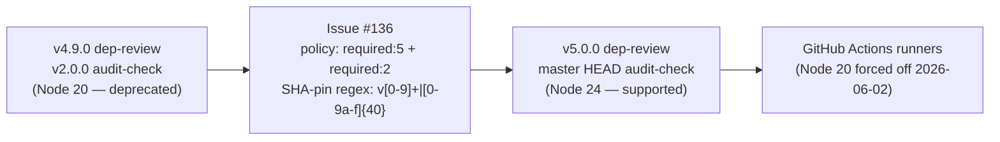

## Summary

Continues the work started in PR #135 by clearing the remaining two
**Node 20 deprecated** GitHub Actions that emit "Actions not starting
correctly" warnings on every run and would be force-bumped to Node 24
on 2026-06-02 (8 days from today). With Node 20 removal scheduled for
2026-09-16, leaving the exceptions in place risks runs that genuinely
fail to start once GitHub-hosted runners drop the runtime. Closes #136.

Bumps and rationale:

- `actions/dependency-review-action`: `v4.9.0` (SHA `2031cfc0…`, Node 20)
  → **`v5.0.0`** (SHA `a1d282b3…`, Node 24). Upstream released v5.0.0 on
  2026-05-08 — well past the worker's 24h external-dep quarantine.
- `rustsec/audit-check`: `v2.0.0` (SHA `69366f33…`, Node 20, 2024-09-23)
  → **master HEAD** (SHA `858dc40f…`, Node 24, 2026-03-20). Upstream's
  PR #48 added Node 24 support on master but hasn't shipped a v2.1 / v3
  tag yet, so we SHA-pin to the commit and label it
  `# v2 (master HEAD, Node 24, post upstream #48)`.

Supporting changes so the local quality gate stays green:

- `scripts/check-workflow-action-versions.sh`: both `node20:N` policy
  entries flipped to `required:N` (5 and 2 respectively). The
  `node20:N` code path itself is retained for any future exception.
- `scripts/check-dependency-review-workflow.sh` and
  `scripts/check-cargo-audit-workflow.sh`: widened the SHA-pin regex
  from `v?[0-9]+` to `(v[0-9]+|[0-9a-f]{40})\b`. The old regex silently
  relied on every commit SHA starting with a digit — the new
  dependency-review-action SHA starts with `a1d282b…`, which the
  previous regex rejected as "not pinned".
- `tests/scripts/workflow_action_versions.bats`: updated fixtures
  (`v4.9.0` → `v5.0.0`; `v2.0.0` → `v2 (master HEAD, …)`), removed the
  stale `"Node 20 exception, tracked"` assertion in the happy-path test,
  and added two regression tests (Issue #136) that fail if either
  dependency-review-action is downgraded below v5 or audit-check below
  v2.

## Evidence

CLI / workflow change — no UI screenshot. Evidence is the test suite plus
the validator output.

Verification:

- `./scripts/check-workflow-action-versions.sh` — every `uses:` line
  reports `>= vN, SHA-pinned` (no `Node 20 exception, tracked` left).
- `./scripts/check-dependency-review-workflow.sh` — accepts the new
  `a1d282b3…` SHA pin (previously rejected as "not pinned" because the
  regex only matched SHAs starting with a digit).
- `./scripts/check-cargo-audit-workflow.sh` — accepts the master-HEAD
  SHA pin for `rustsec/audit-check`.
- `bats tests/scripts/` — 185 tests pass, including the two new
  regression tests `fails when actions/dependency-review-action comment
  is older than v5` and `fails when rustsec/audit-check comment is
  older than v2`.
- `./quality.sh < /dev/null` — full local gate passes (shellcheck,
  cargo-deny, fmt, clippy, check, build, test, doc, release).

## Test Plan

- `bats tests/scripts/workflow_action_versions.bats` — 16 tests,
  including the two new Issue #136 regression tests and an updated
  happy-path assertion (`>= v5, SHA-pinned`).
- `bats tests/scripts/dependency_review_workflow.bats` — 10 tests
  including the real-repo green path (previously failing on the new
  SHA pin until the regex widened).
- `bats tests/scripts/cargo_audit_workflow.bats` — 11 tests.
- `bats tests/scripts/` — full 185-test suite, all passing.
- `./quality.sh < /dev/null` — full local gate.

## Deno regression avoided

N/A — this is a Rust + GitHub Actions repo with no Deno markers
(`deno.json` etc.). No Node-only tooling introduced; the only Node
dependencies touched are GitHub Action SHA pins, which are unavoidable
for this kind of repo.
