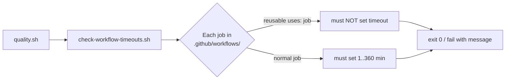

# Add per-job `timeout-minutes` across all workflows (Issue #154)

## Summary

No job under `.github/workflows/` declared `timeout-minutes`, so every job
inherited GitHub's 360-minute (6-hour) default. A hung compile, a wedged
`cargo install`, a stuck network fetch, or a runaway test could occupy a shared
runner for the full six hours before reclamation — delaying queued runs,
burning runner minutes, and masking a stuck step behind a long silent wait.

This PR adds an explicit, work-sized `timeout-minutes` to every job and ships a
guard (`scripts/check-workflow-timeouts.sh`, wired into `quality.sh`) plus BATS
coverage so the rule cannot regress. Closes #154.

### Budgets applied

| Workflow | Job | timeout-minutes |
| --- | --- | --- |
| `ci.yml` | `quality` (cargo build + test + doc + release) | 30 |
| `ci.yml` | `validation` | 10 |
| `ci.yml` | `shell-checks` | 10 |
| `ci.yml` | `spell-check` | 10 |
| `ci.yml` | `ci-required` (fan-in gate) | 5 |
| `security.yml` | `security` | 15 |
| `cargo-audit.yml` | `audit` | 15 |
| `cargo-quality.yml` | `quality` | 15 |
| `dependency-review.yml` | `dependency-review` | 10 |
| `auto-format.yml` | `auto-format` | 10 |
| `version-increment.yml` | `guard` | 5 |
| `version-increment.yml` | `bump` | 10 |
| `gitleaks.yml` | `gitleaks` | 10 |
| `markdown-lint.yml` | `markdownlint` | 10 |
| `semgrep.yml` | `semgrep` | 10 |

The `security` job in `ci.yml` is a reusable-workflow call (`uses:`). GitHub
rejects `timeout-minutes` on caller jobs, so its budget lives in the called
workflow's own job — `security.yml`'s `security` (15 min). The validator
understands this and does not require (in fact forbids) a timeout on caller
jobs.

## Evidence

Backend/CI change — no web interface to screenshot. Verified via the new guard
script and BATS suite.

`scripts/check-workflow-timeouts.sh` before the fix (all jobs flagged):

```text
FAIL ci.yml: job 'quality' has no timeout-minutes — it inherits GitHub's 360-minute default
FAIL ci.yml: job 'validation' has no timeout-minutes — it inherits GitHub's 360-minute default
... (every normal job across every workflow)
```

After the fix:

```text
OK   ci.yml: job 'quality' declares timeout-minutes: 30
OK   ci.yml: job 'security' is a reusable-workflow call (timeout belongs in the called workflow)
OK   security.yml: job 'security' declares timeout-minutes: 15
... (every job OK, exit 0)
```

### Validation flow



## Test Plan

- Added `scripts/check-workflow-timeouts.sh` — an indentation-based YAML scanner
  that asserts every normal job declares a `timeout-minutes` between 1 and 360,
  and that reusable-call jobs declare none.
- Added `tests/scripts/workflow_timeouts.bats` (9 cases): passes on a good
  workflow; fails on a missing timeout, a non-integer value, a value above 360,
  a zero value, and a timeout on a reusable-call job; handles a missing file and
  an unknown flag; and asserts the real repository workflows all pass.
- Wired the guard into `quality.sh` alongside the other workflow validators.
- `bats tests/scripts` — all 203 cases pass.
- `shellcheck -s bash` clean across every `*.sh`.
- All existing workflow check scripts still pass against the edited YAML.
