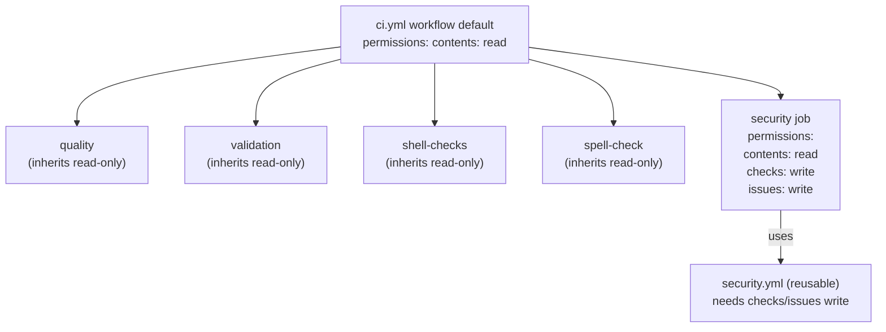

# Add explicit least-privilege `permissions:` to `ci.yml` (Issue #155)

## Summary

`.github/workflows/ci.yml` was the only workflow in the repository without an
explicit `permissions:` block, so every job inherited the broad
repository/organisation default `GITHUB_TOKEN` — far more than its read-only
build/lint/test work needs. This change scopes the token to least privilege.
Closes #155.

- **Workflow-level default → read-only.** Added a top-level
  `permissions: { contents: read }` block. The `quality`, `validation`,
  `shell-checks` and `spell-check` jobs only read the checked-out code, so the
  read-only default covers them.
- **`security` job grants its reusable workflow the scopes it needs.** The
  `security` job calls the reusable `security.yml`, which writes check-run
  annotations and PR/issue comments (`checks: write`, `issues: write`). A
  called workflow's token **can only be narrowed, never elevated**, along the
  caller chain (GitHub: *"permissions can only be maintained or reduced — not
  elevated — throughout the chain"*). So a job-level `permissions:` block was
  added to the `security` job mirroring `security.yml`'s own scopes; without
  it the read-only workflow default would clamp those writes away and the
  security annotations would silently fail. This is the issue's own guidance —
  *"grant it at the job level rather than widening the workflow default"*.



## Evidence

Backend/CI change only — no web interface to screenshot. Verified via a new
validator and BATS suite that follow this repo's established
`scripts/check-*.sh` + `tests/scripts/*.bats` convention.

- `scripts/check-ci-permissions.sh` fails (red) against the pre-fix `ci.yml`
  and passes (green) against the fixed file:

  ```text
  OK   workflow-level permissions block present
  OK   top-level default grants contents: read
  OK   top-level default declares no write scopes (read-only)
  OK   security job declares a job-level permissions block
  OK   security job grants checks: write
  OK   security job grants issues: write
  OK   security job grants contents: read
  ```

- Wired into `quality.sh` next to the other workflow validators.
- All 194 BATS tests pass (`bats tests/scripts`), plus `shellcheck -s bash`,
  `bash -n`, codespell, and markdownlint are clean.

The full `cargo` build/test/release stages of `quality.sh` were not run: this
change touches only workflow YAML, shell scripts, and docs (no Rust), and
`quality.sh`'s `cargo upgrade`/`cargo update` steps would dirty the tree with
dependency bumps unrelated to this issue. Every workflow/shell/docs gate that
applies to the change was run and passes.

## Test Plan

- Added `scripts/check-ci-permissions.sh` — validates a read-only top-level
  default and the security job's job-level scopes.
- Added `tests/scripts/ci_permissions.bats` (10 cases): happy path, missing
  workflow-level block, missing `contents: read`, write scope at top level,
  missing security job permissions, missing `checks: write`, missing
  `issues: write`, missing file, unknown flag, and a guard asserting the real
  shipped `ci.yml` satisfies every rule.
- Wired the validator into `quality.sh`.
- Updated the README **CI** section with a "Least-privilege token scope"
  subsection.
