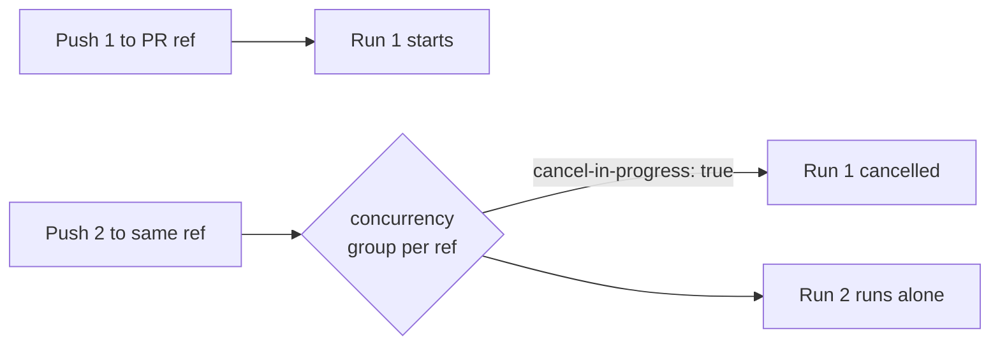

# Add concurrency groups to pile-up-prone workflows (Issue #156)

## Summary

Several `pull_request`-triggered workflows (and `ci.yml`, which also runs on
`push`) declared no `concurrency:` group, so rapid successive pushes to a branch
or PR stacked overlapping runs instead of cancelling superseded ones. This
wasted runner minutes and — for the two workflows that push commits back to the
PR head branch — risked two overlapping runs racing on the same ref.

This change adds the hardened concurrency pattern already used by the standalone
quality workflows (`cargo-audit.yml`, `cargo-quality.yml`,
`dependency-review.yml`, `markdown-lint.yml`) to the five affected workflows,
keyed per-ref with `cancel-in-progress: true`:

```yaml
concurrency:
  group: <workflow>-${{ github.ref }}
  cancel-in-progress: true
```

Affected workflows:

| Workflow | Trigger | Why it matters |
| --- | --- | --- |
| `ci.yml` | `push` (Develop) + `pull_request` | Heaviest workflow (full build/test/doc) — overlapping runs are the most expensive. |
| `auto-format.yml` | `pull_request` | Commits and pushes back to the PR branch — overlap can race. |
| `version-increment.yml` | `pull_request` | Also pushes back to the PR branch — same race risk. |
| `gitleaks.yml` | `pull_request` | Wasted runner minutes on overlapping scans. |
| `semgrep.yml` | `pull_request` | Wasted runner minutes on overlapping scans. |

A new validator, `scripts/check-workflow-concurrency.sh`, enforces the pattern
so the gate cannot regress, and it is wired into `quality.sh`.

Closes #156.

## Evidence

This is a CI/workflow configuration change with no web interface, so there is no
screenshot. Verification is via the new validator and its BATS suite.



Validator output against the real workflows (all pass):

```text
OK   ci.yml: declares a top-level concurrency block
OK   ci.yml: concurrency group is keyed by github.ref
OK   ci.yml: cancel-in-progress is true
... (auto-format, version-increment, gitleaks, semgrep) ...
```

## Test Plan

- Added `scripts/check-workflow-concurrency.sh` — validates that each
  pile-up-prone workflow declares a top-level `concurrency:` block, a `group:`
  keyed by `${{ github.ref }}`, and `cancel-in-progress: true`. Accepts both the
  `<workflow>-${{ github.ref }}` and `${{ github.workflow }}-${{ github.ref }}`
  group forms.
- Added `tests/scripts/workflow_concurrency.bats` (8 cases) exercising the
  validator end-to-end against synthetic fixtures: canonical pass, missing
  concurrency block, group not keyed by ref, `cancel-in-progress` not true,
  `github.workflow`-keyed form accepted, missing file, unknown flag, and a
  real-repository check that every pile-up-prone workflow passes.
- Wired `check-workflow-concurrency.sh` into `quality.sh`.
- Confirmed the validator reports failures **before** the fix and passes
  **after**, following TDD.
- Ran `./quality.sh < /dev/null` — passes cleanly.
