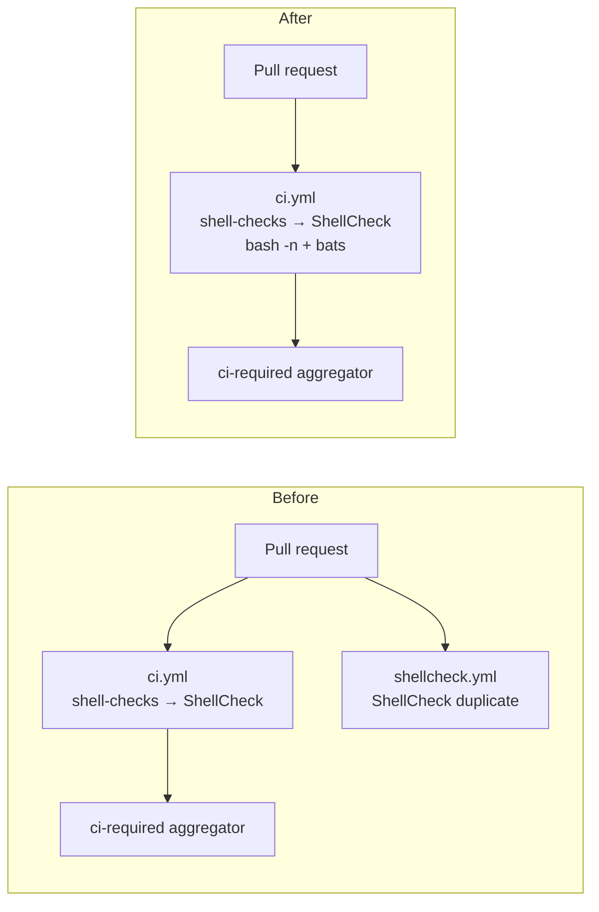

# PR Summary — Issue #157: ShellCheck duplicated across ci.yml and shellcheck.yml

## Summary

The same `ludeeus/action-shellcheck` invocation ran in two workflow files over
the same scope (`scandir: "."`, `severity: warning`, `ignore_paths: "target .git"`,
`SHELLCHECK_OPTS: -s bash`): `ci.yml`'s `shell-checks` job and the standalone
`shellcheck.yml`. Maintaining the same check in two places doubled the
maintenance surface — a severity change, ignore-path tweak, or SHA bump had to
be applied in lockstep in both files or the two scans silently diverged.

Following the issue's recommended fix, ShellCheck now lives in exactly one
home: **`ci.yml`'s `shell-checks` job**, which already feeds the `ci-required`
aggregator that branch protection gates on. The standalone `shellcheck.yml` was
deleted, along with its now-orphaned validator (`check-shellcheck-workflow.sh`)
and that validator's test. In their place, a dedup guard
(`scripts/check-shellcheck-dedup.sh`) enforces the invariant that exactly one
workflow may invoke `ludeeus/action-shellcheck`, so a future change cannot
silently re-introduce the duplication.

`ci.yml` is unchanged — its `shell-checks` job keeps the ShellCheck step, the
`bash -n` syntax check, and the bats helper-test suite.

Closes #157.

## Evidence

This is a CI-configuration change with no web interface to screenshot. It was
verified via the bats test suite and the local quality gate (`./quality.sh`),
which both pass.

### Before / after



`scripts/check-shellcheck-dedup.sh` against the real repository:

```text
OK   ShellCheck invoked in exactly one workflow: .../.github/workflows/ci.yml
```

## Test Plan

- **Added** `tests/scripts/shellcheck_dedup.bats` covering the new guard:
  - passes when exactly one workflow invokes ShellCheck (happy path);
  - fails when ShellCheck is duplicated across two workflows (regression of
    this issue);
  - fails when no workflow invokes ShellCheck (coverage gap);
  - prose mention of the action does not count as an invocation (edge case);
  - errors on a missing workflows directory and on an unknown flag;
  - asserts the real repository keeps ShellCheck in exactly one workflow
    (`ci.yml`). This test fails against the pre-fix tree (two invocations) and
    passes after `shellcheck.yml` is deleted — the TDD red→green for this fix.
- **Removed** `tests/scripts/shellcheck_workflow.bats` and
  `scripts/check-shellcheck-workflow.sh`. *Documented test modification:* both
  existed solely to validate the standalone `shellcheck.yml`; with that file
  deleted they validated a non-existent artefact and their default invocation
  would error. They are replaced by the dedup guard and its test above.
- `quality.sh` now invokes `check-shellcheck-dedup.sh` instead of the deleted
  validator.
- README updated to describe ShellCheck's single home and the dedup guard.
- `./quality.sh` passes cleanly (shellcheck, fmt, clippy, check, build, tests,
  doc, release).
