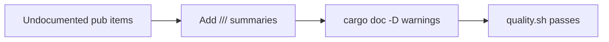

## Summary

Added `///` doc comments to the four `pub` items exported from the
`rust_scorer` crate root that previously carried none, addressing the
`rust` best-practices finding (bucket check 5 — *Doc comments on public
API*, per the Rust API Guidelines). This is a docs-only change — no
behaviour is altered. Closes #165.

Documented items:

- `rust_scorer/src/multi_score.rs` — `score_from_creature_dir(...)`, the
  directory-mode scoring entry point. The summary describes what it does,
  the meaning of the `gpu_backend` and `cost` parameters, and its `Err`
  contract (I/O, shape, or cost-resolution failure).
- `rust_scorer/src/gpu/forward_mse_batched.rs` — `NeuronGpu`,
  `SynapseGpu`, and `CreatureMetaGpu`, the `#[repr(C)]` GPU-upload
  structs. Each now carries a one-line summary noting it is a GPU-side
  mirror of the corresponding compiled-network type, uploaded as an SSBO
  element

### Scope note

The issue suggested confirming coverage by adding `#![deny(missing_docs)]`
to `src/lib.rs`. That lint also requires docs on every public **enum
variant** and **struct field** (21 further items across `cost.rs`,
`scoring.rs`, and others), which is well beyond the four item-level gaps
this issue identified. Permanently adopting the lint was therefore left
out of scope; it was used only as a local verification aid. The change is
instead validated by the existing `cargo doc` gate with
`RUSTDOCFLAGS=-D warnings`, which also confirms the new `accumulate_cost_sum`
and `ScoreResult` intra-doc links resolve.

## Evidence

Backend/library change with no web interface to screenshot. Verified via:

- `RUSTDOCFLAGS="-D warnings" cargo doc --no-deps -p rust_scorer` — builds
  cleanly; the four items now render summaries in `cargo doc` and the
  intra-doc links resolve.
- `./quality.sh` — passes end-to-end (`✅ All quality checks passed!`),
  covering `fmt --check`, `clippy`, `check`, `build`, `test`, the `doc`
  step with `-D warnings`, and the release build.

## Test Plan

No unit test is added — this change adds only documentation and alters no
runtime behaviour. The effective regression guard is the repository's
existing `doc` quality step (`RUSTDOCFLAGS=-D warnings cargo doc`), which
fails the build on broken intra-doc links in the new comments. Confirmed
passing via `./quality.sh`.
