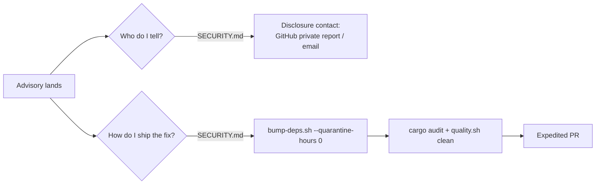

## Summary

`SECURITY.md` already published a disclosure contact (added under Issue #177),
but it had **no written emergency-bump procedure**. When a supply-chain
advisory needs an urgent, out-of-band dependency fix, a responder was left to
reverse-engineer `bump-deps.sh` flags under pressure. This PR closes that
posture/documentation gap by writing the playbook down and enforcing it.

- Added an **"Emergency dependency bump"** section to `SECURITY.md` that points
  a responder at the existing tooling:
  1. `./bump-deps.sh --quarantine-hours 0` — bypasses the default 24-hour
     quarantine window to pull the fixed crate version immediately
     (with `--skip-external` / `--skip-internal` notes).
  2. Confirm `cargo audit` and the release build are clean (run via
     `bump-deps.sh`), then run `./quality.sh` for the full local gate.
  3. Open an expedited PR referencing the advisory.
- Extended `scripts/check-security-policy.sh` with a **sixth validation rule**:
  the policy must document an emergency-bump procedure (an emergency /
  out-of-band steer **and** a reference to `bump-deps.sh`). This reuses the
  validator added for Issue #177 so the requirement is enforced in CI via the
  existing `validation` job, not just asserted once.
- Recorded the change under `## [Unreleased]` in `CHANGELOG.md`.

This reuses the controls already in the repository — it just records them so a
responder does not have to rediscover them mid-incident.

Closes #171.

## Evidence

Backend/docs-only change — no web interface to screenshot. Verified via the
repository's own `SECURITY.md` validator and its bats suite.

Validator against the real file (all six rules pass):

```text
OK   SECURITY.md: is non-empty
OK   SECURITY.md: declares a private reporting route (GitHub private reporting and/or email)
OK   SECURITY.md: states an expected acknowledgement / response time
OK   SECURITY.md: includes a supported-versions table
OK   SECURITY.md: documents an emergency dependency-bump procedure
```

`bats tests/scripts/security_policy.bats` — 12/12 passing (10 prior + 2 new).
`./quality.sh` — passes cleanly (shellcheck, cargo-deny, fmt, clippy, check,
build, test, rustdoc, release build).



## Test Plan

- Added `tests/scripts/security_policy.bats::"fails when there is no emergency
  dependency-bump procedure"` — a policy missing the section is rejected with
  the new message.
- Added `tests/scripts/security_policy.bats::"fails when the emergency procedure
  omits the bump tooling"` — an emergency steer without a `bump-deps.sh`
  reference is rejected.
- Updated the canonical and email-only fixtures (and asserted the new
  `emergency dependency-bump procedure` OK line) so the existing
  passing-policy tests exercise the sixth rule. Fixtures were extended — not
  removed — to satisfy the new required section.
- `"real repository SECURITY.md satisfies every rule"` confirms the live
  `SECURITY.md` passes all six rules.
