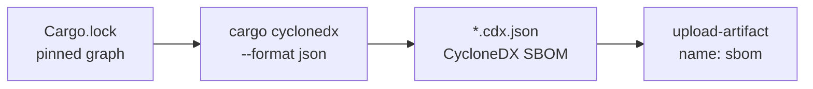

# PR Summary — Issue #172

## Summary

`rust_scorer` ships a binary (`[[bin]] name = "rust_scorer"`) but no Software
Bill of Materials (SBOM) artefact was generated anywhere in the repo or CI. An
SBOM is the lookup table you reach for after a supply-chain advisory drops:
given "crate X version Y is compromised", it answers "are we affected, and
where?" in seconds — and makes the inventory consumable by standard scanners
and downstream consumers without a Rust toolchain.

This PR adds a dedicated **SBOM workflow** that exports the dependency graph
(already pinned in `Cargo.lock`) as a CycloneDX document and uploads it as a
build artefact. This closes the supply-chain *posture* gap only — active
advisories remain owned by `cargo-audit.yml` / `security.yml`.

Changes:

- **`.github/workflows/sbom.yml`** (new) — installs `cargo-cyclonedx`, runs
  `cargo cyclonedx --format json --all`, and uploads the resulting
  `*.cdx.json` files via `actions/upload-artifact`. Runs on pull requests,
  pushes to `Develop`, and `workflow_dispatch`. SHA-pinned actions,
  least-privilege `contents: read`, a 15-minute timeout, and the standard
  NEAT-AI-core sibling-link step so `cargo-cyclonedx` resolves the path
  dependency.
- **`scripts/check-sbom-workflow.sh`** (new) — validates the workflow against
  six rules (build trigger, least-privilege permissions, pinned
  `actions/checkout`, Rust toolchain, CycloneDX generation, artefact upload).
  Wired into `quality.sh`.
- **`tests/scripts/sbom_workflow.bats`** (new) — end-to-end tests for the
  validator, exercising the happy path and one failure per rule against
  synthetic fixtures, plus a check that the real repo workflow passes.
- **`scripts/check-workflow-action-versions.sh`** — added
  `actions/upload-artifact` to the Node-24 policy table (`required:6`; v6.0.0
  is the first Node 24 release, pinned here to v7.0.1).
- **`README.md`** — documented the workflow with a Mermaid diagram.

Closes #172

## Evidence

This is a CI/tooling change with no web interface to screenshot. Verified via
the repository's own validators and test suites.

Data flow of the new workflow:

Validation output (all green):

- `bats tests/scripts/sbom_workflow.bats` — 10/10 pass, including
  *"real repository SBOM workflow satisfies every rule"*.
- `scripts/check-sbom-workflow.sh` — passes against the committed workflow.
- `scripts/check-workflow-paths.sh`, `check-workflow-action-versions.sh`,
  `check-workflow-timeouts.sh` — the new `sbom.yml` satisfies the sibling-path,
  SHA-pinning/Node-24, and per-job timeout invariants.
- `./quality.sh` — full gate passes cleanly (shellcheck, all workflow
  validators, bats suites, cargo-deny, fmt, clippy, check, build, test, doc,
  release).

## Test Plan

- Added `tests/scripts/sbom_workflow.bats`:
  - passes on the canonical fixture
  - fails when no build trigger is present
  - fails when the permissions block is missing
  - fails when `actions/checkout` is unpinned
  - fails when `dtolnay/rust-toolchain` is missing
  - fails when `cargo cyclonedx` is not invoked
  - fails when the SBOM is not uploaded as an artefact
  - reports an error when the workflow file does not exist
  - unknown flag prints usage and exits non-zero
  - real repository SBOM workflow satisfies every rule
- Existing `workflow_action_versions.bats`, `workflow_timeouts.bats`,
  `workflow_neat_ai_core_path.bats` continue to pass with the new workflow
  present.
