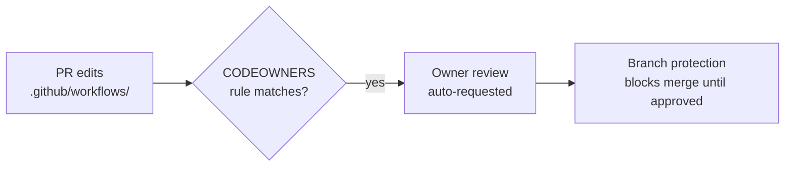

# Add CODEOWNERS coverage for `.github/workflows/` (Issue #176)

## Summary

The repository shipped privileged GitHub Actions workflows — `semgrep.yml`
runs with a non-`GITHUB_TOKEN` secret (`SEMGREP_APP_TOKEN`) — yet had **no
`CODEOWNERS` file** at any of the three GitHub-recognised paths. Without a
CODEOWNERS rule over the workflow directory, a single account could
self-approve a workflow edit that exfiltrates that secret or weakens a
security gate.

This PR adds `.github/CODEOWNERS` with the `@stSoftwareAU/developers`
maintainers team as the owner, including explicit rules over `.github/` and
`.github/workflows/`. It follows the repository's established
validator + bats convention so the coverage cannot silently regress:

- **`.github/CODEOWNERS`** — default owner plus rules covering the privileged
  workflow directory (last-match-wins ordering: catch-all first).
- **`scripts/check-codeowners.sh`** — validates the file exists at a
  recognised path, every rule names a valid owner (`@user`, `@org/team`, or
  email), and at least one rule covers `.github/workflows/`. Wired into
  `quality.sh`.
- **`tests/scripts/codeowners.bats`** — 10 end-to-end tests exercising the
  validator against synthetic fixtures (happy path, catch-all, email owner,
  and each failure mode).
- **`.github/workflows/ci.yml`** — adds `.github/CODEOWNERS` to the
  `validation` job's required-files list so the file cannot disappear.
- **`README.md`** — new "Review governance (CODEOWNERS)" section documenting
  the rule, the validator, and the repo-level branch-protection
  recommendations

Closes #176.

### Branch protection (repo-level — cannot be committed)

The issue also recommends branch-protection controls on `Develop` (required
PR approval, blocked direct/force-push, required linear history, required
signed commits). These are repository settings, not committed files — a
maintainer with admin rights must enable them. They are documented as
recommendations in the README; CODEOWNERS only takes effect once required
owner review is enabled on the default branch.

## Evidence

This is a CI/governance change with no web interface to screenshot. Evidence
is the validator output and the passing bats suite.

Validator against the committed CODEOWNERS:

```text
OK   .github/CODEOWNERS: contains 3 ownership rule(s)
OK   .github/CODEOWNERS: a rule covers .github/workflows/ — workflow changes require an owner review
```

Review-governance flow this PR enables:



### Local quality gate note

`./quality.sh` validators, shellcheck, the full bats suite (including the new
`codeowners.bats`), codespell, and markdownlint all pass. The cargo build
chain (`cargo_metadata.bats` and the cargo steps) cannot run in this local
environment because the `neat-core` path dependency requires a sibling
`NEAT-AI-core` checkout that is not present locally; CI provisions it. This is
a pre-existing environmental limitation unrelated to this change, which is
shell/config/docs only and touches no Rust code.

## Test Plan

- Added `tests/scripts/codeowners.bats` (10 tests) covering
  `scripts/check-codeowners.sh`:
  - passes on the canonical fixture, a catch-all-only file, and an
    email-owner workflow rule;
  - fails when no rule covers `.github/workflows/`, a rule has no owner, an
    owner token is malformed, or the file is comment-only;
  - errors on a missing file and an unknown flag;
  - asserts the real repository CODEOWNERS satisfies every rule.
- `shellcheck` and `bash -n` pass on `scripts/check-codeowners.sh` and the
  updated `quality.sh`.
- `python3 -c "yaml.safe_load(...)"` confirms `ci.yml` remains valid YAML.
