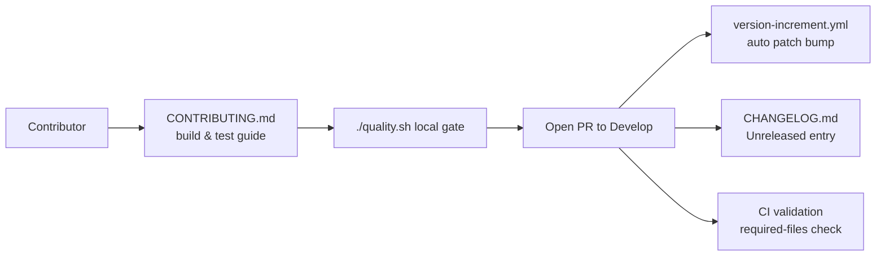

# PR Summary — Issue #178

## Summary

The repository had a substantial `README.md` and an Apache-2.0 `LICENSE`,
but was missing both `CONTRIBUTING.md` and `CHANGELOG.md`. This PR completes
the repository "docs floor" by adding both files and enforcing them in CI so
the floor cannot silently regress. Closes #178.

- **`CONTRIBUTING.md`** — contributor guide summarising the repository
  layout, prerequisites, the `./quality.sh` local gate (shellcheck,
  cargo-deny, `fmt --check`, clippy, check, build, test, rustdoc, release),
  the coding standards (Australian English, stable positional CLI contract),
  and the per-PR workflow including the automated `version-increment.yml`
  bump.
- **`CHANGELOG.md`** — follows [Keep a Changelog](https://keepachangelog.com/)
  with an `## [Unreleased]` section, noting that the `rust_scorer` version is
  bumped automatically so the changelog is the human-readable record of
  *what* changed between versions.
- **CI enforcement** — `CONTRIBUTING.md` and `CHANGELOG.md` are added to the
  `validation` job's required-files check in `.github/workflows/ci.yml`,
  guarded by a new `tests/scripts/docs_floor.bats` suite.

## Evidence

This is a documentation/CI change with no web interface, so no screenshot
applies. Verification is via the bats suite (run by `./quality.sh`):

```text
ok 1 CONTRIBUTING.md exists at the repository root
ok 2 CHANGELOG.md exists at the repository root
ok 3 CONTRIBUTING.md documents the local quality gate
ok 4 CHANGELOG.md follows Keep a Changelog with an Unreleased section
ok 5 ci.yml required-files check lists CONTRIBUTING.md
ok 6 ci.yml required-files check lists CHANGELOG.md
```

The full `./quality.sh` gate passes cleanly (codespell, markdownlint, all
239 bats tests, cargo-deny, fmt, clippy, check, build, test, rustdoc,
release).



## Test Plan

- Added `tests/scripts/docs_floor.bats` (TDD — tests 5 & 6 failed before the
  `ci.yml` change, all pass after):
  - asserts `CONTRIBUTING.md` and `CHANGELOG.md` exist at the repo root;
  - asserts `CONTRIBUTING.md` documents the `./quality.sh` gate;
  - asserts `CHANGELOG.md` uses the Keep a Changelog format with an
    `[Unreleased]` section;
  - asserts `ci.yml` lists both files in the required-files check.
- Ran `./scripts/spell-check.sh` (codespell) and `markdownlint-cli2` on the
  new files — both clean.
- Ran the full `./quality.sh` gate — passes.
