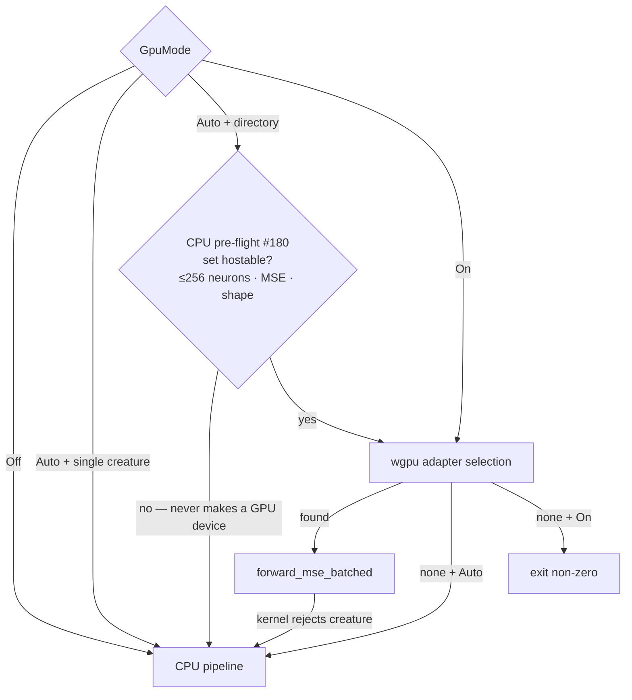

# Make `--gpu auto` fall back to CPU cleanly above the 256-neuron shader cap

## Summary

Under the default `--gpu auto`, **batch** (directory-mode) scoring of a
creature set that exceeds the GPU shader cap (**256 neurons**) created a
`wgpu`/Metal device up-front, then abandoned it when the
`forward_mse_batched` kernel rejected the set. On some drivers (observed:
Apple M4 Pro / Metal 4) that abandoned context aborted during process
teardown, truncating block-buffered stdout — batch callers saw
`exit 158` / `INVALID_JSON` and dropped to dramatically slower per-creature
CPU scoring. Real evolved creatures (4000+ neurons, observed 4139) hit this
on essentially every batch call

**Fix:** under `--gpu auto` the directory path now runs a **CPU-only
pre-flight** (`multi_score::gpu_directory_compatible`) that checks the
creature set against the shader cap (and the MSE-only / shared-shape
constraints) **before** any GPU adapter is selected. An unhostable set
routes straight to the CPU pipeline without ever creating — or tearing down
— a `wgpu` context, so the fallback returns valid JSON with
`gpuBackend: "cpu-fallback"` and exits 0. `--gpu on` still hard-errors on an
unhostable set (the user explicitly demanded a GPU); small creature sets
still run on the GPU.

This addresses **problem #1** from the issue (broken auto→CPU fallback).
**Problem #2** (raise/remove the 256-neuron cap so large creatures run on
the GPU) is a separate GPU-kernel redesign — the WGSL kernel holds each
creature's activations in a fixed-size `private` array that cannot simply be
enlarged — and is tracked as follow-up issue
[stSoftwareAU/NEAT-AI-scorer#182](https://github.com/stSoftwareAU/NEAT-AI-scorer/issues/182).

Also reconciles the **stale docs** the issue flagged: `AGENTS.md` said `off`
was the default ("until #81 lands") — it is `auto` since #83. The cap and
first-class CPU fallback are now documented in `README.md`.

Closes #180.

## Evidence

Backend/CLI change — no web UI. Verified by building the binary and running
it against a generated creature directory.

**Oversized creature (302 neurons) under `--gpu auto` — clean CPU fallback:**

```text
$ rust_scorer --gpu auto <oversized_creatures_dir> <data_dir> | jq .c0.gpuBackend
exit=0
"cpu-fallback"
# stderr:
[gpu] auto fallback to CPU directory mode: GPU runner cannot host this
creature set (creature 0 has 305 neurons; GPU shader caps at 256); rerun
with --gpu off
```

stdout is valid JSON even when piped (the caller's exact scenario); exit 0.

**No regression — small sets still use the GPU; `--gpu on` still hard-errors:**

```text
$ rust_scorer --gpu auto  <small_creatures_dir> <data_dir>  → gpuBackend "metal"
$ rust_scorer --gpu on    <small_creatures_dir> <data_dir>  → gpuBackend "metal"
$ rust_scorer --gpu on    <oversized_dir>       <data_dir>  → exit 1,
    "Error: GPU runner cannot host this creature set (... 305 neurons ...)"
```

### Control flow (after fix)



## Test Plan

New tests (all passing; full workspace suite green):

- `rust_scorer/tests/gpu_preflight_tdd.rs` — drives the new pre-flight
  directly (TDD driver; fails to compile against the unfixed tree because
  the function did not exist):
  - `preflight_rejects_creature_above_shader_cap` — a 302-neuron set returns
    `Err` mentioning the 256 cap.
  - `preflight_accepts_small_creature_set` — a tiny set returns `Ok`.
  - `preflight_defers_empty_directory_to_scoring_path` — load failures are
    *not* reported as GPU-incompatibility (returns `Ok` so the scoring path
    surfaces the real error).
- `rust_scorer/tests/directory_mode_tdd.rs::gpu_auto_directory_above_shader_cap_falls_back_to_cpu_cleanly`
  — binary-level regression guard: `--gpu auto` over an oversized creature
  emits valid JSON with `gpuBackend: "cpu-fallback"` and exit 0.

Existing GPU/auto/cost tests (`scorer_smoke.rs`, `directory_mode_tdd.rs`,
`gpu_multi_score_parity.rs`) continue to pass — no existing tests modified.
`./quality.sh` passes cleanly (fmt, clippy `-D warnings`, cargo-deny,
rustdoc, release build, full test suite).
