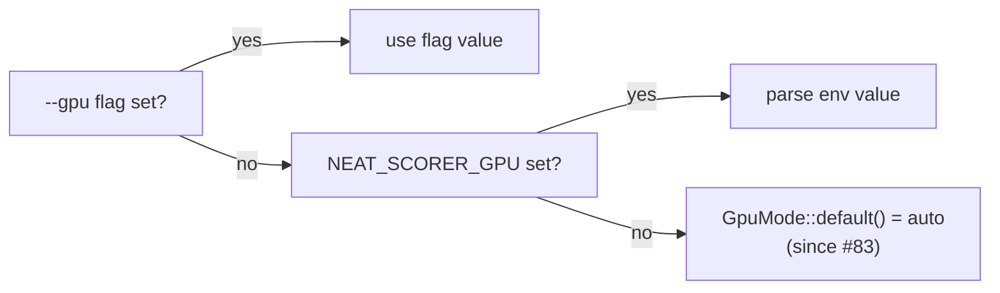

## Summary

`AGENTS.md` documented the `--gpu` default as `off` ("default until #81
lands"). That is stale: the default was flipped to `auto` in Issue #83,
as confirmed by `rust_scorer/src/main.rs` (*"default flipped to `auto` in
Issue #83"*, *"`auto` — **default**"*) and `README.md` (*"`auto` —
**Default since Issue #83**"*).

This change updates the single stale line in the GPU plumbing section so
the docs match the code:

- `auto` is now marked **default since #83** and described as silently
  falling back to CPU when no GPU is found.
- `off` is described by its actual behaviour (skip GPU detection
  entirely) rather than as the default

### Audit of surrounding `#81` references

The "until #81 lands" phrasing was the only stale reference. The other
`#81` mentions (`README.md` lines 90/101/108, `rust_scorer/src/main.rs`
line 220) correctly describe #81 as a **negative result** — the
single-creature GPU path stayed slower than CPU+PGO, so no GPU kernel
ships for it. Those are accurate and left unchanged.

Closes #181

## Evidence

Documentation-only change (no web interface). Verified the code default
independently of the docs:

- `rust_scorer/src/gpu/mod.rs::resolve_mode` returns `GpuMode::default()`
  when neither the `--gpu` flag nor `NEAT_SCORER_GPU` is set.
- The existing test `resolve_mode_falls_back_to_env_then_default`
  asserts `resolve_mode(None, None) == GpuMode::Auto` — i.e. the default
  is `auto`, matching the corrected docs.

`./quality.sh` passes cleanly (codespell, fmt, clippy, check, build,
test — 20 passed, doc with `-D warnings`, release build).

## Test Plan

No code behaviour changed, so no new tests were added. The corrected
documentation is already covered by the existing
`rust_scorer/src/gpu/mod.rs::resolve_mode_falls_back_to_env_then_default`
test, which pins `auto` as the no-flag/no-env default. Full
`./quality.sh` gate run and passed.
