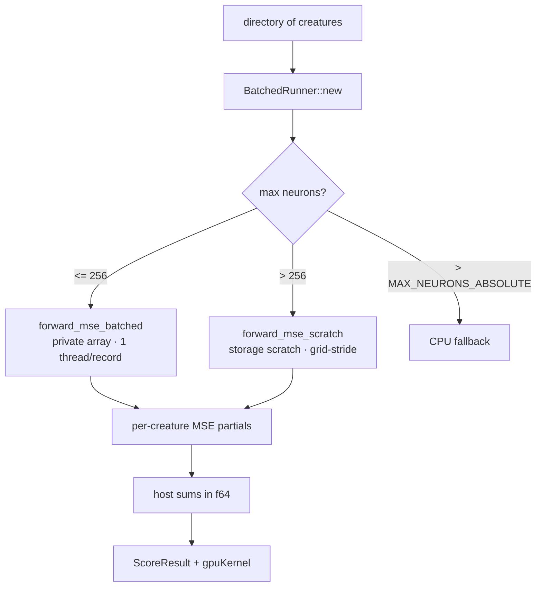

# Raise/remove the 256-neuron GPU shader cap (Issue #182)

## Summary

Large creatures now run on the GPU. The `forward_mse_batched` kernel held each
invocation's activations in a fixed-size `private` WGSL array, capping it at
**256 neurons** per creature — production creatures routinely exceed that
(observed 4139), so they always fell back to CPU.

This PR adds a second kernel, **`forward_mse_scratch`**, that moves the
per-thread activation scratch into a runtime-sized `storage` buffer (WGSL
forbids runtime-sized `private` arrays, but storage arrays are fine), lifting
the neuron cap. To keep the scratch bounded, the host caps the live thread
count against a memory budget and the kernel walks the records with a
grid-stride loop. The runner routes each creature set automatically by its
largest neuron count: ≤ 256 → the fast `forward_mse_batched`; > 256 → the new
`forward_mse_scratch`. The #180 pre-flight cap check is relaxed accordingly, so
`--gpu auto`/`on` now keeps large creatures on the GPU.

**Closes #182.**

### Key changes

- `rust_scorer/src/shaders/forward_mse_scratch.wgsl` — new kernel: storage
  activation scratch + bounded grid-stride loop; reuses the batched kernel's
  per-creature partial reduction so results match within the #81/#82 tolerance.
- `rust_scorer/src/gpu/forward_mse_batched.rs` — `BatchedRunner` selects the
  kernel by `max_neurons`, sizes/binds the scratch buffer against a budget
  (`NEAT_SCORER_GPU_SCRATCH_BYTES`, default 512 MiB, capped to the device's max
  storage-buffer binding size), and reports the kernel via `kernel_label()`.
  `build_batched_network_data` no longer rejects creatures above 256 — only an
  absurd count (> `MAX_NEURONS_ABSOLUTE`).
- Shared WGSL `squash` now clamps its input to ±30 so large pre-activations
  cannot overflow Metal's `tanh`/`exp` to `NaN` (the bug that broke parity at
  4000 neurons; matches the CPU libm result, which saturates).
- `rust_scorer/src/gpu/mod.rs` — request the adapter's full limits so the
  device exposes more than the default 128 MiB storage-buffer binding size.
- `multi_score::gpu_directory_compatible` / `score_from_creature_dir_gpu` —
  large sets are GPU-hostable; `gpuKernel` JSON reports the actual kernel.
- README, AGENTS.md, CHANGELOG updated.

### Architecture

## Evidence

Backend/CLI change — no UI. Verified by automated parity tests plus a manual
end-to-end run of the shipped (PGO) binary on a fixture of 8 creatures with
**4010 neurons** each (8 in / 4000 hidden / 2 out), 32 MiB corpus, Apple M4.

### Performance (Performance Task Workflow)

Before this PR, 4010-neuron creatures could **only** run on CPU. The before
(CPU) / after (GPU `forward_mse_scratch`) comparison:

**End-to-end, PGO binary (`target/pgo/rust_scorer`), median of 2 runs:**

| Path                     | Wall time | Speedup |
|--------------------------|-----------|---------|
| CPU+PGO (`--gpu off`)    | ~31.3 s   | —       |
| GPU Metal (`--gpu on`)   | ~12.85 s  | **2.44× / −59 %** |

**Criterion `large_creature_cpu_vs_gpu/8` (release+LTO profile):**

| Path | Median | Throughput |
|------|--------|------------|
| CPU  | 25.44 s | 1.26 MiB/s |
| GPU  | 14.04 s | 2.28 MiB/s |

The GPU win (2.44× end-to-end) far exceeds the 3 % acceptance bar and is well
beyond any plausible PGO gain on the already-LTO'd CPU path.

### Parity (CPU vs GPU, same fixture)

Per-creature relative error **3.49e-08**, far inside the 1e-4 tolerance:

| | CPU+PGO error | GPU error | rel err |
|---|---|---|---|
| creature-000 | 267586613.5379 | 267586622.8730 | 3.49e-08 |

`gpuBackend: "metal"`, `gpuKernel: "forward_mse_scratch"` for the large set.

## Test Plan

- `rust_scorer/tests/gpu_multi_score_parity.rs` — added CPU↔GPU parity for
  large creatures: 310-neuron (just above cap), **4010-neuron** production
  scale, and a grid-stride remainder case. Each asserts the runner routed to
  the expected kernel (`forward_mse_scratch` above the cap).
- `rust_scorer/tests/gpu_preflight_tdd.rs` — **business-logic change**: the old
  `preflight_rejects_creature_above_shader_cap` (which asserted a 302-neuron
  creature was rejected) is replaced by `preflight_accepts_creature_above_private_cap`
  and `preflight_accepts_large_production_scale_creature` (4010 neurons), since
  the cap is now lifted. Documented here per the no-silent-test-removal rule.
- `forward_mse_batched.rs` unit tests — the old
  `build_batched_network_data_rejects_too_many_neurons` (256 cap) is replaced
  by `build_batched_network_data_accepts_above_private_cap` and
  `build_batched_network_data_rejects_absurd_neuron_count`; added
  `scratch_workgroups_x_*` tests for the budget-bounded grid-stride width.

All GPU parity tests pass on Apple M4 Metal; the suite skips cleanly with no
adapter (CPU-only CI).

## Security self-check

Backend compute change. No new external input surface; the scratch buffer size
is bounded by a budget capped to the device limit and a `MAX_NEURONS_ABSOLUTE`
guard against corrupt creature data. No secrets, no new dependencies.
