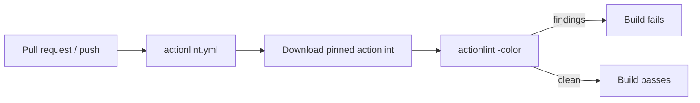

## Summary

Added a CI lint gate for GitHub Actions workflows. The repository shipped a
growing fleet of workflow YAML under `.github/workflows/` but had no CI job
running the standard GitHub Actions linter (actionlint), so workflow
regressions — invalid `runs-on` labels, broken `${{ }}` expressions, unknown
`uses:` inputs, shellcheck findings in `run:` scripts — could reach `Develop`
undetected.

This change adds a standalone `actionlint.yml` workflow that runs actionlint on
every pull request and on pushes to the default branches, following the
established standalone-linter pattern in this repo (validator script +
`quality.sh` wiring + bats coverage). The actionlint binary is downloaded from
a version-pinned upstream release by the official `download-actionlint.bash`
installer and run directly — no third-party wrapper action enters the supply
chain, mirroring how `ci.yml` invokes ShellCheck (PR #184).

Closes #195.

## Changes

- `.github/workflows/actionlint.yml` — new lint gate. Triggers on
  `pull_request` and pushes to `main`/`master`/`Develop`; least-privilege
  `contents: read`; `concurrency` group keyed by `github.ref`; per-job
  `timeout-minutes`; `actions/checkout` SHA-pinned. Passes actionlint itself.
- `scripts/check-actionlint-workflow.sh` — validator asserting the workflow
  triggers on `pull_request`, declares read-only permissions, SHA/major-pins
  `actions/checkout`, installs actionlint, and invokes it.
- `tests/scripts/actionlint_workflow.bats` — 10 end-to-end tests exercising the
  validator against synthetic fixtures (happy path, each failure mode, missing
  file, unknown flag, and the real repository workflow).
- `quality.sh` — invokes the new validator alongside the other workflow checks.
- `README.md`, `CHANGELOG.md` — document the new gate.

## Evidence

Backend/CI change — no web UI to screenshot. Verified locally:

- `actionlint` (v1.7.12) over all workflows including the new one: exit 0.
- `scripts/check-actionlint-workflow.sh`: all rules report `OK`, exit 0.
- `bats tests/scripts`: 261 tests pass (10 new in
  `actionlint_workflow.bats`).
- Existing workflow-iterating validators (timeouts, action-versions,
  concurrency, shellcheck-dedup, codeowners, ci-permissions, ci-job-graph) all
  pass with the new workflow present.
- `scripts/spell-check.sh`: no typos. `markdownlint-cli2`: 0 errors.
  `shellcheck`: clean.

## Test Plan

- Added `tests/scripts/actionlint_workflow.bats` (10 cases) covering the
  validator's happy path, every individual failure mode (no `pull_request`
  trigger, missing permissions, unpinned/missing checkout, missing install
  step, actionlint not invoked), a missing workflow file, an unknown flag, and
  the real repository workflow.
- Wired `scripts/check-actionlint-workflow.sh` into `quality.sh` so the gate is
  enforced on every local run and in CI's bats job.
