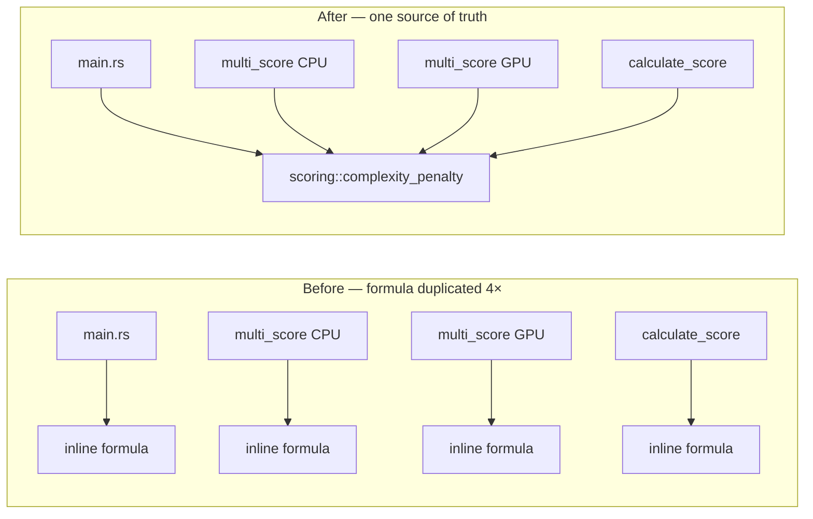

# Refactor: one shared `complexity_penalty` scoring function

## Summary

The `complexityPenalty` arithmetic was hand-copied across three result-assembly
sites purely to populate the JSON `complexityPenalty` field, while
`scoring::calculate_score` already computed the identical formula internally —
so any change to the growth-cost weighting had to be made in four places or the
reported `complexityPenalty` would silently disagree with `score`. The copies
also averaged raw `value_penalty(...)` while `calculate_score` routed through
`calculate_penalty` (which adds finiteness asserts), a subtle inconsistency.

This change exposes a single canonical `pub fn complexity_penalty(components:
&ScoreComponents, growth_cost: f64) -> f64` in `scoring.rs`, calls it from
`calculate_score`, and replaces every inline block with that call. All sites now
share one implementation that routes through `calculate_penalty`. Closes #199.

### Call sites collapsed onto the shared function

- `rust_scorer/src/scoring.rs` — new `complexity_penalty`; `calculate_score`
  now calls it.
- `rust_scorer/src/main.rs:447` — single-creature result assembly.
- `rust_scorer/src/multi_score.rs` — both directory-mode result-assembly sites
  (CPU and GPU paths). The now-unused `value_penalty` import was replaced with
  `complexity_penalty`.

## Evidence

Backend/CLI refactor — no web interface to screenshot. Verified via the test
suite. The behaviour is numerically identical (the formula is unchanged); the
refactor removes duplication and aligns the weight/bias term on
`calculate_penalty`.

- `cargo test -p rust_scorer --lib --bin rust_scorer` → 63 + 84 tests pass.
- `cargo fmt --check` and `cargo clippy --all-targets` clean.

The one `quality.sh` failure — `gpu_auto_directory_above_shader_cap_falls_back_to_cpu_cleanly`
in `tests/directory_mode_tdd.rs` — is a pre-existing, GPU-hardware-dependent
test (it expects a CPU fallback but the build host has a Metal GPU). It fails
identically on the base branch with this change stashed, so it is unrelated to
this refactor.

## Test Plan

- `scoring::tests::test_complexity_penalty_matches_calculate_score` — asserts
  the standalone shared function equals the penalty baked into `calculate_score`
  (for a v4 creature, `score == 1 - cp`).
- `scoring::tests::test_complexity_penalty_routes_through_calculate_penalty` —
  asserts the weight/bias term matches `calculate_penalty` rather than a raw
  `value_penalty` average.
- `tests::test_complexity_penalty_json_matches_score` (in `main.rs`) — runs a
  real creature through `run_single`, parses the serialised JSON, and asserts
  the `complexityPenalty` field equals the value used inside `calculate_score`
  (`score == 1 - error - complexityPenalty`). This is the acceptance-criterion
  test.
- All existing scoring/multi-score tests continue to pass unchanged.
