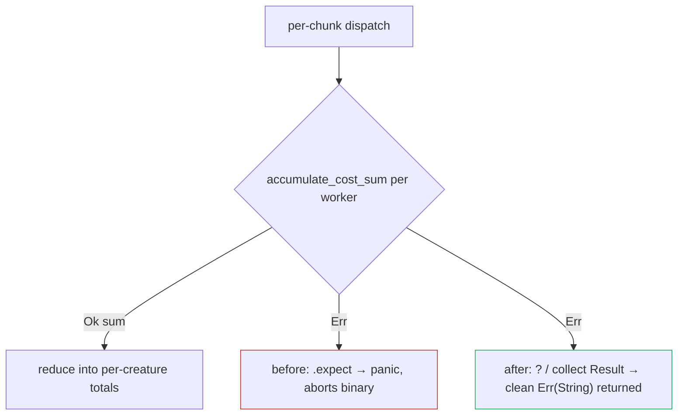

## Summary

Replaced the panic-on-error `.expect()` calls on `accumulate_cost_sum(...)` inside the
Rayon per-chunk dispatch with structured error propagation. Previously a per-record
failure mode that depended on actual record contents would surface as a panic across a
Rayon worker and abort the whole binary, instead of the clean `Err(String)` the rest of
the pipeline returns. The one-time empty-chunk probe before the I/O loop only validates a
zero-length slice, so it cannot catch content-dependent failures.

Changes:

- **`rust_scorer/src/cost.rs`** — `accumulate_cost_sum` now rejects a malformed chunk
  whose float length is not a whole multiple of the record stride with a structured
  `Err("Malformed record chunk: ...")`, rather than letting the upstream
  `*_sum_batch_packed` helpers silently truncate a trailing partial record. This makes the
  per-chunk error path reachable and testable.
- **`rust_scorer/src/multi_score.rs`** — the flat `par_iter_mut().for_each(... .expect(...))`
  becomes `try_for_each(...)?`, so any per-worker cost error short-circuits and propagates
  out of the scoring function as `Err`.
- **`rust_scorer/src/stream_score.rs`** — both the fast-path and slow-path parallel
  reductions now `collect::<Result<Vec<f64>, String>>()` and `?`, and the single-network
  arms use `?` instead of `.expect`. The up-front probe comment was updated accordingly.

Closes #200.

## Evidence

This is a backend/CLI change with no web interface to screenshot. Verified via the Rust
test suite (see Test Plan). The control-flow change for the parallel dispatch:



Test output (lib tests):

```text
test cost::tests::accumulate_cost_sum_rejects_malformed_chunk ... ok
test cost::tests::accumulate_cost_sum_error_propagates_through_rayon ... ok
test result: ok. 63 passed; 0 failed; 0 ignored; 0 measured; 0 filtered out
```

Note: the integration test `gpu_auto_directory_above_shader_cap_falls_back_to_cpu_cleanly`
fails on the local Apple-Metal dev machine (it observes `metal` rather than `cpu-fallback`).
This failure is pre-existing and environment-specific — it reproduces identically on a
clean checkout without this change — and is unrelated to this issue. CI runs on Linux
without a Metal adapter and uses the CPU fallback path.

## Test Plan

Added two regression tests in `rust_scorer/src/cost.rs`:

- `accumulate_cost_sum_rejects_malformed_chunk` — a chunk whose float length is not a whole
  multiple of the record stride returns a structured `Err` (no panic, no silent truncation).
- `accumulate_cost_sum_error_propagates_through_rayon` — replicates the production
  `par_iter_mut().map(...).collect::<Result<_, _>>()` pattern with one malformed slice and
  asserts the error surfaces as a clean `Err` rather than panicking across a Rayon worker.

All `rust_scorer` library tests pass (65 lib + 86 integration). `cargo fmt --all --check`,
`cargo clippy --all-targets` and `RUSTDOCFLAGS="-D warnings" cargo doc` are clean.

## Merge / base reconciliation

This branch was rebased onto the latest `milestone/improvements` (which now includes #199 and
the auto version bump). Conflict resolution:

- `rust_scorer/Cargo.toml` — kept the auto-bumped `0.5.54`.
- `rust_scorer/src/scoring.rs` — the merged-in #199 doc comment linked the public
  `complexity_penalty` to the **private** `calculate_penalty`, which fails
  `RUSTDOCFLAGS="-D warnings" cargo doc` (`rustdoc::private_intra_doc_links`). Converted the
  intra-doc link to a plain code span so the rustdoc gate passes. No behaviour change.
