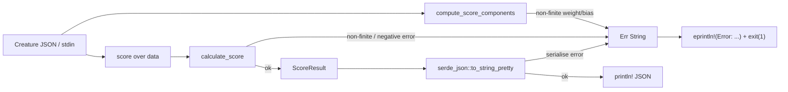

# Robustness: convert input-reachable `assert!`/serialise `expect` panics to structured errors

## Summary

Several `assert!` guards in `rust_scorer/src/scoring.rs` (not `debug_assert!`,
so they fire in release builds) protected values reachable from arbitrary
user-supplied creature JSON / stdin. A non-finite/NaN weight or bias, a
negative or non-finite average error, or a serialisation failure aborted the
process via panic instead of returning the binary's standard
`Err(String)` → `eprintln!("Error: ...")` → `exit(1)` result.

This change converts the input-derived checks to early `Result::Err` returns
with clear messages, and routes serialisation failures through the same error
path. Pure internal-math invariants stay as `debug_assert!`.

**Closes #201.**

### What changed

- `scoring::value_penalty`, `compute_score_components`, `complexity_penalty`
  and `calculate_score` now return `Result<_, String>`:
  - `value_penalty` → `Err` for negative or non-finite `value`.
  - `compute_score_components` → `Err` for a non-finite synapse weight or
    neuron bias (naming the offending UUID/edge).
  - `calculate_score` → `Err` for a non-finite or negative average error.
- `main()` routes `serde_json::to_string_pretty` failures (single- and
  multi-creature) through `eprintln!("Error: ...")` + `process::exit(1)`
  instead of `.expect(...)`.
- Pure internal-math invariants (`primary/compressed penalty < 1`,
  `penalty` finite/`>= 0`/`< 1`, `score <= 1.0`) downgraded to
  `debug_assert!` — they cannot be violated once the input checks pass.
- `ScoreComponents` derives `Debug` (needed so tests can `unwrap_err`).
- Call sites in `main.rs` and `multi_score.rs` (both CPU and GPU directory
  paths) propagate the new `Result` via `?` — all are already inside
  `Result<_, String>`-returning functions.

### Error-flow



## Evidence

Backend/CLI change — no web interface to screenshot. Verified via the Rust
test suite. New and updated unit tests deterministically exercise each
converted error path by calling the real functions with malformed numeric
input and asserting a structured `Err`:

```text
running 22 tests (scoring) ... ok
test result: ok. 91 passed; 0 failed (rust_scorer lib + bin)
```

### Pre-existing, unrelated failure

`tests/directory_mode_tdd::gpu_auto_directory_above_shader_cap_falls_back_to_cpu_cleanly`
fails on this machine because it has a real Metal GPU (the test asserts a
`cpu-fallback` backend). Confirmed it fails identically on the base branch
with my changes stashed, so it is environmental and unrelated to this work.

## Test Plan

Added to `rust_scorer/src/scoring.rs`:

- `test_value_penalty_rejects_non_finite` — NaN/inf → `Err("not finite")`.
- `test_compute_score_components_rejects_non_finite_weight` — NaN/inf weight →
  structured `Err`.
- `test_compute_score_components_rejects_non_finite_bias` — NaN/-inf bias →
  structured `Err`.
- `test_calculate_score_rejects_non_finite_error` — NaN/inf average error →
  structured `Err`.
- `test_calculate_score_rejects_negative_error` — negative average error →
  structured `Err`.

Modified (documented business-logic change — panic → `Result`):

- `test_value_penalty_rejects_negative` — was `#[should_panic(expected = "negative")]`;
  now asserts `value_penalty(-1.0)` returns `Err` containing `"negative"`.
- All other `value_penalty` / `calculate_penalty` / `calculate_score` /
  `complexity_penalty` / `compute_score_components` call sites in the existing
  tests updated to `unwrap()` the new `Result` (no assertions removed).

Note: a true non-finite weight cannot reach `compute_score_components` through
the CLI because `parse_creature_json` rejects out-of-range JSON numbers and the
scoring data pipeline is `f32` (saturating at `f32::MAX`, whose square fits in
`f64`). The conversions remain the correct defensive fix for these `pub`
functions and any in-memory `CreatureExport` callers, and the error branches
are covered directly at the function level.
