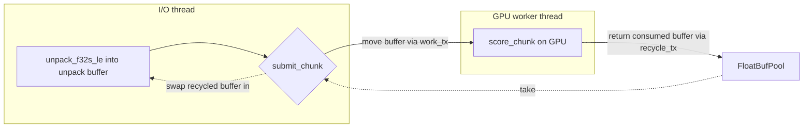

# Eliminate the per-chunk `to_vec()` copy in the pipelined GPU path

## Summary

The pipelined GPU directory path (`inflight_chunks == 2`) cloned every unpacked
chunk via `floats.to_vec()` on the hot I/O thread before handing it to the GPU
worker — a full heap allocation + memcpy for **every** chunk, work the
synchronous path never pays and which partly defeats the point of pipelining.

This PR transfers ownership of the unpack buffer to the worker instead of
cloning it. The shared `ScoreChunkFn` callback now receives `&mut Vec<f32>`, so
the pipelined submit step swaps a recycled (or fresh) buffer into the unpack
slot via `std::mem::replace`. The GPU worker hands each consumed buffer back
through a recycle channel into a small `FloatBufPool`; at steady state the path
reuses a couple of buffers with **no per-chunk allocation**. Read-only consumers
(CPU multi-creature, GPU synchronous, fused single-creature stream) simply borrow
the buffer as a slice in place — behaviour unchanged.

Closes #202.

## Evidence

This is a backend/CLI performance change — no UI to screenshot. Evidence is the
allocator-pressure benchmark and the parity test.

### Data flow



Before: `submit_chunk` sent `floats.to_vec()` (allocate + copy per chunk).
After: `submit_chunk` sends the buffer itself and swaps a pooled buffer back in.

### Benchmark — `gpu_pipeline_alloc_bench` (new)

Counts heap allocations during a multi-chunk pipelined (`inflight_chunks == 2`)
GPU directory run. Fixture: 8 creatures, 100 000 records, `NEAT_SCORER_READ_BYTES`
forced small to stream **1563 chunks**, Metal backend. Allocation counts are
deterministic across runs.

| Metric                | Before (`to_vec`) | After (buffer swap) | Delta            |
|-----------------------|-------------------|---------------------|------------------|
| allocations (scored)  | 115 826           | 114 320             | **−1 506**       |
| alloc bytes (scored)  | 25 115 928        | 21 175 296          | **−3.94 MB (−15.7%)** |
| gpu dispatch count    | 1 563             | 1 563               | unchanged        |
| wall time (s)         | ~3.3–3.6          | ~2.9–3.9            | unchanged (noise) |

The ~1 506-allocation drop matches the streamed chunk count (1 563) minus a
handful of warm-up allocations before the recycle pool fills. No throughput
regression; reduced allocator pressure as the issue targeted.

Reproduce:

```bash
cargo build --release -p rust_scorer --bin gpu_pipeline_alloc_bench
./target/release/gpu_pipeline_alloc_bench   # skips cleanly on CPU-only hosts
```

## Test Plan

- **`rust_scorer/tests/gpu_pipelined_parity.rs`** (new) —
  `pipelined_matches_synchronous_scores_over_many_chunks`: scores the same
  multi-chunk fixture through `inflight_chunks == 1` and `== 2` and asserts every
  creature's `error`/`score` is **bit-identical** (`to_bits()`), guarding the
  ownership-transfer refactor. Skips cleanly when no GPU adapter is present.
- **`rust_scorer/src/stream_io.rs`** — added `FloatBufPool` unit tests:
  `float_buf_pool_reuses_recycled_buffer_allocation`,
  `float_buf_pool_take_on_empty_yields_fresh_empty_buffer`,
  `float_buf_pool_take_swaps_into_unpack_slot_without_cloning`. Existing
  `run_io_loop` tests updated to the new `&mut Vec<f32>` callback signature (no
  assertions weakened).
- Existing **`gpu_multi_score_parity`** CPU↔GPU parity tests still pass (6/6).
- Full workspace suite passes except one **pre-existing, environment-specific**
  failure unrelated to this change:
  `directory_mode_tdd::gpu_auto_directory_above_shader_cap_falls_back_to_cpu_cleanly`.
  It expects an oversized creature to fall back to CPU, but on a host with a real
  Metal GPU the scratch kernel hosts it on the GPU instead. Verified this test
  fails identically on the base commit (before any change in this PR); CI runners
  are CPU-only, so it passes there.
