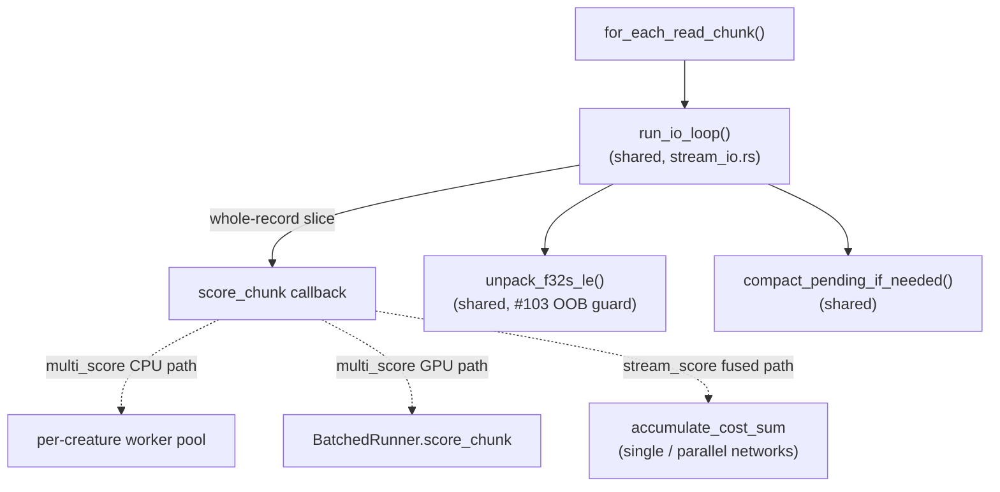

# De-duplicate the streaming head-and-compact loop and unpack helpers

## Summary

The head-and-compact `.bin` streaming logic and its byte-level helpers were
duplicated across `multi_score.rs` and `stream_score.rs`. The Issue #103
out-of-bounds-safety invariant in `unpack_f32s_le` lived in two byte-for-byte
copies that had to be kept in lock-step — a maintenance hazard.

This change hoists the shared pieces into one new module,
`rust_scorer/src/stream_io.rs`:

- `unpack_f32s_le`, `reserve_unpack_capacity`, `compact_pending_if_needed` —
  the byte-level helpers (one copy, shared).
- `run_io_loop` + the `ScoreChunkFn` callback type — the fast-path/slow-path
  head-and-compact driver.
- `PENDING_COMPACT_HEAD_BYTES` — the compaction threshold constant.

Both modules now reuse the shared code:

- `stream_score::accumulate_cost_sum_forward_only_fused` had its own
  near-identical inline copy of the loop. It now feeds a `score_chunk` closure
  (parallel/single-network cost accumulation) into the shared `run_io_loop`.
- `multi_score`'s CPU directory path also carried an inline copy of the loop;
  it now calls `run_io_loop` too (the GPU directory path already did).

Net result: ~457 lines removed, ~82 added. One copy of every helper, one copy
of the loop, and the #103 safety invariant lives in exactly one place.

Closes #203.

## Evidence

This is a pure backend/CLI refactor with no web interface, so there is no
screenshot. Behaviour is unchanged and verified by the existing stream/multi
integration tests plus new unit tests for the shared module (see Test Plan).

### Quality gate

- `cargo fmt --check` — clean.
- `cargo clippy -p rust_scorer --all-targets` — clean (`-D warnings`).
- `RUSTDOCFLAGS=-D warnings cargo doc -p rust_scorer --no-deps` — clean.
- `cargo test -p rust_scorer` — all pass **except** the pre-existing,
  environment-dependent `gpu_auto_directory_above_shader_cap_falls_back_to_cpu_cleanly`.
  This test fails identically on the unmodified base branch on a Metal-equipped
  host (the 256-neuron GPU cap was removed in #188, so the oversized creature
  now scores on `metal` rather than `cpu-fallback`). It is unrelated to this
  byte-streaming refactor and passes on CI's GPU-less Linux runner.

## Test Plan

New unit tests in `rust_scorer/src/stream_io.rs` exercise the shared code with
real calls and assertions:

- `unpack_f32s_le_decodes_exact_length_buffer` — happy path.
- `unpack_f32s_le_rejects_short_buffer_in_release` / `…_rejects_oversize_buffer`
  — the Issue #103 OOB `should_panic` guards (relocated here; canonical copy).
- `compact_pending_if_needed_shifts_tail_to_front` / `…_noop_when_head_zero`.
- `run_io_loop_fast_path_scores_aligned_and_buffers_remainder` — fast path
  scores the aligned prefix and buffers the trailing fragment.
- `run_io_loop_slow_path_joins_buffered_remainder` — a buffered half-record is
  completed by the next chunk.
- `run_io_loop_propagates_score_chunk_error` — a `score_chunk` error propagates.

Existing tests retained and passing:

- `directory_mode_record_aligned_fast_path_matches_slow_path` — confirms the
  shared `run_io_loop` produces identical results on the fast and slow paths
  for both refactored directory paths.
- `stream_score::tests::partition_packed_records_covers_all_and_balances` and
  all `multi_score` partition/worker tests stay local (those functions did not
  move).

### Test relocation note

The three `unpack_f32s_le_*` unit tests existed as byte-for-byte duplicates in
both `multi_score.rs` and `stream_score.rs`. Because `unpack_f32s_le` moved to
`stream_io.rs`, a single canonical copy of those tests now lives alongside it
in `stream_io.rs`; the two duplicate copies were removed (the function they
tested no longer lives in those modules). No test coverage was lost — the
Issue #103 OOB `should_panic` guards still run.
