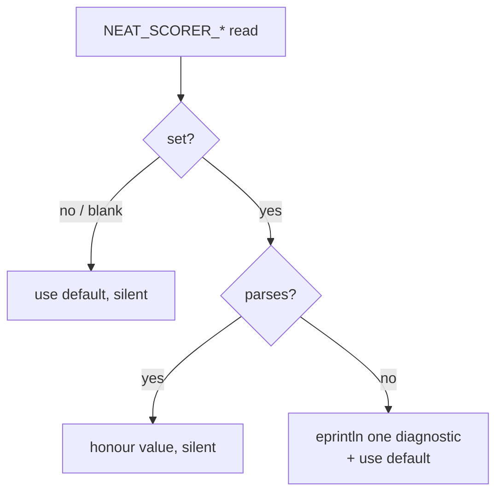

# Warn on malformed `NEAT_SCORER_*` env-var values (Issue #204)

## Summary

Three numeric performance-tuning env vars used to fall back to their default on
a malformed value with **zero** feedback, so a typo like
`NEAT_SCORER_READ_BYTES=2MB` was silently treated as "unset". This was
inconsistent with `NEAT_SCORER_GPU`, which already errors on an invalid value.

Each knob now emits **one** diagnostic line to stderr on the parse-failure
branch and continues with the default:

```text
[scorer] ignoring invalid NEAT_SCORER_READ_BYTES='2MB', using default 2097152
```

Affected vars:

- `NEAT_SCORER_READ_BYTES` — `rust_scorer/src/read_tuning.rs`
- `NEAT_SCORER_ACTIVATION_THREADS` — `rust_scorer/src/stream_score.rs`
- `NEAT_SCORER_GPU_SCRATCH_BYTES` — `rust_scorer/src/gpu/forward_mse_batched.rs`

The shared logic lives in a new `rust_scorer/src/env_tuning.rs` module
(`parse_tuning_var`), keeping it pure and unit-testable: it returns the
resolved value plus an `Option<String>` warning, and the caller does the
`eprintln!`. *Unset* and *blank* values stay silent; a *valid* value is
honoured silently; only a *set-but-malformed* value warns.

Closes #204.

### Behaviour notes

- `NEAT_SCORER_GPU_SCRATCH_BYTES=0` was already rejected (it has a `> 0`
  predicate); it now warns rather than falling back silently, matching the
  "invalid value" contract.
- **Minor behaviour change:** a *malformed* `NEAT_SCORER_ACTIVATION_THREADS`
  previously fell back to `1`; it now falls back to the same default as the
  *unset* case (all available CPU cores), which is the documented default and
  is what `parse_tuning_var` reports in its warning. Valid values are still
  clamped to `[1, 64]` as before.



## Evidence

Backend/CLI change — no web interface to screenshot. Verified via unit tests
(`cargo test -p rust_scorer env_tuning`): all 7 cases pass in every
compilation context (lib, main, both bench bins).

Pre-existing unrelated failure: `directory_mode_tdd::gpu_auto_directory_above_shader_cap_falls_back_to_cpu_cleanly`
fails on this Apple-Silicon/Metal machine on the **clean tree too** (it expects
`cpu-fallback` but post-#182 large creatures run on the GPU `forward_mse_scratch`
kernel, reported as `metal`). It is independent of this change and unaffected by it.

## Test Plan

New `rust_scorer/src/env_tuning.rs` unit tests for `parse_tuning_var`:

- `unset_value_uses_default_silently` — `None` → default, no warning.
- `blank_value_uses_default_silently` — `""`, whitespace → default, no warning.
- `valid_value_is_honoured_silently` — parses, no warning.
- `surrounding_whitespace_is_trimmed_before_parsing` — `"  4096  "` honoured.
- `malformed_value_warns_and_falls_back` — `"2MB"` → default + warning that
  echoes the var name, raw value, and default.
- `warning_preserves_untrimmed_raw_for_context` — warning shows the raw value
  verbatim.
- `custom_predicate_rejection_warns` — `NEAT_SCORER_GPU_SCRATCH_BYTES=0` warns.

The three public env-reading functions are thin wrappers (read env → call
`parse_tuning_var` → `eprintln!` the warning), so the pure-helper tests cover
the warning behaviour without racing on process-global env vars under parallel
test execution.
