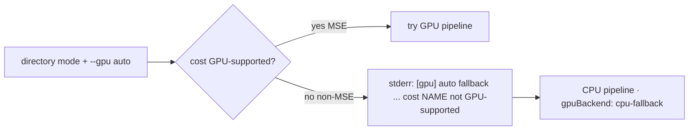

# Surface a stderr note when a non-MSE `--cost` forces CPU fallback in directory mode

## Summary

Under the default `--gpu auto`, selecting a non-MSE `--cost` makes
`auto_should_use_gpu` (`rust_scorer/src/gpu/mod.rs`) return false, so the
directory path runs on CPU. Unlike the explicit `--gpu on` hard-error and the
GPU-runner failure case, that fallback printed nothing — the only signal was
the `gpuBackend: "cpu-fallback"` JSON field, so users could not tell their
**cost choice** (not a missing GPU) caused the CPU path.

This PR adds one informational stderr line on the directory path, mirroring the
existing `[gpu] auto fallback ...` messages and naming the cost as the reason:

```text
[gpu] auto fallback to CPU directory mode: cost MAE is not GPU-supported (forward_mse_batched only handles MSE); rerun with --gpu off to skip GPU detection
```

MSE / GPU-supported costs and explicit `--gpu on|off` are unaffected (no extra
output). Closes #205.

### Changes

- **`rust_scorer/src/gpu/mod.rs`** — new pure helper
  `auto_cost_fallback_note(mode, path, cost) -> Option<String>` that returns the
  note only when `mode` is `Auto`, `path` is `CreatureDirectory`, and the cost
  is not GPU-supported; `None` otherwise.
- **`rust_scorer/src/main.rs`** — directory branch emits the note via
  `eprintln!` before dispatch. It is a no-op for MSE and for explicit
  `--gpu on|off`.
- **`README.md`** — documents the new stderr note under the GPU constraint
  section.
- **`CHANGELOG.md`** — `### Added` entry.



## Evidence

CLI-only change — no web interface to screenshot. Verified by automated tests
(real function calls and a spawned-binary stderr assertion).

- Library unit tests (`cargo test -p rust_scorer --lib gpu::`): **27 passed**,
  including the four new `auto_cost_fallback_note_*` cases.
- Integration test (`cargo test -p rust_scorer --test directory_mode_tdd`):
  new `directory_mode_auto_non_mse_cost_notes_cpu_fallback` **passed**.

Example output for a non-MSE cost under the default `--gpu auto`:

```text
$ rust_scorer --cost MAE creatures/ data/
[gpu] auto fallback to CPU directory mode: cost MAE is not GPU-supported (forward_mse_batched only handles MSE); rerun with --gpu off to skip GPU detection
{ ... "gpuBackend": "cpu-fallback" ... }
```

### Pre-existing unrelated test note

`gpu_auto_directory_above_shader_cap_falls_back_to_cpu_cleanly` fails on the
local Apple-Silicon dev host (a real Metal adapter hosts the 302-neuron creature
on GPU rather than the expected CPU fallback). This failure reproduces on a
clean checkout **without** these changes — it is environmental (GPU-equipped
host) and outside the scope of #205. CI runs on GPU-less hosts where it passes.

## Test Plan

Added:

- `rust_scorer/src/gpu/mod.rs`
  - `auto_cost_fallback_note_present_for_non_mse_directory` — note appears and
    names the cost for every non-MSE cost.
  - `auto_cost_fallback_note_absent_for_mse_directory` — MSE emits no note.
  - `auto_cost_fallback_note_absent_for_explicit_modes` — `--gpu on|off` emit
    no note.
  - `auto_cost_fallback_note_absent_for_single_creature` — single-creature path
    emits no note.
- `rust_scorer/tests/directory_mode_tdd.rs`
  - `directory_mode_auto_non_mse_cost_notes_cpu_fallback` — spawns the binary
    with `--cost MAE` (note present on stderr) and `--cost MSE` (note absent).

Quality: `cargo fmt --check`, `cargo clippy -D warnings`, `cargo doc`
(`RUSTDOCFLAGS=-D warnings`), codespell and markdownlint on the edited docs all
pass.
