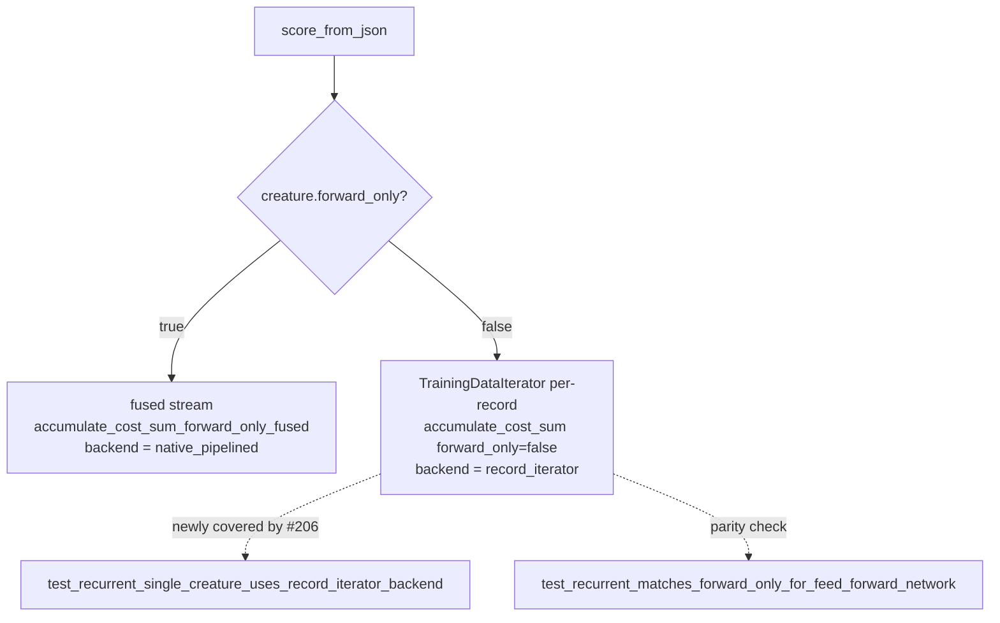

# Add coverage for the recurrent (`forwardOnly:false`) single-creature scoring path

## Summary

The recurrent (non-forward-only) single-creature scoring path had effectively
no automated coverage. The `else` branch of `score_from_json`
(`rust_scorer/src/main.rs`) uses a per-record `TrainingDataIterator` plus
`accumulate_cost_sum(..., forward_only=false)` and reports
`training_read_backend = "record_iterator"`, but every `make_creature_json`
test helper hard-coded `"forwardOnly":true`, so this branch — one of the two
top-level single-creature scoring modes, with distinct packed-buffer assembly
and per-record state-reset semantics — was never exercised.

This PR adds unit coverage for that branch:

- Parameterised the test helper via `make_creature_json_with_forward_only(...)`;
  the existing `make_creature_json(...)` now delegates with `forward_only=true`,
  so no existing test changes behaviour.
- Added `test_recurrent_single_creature_uses_record_iterator_backend`, which
  builds a `forwardOnly:false` creature, scores it, and asserts both the
  numeric result (near-zero error, score ≈ 1.0, record count) **and**
  `training_read_backend == "record_iterator"`, plus that the
  fused-stream-only fields stay unset.
- Added `test_recurrent_matches_forward_only_for_feed_forward_network`, a
  parity sanity check confirming the recurrent and forward-only paths yield
  the same error/score for a purely feed-forward network (both reset state per
  record).

Also refreshed the stale `Cargo.lock` crate version (`0.5.56` → `0.5.57`) so it
matches `Cargo.toml`.

Closes #206.



## Evidence

Backend/CLI change with no web interface — no screenshot applicable. Verified
via the test suite.

New tests pass:

```text
running 2 tests
test tests::test_recurrent_single_creature_uses_record_iterator_backend ... ok
test tests::test_recurrent_matches_forward_only_for_feed_forward_network ... ok
```

Full binary unittest suite: `102 passed; 0 failed`.

Note: `quality.sh` reports one **pre-existing, environment-specific** failure
unrelated to this change — `gpu_auto_directory_above_shader_cap_falls_back_to_cpu_cleanly`
in `tests/directory_mode_tdd.rs`. On a machine with a real Metal GPU the
oversized-creature directory run scores on `metal` rather than the expected
`cpu-fallback`. Confirmed failing on the clean tree (before any of these
changes) by stashing the diff and re-running the test, so it is not introduced
here.

## Test Plan

- `rust_scorer/src/main.rs::tests::test_recurrent_single_creature_uses_record_iterator_backend`
  — drives the `forwardOnly:false` branch; asserts numeric score and
  `training_read_backend == "record_iterator"`.
- `rust_scorer/src/main.rs::tests::test_recurrent_matches_forward_only_for_feed_forward_network`
  — parity sanity check across the two scoring modes.
- Existing tests unchanged and still passing (`cargo test --bin rust_scorer`).
