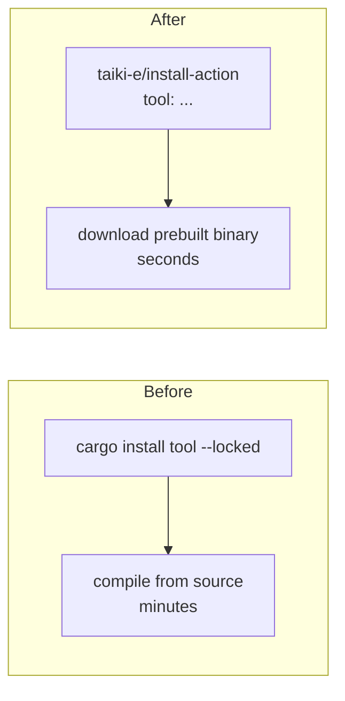

# CI: install cargo tools from prebuilt binaries (Issue #208)

## Summary

Four workflows recompiled a cargo CLI tool from source on every run via
`cargo install <tool> --locked`, costing minutes of CI wall-clock with no
behaviour change. They now fetch a **prebuilt release binary** through
`taiki-e/install-action`, which installs in seconds. Closes #208.

Changed workflows (part of #198):

| Workflow | Tool | Before | After |
| --- | --- | --- | --- |
| `cargo-audit.yml` | `cargo-audit` | `cargo install cargo-audit --locked` | `taiki-e/install-action` |
| `security.yml` | `cargo-audit` | `cargo install cargo-audit --locked` | `taiki-e/install-action` |
| `sbom.yml` | `cargo-cyclonedx` | `cargo install cargo-cyclonedx --locked` | `taiki-e/install-action` |
| `ci.yml` | `cargo-deny` | `cargo install cargo-deny --locked` | `taiki-e/install-action` |

All three tools have native prebuilt manifests in `taiki-e/install-action`, so
no source compile or `cargo-binstall` fallback is needed.

### Acceptance criteria

- **No source compile on a cache hit** — `taiki-e/install-action` downloads a
  released binary; there is no `cargo install` build step left in any of the
  four workflows.
- **Versions stay pinned/`--locked`-equivalent** — the prior steps were
  unversioned (`--locked` pins the tool's *own* build lockfile, not a tool
  version), so they installed the latest release. `taiki-e/install-action`
  with no version resolves the latest release binary — equivalent behaviour.
- **Supply-chain policy intact** — the action is SHA-pinned to
  `7a79fe8c3a13344501c80d99cae481c1c9085912` (`v2.81.10`) with a trailing
  version comment, and added to the Node 24 policy table in
  `scripts/check-workflow-action-versions.sh` (`required:2`).
- **CI wall-clock drops** — a `cargo install` of these tools compiles the tool
  plus its dependency tree (minutes); a prebuilt binary download is seconds.
  `cargo-audit.yml`, `security.yml`, and `sbom.yml` previously had no
  `actions/cache` at all, so every run paid the full build cost.

## Evidence

This is a CI/tooling change — no web interface to screenshot. Verified via the
new validator and the existing workflow-policy gates:

```text
$ ./scripts/check-prebuilt-tool-install.sh
OK   .../cargo-audit.yml: no 'cargo install cargo-audit' source compile
OK   .../cargo-audit.yml: installs cargo-audit via prebuilt taiki-e/install-action
OK   .../security.yml:   no 'cargo install cargo-audit' source compile
OK   .../security.yml:   installs cargo-audit via prebuilt taiki-e/install-action
OK   .../sbom.yml:       no 'cargo install cargo-cyclonedx' source compile
OK   .../sbom.yml:       installs cargo-cyclonedx via prebuilt taiki-e/install-action
OK   .../ci.yml:         no 'cargo install cargo-deny' source compile
OK   .../ci.yml:         installs cargo-deny via prebuilt taiki-e/install-action

$ ./scripts/check-workflow-action-versions.sh   # taiki-e/install-action >= v2, SHA-pinned
```

`actionlint` passes on all four edited workflows.



## Test Plan

TDD: the validator and its BATS suite were written first (red), then the
workflows were updated to make them pass (green).

- Added `scripts/check-prebuilt-tool-install.sh` — fails if a workflow
  compiles a tool via `cargo install <tool>` or lacks a matching
  `taiki-e/install-action` prebuilt step. Wired into `quality.sh`.
- Added `tests/scripts/prebuilt_tool_install.bats` — covers the happy path
  (prebuilt install), the regression (source compile rejected), a missing
  install step, a missing file, argument validation, a directory of canonical
  workflows, and the real repository workflows.
- Updated `scripts/check-workflow-action-versions.sh` policy to require
  `taiki-e/install-action` at `>= v2` and SHA-pinned; existing
  `tests/scripts/workflow_action_versions.bats` continues to pass.
- Existing `tests/scripts/cargo_audit_workflow.bats` and
  `tests/scripts/sbom_workflow.bats` still pass — the `cargo audit` /
  `cargo cyclonedx` run steps are unchanged.
- `./quality.sh` shell/CI gates pass: shellcheck, every workflow validator
  (including the new one), the full bats suite, cargo-deny, fmt, clippy, check
  and build. This change touches **no Rust** (only workflow YAML, shell
  scripts, BATS tests and docs), so the compiled behaviour is unchanged.

  > Note: the unrelated GPU test
  > `directory_mode_tdd::gpu_auto_directory_above_shader_cap_falls_back_to_cpu_cleanly`
  > fails on the dev machine because it has a Metal GPU that hosts the
  > oversized creature (`gpuBackend: "metal"`) instead of taking the
  > CPU-fallback path the test asserts. It is hardware-specific and
  > independent of this CI-only change — CI runners (Linux, no Metal) are
  > unaffected.
