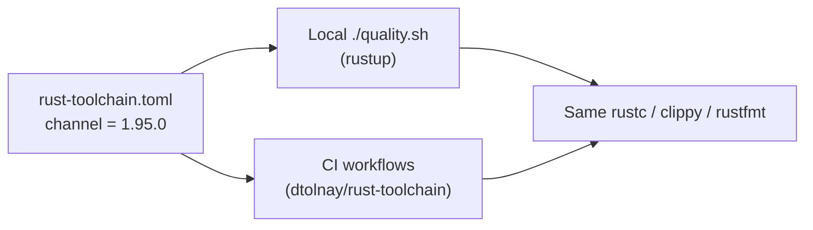

## Summary

Pinned the Rust compiler for reproducible local + CI builds. Closes #209.

The project SHA-pins every GitHub Action and container digest, but the Rust
compiler version floated: workflows resolve `dtolnay/rust-toolchain@<sha> # stable`
at run time and there was no `rust-toolchain.toml`. Because the gate is
`-D warnings` plus specific clippy lints, a fresh stable release could introduce
a lint that breaks CI with no code change — and contributors could not reproduce
it locally.

This PR adds a root [`rust-toolchain.toml`](../../../rust-toolchain.toml) pinning
a concrete channel (`1.95.0`) plus the `rustfmt` and `clippy` components.
`rustup` reads this file automatically, so both local `./quality.sh` and CI
(`dtolnay/rust-toolchain` honours the file when no explicit `toolchain:` input is
given) resolve the **same** `rustc`/`clippy`/`rustfmt`.

### Changes

- **`rust-toolchain.toml`** — pins `channel = "1.95.0"` + `components = ["rustfmt", "clippy"]`, with a header comment documenting the rationale and bump cadence.
- **`scripts/check-rust-toolchain.sh`** — validator (mirrors the repo's existing `check-*` guards): asserts the file exists, declares a `[toolchain]` table, pins a concrete `X.Y.Z` version (rejects floating `stable`/`beta`/`nightly`), and lists both `rustfmt` and `clippy`. Accepts `--toolchain PATH` for fixture testing.
- **`quality.sh`** — invokes the new validator so the local gate enforces the pin.
- **`.github/workflows/ci.yml`** — adds `rust-toolchain.toml` to the required-files check so CI fails if the pin is ever removed.
- **Docs** — new "Pinned Rust toolchain" section in `README.md` (with a Mermaid diagram and the documented bump process), plus updates to `CONTRIBUTING.md` and `AGENTS.md`.
- **`Cargo.lock`** — re-synced `rust_scorer` to `0.5.60` to match `rust_scorer/Cargo.toml` (a pre-existing lockfile drift the pinned build regenerated).

### Acceptance criteria

- ✅ `rust-toolchain.toml` exists and pins a concrete stable version + rustfmt/clippy.
- ✅ CI and local `quality.sh` use the same compiler version (`rustup` honours the file in both).
- ✅ A documented (small) bump process — see README "Pinned Rust toolchain".

## Evidence

Backend/CLI + tooling change — no web interface to screenshot. Verified via the
shell-helper test suite and the local gate.

`./quality.sh` resolved `rustc 1.95.0` via the pinned file and passed every
stage (shellcheck, all workflow validators incl. the new
`check-rust-toolchain.sh`, codespell, bats, cargo-deny, fmt, clippy, check,
build). The only failing test, `gpu_auto_directory_above_shader_cap_falls_back_to_cpu_cleanly`,
is **pre-existing and environment-specific** — it fails identically on the base
branch (confirmed with the change stashed) because the local Mac has a Metal GPU
that hosts the oversized creature instead of falling back to CPU. It is unrelated
to this change, which adds no Rust code. CI's `ubuntu-latest` runners have no GPU
and take the `cpu-fallback` path.

## Test Plan

- Added `tests/scripts/rust_toolchain.bats` (9 cases) exercising
  `scripts/check-rust-toolchain.sh` end-to-end against synthetic fixtures:
  - passes on the canonical pinned fixture;
  - fails when the `[toolchain]` table is missing;
  - fails when `channel` floats on `stable` instead of a pinned version;
  - fails when the `channel` key is absent;
  - fails when the `clippy` component is missing;
  - fails when the `components` key is absent;
  - errors when the file does not exist;
  - prints usage and exits non-zero on an unknown flag;
  - validates the real repository `rust-toolchain.toml`.
- All 9 cases pass: `bats tests/scripts/rust_toolchain.bats`.
