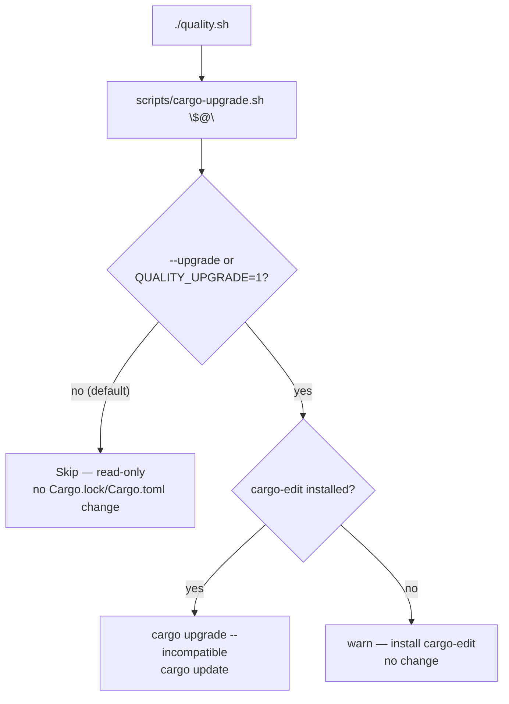

# Make `quality.sh`'s `cargo upgrade` step opt-in

## Summary

The documented local gate `./quality.sh` unconditionally ran
`cargo upgrade --incompatible` followed by `cargo update` whenever
`cargo-edit` was installed. A gate named "quality check" silently bumping
dependency versions in the working tree is surprising and non-deterministic:
a contributor running the gate to validate an unrelated change could end up
with staged dependency bumps, and the result depended on what crates.io
published that hour. Routine bumps already have a dedicated, quarantine-gated
path in `./bump-deps.sh` (Issue #105).

This change makes the upgrade step **opt-in** so the default gate is read-only
against `Cargo.lock` / `Cargo.toml`:

- Extracted the step into `scripts/cargo-upgrade.sh`. By default it is a no-op
  that prints a short "read-only gate" note and exits `0` without invoking any
  `cargo upgrade` / `cargo update`.
- Opt in with `./quality.sh --upgrade` or `QUALITY_UPGRADE=1 ./quality.sh`.
  Only then does it run `cargo upgrade --incompatible` + `cargo update`
  (still requiring `cargo-edit`; warns and no-ops if absent).
- `quality.sh` now calls `./scripts/cargo-upgrade.sh "$@"`, forwarding the
  opt-in flag.
- Updated `README.md`, `CONTRIBUTING.md`, `AGENTS.md`, and `CHANGELOG.md` to
  document the read-only default and the explicit opt-in.

Closes #210.

### Acceptance criteria

- ✅ Default `./quality.sh` does not mutate `Cargo.lock` / `Cargo.toml`.
- ✅ The upgrade behaviour remains available behind an explicit opt-in
  (`--upgrade` / `QUALITY_UPGRADE=1`).
- ✅ Docs updated to match.

## Evidence

This is a backend/CLI tooling change with no web interface to screenshot.
Behaviour is verified by `tests/scripts/cargo_upgrade.bats`, which stubs
`cargo` / `cargo-upgrade` on `PATH` and asserts which subcommands run for each
opt-in state:

## Test Plan

Added `tests/scripts/cargo_upgrade.bats` (5 cases, all passing):

- `default run is read-only: no cargo upgrade/update is invoked` — asserts the
  default invocation touches `cargo` not at all and prints the skip note.
- `--upgrade opts in and runs cargo upgrade + cargo update`.
- `QUALITY_UPGRADE=1 opts in and runs cargo upgrade + cargo update`.
- `opt-in without cargo-edit warns and does not mutate`.
- `unrelated arguments do not trigger an upgrade`.

Also re-ran `tests/scripts/no_scheduled_dep_bump.bats` (regression guard for the
related Issue #105 path) — passes.

`./quality.sh` was run locally: shellcheck, all workflow validators, codespell,
the full bats suite (including the new `cargo_upgrade.bats`), cargo-deny, fmt,
clippy, check, and debug build all pass. The default upgrade step correctly ran
**read-only** (no `Cargo.lock` / `Cargo.toml` mutation). One unrelated,
environment-specific Rust test fails on this developer machine —
`directory_mode_tdd::gpu_auto_directory_above_shader_cap_falls_back_to_cpu_cleanly`
expects `gpuBackend: "cpu-fallback"` but the machine has a Metal GPU, so the
oversized creature legitimately ran on the GPU (`metal`) per Issue #182. This
change touches **no Rust source** (only `quality.sh`, the extracted
`scripts/cargo-upgrade.sh`, docs, and a bats test), so the failure is
pre-existing and unrelated; it passes on CI runners, which have no GPU.
