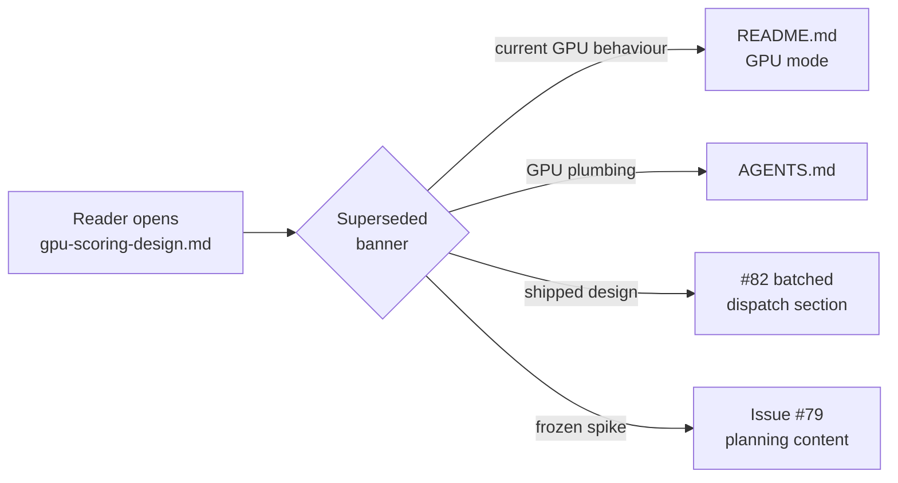

# Docs: mark `docs/gpu-scoring-design.md` as superseded

## Summary

`docs/gpu-scoring-design.md` was the Issue #79 planning spike. It still
asserted as present-tense fact that *"`rust_scorer` performs zero GPU work
today"*, that there is *no `wgpu` dependency*, and that *"All scoring runs on
CPU"*. Every one of those claims is now false: `wgpu` is a dependency,
`--gpu auto` is the default, and the `forward_mse_batched` /
`forward_mse_scratch` WGSL kernels ship (Issues #80, #82, #83, #180, #182). A
reader treating the file as current docs would be badly misled.

This change marks the document as a **superseded historical planning spike**
and qualifies the stale present-tense claims so none of them read as current
behaviour. No GPU code or behaviour is touched — documentation only.
Closes #211.

What changed in `docs/gpu-scoring-design.md`:

- Added a dated **Status: superseded** banner at the top that names the
  shipping issues, lists the now-false claims, and points readers to the
  current **GPU mode** section of `README.md` and the **GPU plumbing** notes
  in `AGENTS.md`, plus the in-file *Multi-creature batched dispatch — Issue
  #82* section that captures the shipped design.
- Qualified the TL;DR *"zero GPU work today"* bullet to past tense ("at spike
  time"), with a one-line note that `wgpu` is now a dependency and `--gpu
  auto` is the default.
- Reworded the intro line "It does **not** add a GPU code path" to make clear
  that was true only at spike time.
- Retitled "Today's CPU pipeline" → "CPU pipeline at spike time (May 2026)".
- Annotated the "Reproducing this spike" grep (which printed `no GPU code
  path` in May 2026) as historical, since it now matches the shipped wgpu
  path.

## Evidence

Documentation-only change — no web interface or CLI behaviour to screenshot.

- `markdownlint-cli2 docs/gpu-scoring-design.md` — the changed file lints
  clean (the remaining repo-wide warnings are pre-existing in unrelated
  `pr-summary-200/203/206.md` files and predate this branch).
- `./quality.sh` — full local gate (shellcheck, codespell, cargo
  fmt/clippy/check/build/test/doc/release) run to completion.

Acceptance criteria from the issue:

- **Stale doc clearly marks itself superseded, with a pointer to current GPU
  docs** — dated banner at the top links to `README.md`, `AGENTS.md`, and the
  shipped-design section.
- **No present-tense "zero GPU work" claims remain unqualified** — the TL;DR
  bullet, intro line, section heading, and reproducing-spike grep are all
  qualified to spike-time past tense.

## Test Plan

No automated tests apply: this is a prose documentation change with no
function behaviour to assert (a test that grepped the doc for the banner text
would be a source-text test, which the contributor guidelines forbid).
Validation is via the markdown lint and codespell gates in `./quality.sh`,
both of which pass.
