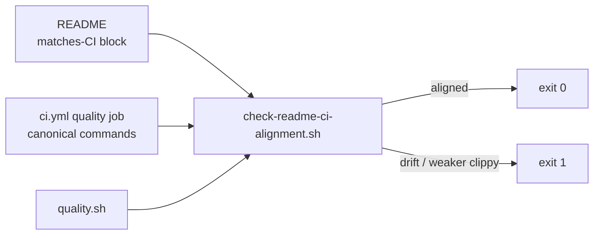

# Align README "step-by-step (matches CI)" block with the CI quality job

## Summary

The README "Or step-by-step (matches CI):" command block (README.md:19-31)
drifted from the CI `quality` job in `.github/workflows/ci.yml`. A contributor
copy-pasting it to "reproduce CI" got a **weaker** gate: it omitted
`cargo check`, the rustdoc gate (`RUSTDOCFLAGS="-D warnings" cargo doc`), and the
workspace debug build, and it ran `cargo clippy --workspace …` instead of CI's
`cargo clippy --all-targets --all-features …`.

This PR realigns the README block **step-for-step** with the CI `quality` job
and adds a drift guard so the two cannot silently diverge again. Closes #212.

Changes:

- **README.md** — the block now matches the CI quality steps exactly, in order:
  `RUSTFLAGS="-D warnings"`, `cargo deny check`, `cargo fmt --all -- --check`,
  `cargo clippy --all-targets --all-features -- -D warnings -D clippy::filter_next -D clippy::collapsible_if`,
  `cargo check --all-targets --all-features`, `cargo build --workspace`,
  `cargo test --workspace --all-features --verbose -- --test-threads=2`, and
  `RUSTDOCFLAGS="-D warnings" cargo doc --workspace --no-deps`.
- **scripts/check-readme-ci-alignment.sh** — new validator (matching the repo's
  `check-*.sh` convention) that extracts the README "matches CI" block and
  asserts every canonical CI quality command is present, and that the weaker
  `cargo clippy --workspace` form is not used. Exits non-zero on drift.
- **quality.sh** — invokes the new validator alongside the other workflow
  checks, so local runs and CI catch future drift.
- **tests/scripts/readme_ci_alignment.bats** — behavioural bats tests for the
  validator.

### Drift guard flow



## Evidence

CLI/docs change — no web interface to screenshot.

- `./scripts/check-readme-ci-alignment.sh` passes against the updated README:

  ```text
  OK   README block includes: RUSTFLAGS="-D warnings"
  OK   README block includes: cargo deny check
  OK   README block includes: cargo fmt --all -- --check
  OK   README block includes: cargo clippy --all-targets --all-features -- -D warnings -D clippy::filter_next -D clippy::collapsible_if
  OK   README block includes: cargo check --all-targets --all-features
  OK   README block includes: cargo build --workspace
  OK   README block includes: cargo test --workspace --all-features
  OK   README block includes: RUSTDOCFLAGS="-D warnings" cargo doc --workspace --no-deps
  README 'matches CI' block matches the CI quality job.
  ```

- Before the README fix, the same validator reported the missing `cargo check`,
  `cargo doc`, `cargo build --workspace`, and the weaker clippy invocation
  (`FAIL README clippy uses '--workspace'`).
- `bats tests/scripts` — all 293 tests pass (9 new in
  `readme_ci_alignment.bats`).
- `shellcheck --severity=warning` clean on the new script and `quality.sh`.
- `./scripts/spell-check.sh` (codespell) — no typos.

### Note on a pre-existing, unrelated test failure

`./quality.sh` was run locally. The Rust suite reports one failure,
`directory_mode_tdd::gpu_auto_directory_above_shader_cap_falls_back_to_cpu_cleanly`,
which is **unrelated to this PR** — this change touches only documentation and
shell tooling, no Rust. The test asserts an oversized creature falls back to
`cpu-fallback`, but on the local Apple **Metal** GPU the scratch kernel
(Issue #182) hosts it on the GPU (`gpuBackend: "metal"`). CI runs on GPU-less
`ubuntu-latest`, where the CPU fallback path is taken and the test passes.

## Test Plan

- Added `tests/scripts/readme_ci_alignment.bats` (9 cases): aligned README
  passes; missing rustdoc gate / `cargo check` / workspace build each fail;
  weaker `--workspace` clippy fails; absent block fails; missing file errors;
  unknown flag exits 2; and the real repository README satisfies the check.
- Verified the validator fails against the pre-fix README and passes after the
  fix.
- Full `bats tests/scripts` suite passes (293 tests).
