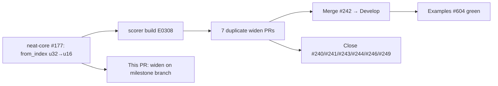

# PR Summary — Issue #250

## Summary

neat-core #177 (landed via neat-core #186) narrowed `SynapseData::from_index`
from `u32` to `u16` for perf/SIMD. Because `rust_scorer` consumes `neat-core`
via an unpinned `path` dependency that tracks head, the scorer build broke with
`E0308` at the `SynapseGpu { … }` construction in
`rust_scorer/src/gpu/forward_mse_batched.rs` — the GPU/WGSL layout has no 16-bit
integer type, so `SynapseGpu.from_index` stays `u32`.

This change widens losslessly at the GPU upload boundary with
`from_index: u32::from(s.from_index)`, matching the existing `squash_type` /
`num_synapses` conversions a few lines above. The u16 narrowing in neat-core is
intentional and permanent — only the boundary conversion is added here.

This is the same one-line fix as the recommended candidate **PR #242**, applied
to the milestone branch `milestone/248-bug-neat-core-breaking-type-change-broke-score`
so it stays buildable against neat-core ≥0.1.46 alongside the merge on `Develop`.

As part of resolving this issue, the seven near-identical automation PRs were
consolidated: one was merged to the default branch and the other six were closed
with comments pointing at the merged PR.

Closes #250.

## Evidence

Backend/CLI change with no web interface — no screenshot applicable.

Reproduced the failure, then verified the fix against the sibling neat-core
clone (which carries the `u16` narrowing):

- Before: `cargo check -p rust_scorer` failed with
  `error[E0308]: mismatched types … expected u32, found u16` at
  `forward_mse_batched.rs:228`.
- After: `./quality.sh` passes cleanly (`✅ All quality checks passed!`),
  including `fmt --check`, clippy, check, build, test, rustdoc and release build.
- New regression test passes:
  `gpu::forward_mse_batched::tests::build_batched_network_data_widens_from_index_to_u32 ... ok`.

## Test Plan

- Added `rust_scorer/src/gpu/forward_mse_batched.rs::tests::build_batched_network_data_widens_from_index_to_u32`
  — builds a creature, runs `build_batched_network_data`, and asserts every
  `SynapseGpu.from_index` equals `u32::from` of the source network's `u16`
  `from_index`. Fails to compile against the unfixed code (E0308); passes after
  the widening.
- Ran the full `./quality.sh` gate to confirm no regressions across the existing
  `forward_mse_batched` tests.
