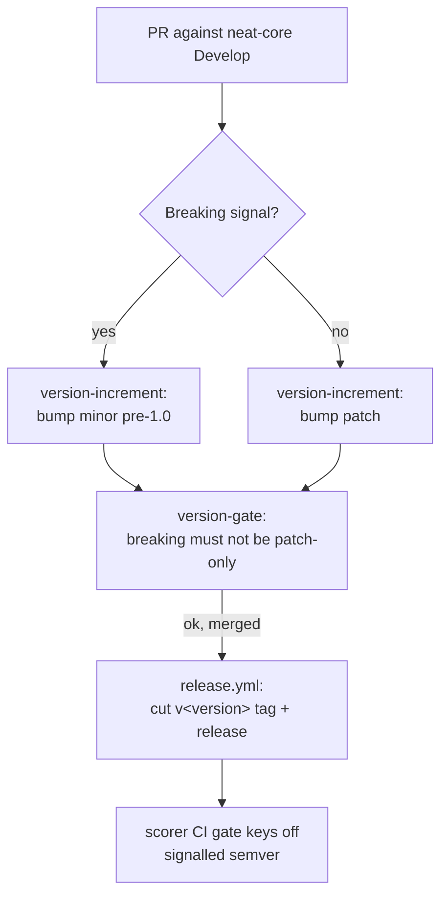

## Summary

Make **neat-core** signal breaking changes through semantic versioning so the
scorer (which tracks the `neat-core` path dependency at head) is no longer broken
silently. neat-core #177 (`SynapseData::from_index` `u32 → u16`) was breaking but
shipped as `0.1.43 → 0.1.46` with no signal — neat-core had no semver tags (only
`wasm-bundle-<sha>`) and its CI auto-bumped only the patch.

Issue #251 is the **scorer-side tracking** issue of epic #248; the substantive
work lands in the **NEAT-AI-core** repo (an internal `stSoftwareAU/*` dependency)
via companion PR
**[stSoftwareAU/NEAT-AI-core#190](https://github.com/stSoftwareAU/NEAT-AI-core/pull/190)**.
This PR records the cross-repo decision on the scorer side.

Closes #251.

### NEAT-AI-core#190 (the fix)

- `RELEASING.md` policy: breaking ⇒ major-equivalent bump (pre-1.0: **minor**,
  `0.1.x → 0.2.0`); non-breaking ⇒ **patch**.
- `version-gate` CI job + `check-version-bump.sh` — a breaking change **cannot**
  ship on a patch-only bump.
- `version-increment` CI job now bumps the minor on a breaking signal
  (`breaking-change` label or Conventional Commit `type!:` / `BREAKING CHANGE:`).
- `release.yml` cuts `v<version>` git tag + GitHub release on `Develop`,
  decoupled from `wasm-bundle-<sha>`.
- Retro-bump `0.1.46 → 0.2.0` to reflect the #177 break (not reverted).

### This (scorer) PR

- `docs/release-process/neat-core-semver-signalling.md` — tracking record of the
  decision and the scorer-side implication (the sibling CI gate can key off the
  signalled semver). No scorer code change is needed: the scorer uses a **path**
  dependency, so there is no version pin to bump.

Per the release-gating policy (#2944), the neat-core PR is **not** auto-merged and
the `v0.2.0` release is **human-gated** — neat-core's `release` workflow cuts it on
merge of PR #190.

## Evidence

Backend/cross-repo + documentation change — no scorer web UI to screenshot.

Validation of the neat-core companion PR (#190), run locally:

- `bats tests/scripts/next_version.bats`, `check_version_bump.bats`,
  `detect_breaking.bats` — policy logic, all green.
- Full `bats tests/scripts` — **146 tests** green, including the SHA-pinning,
  actionlint, and script-injection workflow gates over the two new/edited
  workflows.
- `actionlint`, `shellcheck`, `markdownlint-cli2`, `codespell` clean;
  `cargo check --workspace --locked` passes at `v0.2.0`.

## Test Plan

The enforcement logic is covered by bats unit tests in the neat-core companion
PR (#190), which run real scripts with test data and assert on exit codes /
output (not source greps):

- `tests/scripts/next_version.bats` — patch vs minor/major bump selection.
- `tests/scripts/check_version_bump.bats` — gate rejects breaking-on-patch-only
  and downgrades; allows over-bumping.
- `tests/scripts/detect_breaking.bats` — Conventional Commit marker detection
  over a throwaway git history.

This scorer PR is documentation-only (tracking record); the scorer's own
`./quality.sh` gate covers it.
