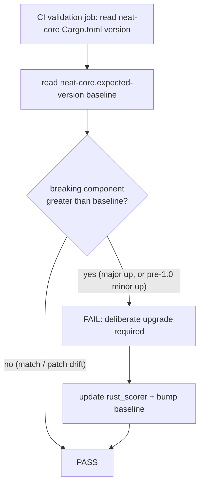

# PR Summary — Issue #252

## Summary

Adds a scorer CI gate that **fails on an unhandled breaking neat-core bump**,
while **keeping the unpinned `path` dependency** (Round 2 decision). scorer
consumes `neat-core` via `neat-core = { path = "../../NEAT-AI-core/neat-core" }`,
which always tracks head — so a breaking neat-core change could reach scorer
silently (this is what broke the build in the NEAT-AI-core #177 scenario).

The safeguard is a **version-baseline check**:

- Scorer records the last-handled neat-core version in a new checked-in
  `neat-core.expected-version` file (currently `0.1.46`).
- `scripts/check-neat-core-version.sh` reads neat-core's actual version from
  the sibling `../NEAT-AI-core/Cargo.toml` (`[workspace.package] version`).
- The **breaking component** follows SemVer — major for `>= 1.0`, minor for
  pre-1.0 (`0.x`). The gate **fails** when neat-core's breaking component is
  greater than the baseline, and **passes** on patch-level drift or an exact
  match.

The gate runs as a step in the CI `validation` job (which already checks out
and symlinks the sibling neat-core) and locally via `./quality.sh`. The path
dependency in `rust_scorer/Cargo.toml` is **unchanged**.

Closes #252.

## Acceptance criteria

- [x] Path dep `neat-core = { path = … }` **unchanged** (kept per Round 2).
- [x] CI **fails** on a breaking bump above the baseline; the failure message
      points at the deliberate-upgrade step (update `rust_scorer` + bump
      `neat-core.expected-version`).
- [x] CI **passes** after scorer records handling (baseline bumped to match).
- [x] Demonstrated against the #177 scenario (see Evidence).
- [x] Gate documented in README ("neat-core breaking-bump gate" section) and
      CONTRIBUTING.

## Evidence

Backend/CLI/CI change — no web UI to screenshot. The `#177` scenario is
demonstrated directly against the real script:

```text
-- baseline 0.1.46 (pre-fix) vs neat-core 0.2.0:
FAIL: breaking neat-core bump: 0.2.0 exceeds handled baseline 0.1.46 (pre-1.0 minor increased)
       To clear this gate, in a single deliberate PR:
         1. Update rust_scorer for the breaking neat-core change.
         2. Bump the recorded baseline in neat-core.expected-version to 0.2.0.
exit=1

-- baseline 0.2.0 (handled) vs neat-core 0.2.0:
OK   neat-core 0.2.0 matches handled baseline 0.2.0 (patch-level drift allowed)
exit=0
```

Against the real sibling clone the gate is green
(`OK   neat-core 0.1.46 matches handled baseline 0.1.46`).

### Gate flow



## Test Plan

- New `tests/scripts/neat_core_version_gate.bats` (15 cases) drives the real
  script against synthetic fixtures: exact match, patch drift, the pre-1.0
  breaking bump (#177), handled baseline, the `1.0` boundary crossing, post-1.0
  major bump (fails) vs minor bump (passes), core-behind-baseline, comment
  handling, and parse/usage errors. A final case runs against the real sibling
  when present.
- Full `bats tests/scripts` suite passes (308 tests).
- `shellcheck`, `codespell`, `markdownlint-cli2`, and the workflow meta-checks
  (`check-ci-job-graph.sh`, `check-workflow-paths.sh`, `check-workflow-timeouts.sh`,
  `check-ci-permissions.sh`, `check-readme-ci-alignment.sh`, `actionlint`) all
  pass with the CI edits.

## Files changed

- `scripts/check-neat-core-version.sh` — new gate script.
- `neat-core.expected-version` — new checked-in baseline (`0.1.46`).
- `.github/workflows/ci.yml` — new `validation` step + baseline added to the
  required-files list.
- `quality.sh` — local mirror of the gate (skips when no sibling clone).
- `tests/scripts/neat_core_version_gate.bats` — new tests.
- `README.md`, `CONTRIBUTING.md`, `CHANGELOG.md` — documentation.
