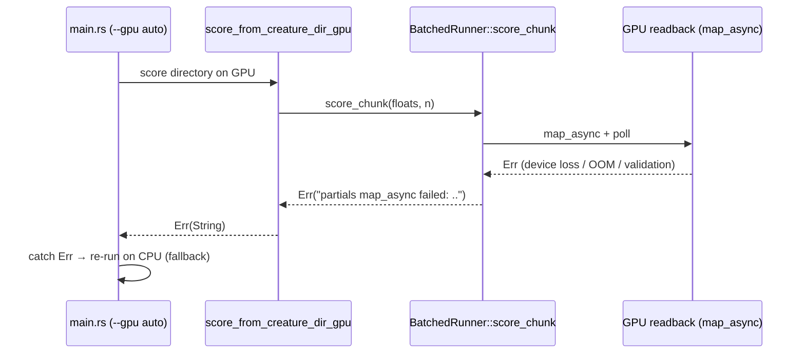

## Summary

`BatchedRunner::score_chunk` mapped the GPU readback buffer and unwrapped the
`map_async` result with two `expect()` calls. Because `score_chunk` returned
`Vec<f64>` (not a `Result`), a readback failure — a recoverable device hiccup
such as device loss, an out-of-memory condition, or a validation error during
readback — panicked the whole process instead of surfacing an error the caller
could recover from. Under the default `--gpu auto` mode that panic unwound past
the `Result<_, String>` boundary in `score_from_creature_dir_gpu` and aborted
the process, bypassing the crate's deliberate CPU-fallback design.

This change threads the readback failure through as an error so the existing
`--gpu auto` CPU fallback in `main.rs` can absorb it:

- `BatchedRunner::score_chunk` now returns `Result<Vec<f64>, String>`. The two
  `expect()` calls at the `map_async` readback are replaced with `?`-propagated
  errors via a small, unit-testable `map_readback_result` helper.
- Both `score_chunk` call sites in `multi_score.rs` (the synchronous path and
  the pipelined worker thread, both already inside a function returning
  `Result<_, String>`) propagate the error, so a readback failure returns `Err`
  and lets `main.rs`'s `--gpu auto` path fall back to the CPU instead of
  aborting.
- The GPU parity integration test was updated for the new signature.

The out-of-scope `u32::try_from(...).expect(...)` calls (bounded by the ≤64 MiB
read buffer, genuinely unreachable) are left untouched.

Closes #273.

## Evidence

Backend/CLI change with no web interface — no screenshot applicable.

The readback failure path requires an actual GPU fault to manifest, which is not
reproducible on CPU-only CI runners. To keep the fix verifiable without a GPU,
the `map_async`-result handling is extracted into a generic `map_readback_result`
helper (generic over the map error type because `wgpu::BufferAsyncError` has no
public constructor) and covered by unit tests for both success and failure
modes.



Test output:

```text
running 3 tests
test gpu::forward_mse_batched::tests::map_readback_result_ok_on_successful_map ... ok
test gpu::forward_mse_batched::tests::map_readback_result_err_on_dropped_sender ... ok
test gpu::forward_mse_batched::tests::map_readback_result_err_on_map_failure ... ok
```

`cargo fmt --check`, `cargo clippy --all-targets -- -D warnings`, and
`cargo test -p rust_scorer` all pass.

## Test Plan

Added in `rust_scorer/src/gpu/forward_mse_batched.rs` (`mod tests`):

- `map_readback_result_ok_on_successful_map` — a successful map (`Ok(Ok(()))`)
  yields `Ok(())`.
- `map_readback_result_err_on_map_failure` — a failed map (`Ok(Err(..))`,
  e.g. device loss during readback) becomes a descriptive `Err` naming the
  readback failure and carrying the underlying cause, instead of panicking.
- `map_readback_result_err_on_dropped_sender` — a dropped callback sender
  (`RecvError`) becomes the recoverable `Err "partials map_async sender dropped"`.

Updated `rust_scorer/tests/gpu_multi_score_parity.rs` to `.expect()` the new
`Result` from `score_chunk` (GPU-gated; skips cleanly on CPU-only runners).
