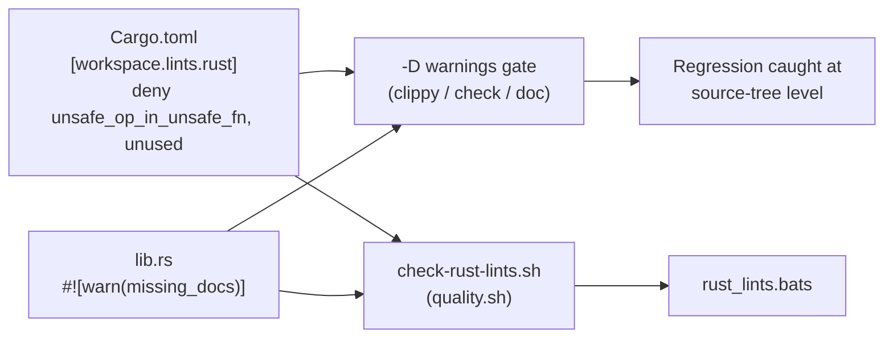

# Add crate-level rustc lint hardening to the rust_scorer workspace

## Summary

The `rust_scorer` workspace configured only Clippy lints; rustc's own (`rust`)
lint groups were unenforced at the source-tree level. Relying solely on a CI
`-D warnings` flag left the tree itself unhardened, so a local build or a
differently-configured CI step would not catch a regression at the point it is
introduced. This change adds a `[workspace.lints.rust]` table to the root
`Cargo.toml` (inherited by the crate via `[lints] workspace = true`) and scopes
`missing_docs` to the library surface. **Closes #274.**

Changes:

- **`Cargo.toml`** — new `[workspace.lints.rust]` table:
  - `unsafe_op_in_unsafe_fn = "deny"` — the crate uses `unsafe` in hot paths
    (`stream_io.rs`, `cost.rs`); denies an unguarded unsafe op inside an
    `unsafe fn`.
  - `unused = "deny"` — dead code / unused imports fail the build.
- **`rust_scorer/src/lib.rs`** — `#![warn(missing_docs)]` scoped to the library
  surface (the binary targets are doc-noisy, so `missing_docs` is intentionally
  **not** in the workspace table). Under the gate's `-D warnings` this enforces
  doc discipline on the public API exposed to benches / integration tests.
- Documented the 21 previously-undocumented public items this surfaced
  (`gpu/mod.rs`, `gpu/forward_mse_batched.rs`, `scoring.rs`).
- Per-lint denies are used deliberately instead of a blanket
  `#![deny(warnings)]` so a future compiler warning does not break the build
  unexpectedly.
- **`scripts/check-rust-lints.sh`** — posture validator (wired into
  `quality.sh`) that fails if the table is dropped, either lint stops being
  denied, a blanket `warnings` lint is introduced, or the `missing_docs`
  scoping is removed.
- README + CHANGELOG documentation.

## Evidence

Backend/CLI change with no web interface — no screenshot applicable. Verified
via the local gate and the compiler enforcing the new lints under
`RUSTFLAGS="-D warnings"`:

- `cargo clippy --workspace --all-targets --all-features` — passes.
- `cargo check` / `cargo build` / `cargo test` (20 passed) — pass.
- `RUSTDOCFLAGS="-D warnings" cargo doc --workspace --no-deps` — passes
  (confirms `missing_docs` is fully satisfied on the library surface).
- `scripts/check-rust-lints.sh` — all posture rules `OK`.
- `bats tests/scripts/rust_lints.bats` — 10/10 pass.

> Note: the pre-existing local `neat-core` breaking-bump gate (Issue #252)
> fails independently of this change because the sibling `../NEAT-AI-core` has
> drifted to `0.2.4` vs the recorded `0.1.46` baseline. That is a separate,
> human-gated upgrade and out of scope here.

## Deno regression avoided

Not applicable — this is a Rust/Cargo repository, no Deno markers present.

## Test Plan

- Added `tests/scripts/rust_lints.bats` (10 tests) exercising
  `scripts/check-rust-lints.sh` end-to-end with synthetic fixtures:
  canonical pass; missing table; `unsafe_op_in_unsafe_fn` absent / only warned;
  `unused` absent; `missing_docs` scoping absent; blanket `warnings` rejected;
  missing manifest; unknown flag; and the real repository files satisfying
  every rule.
- Existing `cargo test --workspace` suite (20 tests) continues to pass; the new
  `unsafe_op_in_unsafe_fn` / `unused` denies and `missing_docs` warn are
  enforced by the compiler under the `-D warnings` gate.
