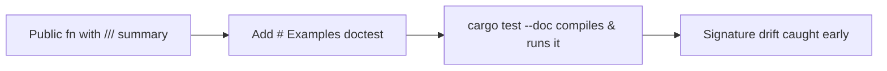

# Add `# Examples` doctest blocks to the public API (Issue #275)

## Summary

The crate root (`rust_scorer/src/lib.rs`) re-exports 17 public functions for
external targets (Criterion benches, integration tests). Each carried a `///`
summary but **none** had a Rust API Guidelines **C-EXAMPLE** `# Examples`
block. This PR adds a `# Examples` section to all 17, turning them into
compile-checked, always-current usage samples that `cargo test` runs.

Beyond documentation, doctests are compiled and executed by `cargo test`, so
they catch signature drift that prose comments silently miss — exactly the
value C-EXAMPLE is after. Where a function's `Err` conditions were not already
spelled out (C-FAILURE), a short sentence was added alongside the example.

Closes #275.

## What changed

Thirteen functions got **runnable** doctests with real `assert_*` checks; the
four I/O- and GPU-bound entry points got `no_run` doctests that still
type-check the call shape (they cannot execute without training files or a GPU
device):

| Module | Function | Kind |
| --- | --- | --- |
| `cost` | `CostKind::as_str` | runnable |
| `cost` | `CostKind::from_cli` | runnable |
| `cost` | `CostKind::gpu_supported` | runnable |
| `cost` | `accumulate_cost_sum` | runnable |
| `scoring` | `value_penalty` | runnable |
| `scoring` | `compute_score_components` | runnable |
| `scoring` | `complexity_penalty` | runnable |
| `scoring` | `calculate_score` | runnable |
| `env_tuning` | `parse_tuning_var` | runnable |
| `read_tuning` | `training_read_target_bytes_from_env` | runnable |
| `read_tuning` | `training_read_backend_label` | runnable |
| `stream_score` | `activation_worker_count_for_scorer` | runnable |
| `stream_score` | `effective_fused_read_buf_len` | runnable |
| `stream_score` | `accumulate_cost_sum_forward_only_fused` | `no_run` |
| `multi_score` | `score_from_creature_dir` | `no_run` |
| `multi_score` | `gpu_directory_compatible` | `no_run` |
| `multi_score` | `score_from_creature_dir_gpu` | `no_run` |

The priority entry points called out in the issue —
`scoring::calculate_score`, `scoring::compute_score_components`,
`multi_score::score_from_creature_dir`, and `cost::accumulate_cost_sum` — are
all covered.

`Cargo.lock` was also synced to the committed `1.0.3` crate version (it lagged
at `1.0.2`).

## Deno regression avoided

N/A — this is a Rust-only repository; no Node or Deno tooling is involved.

## Evidence

Backend/CLI change with no web interface to screenshot. The evidence is the
doctest run: `cargo test --doc -p rust_scorer` reports **17 passed; 0 failed**
(13 executed with assertions, 4 `no_run` compile-checked):

```
running 17 tests
test rust_scorer/src/cost.rs - cost::CostKind::from_cli ... ok
test rust_scorer/src/cost.rs - cost::accumulate_cost_sum ... ok
test rust_scorer/src/scoring.rs - scoring::calculate_score ... ok
test rust_scorer/src/scoring.rs - scoring::compute_score_components ... ok
test rust_scorer/src/multi_score.rs - multi_score::score_from_creature_dir - compile ... ok
... (17 total)
test result: ok. 17 passed; 0 failed; 0 ignored
```

`./quality.sh` passes cleanly (fmt, cargo-deny, clippy, check, build, test,
rustdoc with `RUSTDOCFLAGS=-D warnings`, release build):

```
✅ All quality checks passed!
```



## Test Plan

- The added doctests **are** the new tests — each runnable example calls the
  real function with test data and asserts on the result (e.g.
  `cost::CostKind::from_cli` asserts the accept and reject paths; the malformed
  chunk in `cost::accumulate_cost_sum` asserts `is_err()`).
- Verified with `cargo test --doc -p rust_scorer` → 17 passed, 0 failed.
- Full gate `./quality.sh < /dev/null` → all checks passed.
- No existing tests were modified or removed.

## Security self-check

Documentation-only change (doc comments + lockfile version sync). No new input
handling, no new SQL/shell/HTTP calls, no secrets staged.
