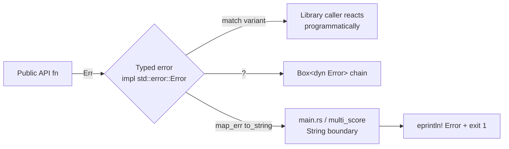

## Summary

The `rust_scorer` crate's public API pervasively returned `Result<_, String>`,
using free-text strings as its error type instead of typed errors that
implement `std::error::Error`. This violated Rust API Guideline **C-GOOD-ERR**:
callers could not `match` on error variants, the errors did not compose with
`?` into a `Box<dyn Error>`, and every error path allocated a formatted string.
The crate already demonstrated the correct pattern one module over
(`gpu::GpuInitError`), so sibling functions returning `String` were an
inconsistency inside a single module tree.

This PR introduces hand-rolled typed error enums (following the existing
`GpuInitError` pattern — no new `thiserror` dependency) and returns them from
every enumerated public call site:

| Function | Old error | New typed error |
| --- | --- | --- |
| `scoring::value_penalty` | `String` | `ScoringError` |
| `scoring::compute_score_components` | `String` | `ScoringError` |
| `scoring::complexity_penalty` | `String` | `ScoringError` |
| `scoring::calculate_score` (coupled via `?`) | `String` | `ScoringError` |
| `cost::CostKind::from_cli` | `String` | `InvalidCostName` |
| `gpu::GpuMode` `FromStr` / `gpu::resolve_mode` | `String` | `GpuModeParseError` |
| `gpu::resolve_backend` | `String` | `ResolveBackendError` |
| `multi_score::gpu_directory_compatible` | `String` | `GpuPrepareError` (returned directly instead of flattened) |

Each new error implements `Display` + `std::error::Error`, and every variant's
`Display` text is **byte-for-byte identical** to the previous `format!(...)`
message, so downstream message-matching is unchanged. `ResolveBackendError::Init`
exposes its underlying `GpuInitError` via `source()`. The binary (`main.rs`) and
the `multi_score` scoring functions keep their internal `String` error contract
and flatten typed errors at the boundary with `.map_err(|e| e.to_string())`.

`multi_score::gpu_directory_compatible` previously already had a typed
`GpuPrepareError` underneath and threw the type information away with
`.map_err(|e| e.to_string())`; it now returns the typed error directly.

Closes #289.

### Scope note

`cost::accumulate_cost_sum` also returns `Result<_, String>`, but it was **not**
in the issue's enumerated list of concrete public call sites, and converting it
would ripple typed-error propagation through the Rayon parallel dispatch in
`multi_score`/`stream_score` (out of the stated scope). It is left unchanged.

### Data flow



## Evidence

Backend/library change with no web interface — no screenshot applicable.
Verified via the crate's own test suite and the full local quality gate
(`./quality.sh`), which runs `fmt --check`, `cargo-deny`, `clippy -D warnings`,
`check`, `build`, unit + integration + doc tests, rustdoc with
`-D warnings`, and the release build. All checks pass:

```text
✅ All quality checks passed!
```

Message-preservation is guaranteed because every variant's `Display` reproduces
the exact prior `format!(...)` string; the existing error-path tests continue to
assert the same substrings via `err.to_string()`.

## Test Plan

New tests added (assert the typed variants and `std::error::Error` composability):

- `scoring::tests::scoring_error_matches_specific_variants` — matches every
  `ScoringError` discriminant returned by the scoring API.
- `scoring::tests::scoring_error_composes_as_std_error` — `?` into
  `Box<dyn Error>` and `downcast_ref::<ScoringError>()`.
- `cost::tests::from_cli_returns_typed_invalid_cost_name` — equality on the
  `InvalidCostName` field + boxed-error downcast.
- `gpu::tests::resolve_backend_error_is_typed_and_composes` — `NoAdapter` /
  `Init` variants, `source()`, and boxed-error downcast.
- `gpu::tests::resolve_mode_propagates_invalid_env_value` (extended) — asserts
  the typed `GpuModeParseError` value.
- `tests/gpu_preflight_tdd.rs::preflight_returns_typed_error_for_unsupported_squash`
  — a GAUSSIAN-squash creature makes `gpu_directory_compatible` return
  `GpuPrepareError::UnsupportedSquash` through the public directory path.

Existing error-path tests modified (documented business-logic change: the error
type changed from `String` to a typed error, so `.unwrap_err()` is followed by
`.to_string()` before the existing `.contains(...)` message assertions — no test
was removed or disabled):

- `scoring::tests`: `test_value_penalty_rejects_negative`,
  `test_value_penalty_rejects_non_finite`,
  `test_compute_score_components_rejects_non_finite_weight`,
  `test_compute_score_components_rejects_non_finite_bias`,
  `test_calculate_score_rejects_non_finite_error`,
  `test_calculate_score_rejects_negative_error`.
- `cost::tests::from_cli_rejects_unknown_cost_name`.
- `gpu::tests::gpu_mode_rejects_invalid`.
